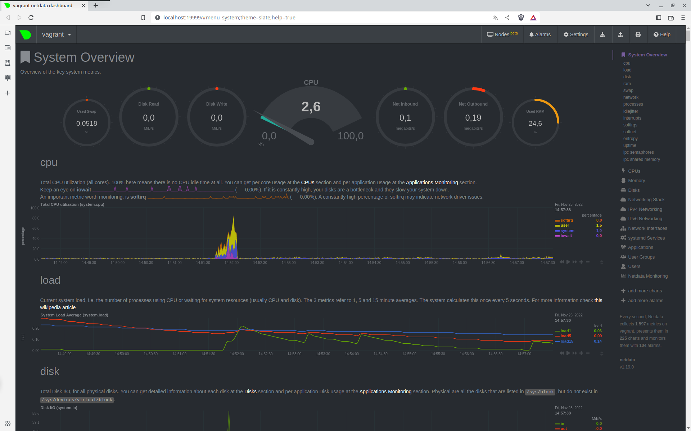
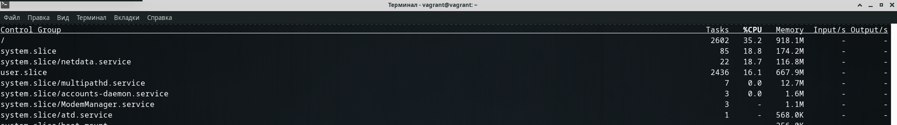

# Домашнее задание к занятию "3.4. Операционные системы. Лекция 2"

### 1. На лекции мы познакомились с node_exporter. В демонстрации его исполняемый файл запускался в background. Этого достаточно для демо, но не для настоящей production-системы, где процессы должны находиться под внешним управлением. Используя знания из лекции по systemd, создайте самостоятельно простой unit-файл для node_exporter:

- поместите его в автозагрузку,
- предусмотрите возможность добавления опций к запускаемому процессу через внешний файл (посмотрите, например, на systemctl cat cron),
- удостоверьтесь, что с помощью systemctl процесс корректно стартует, завершается, а после перезагрузки автоматически поднимается.

````
    создаем unit-файл: sudo systemctl edit --full --force node_exporter.service
    
    $ sudo systemctl cat node_exporter
    # /etc/systemd/system/node_exporter.service
    [Unit]
    Description=Node Exporter
    [Service]
    ExecStart=/usr/local/bin/node_exporter
    [Install]
    WantedBy=multi-user.target

    добавляем его в автозагрузку:
    $ sudo systemctl enable node_exporter
    Created symlink /etc/systemd/system/multi-user.target.wants/node_exporter.service → /etc/systemd/system/node_exporter.service.

    делаем возможность опций через внешний файл добавив 'EnvironmentFile=-/etc/default/node_exporter'
    в unit-фаил в секцию [Service]:

    $ sudo systemctl cat  node_exporter.service
    # /etc/systemd/system/node_exporter.service
    [Unit]
    Description=Node Exporter
    [Service]
    EnvironmentFile=-/etc/default/node_exporter
    ExecStart=/usr/local/bin/node_exporter
    [Install]
    WantedBy=multi-user.target
````
---
    Уточнения как добавляются опции через внешний файл

    Опции для запуска прописываются в файле который указан в поле EnvironmentFile, при этом в поле ExecStart 
    добавляем переменную объявленную в файле из поля EnvironmentFile. Как указано в примере ниже.

    $ cat /etc/systemd/system/node_exporter.service 
    [Unit]
    Description=Node Exporter
    Wants=network-online.target
    After=network-online.target
    
    [Service]
    User=node_exporter
    Group=node_exporter
    Type=simple
    EnvironmentFile=-/etc/default/node_exporter
    ExecStart=/usr/local/bin/node_exporter $OPTIONS
    
    [Install]
    WantedBy=multi-user.target

     cat /etc/default/node_exporter 
    OPTIONS='--collector.disable-defaults --collector.cpu --collector.meminfo'

    Проверяем как отработали наши парметры запуска node_exporter:

    $ sudo systemctl status node_exporter.service
    ● node_exporter.service - Node Exporter
         Loaded: loaded (/etc/systemd/system/node_exporter.service; enabled; vendor preset: enabled)
         Active: active (running) since Thu 2022-12-01 16:15:05 UTC; 11min ago
       Main PID: 68115 (node_exporter)
          Tasks: 4 (limit: 1066)
         Memory: 1.9M
         CGroup: /system.slice/node_exporter.service
                 └─68115 /usr/local/bin/node_exporter --collector.disable-defaults --collector.cpu --collector.meminfo
    
    Dec 01 16:15:05 vagrant systemd[1]: Started Node Exporter.
    Dec 01 16:15:05 vagrant node_exporter[68115]: ts=2022-12-01T16:15:05.078Z caller=node_exporter.go:180 level=info msg="Starting node_ex>
    Dec 01 16:15:05 vagrant node_exporter[68115]: ts=2022-12-01T16:15:05.079Z caller=node_exporter.go:181 level=info msg="Build context" b>
    Dec 01 16:15:05 vagrant node_exporter[68115]: ts=2022-12-01T16:15:05.080Z caller=node_exporter.go:110 level=info msg="Enabled collecto>
    Dec 01 16:15:05 vagrant node_exporter[68115]: ts=2022-12-01T16:15:05.081Z caller=node_exporter.go:117 level=info collector=cpu
    Dec 01 16:15:05 vagrant node_exporter[68115]: ts=2022-12-01T16:15:05.081Z caller=node_exporter.go:117 level=info collector=meminfo
    Dec 01 16:15:05 vagrant node_exporter[68115]: ts=2022-12-01T16:15:05.082Z caller=tls_config.go:232 level=info msg="Listening on" addre>
    Dec 01 16:15:05 vagrant node_exporter[68115]: ts=2022-12-01T16:15:05.083Z caller=tls_config.go:235 level=info msg="TLS is disabled." h>


    как видно , нод экспортер запустился ровно с теми коллекторами что мы указали
    
---
````
    Проверяем запуск и остановку сервиса:
    vagrant@vagrant:~$ sudo systemctl start node_exporter.service
    vagrant@vagrant:~$ sudo systemctl status node_exporter.service
    ● node_exporter.service - Prometheus Node Exporter
         Loaded: loaded (/etc/systemd/system/node_exporter.service; enabled; vendor preset: enabled)
         Active: active (running) since Thu 2022-11-24 14:51:17 UTC; 3s ago

    agrant@vagrant:~$ sudo systemctl stop node_exporter.service
    vagrant@vagrant:~$ sudo systemctl status node_exporter.service
    ● node_exporter.service - Prometheus Node Exporter
         Loaded: loaded (/etc/systemd/system/node_exporter.service; enabled; vendor preset: enabled)
         Active: inactive (dead) since Thu 2022-11-24 14:51:36 UTC; 1s ago

    vagrant@vagrant:~$ sudo reboot
    Connection to 127.0.0.1 closed by remote host.
    vagrant@vagrant:~$ uptime
     14:54:23 up 1 min,  1 user,  load average: 0.75, 0.33, 0.12
    vagrant@vagrant:~$ sudo systemctl status node_exporter.service
    ● node_exporter.service - Prometheus Node Exporter
         Loaded: loaded (/etc/systemd/system/node_exporter.service; enabled; vendor preset: enabled)
         Active: active (running) since Wed 2022-11-23 01:43:03 UTC; 1 day 13h ago

````
### 2. Ознакомьтесь с опциями node_exporter и выводом /metrics по-умолчанию. Приведите несколько опций, которые вы бы выбрали для базового мониторинга хоста по CPU, памяти, диску и сети.

    если я правильно понял задание, то опции следующие:

    ExecStart=/usr/local/bin/node_exporter \
    --collector.disable-defaults \
    --collector.cpu\
    --collector.meminfo \
    --collector.diskstats \
    --collector.filesystem \
    --collector.loadavg \
    --collector.netstat \
    --collector.netdev


### 3. Установите в свою виртуальную машину Netdata. Воспользуйтесь готовыми пакетами для установки (sudo apt install -y netdata).

***После успешной установки:***

- в конфигурационном файле /etc/netdata/netdata.conf в секции [web] замените значение с localhost на bind to = 0.0.0.0,
- добавьте в Vagrantfile проброс порта Netdata на свой локальный компьютер и сделайте vagrant reload:
config.vm.network "forwarded_port", guest: 19999, host: 19999

***После успешной перезагрузки в браузере на своем ПК (не в виртуальной машине) вы должны суметь зайти на localhost:19999. Ознакомьтесь с метриками, которые по умолчанию собираются Netdata и с комментариями, которые даны к этим метрикам.***



### 4. Можно ли по выводу dmesg понять, осознает ли ОС, что загружена не на настоящем оборудовании, а на системе виртуализации?

    да можно
    $ dmesg | grep virt
    [    0.004737] CPU MTRRs all blank - virtualized system.
    [    0.120900] Booting paravirtualized kernel on KVM
    [    3.068736] systemd[1]: Detected virtualization oracle.
    $ dmesg  | grep VBox
    [   75.023253] 11:42:44.605274 main     VBoxService 6.1.40 r154048 (verbosity: 0) linux.amd64 (Oct 11 2022 16:03:32) release log


### 5. Как настроен sysctl fs.nr_open на системе по-умолчанию? Определите, что означает этот параметр. Какой другой существующий лимит не позволит достичь такого числа (ulimit --help)?

    $ sysctl fs.nr_open
    fs.nr_open = 1048576

    man proc
    ...
    /proc/sys/fs/nr_open (since Linux 2.6.25)
        файл устанавливает ограничение на предел увеличения лимита ресурсов для RLIMIT_NOFILE.
        Этот потолок применяеся для всех процессов. Значение по умолчанию 1048576.
    ...

    man getrlimit
    ...
    RLIMIT_NOFILE
        указание на число файловых дискрипторов, которое может быть открыто процессом.
    ...

    таким образом fs.nr_open это число файловых дискрипторов, которое может быть открыто одним процессом
    
    максимальное число файловых дискрипторов для системы содержится в параметре:
    $ sysctl fs.file-max
    fs.file-max = 9223372036854775807

    $ ulimit --help | grep "open file"
      -n	the maximum number of open file descriptors

    мягкое ограничение для открытых файлов, которое может быть увеличено
    $ ulimit -Sn
    1024
    Жесткое ограничение установленное в fs.nr_open
    $ ulimit -Hn
    1048576


    
### 6. Запустите любой долгоживущий процесс (не ls, который отработает мгновенно, а, например, sleep 1h) в отдельном неймспейсе процессов; покажите, что ваш процесс работает под PID 1 через nsenter. Для простоты работайте в данном задании под root (sudo -i). Под обычным пользователем требуются дополнительные опции (--map-root-user) и т.д.

    # unshare -f --pid --mount-proc sleep 1h &
    [1] 13606
    root@vagrant:~# ps -fH
    UID          PID    PPID  C STIME TTY          TIME CMD
    root       13593   13584  0 14:46 pts/0    00:00:00 sudo -i
    root       13595   13593  0 14:46 pts/0    00:00:00   -bash
    root       13606   13595  0 14:47 pts/0    00:00:00     unshare -f --pid --mount-proc sleep 1h
    root       13607   13606  0 14:47 pts/0    00:00:00       sleep 1h
    root       13608   13595  0 14:47 pts/0    00:00:00     ps -fH
    # nsenter --target 13607 --pid --mount
    root@vagrant:/# ps -aux
    USER         PID %CPU %MEM    VSZ   RSS TTY      STAT START   TIME COMMAND
    root           1  0.0  0.0   5476   580 pts/0    S    14:47   0:00 sleep 1h
    root           2  0.5  0.3   7236  4000 pts/0    S    14:48   0:00 -bash
    root          13  0.0  0.3   9080  3564 pts/0    R+   14:48   0:00 ps -aux


    vagrant@vagrant:~$ unshare -f --pid --map-root-user --mount-proc sleep 1h &
    [1] 13682
    vagrant@vagrant:~$ ps -fH
    UID          PID    PPID  C STIME TTY          TIME CMD
    vagrant    13584   13583  0 14:46 pts/0    00:00:00 -bash
    vagrant    13682   13584  0 14:50 pts/0    00:00:00   unshare -f --pid --map-root-user --mount-proc sleep 1h
    vagrant    13683   13682  0 14:50 pts/0    00:00:00     sleep 1h
    vagrant    13684   13584  0 14:50 pts/0    00:00:00   ps -fH
    vagrant@vagrant:~$ nsenter --target 13683 --pid --mount --user --preserve-credentials
    root@vagrant:/# ps -aux
    USER         PID %CPU %MEM    VSZ   RSS TTY      STAT START   TIME COMMAND
    root           1  0.0  0.0   5476   580 pts/0    S    14:50   0:00 sleep 1h
    root          39  0.3  0.4   7360  4160 pts/0    S    15:02   0:00 -bash
    root          48  0.0  0.3   9080  3540 pts/0    R+   15:03   0:00 ps -aux


### 7. Найдите информацию о том, что такое :(){ :|:& };:. Запустите эту команду в своей виртуальной машине Vagrant с Ubuntu 20.04 (это важно, поведение в других ОС не проверялось). Некоторое время все будет "плохо", после чего (минуты) – ОС должна стабилизироваться. Вызов dmesg расскажет, какой механизм помог автоматической стабилизации. Как настроен этот механизм по-умолчанию, и как изменить число процессов, которое можно создать в сессии?

    :(){ :|:& };: - fork bomb
    :() - объявляется функция с именем ":", дальше в фигурных скобках идет тело функции "{ :|:& }" 
    где она вызывает саму себя и порождает другой процесс, & переводит процесс в фон. После
    тела идет разделитель ";" и сам вызов только что определенной функции.

    $ dmseg
    ...
    cgroup: fork rejected by pids controller in /user.slice/user-1000.slice/session-4.scope

    dmseg говорит что механизм cgroup разобрался с нашей fork бомбой
    
    $   man cgroups
    Cgroups - это группы управления или контрольные группы. Это функция ядра Linux, которая 
    позволяет организовать процессы в иерархические группы, использование которых для различных 
    типов ресурсов может быть ограничено и отслежено. 

    pids - этот контроллер позволяет ограничить количество процессов, которые могут быть созданы
    в конкретной группе.

    посмотрим ограничения по умолчанию для поользователя vagrant 
    $ cat /sys/fs/cgroup/pids/user.slice/user-1000.slice/pids.max 
    2436
    для каждой группы возможно запустить только 2436 процессов.

    запустив еще раз :(){ :|:& };: вместе с systemd-cgtop мы сможем убедиться в этом:



    чтобы изменить этот параметр, нужно сделать это в файле pids.max
    /sys/fs/cgroup/pids/user.slice/user-1000.slice/pids.max  - изменит значение по умолчанию
    для всех создаваемых сессий
    /sys/fs/cgroup/pids/user.slice/user-1000.slice/session-X.scope/pids.max - значение в
    конкретной сессии.
    

    отредактировав параметр:
    [Slice]
    TasksMax=33%

    в файле /lib/systemd/system/user-.slice.d/10-defaults.conf можно изменить это значение
    для всех пользователей

    
    
    

    


    