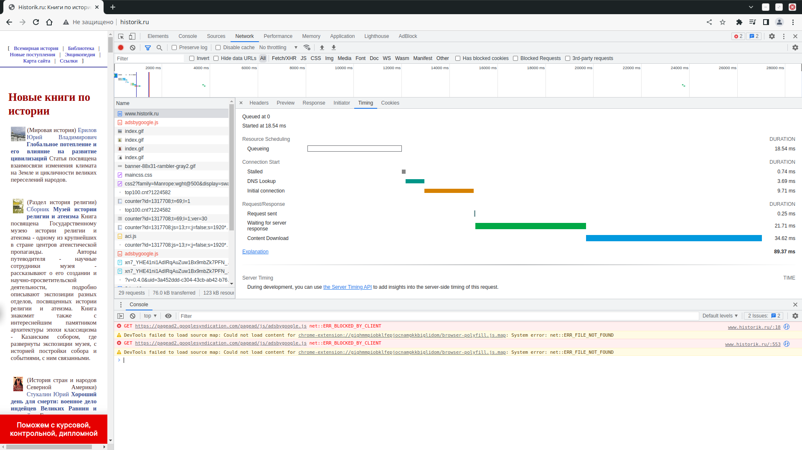
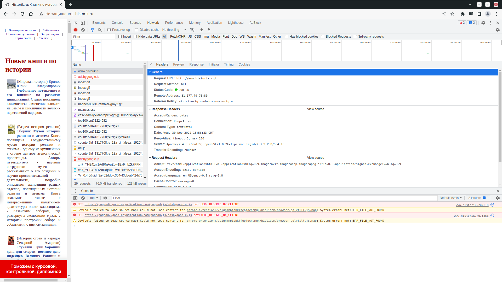

# Домашнее задание к занятию "3.6. Компьютерные сети. Лекция 1"

### 1. Работа c HTTP через телнет.
- Подключитесь утилитой телнет к сайту stackoverflow.com
`telnet stackoverflow.com 80`
- Отправьте HTTP запрос
```bash
GET /questions HTTP/1.0
HOST: stackoverflow.com
[press enter]
[press enter]
```
*В ответе укажите полученный HTTP код, что он означает?*

    сайт взял другой, т.к. у stackoverflow.com на 80 порту стоит переадресация на https и 
    telnet возвращает "HTTP/1.1 403 Forbidden", а в задании 2 в Headers будет "Status Code: 307 Internal Redirect"

    vagrant@vagrant:~$ telnet www.historik.ru 80
    Trying 31.177.79.76...
    Connected to www.historik.ru.
    Escape character is '^]'.
    GET /books/ HTTP/1.0
    HOST: www.historik.ru
    
    HTTP/1.1 200 OK
    Date: Wed, 30 Nov 2022 16:27:45 GMT
    Server: Apache/2.4.6 (CentOS) OpenSSL/1.0.2k-fips mod_fcgid/2.3.9 PHP/5.4.16
    Accept-Ranges: bytes
    Connection: close
    Content-Type: text/html
 
    <HTML>
    <HEAD>
    <TITLE>���������� �� �������</TITLE>
    <META NAME="author" Content="E-Mail webmaster@historic.ru">
    <META HTTP-EQUIV="Last-Modified" CONTENT="Thu, 27 September 2007 19:20:00">
    <META NAME="keywords" CONTENT="����������, ������ ������, �������>
    <META NAME="description" CONTENT="���������� �� �������">
    <META HTTP-EQUIV="Content-Type" CONTENT="text/html; charset=windows-1251">
    </HEAD>
    <LINK HREF="../maincss.css" REL="STYLESHEET" TYPE="text/css">
    <BODY>
    ...
    тело сайта
    ...
    </BODY>
    </HTML>
    Connection closed by foreign host.

    ответ состоит из:
    HTTP/1.1 200 OK - status line 
        где HTTP/1.1 - версия протокола,
        200 - код ответа ( 200 = запрос выполнен )
        OK - сообщение (  текст соответсвующий коду 200 )
    дальше идут заголовки состоящие из ключа, двоеточия и значения.
    Date - дата создания сообщения
    Server - данные о сервере
    Accept-Ranges - маркер использующийся для уведомления клиента о поддержке запросов по частям
    Connection - определяет, остается ли соединение активным после завершения текущей транзакции
    Content-Type - тип передаваемого контента

    дальше идет HTML страница

### 2. Повторите задание 1 в браузере, используя консоль разработчика F12.
- откройте вкладку `Network`
- отправьте запрос http://stackoverflow.com
- найдите первый ответ HTTP сервера, откройте вкладку `Headers`
- укажите в ответе полученный HTTP код
- проверьте время загрузки страницы, какой запрос обрабатывался дольше всего?
- приложите скриншот консоли браузера в ответ.


    Сайт взят тот же что в первом задании

    General
      Request URL: http://www.historik.ru/
      Request Method: GET
      Status Code: 200 OK
      Remote Address: 31.177.79.76:80
      Referrer Policy: strict-origin-when-cross-origin
    Response Headers
      Accept-Ranges: bytes
      Connection: Keep-Alive
      Content-Type: text/html
      Date: Wed, 30 Nov 2022 16:56:23 GMT
      Keep-Alive: timeout=5, max=100
      Server: Apache/2.4.6 (CentOS) OpenSSL/1.0.2k-fips mod_fcgid/2.3.9 PHP/5.4.16
      Transfer-Encoding: chunked

    Дольше всего обрабатывался "Content Download" (загрузка содержимого сайта)




### 3. Какой IP адрес у вас в интернете?

    vagrant@vagrant:~$ curl https://whoer.net/ip
    46.138.169.125

### 4. Какому провайдеру принадлежит ваш IP адрес? Какой автономной системе AS? Воспользуйтесь утилитой `whois`
    
    $ whois 46.138.169.125
    inetnum:        46.138.160.0 - 46.138.223.255
    netname:        MGTS-PPPOE
    descr:          Moscow Local Telephone Network (OAO MGTS)
    country:        RU
    admin-c:        USPD-RIPE
    tech-c:         USPD-RIPE
    status:         ASSIGNED PA
    mnt-by:         MGTS-USPD-MNT
    created:        2011-12-13T10:14:58Z
    last-modified:  2011-12-13T10:14:58Z
    source:         RIPE

    role:           PJSC Moscow City Telephone Network NOC
    address:        USPD MGTS
    address:        Moscow, Russia
    address:        Khachaturyana 5
    admin-c:        AGS9167-RIPE
    admin-c:        AVK103-RIPE
    admin-c:        GIA45-RIPE
    tech-c:         AVK103-RIPE
    tech-c:         VMK
    tech-c:         ANO3-RIPE
    abuse-mailbox:  abuse@spd-mgts.ru
    nic-hdl:        USPD-RIPE
    mnt-by:         MGTS-USPD-MNT
    created:        2006-09-11T07:56:01Z
    last-modified:  2022-04-04T16:36:51Z
    source:         RIPE # Filtered
    
    % Information related to '46.138.0.0/16AS25513'
    
    route:          46.138.0.0/16
    descr:          Moscow Local Telephone Network (PJSC MGTS)
    descr:          Moscow, Russia
    origin:         AS25513
    mnt-by:         MGTS-USPD-MNT
    created:        2010-11-29T19:47:08Z
    last-modified:  2020-01-13T10:32:12Z
    source:         RIPE

    провайдер: Moscow Local Telephone Network (OAO MGTS)
    автономная система: AS25513

### 5. Через какие сети проходит пакет, отправленный с вашего компьютера на адрес 8.8.8.8? Через какие AS? Воспользуйтесь утилитой `traceroute`

    vagrant@vagrant:~$ traceroute -An 8.8.8.8
    traceroute to 8.8.8.8 (8.8.8.8), 30 hops max, 60 byte packets
     1  10.0.2.2 [*]  0.687 ms  0.494 ms  0.663 ms
     2  192.168.88.1 [*]  1.458 ms  1.279 ms  1.685 ms
     3  * * *
     4  100.89.0.1 [*]  6.366 ms  7.352 ms  8.175 ms
     5  * * *
     6  212.188.1.5 [AS8359]  8.317 ms * *
     7  72.14.223.72 [AS15169]  8.575 ms  7.110 ms  7.048 ms
     8  108.170.250.34 [AS15169]  7.700 ms  8.090 ms 108.170.250.113 [AS15169]  8.032 ms
     9  216.239.51.32 [AS15169]  27.003 ms * 172.253.66.116 [AS15169]  26.404 ms
    10  142.250.235.68 [AS15169]  25.972 ms  26.337 ms 216.239.57.222 [AS15169]  25.868 ms
    11  142.250.236.77 [AS15169]  25.831 ms 172.253.79.115 [AS15169]  22.456 ms 216.239.63.129 [AS15169]  24.206 ms
    12  * * *
    13  * * *
    14  * * *
    15  * * *
    16  * * *
    17  * * *
    18  * * *
    19  * * *
    20  * * *
    21  8.8.8.8 [AS15169]  24.849 ms  24.718 ms *


### 6. Повторите задание 5 в утилите `mtr`. На каком участке наибольшая задержка - delay?

    vagrant@vagrant:~$ mtr -znr 8.8.8.8 -c 50
    Start: 2022-11-30T18:21:11+0000
    HOST: vagrant                     Loss%   Snt   Last   Avg  Best  Wrst StDev
     1. AS???    10.0.2.2             0.0%    50    0.3   1.1   0.3  20.2   2.8
     2. AS???    192.168.88.1         0.0%    50    1.1   3.1   1.0  56.2   7.8
     3. AS???    ???                 100.0    50    0.0   0.0   0.0   0.0   0.0
     4. AS???    100.89.0.1           0.0%    50    4.1   7.7   4.1  18.8   3.0
     5. AS8359   212.188.1.6         24.0%    50    4.9   6.8   4.6  21.8   3.3
     6. AS8359   212.188.1.5         98.0%    50    6.6   6.6   6.6   6.6   0.0
     7. AS15169  72.14.223.74         0.0%    50    7.1   9.2   5.7 119.1  15.9
     8. AS15169  108.170.250.83       0.0%    50    7.2  15.4   5.4  64.1  12.6
     9. AS15169  209.85.249.158      38.0%    50   24.0  26.9  23.3  68.0   8.4
     10. AS15169  216.239.43.20        0.0%    50   64.6  29.0  20.6  81.0  14.2
     11. AS15169  172.253.51.187       0.0%    50   23.2  24.3  23.0  31.2   1.3
     12. AS???    ???                 100.0    50    0.0   0.0   0.0   0.0   0.0
     13. AS???    ???                 100.0    50    0.0   0.0   0.0   0.0   0.0
     14. AS???    ???                 100.0    50    0.0   0.0   0.0   0.0   0.0
     15. AS???    ???                 100.0    50    0.0   0.0   0.0   0.0   0.0
     16. AS???    ???                 100.0    50    0.0   0.0   0.0   0.0   0.0
     17. AS???    ???                 100.0    50    0.0   0.0   0.0   0.0   0.0
     18. AS???    ???                 100.0    50    0.0   0.0   0.0   0.0   0.0
     19. AS???    ???                 100.0    50    0.0   0.0   0.0   0.0   0.0
     20. AS???    ???                 100.0    50    0.0   0.0   0.0   0.0   0.0
     21. AS???    ???                 100.0    50    0.0   0.0   0.0   0.0   0.0
     22. AS???    ???                 100.0    50    0.0   0.0   0.0   0.0   0.0
     23. AS15169  8.8.8.8              0.0%    48   20.6  22.4  19.6  52.9   5.5

    наибольшая средняя задержка наблюдается на 10. AS15169  216.239.43.20
    но максимальное время задержки было у пакета на 7. AS15169  72.14.223.74


### 7. Какие DNS сервера отвечают за доменное имя dns.google? Какие A записи? Воспользуйтесь утилитой `dig`

    DNS сервера отвечающие за доменное имя dns.google:

    vagrant@vagrant:~$ dig dns.google ns +noall +answer
    dns.google.		21600	IN	NS	ns3.zdns.google.
    dns.google.		21600	IN	NS	ns4.zdns.google.
    dns.google.		21600	IN	NS	ns1.zdns.google.
    dns.google.		21600	IN	NS	ns2.zdns.google.

    A записи:
    
    vagrant@vagrant:~$ dig dns.google +noall +answer
    dns.google.		366	IN	A	8.8.4.4
    dns.google.		366	IN	A	8.8.8.8


### 8. Проверьте PTR записи для IP адресов из задания 7. Какое доменное имя привязано к IP? Воспользуйтесь утилитой `dig`

    vagrant@vagrant:~$ dig -x 8.8.8.8 +noall +answer
    8.8.8.8.in-addr.arpa.	61330	IN	PTR	dns.google.
    vagrant@vagrant:~$ dig -x 8.8.4.4 +noall +answer
    4.4.8.8.in-addr.arpa.	62219	IN	PTR	dns.google.

    к ip привязано dns.google
    vagrant@vagrant:~$ dig -x 8.8.8.8 +short
    dns.google.
    vagrant@vagrant:~$ dig -x 8.8.4.4 +short
    dns.google.


