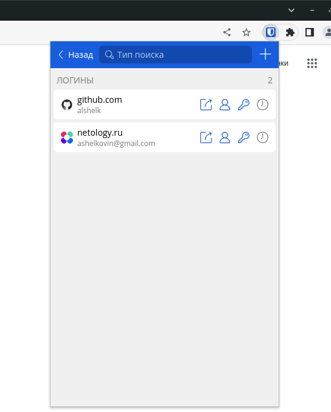
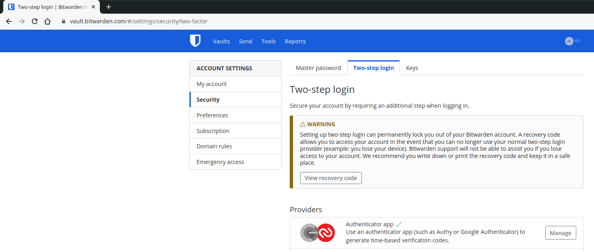
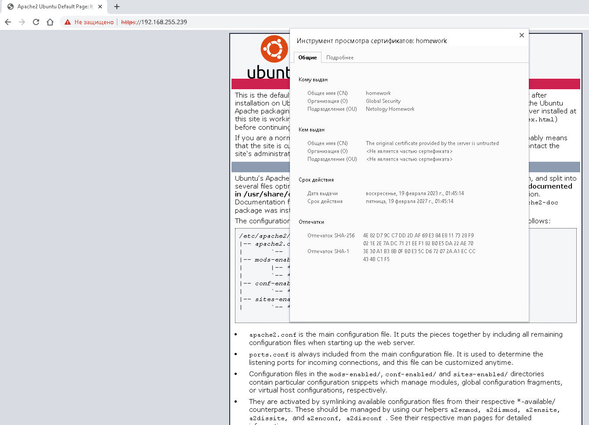
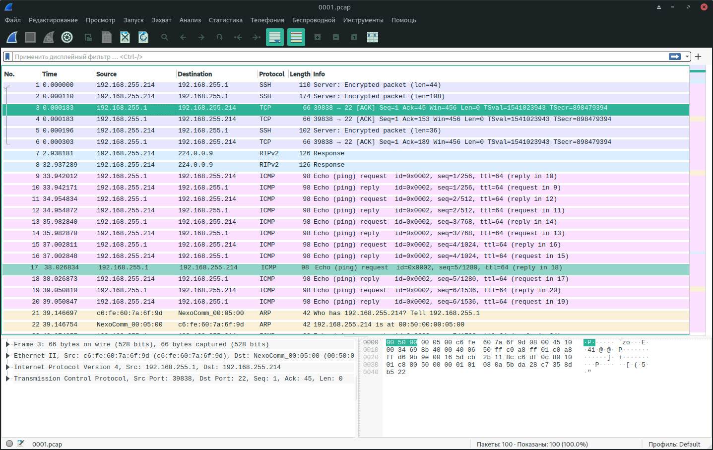

# Домашнее задание к занятию "Элементы безопасности информационных систем"

## Задание

1. Установите Bitwarden плагин для браузера. Зарегестрируйтесь и сохраните несколько паролей.



2. Установите Google authenticator на мобильный телефон. Настройте вход в Bitwarden акаунт через Google authenticator OTP.




Приложение не позволяет делать скриншоты

3. Установите apache2, сгенерируйте самоподписанный сертификат, настройте тестовый сайт для работы по HTTPS.


```bash
ubuntu@test:~$ dpkg --get-selections | grep apache
apache2						install
apache2-bin					install
apache2-data					install
apache2-utils					install

ubuntu@test:/etc/apache2/ssl$ sudo openssl req -new -x509 -days 1461 -nodes -out cert.pem -keyout cert.key -subj "/C=RU/ST=Mos/L=Mos/O=Global Security/OU=Netology Homework/CN=homework.netology.local/CN=homework"
Generating a RSA private key
..+++++
...................................+++++
writing new private key to 'cert.key'
-----

ubuntu@test:/etc/apache2/ssl$ ls
cert.key  cert.pem

ubuntu@test:/etc/apache2/ssl$ sudo a2enmod ssl
ubuntu@test:/etc/apache2/ssl$ sudo systemctl restart apache2
ubuntu@test:/etc/apache2/ssl$ sudo systemctl status apache2
● apache2.service - The Apache HTTP Server
     Loaded: loaded (/lib/systemd/system/apache2.service; enabled; vendor preset: enabled)
     Active: active (running) since Sat 2023-02-18 23:08:22 UTC; 25min ago
       Docs: https://httpd.apache.org/docs/2.4/
    Process: 4198 ExecStart=/usr/sbin/apachectl start (code=exited, status=0/SUCCESS)
   Main PID: 4215 (apache2)
      Tasks: 55 (limit: 4612)
     Memory: 12.9M
     CGroup: /system.slice/apache2.service
             ├─4215 /usr/sbin/apache2 -k start
             ├─4216 /usr/sbin/apache2 -k start
             └─4217 /usr/sbin/apache2 -k start

Feb 18 23:08:22 test systemd[1]: Starting The Apache HTTP Server...
Feb 18 23:08:22 test systemd[1]: Started The Apache HTTP Server.

ubuntu@test:/etc/apache2$ cat sites-enabled/default-ssl.conf 
<IfModule mod_ssl.c>
	<VirtualHost _default_:443>
		ServerAdmin webmaster@localhost
		DocumentRoot /var/www/html
		ErrorLog ${APACHE_LOG_DIR}/error.log
		CustomLog ${APACHE_LOG_DIR}/access.log combined
		SSLEngine on
		SSLCertificateFile ssl/cert.pem
		SSLCertificateKeyFile ssl/cert.key
		<FilesMatch "\.(cgi|shtml|phtml|php)$">
				SSLOptions +StdEnvVars
		</FilesMatch>
		<Directory /usr/lib/cgi-bin>
				SSLOptions +StdEnvVars
		</Directory>
	</VirtualHost>
</IfModule>

```



4. Проверьте на TLS уязвимости произвольный сайт в интернете (кроме сайтов МВД, ФСБ, МинОбр, НацБанк, РосКосмос, РосАтом, РосНАНО и любых госкомпаний, объектов КИИ, ВПК ... и тому подобное).


```bash
vagrant@vagrant:~/testssl.sh$ ./testssl.sh -U --sneaky https://www.github.com/

###########################################################
    testssl.sh       3.2rc2 from https://testssl.sh/dev/
    (e57527f 2023-02-08 17:07:42)

      This program is free software. Distribution and
             modification under GPLv2 permitted.
      USAGE w/o ANY WARRANTY. USE IT AT YOUR OWN RISK!

       Please file bugs @ https://testssl.sh/bugs/

###########################################################

 Using "OpenSSL 1.0.2-bad (1.0.2k-dev)" [~183 ciphers]
 on vagrant:./bin/openssl.Linux.x86_64
 (built: "Sep  1 14:03:44 2022", platform: "linux-x86_64")


 Start 2023-02-18 18:08:09        -->> 140.82.121.3:443 (www.github.com) <<--

 rDNS (140.82.121.3):    lb-140-82-121-3-fra.github.com.
 Service detected:       HTTP


 Testing vulnerabilities 

 Heartbleed (CVE-2014-0160)                not vulnerable (OK), no heartbeat extension
 CCS (CVE-2014-0224)                       not vulnerable (OK)
 Ticketbleed (CVE-2016-9244), experiment.  not vulnerable (OK), no session ticket extension
 ROBOT                                     not vulnerable (OK)
 Secure Renegotiation (RFC 5746)           supported (OK)
 Secure Client-Initiated Renegotiation     not vulnerable (OK)
 CRIME, TLS (CVE-2012-4929)                not vulnerable (OK)
 BREACH (CVE-2013-3587)                    no gzip/deflate/compress/br HTTP compression (OK)  - only supplied "/" tested
 POODLE, SSL (CVE-2014-3566)               not vulnerable (OK)
 TLS_FALLBACK_SCSV (RFC 7507)              No fallback possible (OK), no protocol below TLS 1.2 offered
 SWEET32 (CVE-2016-2183, CVE-2016-6329)    not vulnerable (OK)
 FREAK (CVE-2015-0204)                     not vulnerable (OK)
 DROWN (CVE-2016-0800, CVE-2016-0703)      not vulnerable on this host and port (OK)
                                           make sure you don't use this certificate elsewhere with SSLv2 enabled services, see
                                           https://search.censys.io/search?resource=hosts&virtual_hosts=INCLUDE&q=D94BC37BB699AAF8FC2453BFAE964F1B87A557DFB0DA526AC95D203C0DBA719C
 LOGJAM (CVE-2015-4000), experimental      not vulnerable (OK): no DH EXPORT ciphers, no DH key detected with <= TLS 1.2
 BEAST (CVE-2011-3389)                     not vulnerable (OK), no SSL3 or TLS1
 LUCKY13 (CVE-2013-0169), experimental     potentially VULNERABLE, uses cipher block chaining (CBC) ciphers with TLS. Check patches
 Winshock (CVE-2014-6321), experimental    not vulnerable (OK)
 RC4 (CVE-2013-2566, CVE-2015-2808)        no RC4 ciphers detected (OK)


 Done 2023-02-18 18:08:49 [  45s] -->> 140.82.121.3:443 (www.github.com) <<--


```

5. Установите на Ubuntu ssh сервер, сгенерируйте новый приватный ключ. Скопируйте свой публичный ключ на другой сервер. Подключитесь к серверу по SSH-ключу.
 
Проверяем ssh сервер на test:

```bash
ubuntu@test:~$ systemctl status sshd.service 
● ssh.service - OpenBSD Secure Shell server
     Loaded: loaded (/lib/systemd/system/ssh.service; enabled; vendor preset: enabled)
     Active: active (running) since Sat 2023-02-18 18:45:23 UTC; 4min 43s ago
       Docs: man:sshd(8)
             man:sshd_config(5)
    Process: 680 ExecStartPre=/usr/sbin/sshd -t (code=exited, status=0/SUCCESS)
   Main PID: 738 (sshd)
      Tasks: 1 (limit: 4612)
     Memory: 6.4M
     CGroup: /system.slice/ssh.service
             └─738 sshd: /usr/sbin/sshd -D [listener] 0 of 10-100 startups

Feb 18 18:45:22 test systemd[1]: Starting OpenBSD Secure Shell server...
Feb 18 18:45:23 test sshd[738]: Server listening on 0.0.0.0 port 22.
Feb 18 18:45:23 test sshd[738]: Server listening on :: port 22.
Feb 18 18:45:23 test systemd[1]: Started OpenBSD Secure Shell server.
Feb 18 18:49:52 test sshd[1215]: Accepted password for ubuntu from 192.168.255.1 port 39822 ssh2
Feb 18 18:49:52 test sshd[1215]: pam_unix(sshd:session): session opened for user ubuntu by (uid=0)


```

Генерим пару ключей для ssh на test2 и копируем их на test:

```bash
ubuntu@test2:~/.ssh# ssh-keygen 
Generating public/private rsa key pair.
Enter file in which to save the key (/home/ubuntu/.ssh/id_rsa): 
Enter passphrase (empty for no passphrase): 
Enter same passphrase again: 
Your identification has been saved in /home/ubuntu/.ssh/id_rsa
Your public key has been saved in /home/ubuntu/.ssh/id_rsa.pub
The key fingerprint is:
SHA256:Fz9Kw+31Z7ngfZ+XiQjttdn/enPHnwBEKp/sHvF+YDs ubuntu@test2
The key's randomart image is:
+---[RSA 3072]----+
|           .     |
|          o      |
|       . ...     |
|        +.o+     |
|        S=*.+ .  |
|        .+oB.+ ..|
|         o=.*o=o*|
|        . oE.=+*%|
|         . .o..B/|
+----[SHA256]-----+

ubuntu@test2:~/.ssh# ssh-copy-id ubuntu@192.168.255.214
/usr/bin/ssh-copy-id: INFO: Source of key(s) to be installed: "/home/ubuntu/.ssh/id_rsa.pub"
/usr/bin/ssh-copy-id: INFO: attempting to log in with the new key(s), to filter out any that are already installed
/usr/bin/ssh-copy-id: INFO: 1 key(s) remain to be installed -- if you are prompted now it is to install the new keys
ubuntu@192.168.255.214's password: 

Number of key(s) added: 1

Now try logging into the machine, with:   "ssh 'ubuntu@192.168.255.214'"
and check to make sure that only the key(s) you wanted were added.

```

Проверяем подключение по ключу:

```bash

ubuntu@test2:~/.ssh# ssh ubuntu@192.168.255.214
Welcome to Ubuntu 20.04.5 LTS (GNU/Linux 5.4.0-139-generic x86_64)

 * Documentation:  https://help.ubuntu.com
 * Management:     https://landscape.canonical.com
 * Support:        https://ubuntu.com/advantage

  System information as of Sat 18 Feb 2023 07:07:49 PM UTC

  System load:  0.0               Users logged in:         1
  Usage of /:   69.4% of 8.02GB   IPv4 address for dummy0: 10.1.1.1
  Memory usage: 19%               IPv4 address for ens3:   192.168.255.214

 * Strictly confined Kubernetes makes edge and IoT secure. Learn how MicroK8s
   just raised the bar for easy, resilient and secure K8s cluster deployment.

   https://ubuntu.com/engage/secure-kubernetes-at-the-edge

36 updates can be applied immediately.
To see these additional updates run: apt list --upgradable

New release '22.04.1 LTS' available.
Run 'do-release-upgrade' to upgrade to it.


Last login: Sat Feb 18 18:49:53 2023 from 192.168.255.1
ubuntu@test:~$ 
```


6. Переименуйте файлы ключей из задания 5. Настройте файл конфигурации SSH клиента, так чтобы вход на удаленный сервер осуществлялся по имени сервера.

Переименовываем файлы ключей:

```bash
ubuntu@test2:~/.ssh# mv id_rsa test
ubuntu@test2:~/.ssh# mv id_rsa.pub test.pub
ubuntu@test2:~/.ssh# ls
authorized_keys  known_hosts  test  test.pub

```

Настройка SSH клиента:

```bash
ubuntu@test2:~/.ssh# cat config 
Host test
 HostName 192.168.255.214
 IdentityFile ~/.ssh/test
 User ubuntu
Host *
 User default_username
 IdentityFile ~/.ssh/id_rsa
 Protocol 2

```
Проверяем подключение:

```bash
ubuntu@test2:~/.ssh# ssh test
Welcome to Ubuntu 20.04.5 LTS (GNU/Linux 5.4.0-139-generic x86_64)

 * Documentation:  https://help.ubuntu.com
 * Management:     https://landscape.canonical.com
 * Support:        https://ubuntu.com/advantage

  System information as of Sat 18 Feb 2023 07:40:35 PM UTC

  System load:  0.0               Users logged in:         1
  Usage of /:   69.4% of 8.02GB   IPv4 address for dummy0: 10.1.1.1
  Memory usage: 19%               IPv4 address for ens3:   192.168.255.214

 * Strictly confined Kubernetes makes edge and IoT secure. Learn how MicroK8s
   just raised the bar for easy, resilient and secure K8s cluster deployment.

   https://ubuntu.com/engage/secure-kubernetes-at-the-edge

36 updates can be applied immediately.
To see these additional updates run: apt list --upgradable

New release '22.04.1 LTS' available.
Run 'do-release-upgrade' to upgrade to it.


Last login: Sat Feb 18 19:07:50 2023 from 192.168.255.1
ubuntu@test:~$

```


7. Соберите дамп трафика утилитой tcpdump в формате pcap, 100 пакетов. Откройте файл pcap в Wireshark.

```bash
$ sudo tcpdump -c 100 -w 0001.pcap -i ens3
[sudo] password for ubuntu: 
tcpdump: listening on ens3, link-type EN10MB (Ethernet), capture size 262144 bytes
100 packets captured
101 packets received by filter
0 packets dropped by kernel

$ ls | grep pcap
0001.pcap

```

```bash
$ tshark -r 0001.pcap 
    1   0.000000 192.168.255.214 → 192.168.255.1 SSH 110 Server: Encrypted packet (len=44)
    2   0.000110 192.168.255.214 → 192.168.255.1 SSH 174 Server: Encrypted packet (len=108)
    3   0.000183 192.168.255.1 → 192.168.255.214 TCP 66 39838 → 22 [ACK] Seq=1 Ack=45 Win=456 Len=0 TSval=1541023943 TSecr=898479394
    4   0.000183 192.168.255.1 → 192.168.255.214 TCP 66 39838 → 22 [ACK] Seq=1 Ack=153 Win=456 Len=0 TSval=1541023943 TSecr=898479394
    5   0.000196 192.168.255.214 → 192.168.255.1 SSH 102 Server: Encrypted packet (len=36)
    6   0.000303 192.168.255.1 → 192.168.255.214 TCP 66 39838 → 22 [ACK] Seq=1 Ack=189 Win=456 Len=0 TSval=1541023943 TSecr=898479394
    7   2.938181 192.168.255.214 → 224.0.0.9    RIPv2 126 Response
    8  32.937289 192.168.255.214 → 224.0.0.9    RIPv2 126 Response
    9  33.942012 192.168.255.1 → 192.168.255.214 ICMP 98 Echo (ping) request  id=0x0002, seq=1/256, ttl=64
   10  33.942171 192.168.255.214 → 192.168.255.1 ICMP 98 Echo (ping) reply    id=0x0002, seq=1/256, ttl=64 (request in 9)
   11  34.954834 192.168.255.1 → 192.168.255.214 ICMP 98 Echo (ping) request  id=0x0002, seq=2/512, ttl=64
   12  34.954872 192.168.255.214 → 192.168.255.1 ICMP 98 Echo (ping) reply    id=0x0002, seq=2/512, ttl=64 (request in 11)
   13  35.982840 192.168.255.1 → 192.168.255.214 ICMP 98 Echo (ping) request  id=0x0002, seq=3/768, ttl=64
   14  35.982870 192.168.255.214 → 192.168.255.1 ICMP 98 Echo (ping) reply    id=0x0002, seq=3/768, ttl=64 (request in 13)
   15  37.002811 192.168.255.1 → 192.168.255.214 ICMP 98 Echo (ping) request  id=0x0002, seq=4/1024, ttl=64
   16  37.002848 192.168.255.214 → 192.168.255.1 ICMP 98 Echo (ping) reply    id=0x0002, seq=4/1024, ttl=64 (request in 15)
   17  38.026834 192.168.255.1 → 192.168.255.214 ICMP 98 Echo (ping) request  id=0x0002, seq=5/1280, ttl=64
   18  38.026873 192.168.255.214 → 192.168.255.1 ICMP 98 Echo (ping) reply    id=0x0002, seq=5/1280, ttl=64 (request in 17)
   19  39.050810 192.168.255.1 → 192.168.255.214 ICMP 98 Echo (ping) request  id=0x0002, seq=6/1536, ttl=64
   20  39.050847 192.168.255.214 → 192.168.255.1 ICMP 98 Echo (ping) reply    id=0x0002, seq=6/1536, ttl=64 (request in 19)
   21  39.146697 c6:fe:60:7a:6f:9d → NexoComm_00:05:00 ARP 42 Who has 192.168.255.214? Tell 192.168.255.1
   22  39.146754 NexoComm_00:05:00 → c6:fe:60:7a:6f:9d ARP 42 192.168.255.214 is at 00:50:00:00:05:00
   23  40.074857 192.168.255.1 → 192.168.255.214 ICMP 98 Echo (ping) request  id=0x0002, seq=7/1792, ttl=64
   24  40.074894 192.168.255.214 → 192.168.255.1 ICMP 98 Echo (ping) reply    id=0x0002, seq=7/1792, ttl=64 (request in 23)
   25  41.098780 192.168.255.1 → 192.168.255.214 ICMP 98 Echo (ping) request  id=0x0002, seq=8/2048, ttl=64
   26  41.098818 192.168.255.214 → 192.168.255.1 ICMP 98 Echo (ping) reply    id=0x0002, seq=8/2048, ttl=64 (request in 25)
   27  42.122764 192.168.255.1 → 192.168.255.214 ICMP 98 Echo (ping) request  id=0x0002, seq=9/2304, ttl=64
   28  42.122803 192.168.255.214 → 192.168.255.1 ICMP 98 Echo (ping) reply    id=0x0002, seq=9/2304, ttl=64 (request in 27)
   29  43.146772 192.168.255.1 → 192.168.255.214 ICMP 98 Echo (ping) request  id=0x0002, seq=10/2560, ttl=64
   30  43.146810 192.168.255.214 → 192.168.255.1 ICMP 98 Echo (ping) reply    id=0x0002, seq=10/2560, ttl=64 (request in 29)
   31  44.170730 192.168.255.1 → 192.168.255.214 ICMP 98 Echo (ping) request  id=0x0002, seq=11/2816, ttl=64
   32  44.170767 192.168.255.214 → 192.168.255.1 ICMP 98 Echo (ping) reply    id=0x0002, seq=11/2816, ttl=64 (request in 31)
   33  45.198710 192.168.255.1 → 192.168.255.214 ICMP 98 Echo (ping) request  id=0x0002, seq=12/3072, ttl=64
   34  45.198748 192.168.255.214 → 192.168.255.1 ICMP 98 Echo (ping) reply    id=0x0002, seq=12/3072, ttl=64 (request in 33)
   35  46.218710 192.168.255.1 → 192.168.255.214 ICMP 98 Echo (ping) request  id=0x0002, seq=13/3328, ttl=64
   36  46.218741 192.168.255.214 → 192.168.255.1 ICMP 98 Echo (ping) reply    id=0x0002, seq=13/3328, ttl=64 (request in 35)
   37  47.242683 192.168.255.1 → 192.168.255.214 ICMP 98 Echo (ping) request  id=0x0002, seq=14/3584, ttl=64
   38  47.242721 192.168.255.214 → 192.168.255.1 ICMP 98 Echo (ping) reply    id=0x0002, seq=14/3584, ttl=64 (request in 37)
   39  48.266763 192.168.255.1 → 192.168.255.214 ICMP 98 Echo (ping) request  id=0x0002, seq=15/3840, ttl=64
   40  48.266806 192.168.255.214 → 192.168.255.1 ICMP 98 Echo (ping) reply    id=0x0002, seq=15/3840, ttl=64 (request in 39)
   41  48.364917 NexoComm_00:05:00 → c6:fe:60:7a:6f:9d ARP 42 Who has 192.168.255.1? Tell 192.168.255.214
   42  48.365125 c6:fe:60:7a:6f:9d → NexoComm_00:05:00 ARP 42 192.168.255.1 is at c6:fe:60:7a:6f:9d
   43  49.290648 192.168.255.1 → 192.168.255.214 ICMP 98 Echo (ping) request  id=0x0002, seq=16/4096, ttl=64
   44  49.290684 192.168.255.214 → 192.168.255.1 ICMP 98 Echo (ping) reply    id=0x0002, seq=16/4096, ttl=64 (request in 43)
   45  50.314713 192.168.255.1 → 192.168.255.214 ICMP 98 Echo (ping) request  id=0x0002, seq=17/4352, ttl=64
   46  50.314754 192.168.255.214 → 192.168.255.1 ICMP 98 Echo (ping) reply    id=0x0002, seq=17/4352, ttl=64 (request in 45)
   47  51.338642 192.168.255.1 → 192.168.255.214 ICMP 98 Echo (ping) request  id=0x0002, seq=18/4608, ttl=64
   48  51.338679 192.168.255.214 → 192.168.255.1 ICMP 98 Echo (ping) reply    id=0x0002, seq=18/4608, ttl=64 (request in 47)
   49  52.362601 192.168.255.1 → 192.168.255.214 ICMP 98 Echo (ping) request  id=0x0002, seq=19/4864, ttl=64
   50  52.362633 192.168.255.214 → 192.168.255.1 ICMP 98 Echo (ping) reply    id=0x0002, seq=19/4864, ttl=64 (request in 49)
   51  53.390656 192.168.255.1 → 192.168.255.214 ICMP 98 Echo (ping) request  id=0x0002, seq=20/5120, ttl=64
   52  53.390695 192.168.255.214 → 192.168.255.1 ICMP 98 Echo (ping) reply    id=0x0002, seq=20/5120, ttl=64 (request in 51)
   53  54.410597 192.168.255.1 → 192.168.255.214 ICMP 98 Echo (ping) request  id=0x0002, seq=21/5376, ttl=64
   54  54.410636 192.168.255.214 → 192.168.255.1 ICMP 98 Echo (ping) reply    id=0x0002, seq=21/5376, ttl=64 (request in 53)
   55  55.434599 192.168.255.1 → 192.168.255.214 ICMP 98 Echo (ping) request  id=0x0002, seq=22/5632, ttl=64
   56  55.434636 192.168.255.214 → 192.168.255.1 ICMP 98 Echo (ping) reply    id=0x0002, seq=22/5632, ttl=64 (request in 55)
   57  56.458569 192.168.255.1 → 192.168.255.214 ICMP 98 Echo (ping) request  id=0x0002, seq=23/5888, ttl=64
   58  56.458605 192.168.255.214 → 192.168.255.1 ICMP 98 Echo (ping) reply    id=0x0002, seq=23/5888, ttl=64 (request in 57)
   59  57.482564 192.168.255.1 → 192.168.255.214 ICMP 98 Echo (ping) request  id=0x0002, seq=24/6144, ttl=64
   60  57.482602 192.168.255.214 → 192.168.255.1 ICMP 98 Echo (ping) reply    id=0x0002, seq=24/6144, ttl=64 (request in 59)
   61  58.506609 192.168.255.1 → 192.168.255.214 ICMP 98 Echo (ping) request  id=0x0002, seq=25/6400, ttl=64
   62  58.506648 192.168.255.214 → 192.168.255.1 ICMP 98 Echo (ping) reply    id=0x0002, seq=25/6400, ttl=64 (request in 61)
   63  59.530526 192.168.255.1 → 192.168.255.214 ICMP 98 Echo (ping) request  id=0x0002, seq=26/6656, ttl=64
   64  59.530562 192.168.255.214 → 192.168.255.1 ICMP 98 Echo (ping) reply    id=0x0002, seq=26/6656, ttl=64 (request in 63)
   65  60.554561 192.168.255.1 → 192.168.255.214 ICMP 98 Echo (ping) request  id=0x0002, seq=27/6912, ttl=64
   66  60.554599 192.168.255.214 → 192.168.255.1 ICMP 98 Echo (ping) reply    id=0x0002, seq=27/6912, ttl=64 (request in 65)
   67  61.578556 192.168.255.1 → 192.168.255.214 ICMP 98 Echo (ping) request  id=0x0002, seq=28/7168, ttl=64
   68  61.578594 192.168.255.214 → 192.168.255.1 ICMP 98 Echo (ping) reply    id=0x0002, seq=28/7168, ttl=64 (request in 67)
   69  62.602469 192.168.255.1 → 192.168.255.214 ICMP 98 Echo (ping) request  id=0x0002, seq=29/7424, ttl=64
   70  62.602497 192.168.255.214 → 192.168.255.1 ICMP 98 Echo (ping) reply    id=0x0002, seq=29/7424, ttl=64 (request in 69)
   71  62.937129 192.168.255.214 → 224.0.0.9    RIPv2 126 Response
   72  63.626530 192.168.255.1 → 192.168.255.214 ICMP 98 Echo (ping) request  id=0x0002, seq=30/7680, ttl=64
   73  63.626560 192.168.255.214 → 192.168.255.1 ICMP 98 Echo (ping) reply    id=0x0002, seq=30/7680, ttl=64 (request in 72)
   74  64.650472 192.168.255.1 → 192.168.255.214 ICMP 98 Echo (ping) request  id=0x0002, seq=31/7936, ttl=64
   75  64.650501 192.168.255.214 → 192.168.255.1 ICMP 98 Echo (ping) reply    id=0x0002, seq=31/7936, ttl=64 (request in 74)
   76  65.674435 192.168.255.1 → 192.168.255.214 ICMP 98 Echo (ping) request  id=0x0002, seq=32/8192, ttl=64
   77  65.674464 192.168.255.214 → 192.168.255.1 ICMP 98 Echo (ping) reply    id=0x0002, seq=32/8192, ttl=64 (request in 76)
   78  66.698514 192.168.255.1 → 192.168.255.214 ICMP 98 Echo (ping) request  id=0x0002, seq=33/8448, ttl=64
   79  66.698553 192.168.255.214 → 192.168.255.1 ICMP 98 Echo (ping) reply    id=0x0002, seq=33/8448, ttl=64 (request in 78)
   80  67.726447 192.168.255.1 → 192.168.255.214 ICMP 98 Echo (ping) request  id=0x0002, seq=34/8704, ttl=64
   81  67.726486 192.168.255.214 → 192.168.255.1 ICMP 98 Echo (ping) reply    id=0x0002, seq=34/8704, ttl=64 (request in 80)
   82  68.746452 192.168.255.1 → 192.168.255.214 ICMP 98 Echo (ping) request  id=0x0002, seq=35/8960, ttl=64
   83  68.746480 192.168.255.214 → 192.168.255.1 ICMP 98 Echo (ping) reply    id=0x0002, seq=35/8960, ttl=64 (request in 82)
   84  68.842351 c6:fe:60:7a:6f:9d → NexoComm_00:05:00 ARP 42 Who has 192.168.255.214? Tell 192.168.255.1
   85  68.842360 NexoComm_00:05:00 → c6:fe:60:7a:6f:9d ARP 42 192.168.255.214 is at 00:50:00:00:05:00
   86  69.770503 192.168.255.1 → 192.168.255.214 ICMP 98 Echo (ping) request  id=0x0002, seq=36/9216, ttl=64
   87  69.770547 192.168.255.214 → 192.168.255.1 ICMP 98 Echo (ping) reply    id=0x0002, seq=36/9216, ttl=64 (request in 86)
   88  70.794463 192.168.255.1 → 192.168.255.214 ICMP 98 Echo (ping) request  id=0x0002, seq=37/9472, ttl=64
   89  70.794501 192.168.255.214 → 192.168.255.1 ICMP 98 Echo (ping) reply    id=0x0002, seq=37/9472, ttl=64 (request in 88)
   90  71.818499 192.168.255.1 → 192.168.255.214 ICMP 98 Echo (ping) request  id=0x0002, seq=38/9728, ttl=64
   91  71.818535 192.168.255.214 → 192.168.255.1 ICMP 98 Echo (ping) reply    id=0x0002, seq=38/9728, ttl=64 (request in 90)
   92  72.842388 192.168.255.1 → 192.168.255.214 ICMP 98 Echo (ping) request  id=0x0002, seq=39/9984, ttl=64
   93  72.842426 192.168.255.214 → 192.168.255.1 ICMP 98 Echo (ping) reply    id=0x0002, seq=39/9984, ttl=64 (request in 92)
   94  73.866476 192.168.255.1 → 192.168.255.214 ICMP 98 Echo (ping) request  id=0x0002, seq=40/10240, ttl=64
   95  73.866520 192.168.255.214 → 192.168.255.1 ICMP 98 Echo (ping) reply    id=0x0002, seq=40/10240, ttl=64 (request in 94)
   96  74.890483 192.168.255.1 → 192.168.255.214 ICMP 98 Echo (ping) request  id=0x0002, seq=41/10496, ttl=64
   97  74.890529 192.168.255.214 → 192.168.255.1 ICMP 98 Echo (ping) reply    id=0x0002, seq=41/10496, ttl=64 (request in 96)
   98  75.914351 192.168.255.1 → 192.168.255.214 ICMP 98 Echo (ping) request  id=0x0002, seq=42/10752, ttl=64
   99  75.914379 192.168.255.214 → 192.168.255.1 ICMP 98 Echo (ping) reply    id=0x0002, seq=42/10752, ttl=64 (request in 98)
  100  76.938336 192.168.255.1 → 192.168.255.214 ICMP 98 Echo (ping) request  id=0x0002, seq=43/11008, ttl=64

```



*В качестве решения приложите: скриншоты, выполняемые команды, комментарии (по необходимости).*

 ---
 
## Задание для самостоятельной отработки* (необязательно к выполнению)

8. Просканируйте хост scanme.nmap.org. Какие сервисы запущены?


```bash
$ sudo nmap -A scanme.nmap.org
Starting Nmap 7.93 ( https://nmap.org ) at 2023-02-19 00:49 MSK
Nmap scan report for scanme.nmap.org (45.33.32.156)
Host is up (0.19s latency).
Other addresses for scanme.nmap.org (not scanned): 2600:3c01::f03c:91ff:fe18:bb2f
Not shown: 996 closed tcp ports (reset)
PORT      STATE SERVICE    VERSION
22/tcp    open  ssh        OpenSSH 6.6.1p1 Ubuntu 2ubuntu2.13 (Ubuntu Linux; protocol 2.0)
| ssh-hostkey: 
|   1024 ac00a01a82ffcc5599dc672b34976b75 (DSA)
|   2048 203d2d44622ab05a9db5b30514c2a6b2 (RSA)
|   256 9602bb5e57541c4e452f564c4a24b257 (ECDSA)
|_  256 33fa910fe0e17b1f6d05a2b0f1544156 (ED25519)
80/tcp    open  http       Apache httpd 2.4.7 ((Ubuntu))
|_http-favicon: Nmap Project
|_http-server-header: Apache/2.4.7 (Ubuntu)
|_http-title: Go ahead and ScanMe!
9929/tcp  open  nping-echo Nping echo
31337/tcp open  tcpwrapped
Device type: general purpose|storage-misc|firewall
Running (JUST GUESSING): Linux 4.X|2.6.X|3.X (85%), Synology DiskStation Manager 5.X (85%), WatchGuard Fireware 11.X (85%)
OS CPE: cpe:/o:linux:linux_kernel:4.0 cpe:/o:linux:linux_kernel:2.6.32 cpe:/o:linux:linux_kernel:3 cpe:/o:linux:linux_kernel cpe:/a:synology:diskstation_manager:5.1 cpe:/o:watchguard:fireware:11.8
Aggressive OS guesses: Linux 4.0 (85%), Linux 2.6.32 (85%), Linux 2.6.39 (85%), Linux 3.10 - 3.12 (85%), Linux 3.4 (85%), Linux 3.5 (85%), Linux 4.2 (85%), Linux 4.4 (85%), Synology DiskStation Manager 5.1 (85%), WatchGuard Fireware 11.8 (85%)
No exact OS matches for host (test conditions non-ideal).
Network Distance: 22 hops
Service Info: OS: Linux; CPE: cpe:/o:linux:linux_kernel


```

Запущены: OpenSSH server (v6.6.1p1) на 22 порту и Apache httpd (v2.4.7) на 80 порту, nping-echo на 9929 порту

31337/tcp open  tcpwrapped - говорит о том, что либо этот порт защищен tcpwrapper, либо что-то еще, например брандмауэр или балансировщик, перехватывают запросы на нем.
(т.е. рукопожатие TCP было завершено, но удаленный узел закрыл соединение)

9. Установите и настройте фаервол ufw на web-сервер из задания 3. Откройте доступ снаружи только к портам 22,80,443

настройки ufw:

```bash
ubuntu@test:~$ sudo ufw status verbose
Status: active
Logging: on (low)
Default: deny (incoming), allow (outgoing), disabled (routed)
New profiles: skip

To                         Action      From
--                         ------      ----
22/tcp                     ALLOW IN    Anywhere                  
80/tcp                     ALLOW IN    Anywhere                  
443/tcp                    ALLOW IN    Anywhere  
```

проверим доступность портов:

```bash
ubuntu@test2:~$ sudo nmap -A 192.168.255.239
Starting Nmap 7.80 ( https://nmap.org ) at 2023-02-18 23:27 UTC
Nmap scan report for 192.168.255.239
Host is up (0.00080s latency).
Not shown: 997 filtered ports
PORT    STATE SERVICE  VERSION
22/tcp  open  ssh      OpenSSH 8.2p1 Ubuntu 4ubuntu0.5 (Ubuntu Linux; protocol 2.0)
80/tcp  open  http     Apache httpd 2.4.41 ((Ubuntu))
|_http-server-header: Apache/2.4.41 (Ubuntu)
|_http-title: Apache2 Ubuntu Default Page: It works
443/tcp open  ssl/http Apache httpd 2.4.41 ((Ubuntu))
|_http-server-header: Apache/2.4.41 (Ubuntu)
|_http-title: Apache2 Ubuntu Default Page: It works
| ssl-cert: Subject: commonName=homework/organizationName=Global Security/stateOrProvinceName=Mos/countryName=RU
| Not valid before: 2023-02-18T22:45:14
|_Not valid after:  2027-02-18T22:45:14
| tls-alpn: 
|_  http/1.1
Service Info: OS: Linux; CPE: cpe:/o:linux:linux_kernel

Service detection performed. Please report any incorrect results at https://nmap.org/submit/ .
Nmap done: 1 IP address (1 host up) scanned in 17.72 seconds

```
----