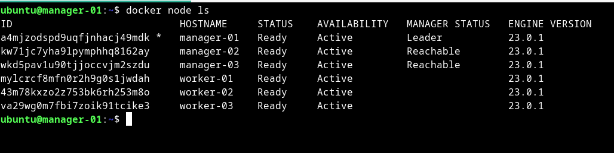
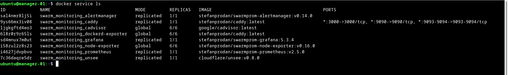
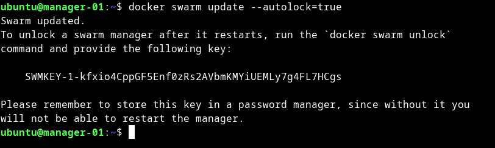

# Домашнее задание к занятию "5. Оркестрация кластером Docker контейнеров на примере Docker Swarm"

## Задача 1

Дайте письменные ответы на следующие вопросы:

- В чём отличие режимов работы сервисов в Docker Swarm кластере: replication и global?

    
    global - означает, что данный сервис будет запущен ровно в одном экземпляре на всех возможных нодах
    replication - означает, что на всех нодах будет запущено указанное количество контейнеров

- Какой алгоритм выбора лидера используется в Docker Swarm кластере?


    Используется алгоритм поддержания распределенного консенсуса - Raft. 
    
- Что такое Overlay Network?
    
    
    Это внутренняя частная сеть, которая охватывает все узлы, участвующие в кластере swarm. Которая
    предназначена для облегчения обмена данными между сервисом Docker Swarm и автономным контейнером
    или между двумя автономными контейнерами на разных демонах Docker.


## Задача 2

Создать ваш первый Docker Swarm кластер в Яндекс.Облаке

Для получения зачета, вам необходимо предоставить скриншот из терминала (консоли), с выводом команды:
```
docker node ls
```



## Задача 3

Создать ваш первый, готовый к боевой эксплуатации кластер мониторинга, состоящий из стека микросервисов.

Для получения зачета, вам необходимо предоставить скриншот из терминала (консоли), с выводом команды:
```
docker service ls
```



## Задача 4 (*)

Выполнить на лидере Docker Swarm кластера команду (указанную ниже) и дать письменное описание её функционала, что она делает и зачем она нужна:
```
# см.документацию: https://docs.docker.com/engine/swarm/swarm_manager_locking/
docker swarm update --autolock=true
```




    Данная команда включает автоблокировку существующего swarm.
    Она нужна, что бы хранить в зашифрованном виде ключи TLS, используемые 
    для шифрования связи между узлами swarm и используемый для шифрования и расшифровки журналов
    Raft на диске. Пока к ключам не обращаются, они хранятся в зашифрованном виде,
    но при перезапуске Docker, потребуется ручная разблокировка ключей, с использованием ключа 
    шифрования, сгенерированного Docker, когда swarm был заблокирован.