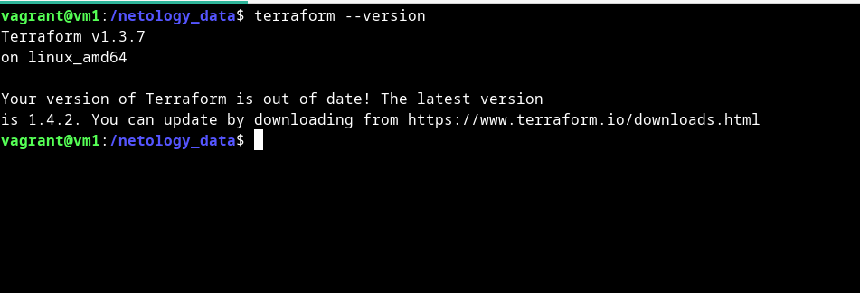
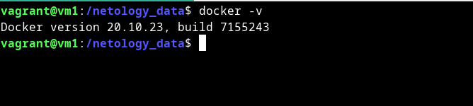
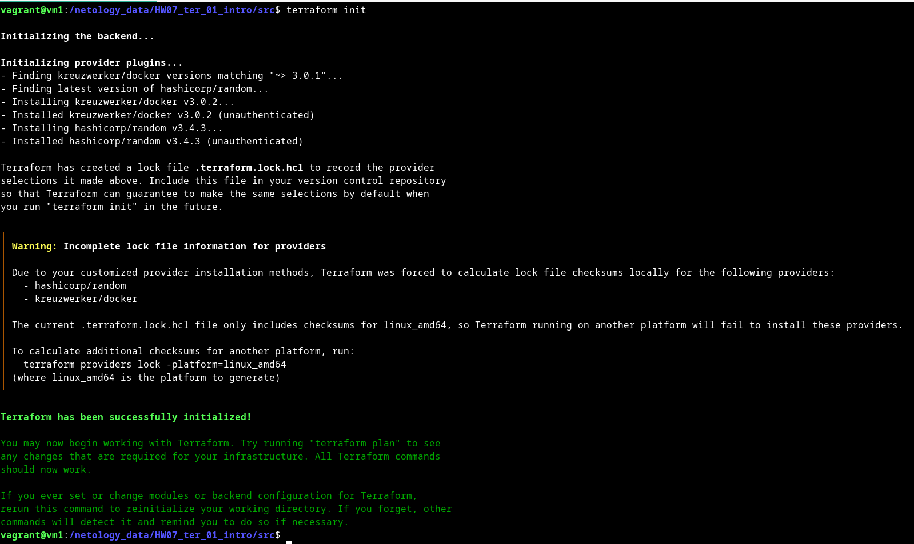

# Домашнее задание к занятию "Введение в Terraform"

### Цель задания

1. Установить и настроить Terrafrom.
2. Научиться использовать готовый код.

------

### Чеклист готовности к домашнему заданию

1. Скачайте и установите актуальную версию **terraform**(не менее 1.3.7). Приложите скриншот вывода команды ```terraform --version```

 

4. Скачайте на свой ПК данный git репозиторий. Исходный код для выполнения задания расположен в директории **01/src**.
3. Убедитесь, что в вашей ОС установлен docker



------

### Инструменты и дополнительные материалы, которые пригодятся для выполнения задания

1. Установка и настройка Terraform  [ссылка](https://cloud.yandex.ru/docs/tutorials/infrastructure-management/terraform-quickstart#from-yc-mirror)
2. Зеркало документации Terraform  [ссылка](https://registry.tfpla.net/browse/providers) 
3. Установка docker [ссылка](https://docs.docker.com/engine/install/ubuntu/) 
------


### Задание 1

1. Перейдите в каталог [**src**](https://github.com/netology-code/ter-homeworks/tree/main/01/src). Скачайте все необходимые зависимости, использованные в проекте.



2. Изучите файл **.gitignore**. В каком terraform файле допустимо сохранить личную, секретную информацию?

```bash
vagrant@vm1:/netology_data/HW07_ter_01_intro/src$ cat .gitignore 
# Local .terraform directories and files
**/.terraform/*
.terraform*

# .tfstate files
*.tfstate
*.tfstate.*

# own secret vars store.
personal.auto.tfvars
```

```text
Секретную личную информацию допустимо хранить в personal.auto.tfvars
```


3. Выполните код проекта. Найдите  в State-файле секретное содержимое созданного ресурса **random_password**. Пришлите его в качестве ответа.

```bash
$ cat terraform.tfstate | grep result
            "result": "gZ9fJjYenY5dC8Zr",

```

4. Раскомментируйте блок кода, примерно расположенный на строчках 29-42 файла **main.tf**.
   Выполните команду ```terraform -validate```. Объясните в чем заключаются намеренно допущенные ошибки? Исправьте их.

```bash
$ terraform validate
╷
│ Error: Missing name for resource
│ 
│   on main.tf line 23, in resource "docker_image":
│   23: resource "docker_image" {
│ 
│ All resource blocks must have 2 labels (type, name).
╵
╷
│ Error: Invalid resource name
│ 
│   on main.tf line 28, in resource "docker_container" "1nginx":
│   28: resource "docker_container" "1nginx" {
│ 
│ A name must start with a letter or underscore and may contain only letters, digits, underscores, and dashes.
╵
```

```text
Первая ошибка, говорит об отсутствии имени ресурса. Блок resourse должен содержать две метки (тип и имя)

Вторая ошибка говорит о неправильном имени resourse. И подсказывает, что имя должно начинаться с буквы или символа
подчеркивания и может содержать только буквы, цифры , символы подчеркивания и дефисы.

исправляем:
```

```bash
$ tail main.tf -n 15

resource "docker_image" "nginx" {
  name         = "nginx:latest"
  keep_locally = true
}

resource "docker_container" "nginx" {
  image = docker_image.nginx.image_id
  name  = "example_${random_password.random_string.result}"

  ports {
    internal = 80
    external = 8000
  }
}

$ terraform validate
Success! The configuration is valid.

```

5. Выполните код. В качестве ответа приложите вывод команды ```docker ps```

```bash
$ docker ps
CONTAINER ID   IMAGE          COMMAND                  CREATED          STATUS          PORTS                  NAMES
8ddad00be6d6   a99a39d070bf   "/docker-entrypoint.…"   23 seconds ago   Up 22 seconds   0.0.0.0:8000->80/tcp   example_gZ9fJjYenY5dC8Zr

```

6. Замените имя docker-контейнера в блоке кода на ```hello_world```, выполните команду ```terraform apply -auto-approve```.
   Объясните своими словами, в чем может быть опасность применения ключа  ```-auto-approve``` ?

```bash
$ docker ps
CONTAINER ID   IMAGE          COMMAND                  CREATED         STATUS         PORTS                  NAMES
8afd8312a7a2   a99a39d070bf   "/docker-entrypoint.…"   7 minutes ago   Up 7 minutes   0.0.0.0:8000->80/tcp   hello_world

```

```text
terraform apply - создает и обновляет инфраструктуру после запроса подтверждения, что дает возможность
еще раз проверить вносимые изменения и избежать критических ошибок ведущих к необратимым оптерям данных 

terraform apply -auto-approve  - создает и обновляет инфраструктуру без подтверждения от пользователя, что
может привести к критическим ошибкам и потерям данных.

```

7. Уничтожьте созданные ресурсы с помощью **terraform**. Убедитесь, что все ресурсы удалены. Приложите содержимое файла **terraform.tfstate**.

```bash
$ cat terraform.tfstate
{
  "version": 4,
  "terraform_version": "1.3.7",
  "serial": 17,
  "lineage": "a8bb3071-5d31-ff43-b205-aa4fe6d201a6",
  "outputs": {},
  "resources": [],
  "check_results": null
}

```

8. Объясните, почему при этом не был удален docker образ **nginx:latest** ?(Ответ найдите в коде проекта или документации)


```text
keep_locally (Boolean) If true, then the Docker image won't be deleted on destroy operation. If this is false, 
it will delete the image from the docker local storage on destroy operation.

В описании resource "docker_image" установлен параметр keep_locally = true :

resource "docker_image" "nginx" {
  name         = "nginx:latest"
  keep_locally = true
}

который запрещает удаление образа при операции уничтожения

```

[документация](https://github.com/kreuzwerker/terraform-provider-docker/blob/master/docs/resources/image.md)

---

## Дополнительные задания (со звездочкой*)

**Настоятельно рекомендуем выполнять все задания под звёздочкой.**   Их выполнение поможет глубже разобраться в материале.
Задания под звёздочкой дополнительные (необязательные к выполнению) и никак не повлияют на получение вами зачета по этому домашнему заданию.

### Задание 2*

1. Изучите в документации provider [**Virtualbox**](https://registry.tfpla.net/providers/shekeriev/virtualbox/latest/docs/overview/index) от
   shekeriev.
2. Создайте с его помощью любую виртуальную машину.

В качестве ответа приложите plan для создаваемого ресурса.

```bash
$ terraform plan

Terraform used the selected providers to generate the following execution plan. Resource actions are indicated with the following symbols:
  + create

Terraform will perform the following actions:

  # virtualbox_vm.vm-tr1 will be created
  + resource "virtualbox_vm" "vm-tr1" {
      + cpus      = 1
      + id        = (known after apply)
      + image     = "https://app.vagrantup.com/shekeriev/boxes/debian-11/versions/0.2/providers/virtualbox.box"
      + memory    = "512 mib"
      + name      = "debian-11"
      + status    = "running"
      + user_data = jsonencode(
            {
              + foo  = "bar"
              + role = "worker"
            }
        )

      + network_adapter {
          + device                 = "IntelPro1000MTServer"
          + host_interface         = "vboxnet1"
          + ipv4_address           = (known after apply)
          + ipv4_address_available = (known after apply)
          + mac_address            = (known after apply)
          + status                 = (known after apply)
          + type                   = "hostonly"
        }
    }

Plan: 1 to add, 0 to change, 0 to destroy.

Changes to Outputs:
  + IPAddress = (known after apply)

─────────────────────────────────────────────────────────────────────────────────────────────────────────────────────────────────────────────────────────────────────────────────────────────

Note: You didn't use the -out option to save this plan, so Terraform can't guarantee to take exactly these actions if you run "terraform apply" now.
```


