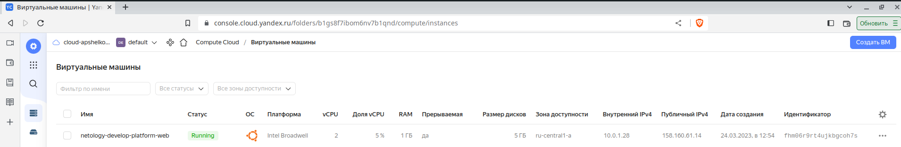
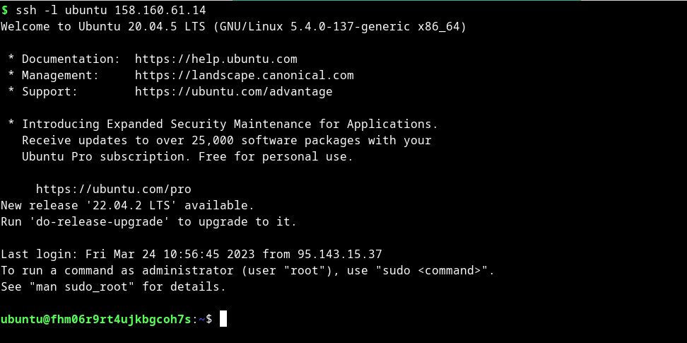

# Домашнее задание к занятию "Основы Terraform. Yandex Cloud"


### Чеклист готовности к домашнему заданию

1. Зарегистрирован аккаунт в Yandex Cloud. Использован промокод на грант.
2. Установлен инструмент Yandex Cli.
3. Исходный код для выполнения задания расположен в директории [**02/src**](https://github.com/netology-code/ter-homeworks/tree/main/02/src).


### Задание 0

1. Ознакомьтесь с [документацией к security-groups в Yandex Cloud](https://cloud.yandex.ru/docs/vpc/concepts/security-groups?from=int-console-help-center-or-nav).
2. Запросите preview доступ к данному функционалу в ЛК Yandex Cloud. Обычно его выдают в течении 24-х часов.
https://console.cloud.yandex.ru/folders/<ваш cloud_id>/vpc/security-groups
Этот функционал понадобится к следующей лекции. 


### Задание 1

1. Изучите проект. В файле variables.tf объявлены переменные для yandex provider.
2. Переименуйте файл personal.auto.tfvars_example в personal.auto.tfvars. Заполните переменные (идентификаторы облака, токен доступа). Благодаря .gitignore этот файл не попадет в публичный репозиторий. **Вы можете выбрать иной способ безопасно передать секретные данные в terraform.**
3. Сгенерируйте или используйте свой текущий ssh ключ. Запишите его открытую часть в переменную **vms_ssh_root_key**.
4. Инициализируйте проект, выполните код. Исправьте возникшую ошибку. Ответьте в чем заключается ее суть?
5. Ответьте, что означает ```preemptible = true``` и ```core_fraction``` в параметрах ВМ? Как это может пригодится в процессе обучения? Ответ в документации Yandex cloud.


В качестве решения приложите:
- скриншот ЛК Yandex Cloud с созданной ВМ,



- скриншот успешного подключения к консоли ВМ через ssh,



- ответы на вопросы.

Ответы:

Вопрос 4:

```bash
yandex_vpc_network.develop: Creating...
╷
│ Error: Error while requesting API to create network: server-request-id = f0523ede-a331-4d00-b094-c6542445af84 server-trace-id = 4ae4e2713ebe8314:e90ee7a6c1c65992:4ae4e2713ebe8314:1 client-request-id = a55489e1-77e2-45ca-a96e-ad0543fe0118 client-trace-id = 9556a93e-30e2-4672-9b28-747dc89c8924 rpc error: code = ResourceExhausted desc = Quota limit vpc.networks.count exceeded
│ 
│   with yandex_vpc_network.develop,
│   on main.tf line 1, in resource "yandex_vpc_network" "develop":
│    1: resource "yandex_vpc_network" "develop" {
│ 
╵


yandex_compute_instance.platform: Creating...
╷
│ Error: Error while requesting API to create instance: server-request-id = 4b35add5-d0fc-4f37-8418-0c5f0c4f9f2a server-trace-id = 6d5cb1a805c3ce43:d8cf0c75eb91ac03:6d5cb1a805c3ce43:1 client-request-id = b9529ea6-a875-4ce7-9ac3-ca12c43d9aec client-trace-id = a19de33a-5bd4-4482-9402-ae897f903919 rpc error: code = InvalidArgument desc = the specified number of cores is not available on platform "standard-v1"; allowed core number: 2, 4
│ 
│   with yandex_compute_instance.platform,
│   on main.tf line 15, in resource "yandex_compute_instance" "platform":
│   15: resource "yandex_compute_instance" "platform" {
│ 
╵

```

```text
Первая ошибка, говорит что превышено количество допустимых сетей. Удаляем созданные сети в yandex cloud.

Вторая ошибка, говорит, что на платформе допустимо количество ядер: 2, 4. В конфиге указано 1 ядро, исправляем на два и опять пробуем terraform apply

resource "yandex_compute_instance" "platform" {
  name        = "netology-develop-platform-web"
  platform_id = "standard-v1"
  resources {
    cores         = 1  # исправляем на 2
    memory        = 1
    core_fraction = 5
  }
```

```bash
$ terraform apply
data.yandex_compute_image.ubuntu: Reading...

...

Do you want to perform these actions?
  Terraform will perform the actions described above.
  Only 'yes' will be accepted to approve.

  Enter a value: yes

yandex_compute_instance.platform: Creating...
yandex_compute_instance.platform: Still creating... [10s elapsed]
yandex_compute_instance.platform: Still creating... [20s elapsed]
yandex_compute_instance.platform: Still creating... [30s elapsed]
yandex_compute_instance.platform: Still creating... [40s elapsed]
yandex_compute_instance.platform: Creation complete after 41s [id=fhm7iv8a96o6163qf2v5]

Apply complete! Resources: 1 added, 0 changed, 0 destroyed.

```

Вопрос 5:


```text
параметр "preemptible = true"   - Указывает, является ли экземпляр вытесняемым. По умолчанию ложно. 
Это означает что выполнение может быть прервано для выполнения других действий без каких-либо побочных эфектов

параметр core_fraction  при наличии указывает базовую производительность ядра в процентах.
При создании каждой виртуальной машины необходимо выбирать уровень производительности vCPU. Этот уровень определяет долю вычислительного времени физических ядер, которую гарантирует vCPU.

```
The scheduling_policy block supports:

[preemptible](https://registry.tfpla.net/providers/yandex-cloud/yandex/latest/docs/resources/compute_instance#preemptible) - (Optional) Specifies if the instance is preemptible. Defaults to false.


The resources block supports:

[core_fraction](https://registry.tfpla.net/providers/yandex-cloud/yandex/latest/docs/resources/compute_instance#core_fraction) - (Optional) If provided, specifies baseline performance for a core as a percent.


### Задание 2

1. Изучите файлы проекта.
2. Замените все "хардкод" **значения** для ресурсов **yandex_compute_image** и **yandex_compute_instance** на **отдельные** переменные. К названиям переменных ВМ добавьте в начало префикс **vm_web_** .  Пример: **vm_web_name**.
2. Объявите нужные переменные в файле variables.tf, обязательно указывайте тип переменной. Заполните их **default** прежними значениями из main.tf. 
3. Проверьте terraform plan (изменений быть не должно). 

#### Ответ

main.tf:

```terraform
data "yandex_compute_image" "ubuntu" {
  family = var.vm_web_family
}
resource "yandex_compute_instance" "platform" {
  name          = var.vm_web_instance.name
  platform_id   = var.vm_web_instance.platform_id
  resources {
    cores         = var.vm_web_instance.resources.cores
    memory        = var.vm_web_instance.resources.memory
    core_fraction = var.vm_web_instance.resources.core_fraction
  }
  boot_disk {
    initialize_params {
      image_id = data.yandex_compute_image.ubuntu.image_id
    }
  }
  scheduling_policy {
    preemptible = var.vm_web_instance.scheduling_policy.preemptible
  }
  network_interface {
    subnet_id = yandex_vpc_subnet.develop.id
    nat = var.vm_web_instance.network_interface.nat
  }
  metadata = {
    serial-port-enable = var.vm_web_instance.metadata.serial-port-enable
    ssh-keys           = "${var.vms_ssh_user}:${file("~/.ssh/id_rsa.pub")}"
  }
}
```

variables.tf:

```terraform
variable "vm_web_family" {
  type        = string
  default     = "ubuntu-2004-lts"
  description = "OS family & release"
}

variable "vm_web_instance" {
  type        = object({
    name              = string,
    platform_id       = string,
    resources         = map(number),
    scheduling_policy = map(bool),
    network_interface = map(bool),
    metadata          = map(number)
  })
  default     = {
    name = "netology-develop-platform-web",
    platform_id = "standard-v1",
    resources = {
      cores         = 2
      memory        = 1
      core_fraction = 5
    },
    scheduling_policy = { preemptible = true },
    network_interface = { nat = true },
    metadata          = { serial-port-enable = 1}
  }
  description = "resource instance variables"
}

variable "vms_ssh_user" {
  type        = string
  default     = "ubuntu"
  description = "Root user for OS"
}
```

```bash
$ terraform plan
data.yandex_compute_image.ubuntu: Reading...
yandex_vpc_network.develop: Refreshing state... [id=enp05dsssl9tuha2hb6g]
data.yandex_compute_image.ubuntu: Read complete after 1s [id=fd8snjpoq85qqv0mk9gi]
yandex_vpc_subnet.develop: Refreshing state... [id=e9bat7hg2gu8rpjamrq5]
yandex_compute_instance.platform: Refreshing state... [id=fhm06r9rt4ujkbgcoh7s]

No changes. Your infrastructure matches the configuration.

Terraform has compared your real infrastructure against your configuration and found no differences, so no changes are needed.

```


### Задание 3

1. Создайте в корне проекта файл 'vms_platform.tf' . Перенесите в него все переменные ВМ.
2. Скопируйте блок ресурса и создайте с его помощью вторую ВМ: **"netology-develop-platform-db"** ,  cores  = 2, memory = 2, core_fraction = 20. Объявите ее переменные с префиксом **vm_db_** в том же файле.
3. Примените изменения.

#### Ответ:

[vms_platform.tf](src%2Fvms_platform.tf)

```terraform
variable "vm_web_family" {
  type        = string
  default     = "ubuntu-2004-lts"
  description = "OS family & release"
}

variable "vm_web_instance" {
  type        = object({
    name              = string,
    platform_id       = string,
    resources         = map(number),
    scheduling_policy = map(bool),
    network_interface = map(bool),
    metadata          = map(number)
  })
  default     = {
    name = "netology-develop-platform-web",
    platform_id = "standard-v1",
    resources = {
      cores         = 2
      memory        = 1
      core_fraction = 5
    },
    scheduling_policy = { preemptible = true },
    network_interface = { nat = true },
    metadata          = { serial-port-enable = 1}
  }
  description = "resource instance variables"
}

variable "vms_ssh_user" {
  type        = string
  default     = "ubuntu"
  description = "Root user for OS"
}

variable "vm_db_instance" {
  type        = object({
    name              = string,
    platform_id       = string,
    resources         = map(number),
    scheduling_policy = map(bool),
    network_interface = map(bool),
    metadata          = map(number)
  })
  default     = {
    name = "netology-develop-platform-db",
    platform_id = "standard-v1",
    resources = {
      cores         = 2
      memory        = 2
      core_fraction = 20
    },
    scheduling_policy = { preemptible = true },
    network_interface = { nat = true },
    metadata          = { serial-port-enable = 1}
  }
  description = "resource instance variables"
}
```

```bash
$ terraform apply
data.yandex_compute_image.ubuntu: Reading...
...
Plan: 1 to add, 0 to change, 0 to destroy.

Do you want to perform these actions?
  Terraform will perform the actions described above.
  Only 'yes' will be accepted to approve.

  Enter a value: yes

yandex_compute_instance.platform_db: Creating...
yandex_compute_instance.platform_db: Still creating... [10s elapsed]
yandex_compute_instance.platform_db: Still creating... [20s elapsed]
yandex_compute_instance.platform_db: Creation complete after 30s [id=fhmd6cpcs3cp1i8v5u1o]

Apply complete! Resources: 1 added, 0 changed, 0 destroyed.

```

### Задание 4

1. Объявите в файле outputs.tf отдельные output, для каждой из ВМ с ее внешним IP адресом.
2. Примените изменения.

В качестве решения приложите вывод значений ip-адресов команды ```terraform output```

#### Ответ:

[outputs.tf](src%2Foutputs.tf)

```bash
$ terraform output
vm_external_ip_address_db = "158.160.59.46"
vm_external_ip_address_web = "158.160.61.14"

```

### Задание 5

1. В файле locals.tf опишите в **одном** local-блоке имя каждой ВМ, используйте интерполяцию по примеру из лекции.
2. Замените переменные с именами ВМ из файла variables.tf на созданные вами local переменные.
3. Примените изменения.

#### Ответ:

[locals.tf](src%2Flocals.tf)

```terraform
resource "yandex_compute_instance" "platform" {
  name          = local.name_web
  platform_id   = var.vm_web_instance.platform_id
  resources {
    cores         = var.vm_web_instance.resources.cores
    memory        = var.vm_web_instance.resources.memory
    core_fraction = var.vm_web_instance.resources.core_fraction
  }
  boot_disk {
    initialize_params {
      image_id = data.yandex_compute_image.ubuntu.image_id
    }
  }
  scheduling_policy {
    preemptible = var.vm_web_instance.scheduling_policy.preemptible
  }
  network_interface {
    subnet_id = yandex_vpc_subnet.develop.id
    nat = var.vm_web_instance.network_interface.nat
  }

  metadata = {
    serial-port-enable = var.vm_web_instance.metadata.serial-port-enable
    ssh-keys           = "${var.vms_ssh_user}:${file("~/.ssh/id_rsa.pub")}"
  }

}

resource "yandex_compute_instance" "platform_db" {
  name          = local.name_db
  platform_id   = var.vm_db_instance.platform_id
  resources {
    cores         = var.vm_db_instance.resources.cores
    memory        = var.vm_db_instance.resources.memory
    core_fraction = var.vm_db_instance.resources.core_fraction
  }
  boot_disk {
    initialize_params {
      image_id = data.yandex_compute_image.ubuntu.image_id
    }
  }
  scheduling_policy {
    preemptible = var.vm_db_instance.scheduling_policy.preemptible
  }
  network_interface {
    subnet_id = yandex_vpc_subnet.develop.id
    nat = var.vm_db_instance.network_interface.nat
  }

  metadata = {
    serial-port-enable = var.vm_db_instance.metadata.serial-port-enable
    ssh-keys           = "${var.vms_ssh_user}:${file("~/.ssh/id_rsa.pub")}"
  }

}
```


### Задание 6

1. Вместо использования 3-х переменных  ".._cores",".._memory",".._core_fraction" в блоке  resources {...}, объедените их в переменные типа **map** с именами "vm_web_resources" и "vm_db_resources".
2. Так же поступите с блоком **metadata {serial-port-enable, ssh-keys}**, эта переменная должна быть общая для всех ваших ВМ.
3. Найдите и удалите все более не используемые переменные проекта.
4. Проверьте terraform plan (изменений быть не должно).

#### Ответ:

1:

```terraform
variable "vm_web_resources" {
  type      = map(number)
  default   = {
    cores         = 2
    memory        = 1
    core_fraction = 5
  } 
}

variable "vm_db_resources" {
  type      = map(number)
  default   = {
    cores         = 2
    memory        = 2
    core_fraction = 20
  } 
}
```

2:

```terraform
variable "vm_metadata" {
  type      = object({
    erial-port-enable = number
    ssh-user          = string
  })
  default   = {
    serial-port-enable = 1
    ssh-user           = "ubuntu"
  }
}
```

3:

```text
Закомментировал переменные на удаление. 
```

4:

```bash
$ terraform plan
data.yandex_compute_image.ubuntu: Reading...
yandex_vpc_network.develop: Refreshing state... [id=enp05dsssl9tuha2hb6g]
data.yandex_compute_image.ubuntu: Read complete after 0s [id=fd8snjpoq85qqv0mk9gi]
yandex_vpc_subnet.develop: Refreshing state... [id=e9bat7hg2gu8rpjamrq5]
yandex_compute_instance.platform_db: Refreshing state... [id=fhmd6cpcs3cp1i8v5u1o]
yandex_compute_instance.platform: Refreshing state... [id=fhm06r9rt4ujkbgcoh7s]

No changes. Your infrastructure matches the configuration.

Terraform has compared your real infrastructure against your configuration and found no differences, so no changes are needed.

```

------

## Дополнительные задания (со звездочкой*)

**Настоятельно рекомендуем выполнять все задания под звёздочкой.**   
Их выполнение поможет глубже разобраться в материале. Задания под звёздочкой дополнительные (необязательные к выполнению) и никак не повлияют на получение вами зачета по этому домашнему заданию. 

### Задание 7*

Изучите сожержимое файла console.tf. Откройте terraform console, выполните следующие задания: 

1. Напишите, какой командой можно отобразить **второй** элемент списка test_list?
2. Найдите длину списка test_list с помощью функции length(<имя переменной>).
3. Напишите, какой командой можно отобразить значение ключа admin из map test_map ?
4. Напишите interpolation выражение, результатом которого будет: "John is admin for production server based on OS ubuntu-20-04 with X vcpu, Y ram and Z virtual disks", используйте данные из переменных test_list, test_map, servers и функцию length() для подстановки значений.

В качестве решения предоставьте необходимые команды и их вывод.

```terraform
$ terraform console
> local.test_list[1]
"staging"
> length(local.test_list)
3
> local.test_map["admin"]
"John"
> local.test_map.admin
"John"
> "${local.test_map.admin} is admin for ${local.test_list[2]} server based on OS ${local.servers[local.test_list[2]].image} with ${local.servers[local.test_list[2]].cpu} vcpu, ${local.servers[local.test_list[2]].ram} ram and ${length(local.servers[local.test_list[2]].disks)} virtual disks"
"John is admin for production server based on OS ubuntu-20-04 with 10 vcpu, 40 ram and 4 virtual disks"

```

------