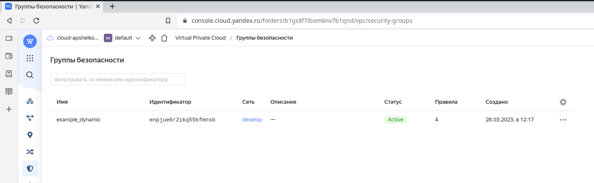
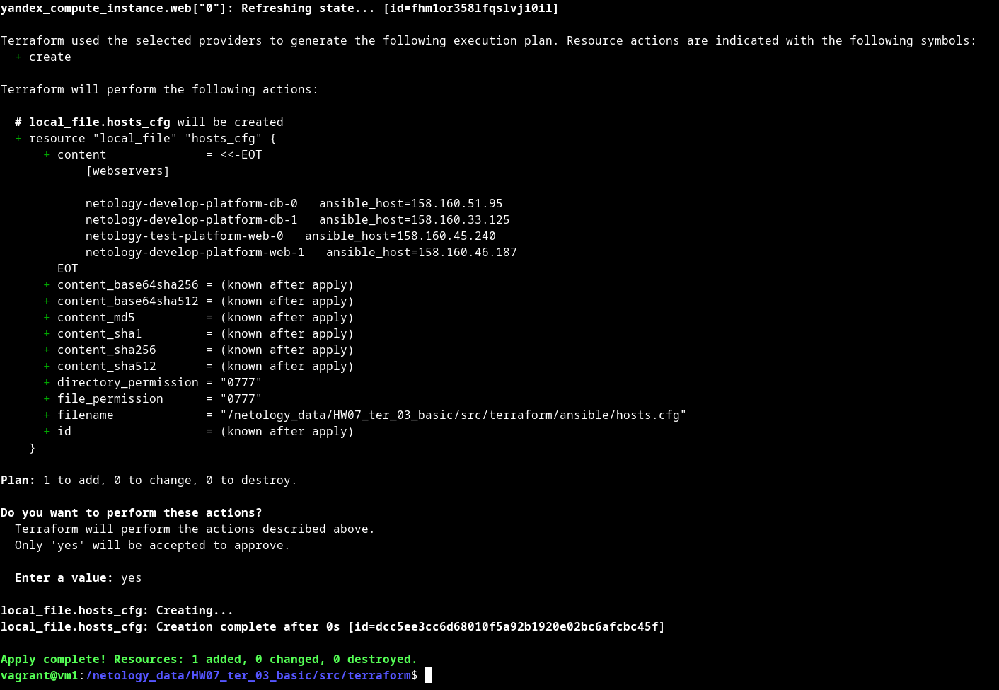
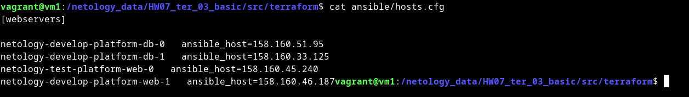
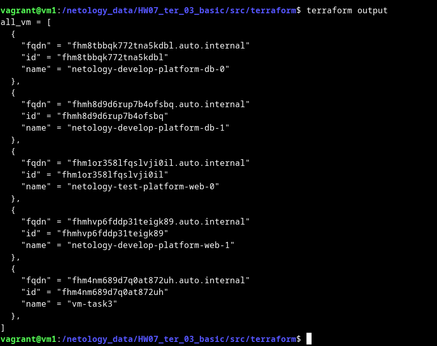

# Домашнее задание к занятию "Управляющие конструкции в коде Terraform"


### Чеклист готовности к домашнему заданию

1. Зарегистрирован аккаунт в Yandex Cloud. Использован промокод на грант.
2. Установлен инструмент yandex cli.
3. Доступен исходный код для выполнения задания в директории [**03/src**](https://github.com/netology-code/ter-homeworks/tree/main/03/src).
4. Любые ВМ, использованные при выполнении задания должны быть прерываемыми, для экономии средств.

------

### Инструменты/ дополнительные материалы, которые пригодятся для выполнения задания

1. [Консоль управления Yandex Cloud](https://console.cloud.yandex.ru/folders/<cloud_id>/vpc/security-groups).
2. [Группы безопасности](https://cloud.yandex.ru/docs/vpc/concepts/security-groups?from=int-console-help-center-or-nav).
3. [Datasource compute disk](https://terraform-eap.website.yandexcloud.net/docs/providers/yandex/d/datasource_compute_disk.html).


### Задание 1

1. Изучите проект.
2. Заполните файл personal.auto.tfvars
3. Инициализируйте проект, выполните код (он выполнится даже если доступа к preview нет).

Примечание: Если у вас не активирован preview доступ к функционалу "Группы безопасности" в Yandex Cloud - запросите доступ у поддержки облачного провайдера. Обычно его выдают в течении 24-х часов.

Приложите скриншот входящих правил "Группы безопасности" в ЛК Yandex Cloud  или скриншот отказа в предоставлении доступа к preview версии.

#### Ответ



------

### Задание 2

1. Создайте файл count-vm.tf. Опишите в нем создание двух **одинаковых** виртуальных машин с минимальными параметрами, используя мета-аргумент **count loop**.
2. Создайте файл for_each-vm.tf. Опишите в нем создание 2 **разных** по cpu/ram/disk виртуальных машин, используя мета-аргумент **for_each loop**. Используйте переменную типа list(object({ vm_name=string, cpu=number, ram=number, disk=number  })). При желании внесите в переменную все возможные параметры.
3. ВМ из пункта 2.2 должны создаваться после создания ВМ из пункта 2.1.
4. Используйте функцию file в local переменной для считывания ключа ~/.ssh/id_rsa.pub и его последующего использования в блоке metadata, взятому из ДЗ №2.
5. Инициализируйте проект, выполните код.

#### Ответ

[count-vm.tf](src%2Fcount-vm.tf)

[for_each-vm.tf](src%2Ffor_each-vm.tf)

[locals.tf](src%2Flocals.tf)


```bash
$ terraform apply
data.yandex_compute_image.ubuntu: Reading...
...
yandex_compute_instance.db[0]: Creating...
yandex_compute_instance.db[1]: Creating...
yandex_compute_instance.db[1]: Still creating... [10s elapsed]
yandex_compute_instance.db[0]: Still creating... [10s elapsed]
yandex_compute_instance.db[0]: Still creating... [20s elapsed]
yandex_compute_instance.db[1]: Still creating... [20s elapsed]
yandex_compute_instance.db[1]: Still creating... [30s elapsed]
yandex_compute_instance.db[0]: Still creating... [30s elapsed]
yandex_compute_instance.db[0]: Creation complete after 34s [id=fhm8tbbqk772tna5kdbl]
yandex_compute_instance.db[1]: Still creating... [40s elapsed]
yandex_compute_instance.db[1]: Still creating... [50s elapsed]
yandex_compute_instance.db[1]: Creation complete after 58s [id=fhmh8d9d6rup7b4ofsbq]
yandex_compute_instance.web["0"]: Creating...
yandex_compute_instance.web["1"]: Creating...
yandex_compute_instance.web["0"]: Still creating... [10s elapsed]
yandex_compute_instance.web["1"]: Still creating... [10s elapsed]
yandex_compute_instance.web["0"]: Still creating... [20s elapsed]
yandex_compute_instance.web["1"]: Still creating... [20s elapsed]
yandex_compute_instance.web["0"]: Creation complete after 28s [id=fhm1or358lfqslvji0il]
yandex_compute_instance.web["1"]: Still creating... [30s elapsed]
yandex_compute_instance.web["1"]: Creation complete after 31s [id=fhmhvp6fddp31teigk89]

Apply complete! Resources: 4 added, 0 changed, 0 destroyed.

```
------

### Задание 3

1. Создайте 3 одинаковых виртуальных диска, размером 1 Гб с помощью ресурса yandex_compute_disk и мета-аргумента count.
2. Создайте одну **любую** ВМ. Используйте блок **dynamic secondary_disk{..}** и мета-аргумент for_each для подключения созданных вами дополнительных дисков.
3. Назначьте ВМ созданную в 1-м задании группу безопасности.

#### Ответ

[dyn_sec_disk.tf](src%2Fdyn_sec_disk.tf)


------

### Задание 4

1. Создайте inventory-файл для ansible.
Используйте функцию tepmplatefile и файл-шаблон для создания ansible inventory-файла из лекции.
Готовый код возьмите из демонстрации к лекции [**demonstration2**](https://github.com/netology-code/ter-homeworks/tree/main/demonstration2).
Передайте в него в качестве переменных имена и внешние ip-адреса ВМ из задания 2.1 и 2.2.
2. Выполните код. Приложите скриншот получившегося файла.

#### Ответ





[invent_ansible.tf](src%2Fterraform%2Finvent_ansible.tf)

[hosts.tftpl](src%2Fterraform%2Fansible%2Fhosts.tftpl)

Для общего зачета создайте в вашем GitHub репозитории новую ветку terraform-03. Закомитьте в эту ветку свой финальный код проекта, пришлите ссылку на коммит.   
**Удалите все созданные ресурсы**.

------

## Дополнительные задания (со звездочкой*)

**Настоятельно рекомендуем выполнять все задания под звёздочкой.**   Их выполнение поможет глубже разобраться в материале.   
Задания под звёздочкой дополнительные (необязательные к выполнению) и никак не повлияют на получение вами зачета по этому домашнему заданию. 

### Задание 5*(необязательное)
1. Напишите output, который отобразит все 5 созданных ВМ в виде списка словарей:
``` 
[
 {
  "name" = 'имя ВМ1'
  "id"   = 'идентификатор ВМ1'
  "fqdn" = 'Внутренний FQDN ВМ1'
 },
 {
  "name" = 'имя ВМ2'
  "id"   = 'идентификатор ВМ2'
  "fqdn" = 'Внутренний FQDN ВМ2'
 },
 ....
]
```
Приложите скриншот вывода команды ```terrafrom output```

#### Ответ



[outputs.tf](src%2Fterraform%2Foutputs.tf)

------

### Задание 6*(необязательное)

1. Используя null_resource и local-exec примените ansible-playbook к ВМ из ansible inventory файла.
Готовый код возьмите из демонстрации к лекции [**demonstration2**](https://github.com/netology-code/ter-homeworks/tree/main/demonstration2).
3. Дополните файл шаблон hosts.tftpl. 
Формат готового файла:
```netology-develop-platform-web-0   ansible_host="<внешний IP-address или внутренний IP-address если у ВМ отсутвует внешний адрес>"```

Для проверки работы уберите у ВМ внешние адреса. Этот вариант используется при работе через bastion сервер.
Для зачета предоставьте код вместе с основной частью задания.

#### Ответ

[null_resource.tf](src%2Fterraform%2Fnull_resource.tf)

[hosts.tftpl](src%2Fterraform%2Fansible%2Fhosts.tftpl)

```bash
$ terraform apply
yandex_compute_disk.task3-disk[2]: Refreshing state... [id=fhm2io784a7rov4sl472]
yandex_compute_disk.task3-disk[0]: Refreshing state... [id=fhmeapa92mrnt9fmqdg2]
yandex_vpc_network.develop: Refreshing state... [id=enpajg59h5e4j8kh6f76]
data.yandex_compute_image.ubuntu: Reading...
yandex_compute_disk.task3-disk[1]: Refreshing state... [id=fhmmgp5u1h9oj291n9fe]
data.yandex_compute_image.ubuntu: Read complete after 0s [id=fd8snjpoq85qqv0mk9gi]
yandex_vpc_security_group.example: Refreshing state... [id=enpjsa0mtsvs11ghkejv]
yandex_vpc_subnet.develop: Refreshing state... [id=e9b84chopr5qps48e4is]
yandex_compute_instance.db[1]: Refreshing state... [id=fhm6s6nkt1tot5aplgk3]
yandex_compute_instance.db[0]: Refreshing state... [id=fhm8qb65ba81g0rrrmr5]
yandex_compute_instance.vm-task3: Refreshing state... [id=fhmrsrdqb91p49h1a2vj]
yandex_compute_instance.web["0"]: Refreshing state... [id=fhmhoecb4vhgr4eapofp]
yandex_compute_instance.web["1"]: Refreshing state... [id=fhmhvhuipek0up3jfcl0]
null_resource.web_hosts_provision: Refreshing state... [id=3007857387807487201]
local_file.hosts_cfg: Refreshing state... [id=79a1e0b394cd54abdbb24c28ffaa68d090c400d7]

Terraform used the selected providers to generate the following execution plan. Resource actions are indicated with the following symbols:
-/+ destroy and then create replacement

Terraform will perform the following actions:

  # null_resource.web_hosts_provision must be replaced
-/+ resource "null_resource" "web_hosts_provision" {
      ~ id       = "3007857387807487201" -> (known after apply)
      ~ triggers = { # forces replacement
          ~ "always_run"        = "2023-03-28T14:32:37Z" -> (known after apply)
            # (2 unchanged elements hidden)
        }
    }

Plan: 1 to add, 0 to change, 1 to destroy.

Do you want to perform these actions?
  Terraform will perform the actions described above.
  Only 'yes' will be accepted to approve.

  Enter a value: yes

null_resource.web_hosts_provision: Destroying... [id=3007857387807487201]
null_resource.web_hosts_provision: Destruction complete after 0s
null_resource.web_hosts_provision: Creating...
null_resource.web_hosts_provision: Provisioning with 'local-exec'...
null_resource.web_hosts_provision (local-exec): Executing: ["/bin/sh" "-c" "cat ~/.ssh/id_rsa | ssh-add -"]
null_resource.web_hosts_provision (local-exec): Identity added: (stdin) (vagrant@vm1)
null_resource.web_hosts_provision: Provisioning with 'local-exec'...
null_resource.web_hosts_provision (local-exec): Executing: ["/bin/sh" "-c" "sleep 30"]
null_resource.web_hosts_provision: Still creating... [10s elapsed]
null_resource.web_hosts_provision: Still creating... [20s elapsed]
null_resource.web_hosts_provision: Still creating... [30s elapsed]
null_resource.web_hosts_provision: Provisioning with 'local-exec'...
null_resource.web_hosts_provision (local-exec): Executing: ["/bin/sh" "-c" "export ANSIBLE_HOST_KEY_CHECKING=False; ansible-playbook -i /netology_data/HW07_ter_03_basic/src/terraform/ansible/hosts.cfg /netology_data/HW07_ter_03_basic/src/terraform/ansible/playbook.yml"]

null_resource.web_hosts_provision (local-exec): PLAY [test] ********************************************************************

null_resource.web_hosts_provision (local-exec): TASK [Install Nginx Web Server on Debian Family] *******************************
null_resource.web_hosts_provision (local-exec): fatal: [netology-develop-platform-db-0]: UNREACHABLE! => {"changed": false, "msg": "Failed to connect to the host via ssh: ssh: connect to host 10.0.1.28 port 22: No route to host", "unreachable": true}
null_resource.web_hosts_provision (local-exec): fatal: [netology-develop-platform-db-1]: UNREACHABLE! => {"changed": false, "msg": "Failed to connect to the host via ssh: ssh: connect to host 10.0.1.8 port 22: No route to host", "unreachable": true}
null_resource.web_hosts_provision (local-exec): ok: [netology-develop-platform-web-1]
null_resource.web_hosts_provision: Still creating... [40s elapsed]
null_resource.web_hosts_provision: Still creating... [50s elapsed]
null_resource.web_hosts_provision: Still creating... [1m0s elapsed]
null_resource.web_hosts_provision: Still creating... [1m10s elapsed]
null_resource.web_hosts_provision: Still creating... [1m20s elapsed]
null_resource.web_hosts_provision: Still creating... [1m30s elapsed]
null_resource.web_hosts_provision: Still creating... [1m40s elapsed]
null_resource.web_hosts_provision: Still creating... [1m50s elapsed]
null_resource.web_hosts_provision: Still creating... [2m0s elapsed]
null_resource.web_hosts_provision: Still creating... [2m10s elapsed]
null_resource.web_hosts_provision: Still creating... [2m20s elapsed]
null_resource.web_hosts_provision: Still creating... [2m30s elapsed]
null_resource.web_hosts_provision: Still creating... [2m40s elapsed]
null_resource.web_hosts_provision: Still creating... [2m50s elapsed]
null_resource.web_hosts_provision: Still creating... [3m0s elapsed]
null_resource.web_hosts_provision: Still creating... [3m10s elapsed]
null_resource.web_hosts_provision: Still creating... [3m20s elapsed]
null_resource.web_hosts_provision: Still creating... [3m30s elapsed]
null_resource.web_hosts_provision: Still creating... [3m40s elapsed]
null_resource.web_hosts_provision: Still creating... [3m50s elapsed]
null_resource.web_hosts_provision: Still creating... [4m0s elapsed]
null_resource.web_hosts_provision: Still creating... [4m10s elapsed]
null_resource.web_hosts_provision: Still creating... [4m20s elapsed]
null_resource.web_hosts_provision (local-exec): changed: [netology-test-platform-web-0]

null_resource.web_hosts_provision (local-exec): PLAY RECAP *********************************************************************
null_resource.web_hosts_provision (local-exec): netology-develop-platform-db-0 : ok=0    changed=0    unreachable=1    failed=0    skipped=0    rescued=0    ignored=0
null_resource.web_hosts_provision (local-exec): netology-develop-platform-db-1 : ok=0    changed=0    unreachable=1    failed=0    skipped=0    rescued=0    ignored=0
null_resource.web_hosts_provision (local-exec): netology-develop-platform-web-1 : ok=1    changed=0    unreachable=0    failed=0    skipped=0    rescued=0    ignored=0
null_resource.web_hosts_provision (local-exec): netology-test-platform-web-0 : ok=1    changed=1    unreachable=0    failed=0    skipped=0    rescued=0    ignored=0

null_resource.web_hosts_provision: Creation complete after 4m24s [id=8382278932395609343]

Apply complete! Resources: 1 added, 0 changed, 1 destroyed.

Outputs:

all_vm = [
  {
    "fqdn" = "fhm8qb65ba81g0rrrmr5.auto.internal"
    "id" = "fhm8qb65ba81g0rrrmr5"
    "name" = "netology-develop-platform-db-0"
  },
  {
    "fqdn" = "fhm6s6nkt1tot5aplgk3.auto.internal"
    "id" = "fhm6s6nkt1tot5aplgk3"
    "name" = "netology-develop-platform-db-1"
  },
  {
    "fqdn" = "fhmhoecb4vhgr4eapofp.auto.internal"
    "id" = "fhmhoecb4vhgr4eapofp"
    "name" = "netology-test-platform-web-0"
  },
  {
    "fqdn" = "fhmhvhuipek0up3jfcl0.auto.internal"
    "id" = "fhmhvhuipek0up3jfcl0"
    "name" = "netology-develop-platform-web-1"
  },
  {
    "fqdn" = "fhmrsrdqb91p49h1a2vj.auto.internal"
    "id" = "fhmrsrdqb91p49h1a2vj"
    "name" = "vm-task3"
  },
]


```