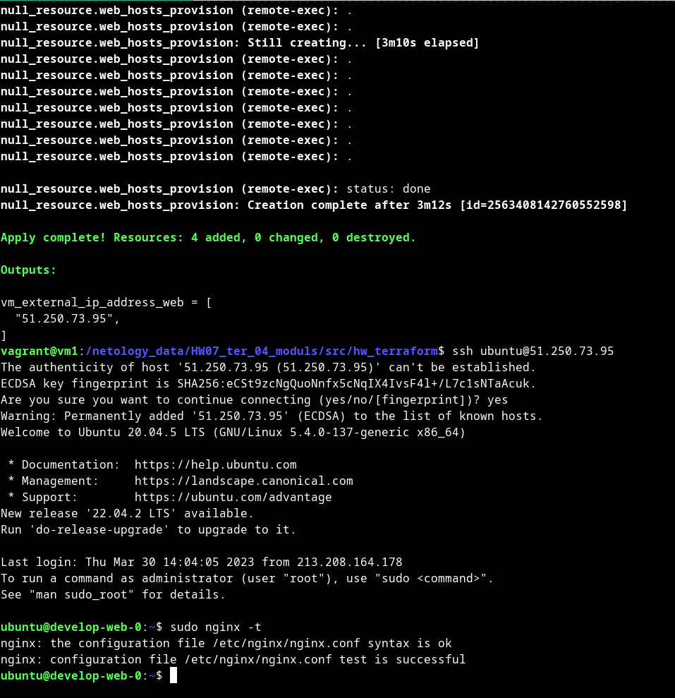

# Домашнее задание к занятию "Продвинутые методы работы с Terraform"


### Чеклист готовности к домашнему заданию

1. Зарегистрирован аккаунт в Yandex Cloud. Использован промокод на грант.
2. Установлен инструмент yandex CLI
3. Исходный код для выполнения задания расположен в директории [**04/src**](https://github.com/netology-code/ter-homeworks/tree/main/04/src).
4. Любые ВМ, использованные при выполнении задания должны быть прерываемыми, для экономии средств.

------

### Задание 1

1. Возьмите из [демонстрации к лекции готовый код](https://github.com/netology-code/ter-homeworks/tree/main/04/demonstration1) для создания ВМ с помощью remote модуля.
2. Создайте 1 ВМ, используя данный модуль. В файле cloud-init.yml необходимо использовать переменную для ssh ключа вместо хардкода. Передайте ssh-ключ в функцию template_file в блоке vars ={} .
Воспользуйтесь [**примером**](https://grantorchard.com/dynamic-cloudinit-content-with-terraform-file-templates/). Обратите внимание что ssh-authorized-keys принимает в себя список, а не строку!
3. Добавьте в файл cloud-init.yml установку nginx.
4. Предоставьте скриншот подключения к консоли и вывод команды ```nginx -t```.

#### Решение

[main.tf](src%2Fhw_terraform%2Fmain.tf)

[cloud-init.yml](src%2Fhw_terraform%2Fcloud-init.yml)



```bash
vagrant@vm1:/netology_data/HW07_ter_04_moduls/src/hw_terraform$ terraform apply
data.template_file.cloudinit: Reading...
...
Plan: 4 to add, 0 to change, 0 to destroy.

Changes to Outputs:
  + vm_external_ip_address_web = [
      + (known after apply),
    ]

Do you want to perform these actions?
  Terraform will perform the actions described above.
  Only 'yes' will be accepted to approve.

  Enter a value: yes

module.vpc_dev.yandex_vpc_network.new_vpc: Creating...
module.vpc_dev.yandex_vpc_network.new_vpc: Creation complete after 1s [id=enpdfn9f3or2b3eic9g0]
module.vpc_dev.yandex_vpc_subnet.new_subnet: Creating...
module.vpc_dev.yandex_vpc_subnet.new_subnet: Creation complete after 1s [id=e9b1g32j5931thpvde5c]
module.test-vm.yandex_compute_instance.vm[0]: Creating...
module.test-vm.yandex_compute_instance.vm[0]: Still creating... [10s elapsed]
module.test-vm.yandex_compute_instance.vm[0]: Still creating... [20s elapsed]
module.test-vm.yandex_compute_instance.vm[0]: Still creating... [30s elapsed]
module.test-vm.yandex_compute_instance.vm[0]: Still creating... [40s elapsed]
module.test-vm.yandex_compute_instance.vm[0]: Still creating... [50s elapsed]
module.test-vm.yandex_compute_instance.vm[0]: Still creating... [1m0s elapsed]
module.test-vm.yandex_compute_instance.vm[0]: Creation complete after 1m1s [id=fhmeg7r7h3udolutghre]
null_resource.web_hosts_provision: Creating...
null_resource.web_hosts_provision: Provisioning with 'remote-exec'...
null_resource.web_hosts_provision (remote-exec): Connecting to remote host via SSH...
null_resource.web_hosts_provision (remote-exec):   Host: 51.250.73.95
null_resource.web_hosts_provision (remote-exec):   User: ubuntu
null_resource.web_hosts_provision (remote-exec):   Password: false
null_resource.web_hosts_provision (remote-exec):   Private key: true
null_resource.web_hosts_provision (remote-exec):   Certificate: false
null_resource.web_hosts_provision (remote-exec):   SSH Agent: false
null_resource.web_hosts_provision (remote-exec):   Checking Host Key: false
null_resource.web_hosts_provision (remote-exec):   Target Platform: unix
null_resource.web_hosts_provision: Still creating... [10s elapsed]
null_resource.web_hosts_provision: Still creating... [1m30s elapsed]
null_resource.web_hosts_provision (remote-exec): Connecting to remote host via SSH...
null_resource.web_hosts_provision (remote-exec):   Host: 51.250.73.95
null_resource.web_hosts_provision (remote-exec):   User: ubuntu
null_resource.web_hosts_provision (remote-exec):   Password: false
null_resource.web_hosts_provision (remote-exec):   Private key: true
null_resource.web_hosts_provision (remote-exec):   Certificate: false
null_resource.web_hosts_provision (remote-exec):   SSH Agent: false
null_resource.web_hosts_provision (remote-exec):   Checking Host Key: false
null_resource.web_hosts_provision (remote-exec):   Target Platform: unix
null_resource.web_hosts_provision (remote-exec): Connected!
null_resource.web_hosts_provision (remote-exec): .
null_resource.web_hosts_provision (remote-exec): .
null_resource.web_hosts_provision: Still creating... [3m10s elapsed]
null_resource.web_hosts_provision (remote-exec): .
null_resource.web_hosts_provision (remote-exec): .
null_resource.web_hosts_provision (remote-exec): .
null_resource.web_hosts_provision (remote-exec): .
null_resource.web_hosts_provision (remote-exec): .
null_resource.web_hosts_provision (remote-exec): .
null_resource.web_hosts_provision (remote-exec): .

null_resource.web_hosts_provision (remote-exec): status: done
null_resource.web_hosts_provision: Creation complete after 3m12s [id=2563408142760552598]

Apply complete! Resources: 4 added, 0 changed, 0 destroyed.

Outputs:

vm_external_ip_address_web = [
  "51.250.73.95",
]
vagrant@vm1:/netology_data/HW07_ter_04_moduls/src/hw_terraform$ ssh ubuntu@51.250.73.95
The authenticity of host '51.250.73.95 (51.250.73.95)' can't be established.
ECDSA key fingerprint is SHA256:eCSt9zcNgQuoNnfx5cNqIX4IvsF4l+/L7c1sNTaAcuk.
Are you sure you want to continue connecting (yes/no/[fingerprint])? yes
Warning: Permanently added '51.250.73.95' (ECDSA) to the list of known hosts.
Welcome to Ubuntu 20.04.5 LTS (GNU/Linux 5.4.0-137-generic x86_64)

 * Documentation:  https://help.ubuntu.com
 * Management:     https://landscape.canonical.com
 * Support:        https://ubuntu.com/advantage
New release '22.04.2 LTS' available.
Run 'do-release-upgrade' to upgrade to it.

Last login: Thu Mar 30 14:04:05 2023 from 213.208.164.178
To run a command as administrator (user "root"), use "sudo <command>".
See "man sudo_root" for details.

ubuntu@develop-web-0:~$ sudo nginx -t
nginx: the configuration file /etc/nginx/nginx.conf syntax is ok
nginx: configuration file /etc/nginx/nginx.conf test is successful
ubuntu@develop-web-0:~$ 

```


------

### Задание 2

1. Напишите локальный модуль vpc, который будет создавать 2 ресурса: **одну** сеть и **одну** подсеть в зоне, объявленной при вызове модуля. например: ```ru-central1-a```.
2. Модуль должен возвращать значения vpc.id и subnet.id
3. Замените ресурсы yandex_vpc_network и yandex_vpc_subnet, созданным модулем.
4. Сгенерируйте документацию к модулю с помощью terraform-docs.    
 
Пример вызова:
```
module "vpc_dev" {
  source       = "./vpc"
  env_name     = "develop"
  zone = "ru-central1-a"
  cidr = "10.0.1.0/24"
}
```

#### Решение

[main.tf](src%2Fmodules%2Fvpc%2Fmain.tf) :

```terraform
terraform {
  required_providers {
    yandex = {
      source = "yandex-cloud/yandex"
    }
  }
  required_version = ">=0.13"
}

resource "yandex_vpc_network" "new_vpc" {
  name = var.vpc_name
}

#создаем подсеть
resource "yandex_vpc_subnet" "new_subnet" {
  name           = "${var.vpc_name}-${var.default_zone}"
  zone           = var.default_zone
  network_id     = yandex_vpc_network.new_vpc.id
  v4_cidr_blocks = var.default_cidr
}

```

[variables.tf](src%2Fmodules%2Fvpc%2Fvariables.tf) :

```terraform
variable "default_zone" {
  type        = string
  default     = "ru-central1-a"
  description = "https://cloud.yandex.ru/docs/overview/concepts/geo-scope"
}
variable "default_cidr" {
  type        = list(string)
  default     = ["10.0.1.0/24"]
  description = "https://cloud.yandex.ru/docs/vpc/operations/subnet-create"
}

variable "vpc_name" {
  type        = string
  default     = "develop"
  description = "VPC network&subnet name"
}


```

[outputs.tf](src%2Fmodules%2Fvpc%2Foutputs.tf) :
```terraform
output "vpc_id" {
  value = yandex_vpc_network.new_vpc.id
  description = "vpc id"
}

output "subnet_id" {
  value = yandex_vpc_subnet.new_subnet.id
  description = "subnet id"
}
```

[main.tf](src%2Fhw_terraform%2Fmain.tf) :

```terraform
#создаем облачную сеть
module "vpc_dev" {
  source = "../modules/vpc"
  vpc_name     = var.vpc_name
  default_cidr = var.default_cidr
  default_zone = var.default_zone
}
```

```bash
vagrant@vm1:/netology_data/HW07_ter_04_moduls/src/hw_terraform$ terraform-docs markdown table --output-file ./doc.md .
doc.md updated successfully
```

[doc.md](src%2Fhw_terraform%2Fdoc.md)

------

### Задание 3
1. Выведите список ресурсов в стейте.
2. Удалите из стейта модуль vpc.
3. Импортируйте его обратно. Проверьте terraform plan - изменений быть не должно.
Приложите список выполненных команд и вывод.

#### Решение

1.

```bash
$ terraform state list
data.template_file.cloudinit
null_resource.web_hosts_provision
module.test-vm.data.yandex_compute_image.my_image
module.test-vm.yandex_compute_instance.vm[0]
module.vpc_dev.yandex_vpc_network.new_vpc
module.vpc_dev.yandex_vpc_subnet.new_subnet
```

2.

```bash
vagrant@vm1:/netology_data/HW07_ter_04_moduls/src/hw_terraform$ terraform state rm 'module.vpc_dev.yandex_vpc_network.new_vpc'
Removed module.vpc_dev.yandex_vpc_network.new_vpc
Successfully removed 1 resource instance(s).
vagrant@vm1:/netology_data/HW07_ter_04_moduls/src/hw_terraform$ terraform state show 'module.vpc_dev.yandex_vpc_network.new_vpc'
No instance found for the given address!

This command requires that the address references one specific instance.
To view the available instances, use "terraform state list". Please modify 
the address to reference a specific instance.

```

3.

```bash
vagrant@vm1:/netology_data/HW07_ter_04_moduls/src/hw_terraform$ terraform import 'module.vpc_dev.yandex_vpc_network.new_vpc' enpdfn9f3or2b3eic9g0
module.vpc_dev.yandex_vpc_network.new_vpc: Importing from ID "enpdfn9f3or2b3eic9g0"...
module.vpc_dev.yandex_vpc_network.new_vpc: Import prepared!
  Prepared yandex_vpc_network for import
module.vpc_dev.yandex_vpc_network.new_vpc: Refreshing state... [id=enpdfn9f3or2b3eic9g0]
module.test-vm.data.yandex_compute_image.my_image: Reading...
data.template_file.cloudinit: Reading...
data.template_file.cloudinit: Read complete after 0s [id=ebfe5cca7da31de38fd95bb03c6532df96c4c1d0c96bcf6b391471536f7e6b67]
module.test-vm.data.yandex_compute_image.my_image: Read complete after 0s [id=fd8snjpoq85qqv0mk9gi]

Import successful!

The resources that were imported are shown above. These resources are now in
your Terraform state and will henceforth be managed by Terraform.

vagrant@vm1:/netology_data/HW07_ter_04_moduls/src/hw_terraform$ terraform plan
module.vpc_dev.yandex_vpc_network.new_vpc: Refreshing state... [id=enpdfn9f3or2b3eic9g0]
module.test-vm.data.yandex_compute_image.my_image: Reading...
data.template_file.cloudinit: Reading...
data.template_file.cloudinit: Read complete after 0s [id=ebfe5cca7da31de38fd95bb03c6532df96c4c1d0c96bcf6b391471536f7e6b67]
module.test-vm.data.yandex_compute_image.my_image: Read complete after 0s [id=fd8snjpoq85qqv0mk9gi]
module.vpc_dev.yandex_vpc_subnet.new_subnet: Refreshing state... [id=e9b1g32j5931thpvde5c]
module.test-vm.yandex_compute_instance.vm[0]: Refreshing state... [id=fhmeg7r7h3udolutghre]
null_resource.web_hosts_provision: Refreshing state... [id=2563408142760552598]

Terraform used the selected providers to generate the following execution plan. Resource actions are indicated with the following symbols:
-/+ destroy and then create replacement

Terraform will perform the following actions:

  # null_resource.web_hosts_provision must be replaced
-/+ resource "null_resource" "web_hosts_provision" {
      ~ id       = "2563408142760552598" -> (known after apply)
      ~ triggers = { # forces replacement
          ~ "always_run"        = "2023-03-30T14:02:29Z" -> (known after apply)
            # (2 unchanged elements hidden)
        }
    }

Plan: 1 to add, 0 to change, 1 to destroy.

─────────────────────────────────────────────────────────────────────────────────────────────────────────────────────────────────────────────────────────────────────────────────────────────

Note: You didn't use the -out option to save this plan, so Terraform can't guarantee to take exactly these actions if you run "terraform apply" now.
vagrant@vm1:/netology_data/HW07_ter_04_moduls/src/hw_terraform$
```

## Дополнительные задания (со звездочкой*)

**Настоятельно рекомендуем выполнять все задания под звёздочкой.**   Их выполнение поможет глубже разобраться в материале.   
Задания под звёздочкой дополнительные (необязательные к выполнению) и никак не повлияют на получение вами зачета по этому домашнему заданию. 


### Задание 4*

1. Измените модуль vpc так, чтобы он мог создать подсети во всех зонах доступности, переданных в переменной типа list(object) при вызове модуля.  
  
Пример вызова:
```
module "vpc_prod" {
  source       = "./vpc"
  env_name     = "production"
  subnets = [
    { zone = "ru-central1-a", cidr = "10.0.1.0/24" },
    { zone = "ru-central1-b", cidr = "10.0.2.0/24" },
    { zone = "ru-central1-c", cidr = "10.0.3.0/24" },
  ]
}

module "vpc_dev" {
  source       = "./vpc"
  env_name     = "develop"
  subnets = [
    { zone = "ru-central1-a", cidr = "10.0.1.0/24" },
  ]
}
```

Предоставьте код, план выполнения, результат из консоли YC.

#### Решение

Код:

[variables.tf](src%2Fmodules%2Fvpc_ex4%2Fvariables.tf)

```terraform
variable "vpc_name" {
  type        = string
  default     = "develop"
  description = "VPC network&subnet name"
}

variable "subnets" {
  type	      = list(object({
    zone	= string
    cidr	= list(string)
  }))
  default     = [
    { zone = "ru-central1-a", cidr = [ "10.0.1.0/24" ] }
  ]
  description = "https://cloud.yandex.ru/docs/overview/concepts/geo-scope & https://cloud.yandex.ru/docs/vpc/operations/subnet-create"
}
```

[main.tf](src%2Fmodules%2Fvpc_ex4%2Fmain.tf)

```terraform
esource "yandex_vpc_network" "new_vpc" {
  name = var.vpc_name
}

#создаем подсеть
resource "yandex_vpc_subnet" "new_subnet" {
  count          = length(var.subnets)
  name           = "${var.vpc_name}-${var.subnets[count.index].zone}"
  zone           = var.subnets[count.index].zone
  network_id     = yandex_vpc_network.new_vpc.id
  v4_cidr_blocks = var.subnets[count.index].cidr
}
```

[outputs.tf](src%2Fmodules%2Fvpc_ex4%2Foutputs.tf)

```terraform
output "vpc_id" {
  value = yandex_vpc_network.new_vpc.id
  description = "vpc id"
}

output "subnet_id" {
  value = [ for subnet in yandex_vpc_subnet.new_subnet : subnet.id ]
  description = "subnets id"
}
```

root [main.tf](src%2Fhw_terraform_ex4%2Fmain.tf)

```terraform
#создаем облачную сеть
module "vpc_prod" {
  source       = "../modules/vpc_ex4"
  vpc_name     = "production"
  subnets = [
    { zone = "ru-central1-a", cidr = ["10.0.1.0/24"] },
    { zone = "ru-central1-b", cidr = ["10.0.2.0/24"] },
    { zone = "ru-central1-c", cidr = ["10.0.3.0/24"] },
  ]
}

module "vpc_dev" {
  source       = "../modules/vpc_ex4"
  vpc_name     = "develop"
  subnets = [
    { zone = "ru-central1-a", cidr = ["10.0.1.0/24"] },
  ]
}
```

План:

```bash
vagrant@vm1:/netology_data/HW07_ter_04_moduls/src/hw_terraform_ex4$ terraform plan
data.template_file.cloudinit: Reading...
data.template_file.cloudinit: Read complete after 0s [id=ebfe5cca7da31de38fd95bb03c6532df96c4c1d0c96bcf6b391471536f7e6b67]
module.test-vm.data.yandex_compute_image.my_image: Reading...
module.test-vm.data.yandex_compute_image.my_image: Read complete after 1s [id=fd8snjpoq85qqv0mk9gi]

Terraform used the selected providers to generate the following execution plan. Resource actions are indicated with the following
symbols:
  + create

Terraform will perform the following actions:

  # null_resource.web_hosts_provision will be created
  + resource "null_resource" "web_hosts_provision" {
      + id       = (known after apply)
      + triggers = {
          + "always_run"        = (known after apply)
          + "playbook_src_hash" = <<-EOT
                #cloud-config
                users:
                  - name: ${username}
                    groups: sudo
                    shell: /bin/bash
                    sudo: ['ALL=(ALL) NOPASSWD:ALL']
                    ssh_authorized_keys:
                      - ${ssh_public_key}
                package_update: true
                package_upgrade: false
                packages:
                  - nginx
                
                runcmd:
                  - systemctl enable --no-block nginx
                  - systemctl start --no-block nginx
            EOT
          + "ssh_public_key"    = <<-EOT
                ssh-rsa AAAA...
            EOT
        }
    }

  # module.test-vm.yandex_compute_instance.vm[0] will be created
  + resource "yandex_compute_instance" "vm" {
      + allow_stopping_for_update = true
      + created_at                = (known after apply)
      + description               = "TODO: description; {{terraform managed}}"
      + folder_id                 = (known after apply)
      + fqdn                      = (known after apply)
      + gpu_cluster_id            = (known after apply)
      + hostname                  = "develop-web-0"
      + id                        = (known after apply)
      + labels                    = {
          + "env"     = "develop"
          + "project" = "undefined"
        }
      + metadata                  = {
          + "serial-port-enable" = "1"
          + "user-data"          = <<-EOT
                #cloud-config
                users:
                  - name: ubuntu
                    groups: sudo
                    shell: /bin/bash
                    sudo: ['ALL=(ALL) NOPASSWD:ALL']
                    ssh_authorized_keys:
                      - ssh-rsa AAAA...
                
                package_update: true
                package_upgrade: false
                packages:
                  - nginx
                
                runcmd:
                  - systemctl enable --no-block nginx
                  - systemctl start --no-block nginx
            EOT
        }
      + name                      = "develop-web-0"
      + network_acceleration_type = "standard"
      + platform_id               = "standard-v1"
      + service_account_id        = (known after apply)
      + status                    = (known after apply)
      + zone                      = "ru-central1-a"

      + boot_disk {
          + auto_delete = true
          + device_name = (known after apply)
          + disk_id     = (known after apply)
          + mode        = (known after apply)

          + initialize_params {
              + block_size  = (known after apply)
              + description = (known after apply)
              + image_id    = "fd8snjpoq85qqv0mk9gi"
              + name        = (known after apply)
              + size        = 10
              + snapshot_id = (known after apply)
              + type        = "network-hdd"
            }
        }

      + metadata_options {
          + aws_v1_http_endpoint = (known after apply)
          + aws_v1_http_token    = (known after apply)
          + gce_http_endpoint    = (known after apply)
          + gce_http_token       = (known after apply)
        }

      + network_interface {
          + index              = (known after apply)
          + ip_address         = (known after apply)
          + ipv4               = true
          + ipv6               = (known after apply)
          + ipv6_address       = (known after apply)
          + mac_address        = (known after apply)
          + nat                = true
          + nat_ip_address     = (known after apply)
          + nat_ip_version     = (known after apply)
          + security_group_ids = (known after apply)
          + subnet_id          = (known after apply)
        }

      + placement_policy {
          + host_affinity_rules = (known after apply)
          + placement_group_id  = (known after apply)
        }

      + resources {
          + core_fraction = 5
          + cores         = 2
          + memory        = 1
        }

      + scheduling_policy {
          + preemptible = true
        }
    }

  # module.vpc_dev.yandex_vpc_network.new_vpc will be created
  + resource "yandex_vpc_network" "new_vpc" {
      + created_at                = (known after apply)
      + default_security_group_id = (known after apply)
      + folder_id                 = (known after apply)
      + id                        = (known after apply)
      + labels                    = (known after apply)
      + name                      = "develop"
      + subnet_ids                = (known after apply)
    }

  # module.vpc_dev.yandex_vpc_subnet.new_subnet[0] will be created
  + resource "yandex_vpc_subnet" "new_subnet" {
      + created_at     = (known after apply)
      + folder_id      = (known after apply)
      + id             = (known after apply)
      + labels         = (known after apply)
      + name           = "develop-ru-central1-a"
      + network_id     = (known after apply)
      + v4_cidr_blocks = [
          + "10.0.1.0/24",
        ]
      + v6_cidr_blocks = (known after apply)
      + zone           = "ru-central1-a"
    }

  # module.vpc_prod.yandex_vpc_network.new_vpc will be created
  + resource "yandex_vpc_network" "new_vpc" {
      + created_at                = (known after apply)
      + default_security_group_id = (known after apply)
      + folder_id                 = (known after apply)
      + id                        = (known after apply)
      + labels                    = (known after apply)
      + name                      = "production"
      + subnet_ids                = (known after apply)
    }

  # module.vpc_prod.yandex_vpc_subnet.new_subnet[0] will be created
  + resource "yandex_vpc_subnet" "new_subnet" {
      + created_at     = (known after apply)
      + folder_id      = (known after apply)
      + id             = (known after apply)
      + labels         = (known after apply)
      + name           = "production-ru-central1-a"
      + network_id     = (known after apply)
      + v4_cidr_blocks = [
          + "10.0.1.0/24",
        ]
      + v6_cidr_blocks = (known after apply)
      + zone           = "ru-central1-a"
    }

  # module.vpc_prod.yandex_vpc_subnet.new_subnet[1] will be created
  + resource "yandex_vpc_subnet" "new_subnet" {
      + created_at     = (known after apply)
      + folder_id      = (known after apply)
      + id             = (known after apply)
      + labels         = (known after apply)
      + name           = "production-ru-central1-b"
      + network_id     = (known after apply)
      + v4_cidr_blocks = [
          + "10.0.2.0/24",
        ]
      + v6_cidr_blocks = (known after apply)
      + zone           = "ru-central1-b"
    }

  # module.vpc_prod.yandex_vpc_subnet.new_subnet[2] will be created
  + resource "yandex_vpc_subnet" "new_subnet" {
      + created_at     = (known after apply)
      + folder_id      = (known after apply)
      + id             = (known after apply)
      + labels         = (known after apply)
      + name           = "production-ru-central1-c"
      + network_id     = (known after apply)
      + v4_cidr_blocks = [
          + "10.0.3.0/24",
        ]
      + v6_cidr_blocks = (known after apply)
      + zone           = "ru-central1-c"
    }

Plan: 8 to add, 0 to change, 0 to destroy.

Changes to Outputs:
  + vm_external_ip_address_web = [
      + (known after apply),
    ]

──────────────────────────────────────────────────────────────────────────────────────────────────────────────────────────────────────

Note: You didn't use the -out option to save this plan, so Terraform can't guarantee to take exactly these actions if you run
"terraform apply" now.
vagrant@vm1:/netology_data/HW07_ter_04_moduls/src/hw_terraform_ex4$ 

```

Результат из консоли YC

```bash
$ yc vpc network list
+----------------------+------------+
|          ID          |    NAME    |
+----------------------+------------+
| enpgra18q1h1bcl7pu3d | production |
| enpta87m1tbu2no4anpf | develop    |
+----------------------+------------+

$ yc vpc subnet list
+----------------------+--------------------------+----------------------+----------------+---------------+---------------+
|          ID          |           NAME           |      NETWORK ID      | ROUTE TABLE ID |     ZONE      |     RANGE     |
+----------------------+--------------------------+----------------------+----------------+---------------+---------------+
| b0cibl373kqdi9f33lhb | production-ru-central1-c | enpgra18q1h1bcl7pu3d |                | ru-central1-c | [10.0.3.0/24] |
| e2lf6klingga34af1oo6 | production-ru-central1-b | enpgra18q1h1bcl7pu3d |                | ru-central1-b | [10.0.2.0/24] |
| e9b6g8ijml1buduvpvl6 | production-ru-central1-a | enpgra18q1h1bcl7pu3d |                | ru-central1-a | [10.0.1.0/24] |
| e9bt3k6tcrp3es0nq7dq | develop-ru-central1-a    | enpta87m1tbu2no4anpf |                | ru-central1-a | [10.0.1.0/24] |
+----------------------+--------------------------+----------------------+----------------+---------------+---------------+

```

### Задание 5**

1. Напишите модуль для создания кластера managed БД Mysql в Yandex Cloud с 1 или 3 хостами в зависимости от переменной HA=true или HA=false. Используйте ресурс yandex_mdb_mysql_cluster (передайте имя кластера и id сети).
2. Напишите модуль для создания базы данных и пользователя в уже существующем кластере managed БД Mysql. Используйте ресурсы yandex_mdb_mysql_database и yandex_mdb_mysql_user (передайте имя базы данных, имя пользователя и id кластера при вызове модуля).
3. Используя оба модуля, создайте кластер example из одного хоста, а затем добавьте в него БД test и пользователя app. Затем измените переменную и превратите сингл хост в кластер из 3х серверов.

Предоставьте план выполнения и по-возможности результат. Сразу же удаляйте созданные ресурсы, так как кластер может стоить очень дорого! Используйте минимальную конфигурацию.

#### Решение

1. модуль создания кластера managed БД Mysql в Yandex Cloud [create_mysql_cluster](src%2Fmodules%2Fcreate_mysql_cluster)

2. модуль создания базы данных и пользователя в уже существующем кластере managed БД Mysql [create_db_user](src%2Fmodules%2Fcreate_db_user)

3. создание кластера с последующим добавление базы и пользователя [main.tf](src%2Fhw_terraform_ex5%2Fmain.tf)


### Задание 6***  

1. Разверните у себя локально vault, используя docker-compose.yml в проекте.
2. Для входа в web интерфейс и авторизации terraform в vault используйте токен "education"
3. Создайте новый секрет по пути http://127.0.0.1:8200/ui/vault/secrets/secret/create  
Path: example  
secret data key: test 
secret data value: congrats!  
4. Считайте данный секрет с помощью terraform и выведите его в output по примеру:
```
provider "vault" {
 address = "https://<IP_ADDRESS>:<PORT_NUMBER>"
 skip_tls_verify = true
 token = "education"
}
data "vault_generic_secret" "vault_example"{
 path = "secret/example"
}
output "vault_example" {
 value = "${data.vault_generic_secret.vault_example.data["value"]}"
}
```
5. Попробуйте разобраться в документации и записать новый секрет в vault с помощью terraform. 


