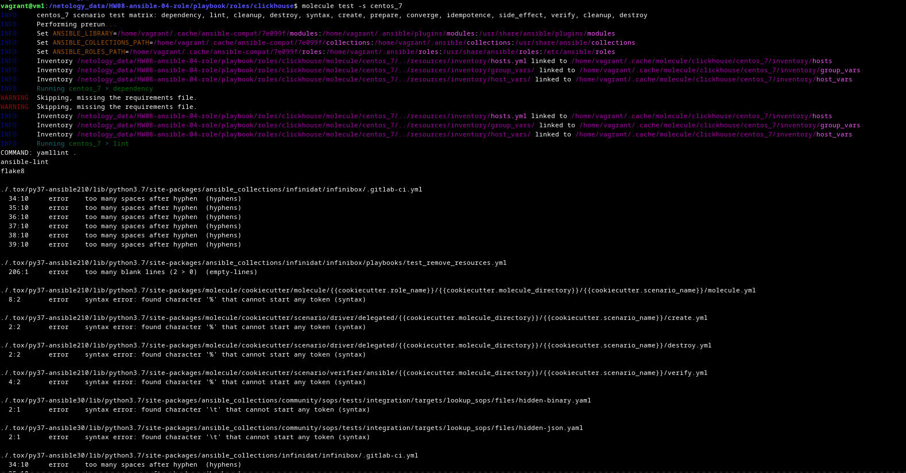
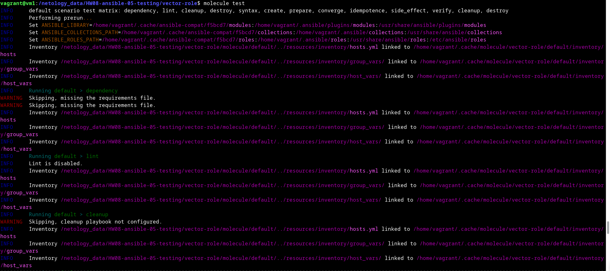
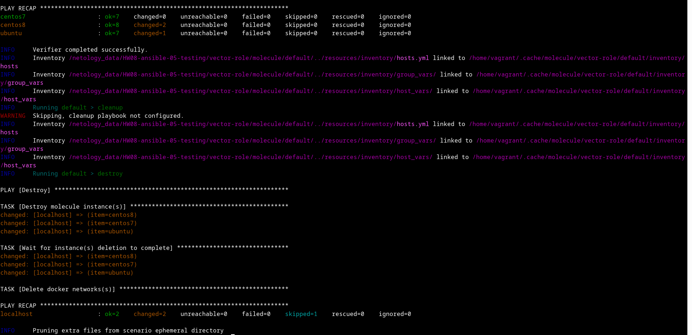
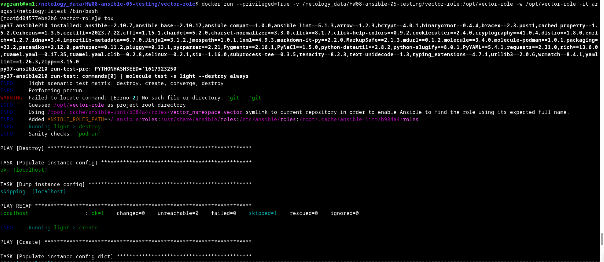
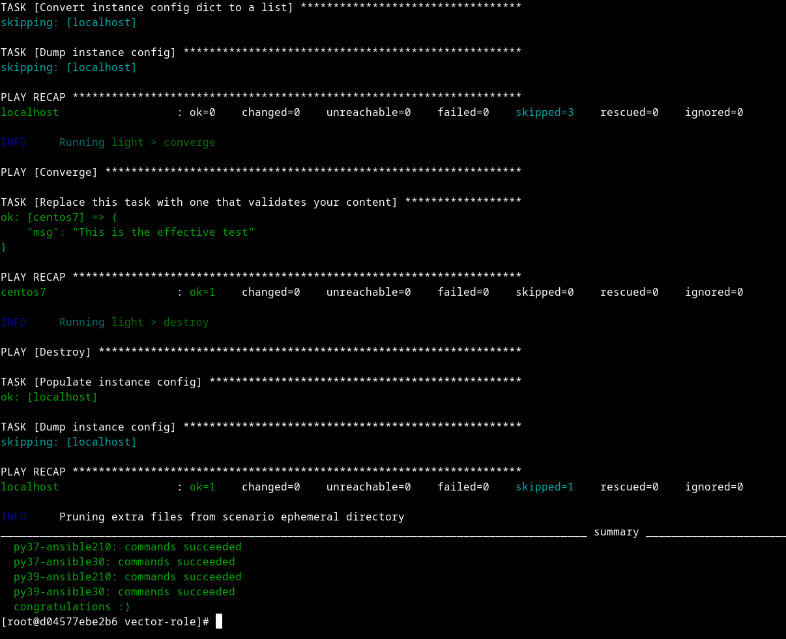

# Домашнее задание к занятию 5 «Тестирование roles»

## Подготовка к выполнению

1. Установите molecule: `pip3 install "molecule==3.5.2"`.
2. Выполните `docker pull aragast/netology:latest` —  это образ с podman, tox и несколькими пайтонами (3.7 и 3.9) внутри.

## Основная часть

Ваша цель — настроить тестирование ваших ролей. 

Задача — сделать сценарии тестирования для vector. 

Ожидаемый результат — все сценарии успешно проходят тестирование ролей.

### Molecule

1. Запустите  `molecule test -s centos_7` внутри корневой директории clickhouse-role, посмотрите на вывод команды. Данная команда может отработать с ошибками, это нормально. Наша цель - посмотреть как другие в реальном мире используют молекулу.

<details>
<summary>

</summary>

```bash
$ molecule test -s centos_7
INFO     centos_7 scenario test matrix: dependency, lint, cleanup, destroy, syntax, create, prepare, converge, idempotence, side_effect, verify, cleanup, destroy
INFO     Performing prerun...
INFO     Set ANSIBLE_LIBRARY=/home/vagrant/.cache/ansible-compat/7e099f/modules:/home/vagrant/.ansible/plugins/modules:/usr/share/ansible/plugins/modules
INFO     Set ANSIBLE_COLLECTIONS_PATH=/home/vagrant/.cache/ansible-compat/7e099f/collections:/home/vagrant/.ansible/collections:/usr/share/ansible/collections
INFO     Set ANSIBLE_ROLES_PATH=/home/vagrant/.cache/ansible-compat/7e099f/roles:/home/vagrant/.ansible/roles:/usr/share/ansible/roles:/etc/ansible/roles
INFO     Inventory /netology_data/HW08-ansible-04-role/playbook/roles/clickhouse/molecule/centos_7/../resources/inventory/hosts.yml linked to /home/vagrant/.cache/molecule/clickhouse/centos_7/inventory/hosts
INFO     Inventory /netology_data/HW08-ansible-04-role/playbook/roles/clickhouse/molecule/centos_7/../resources/inventory/group_vars/ linked to /home/vagrant/.cache/molecule/clickhouse/centos_7/inventory/group_vars
INFO     Inventory /netology_data/HW08-ansible-04-role/playbook/roles/clickhouse/molecule/centos_7/../resources/inventory/host_vars/ linked to /home/vagrant/.cache/molecule/clickhouse/centos_7/inventory/host_vars
INFO     Running centos_7 > dependency
WARNING  Skipping, missing the requirements file.
WARNING  Skipping, missing the requirements file.
INFO     Inventory /netology_data/HW08-ansible-04-role/playbook/roles/clickhouse/molecule/centos_7/../resources/inventory/hosts.yml linked to /home/vagrant/.cache/molecule/clickhouse/centos_7/inventory/hosts
INFO     Inventory /netology_data/HW08-ansible-04-role/playbook/roles/clickhouse/molecule/centos_7/../resources/inventory/group_vars/ linked to /home/vagrant/.cache/molecule/clickhouse/centos_7/inventory/group_vars
INFO     Inventory /netology_data/HW08-ansible-04-role/playbook/roles/clickhouse/molecule/centos_7/../resources/inventory/host_vars/ linked to /home/vagrant/.cache/molecule/clickhouse/centos_7/inventory/host_vars
INFO     Running centos_7 > lint
COMMAND: yamllint .
ansible-lint
flake8

./.tox/py37-ansible210/lib/python3.7/site-packages/ansible_collections/infinidat/infinibox/.gitlab-ci.yml
  34:10     error    too many spaces after hyphen  (hyphens)
  35:10     error    too many spaces after hyphen  (hyphens)
  36:10     error    too many spaces after hyphen  (hyphens)
  37:10     error    too many spaces after hyphen  (hyphens)
  38:10     error    too many spaces after hyphen  (hyphens)
  39:10     error    too many spaces after hyphen  (hyphens)

./.tox/py37-ansible210/lib/python3.7/site-packages/ansible_collections/infinidat/infinibox/playbooks/test_remove_resources.yml
  206:1     error    too many blank lines (2 > 0)  (empty-lines)

./.tox/py37-ansible210/lib/python3.7/site-packages/molecule/cookiecutter/molecule/{{cookiecutter.role_name}}/{{cookiecutter.molecule_directory}}/{{cookiecutter.scenario_name}}/molecule.yml
  8:2       error    syntax error: found character '%' that cannot start any token (syntax)

./.tox/py37-ansible210/lib/python3.7/site-packages/molecule/cookiecutter/scenario/driver/delegated/{{cookiecutter.molecule_directory}}/{{cookiecutter.scenario_name}}/create.yml
  2:2       error    syntax error: found character '%' that cannot start any token (syntax)

./.tox/py37-ansible210/lib/python3.7/site-packages/molecule/cookiecutter/scenario/driver/delegated/{{cookiecutter.molecule_directory}}/{{cookiecutter.scenario_name}}/destroy.yml
  2:2       error    syntax error: found character '%' that cannot start any token (syntax)

./.tox/py37-ansible210/lib/python3.7/site-packages/molecule/cookiecutter/scenario/verifier/ansible/{{cookiecutter.molecule_directory}}/{{cookiecutter.scenario_name}}/verify.yml
  4:2       error    syntax error: found character '%' that cannot start any token (syntax)

./.tox/py37-ansible30/lib/python3.7/site-packages/ansible_collections/community/sops/tests/integration/targets/lookup_sops/files/hidden-binary.yaml
  2:1       error    syntax error: found character '\t' that cannot start any token (syntax)

./.tox/py37-ansible30/lib/python3.7/site-packages/ansible_collections/community/sops/tests/integration/targets/lookup_sops/files/hidden-json.yaml
  2:1       error    syntax error: found character '\t' that cannot start any token (syntax)

./.tox/py37-ansible30/lib/python3.7/site-packages/ansible_collections/infinidat/infinibox/.gitlab-ci.yml
  34:10     error    too many spaces after hyphen  (hyphens)
  35:10     error    too many spaces after hyphen  (hyphens)
  36:10     error    too many spaces after hyphen  (hyphens)
  37:10     error    too many spaces after hyphen  (hyphens)
  38:10     error    too many spaces after hyphen  (hyphens)
  39:10     error    too many spaces after hyphen  (hyphens)

./.tox/py37-ansible30/lib/python3.7/site-packages/ansible_collections/infinidat/infinibox/playbooks/test_remove_resources.yml
  206:1     error    too many blank lines (2 > 0)  (empty-lines)

./.tox/py37-ansible30/lib/python3.7/site-packages/molecule/cookiecutter/molecule/{{cookiecutter.role_name}}/{{cookiecutter.molecule_directory}}/{{cookiecutter.scenario_name}}/molecule.yml
  8:2       error    syntax error: found character '%' that cannot start any token (syntax)

./.tox/py37-ansible30/lib/python3.7/site-packages/molecule/cookiecutter/scenario/driver/delegated/{{cookiecutter.molecule_directory}}/{{cookiecutter.scenario_name}}/create.yml
  2:2       error    syntax error: found character '%' that cannot start any token (syntax)

./.tox/py37-ansible30/lib/python3.7/site-packages/molecule/cookiecutter/scenario/driver/delegated/{{cookiecutter.molecule_directory}}/{{cookiecutter.scenario_name}}/destroy.yml
  2:2       error    syntax error: found character '%' that cannot start any token (syntax)

./.tox/py37-ansible30/lib/python3.7/site-packages/molecule/cookiecutter/scenario/verifier/ansible/{{cookiecutter.molecule_directory}}/{{cookiecutter.scenario_name}}/verify.yml
  4:2       error    syntax error: found character '%' that cannot start any token (syntax)

./.tox/py39-ansible210/lib/python3.9/site-packages/ansible_collections/infinidat/infinibox/.gitlab-ci.yml
  34:10     error    too many spaces after hyphen  (hyphens)
  35:10     error    too many spaces after hyphen  (hyphens)
  36:10     error    too many spaces after hyphen  (hyphens)
  37:10     error    too many spaces after hyphen  (hyphens)
  38:10     error    too many spaces after hyphen  (hyphens)
  39:10     error    too many spaces after hyphen  (hyphens)

./.tox/py39-ansible210/lib/python3.9/site-packages/ansible_collections/infinidat/infinibox/playbooks/test_remove_resources.yml
  206:1     error    too many blank lines (2 > 0)  (empty-lines)

./.tox/py39-ansible210/lib/python3.9/site-packages/molecule/cookiecutter/molecule/{{cookiecutter.role_name}}/{{cookiecutter.molecule_directory}}/{{cookiecutter.scenario_name}}/molecule.yml
  8:2       error    syntax error: found character '%' that cannot start any token (syntax)

./.tox/py39-ansible210/lib/python3.9/site-packages/molecule/cookiecutter/scenario/driver/delegated/{{cookiecutter.molecule_directory}}/{{cookiecutter.scenario_name}}/create.yml
  2:2       error    syntax error: found character '%' that cannot start any token (syntax)

./.tox/py39-ansible210/lib/python3.9/site-packages/molecule/cookiecutter/scenario/driver/delegated/{{cookiecutter.molecule_directory}}/{{cookiecutter.scenario_name}}/destroy.yml
  2:2       error    syntax error: found character '%' that cannot start any token (syntax)

./.tox/py39-ansible210/lib/python3.9/site-packages/molecule/cookiecutter/scenario/verifier/ansible/{{cookiecutter.molecule_directory}}/{{cookiecutter.scenario_name}}/verify.yml
  4:2       error    syntax error: found character '%' that cannot start any token (syntax)

./.tox/py39-ansible30/lib/python3.9/site-packages/ansible_collections/community/sops/tests/integration/targets/lookup_sops/files/hidden-binary.yaml
  2:1       error    syntax error: found character '\t' that cannot start any token (syntax)

./.tox/py39-ansible30/lib/python3.9/site-packages/ansible_collections/community/sops/tests/integration/targets/lookup_sops/files/hidden-json.yaml
  2:1       error    syntax error: found character '\t' that cannot start any token (syntax)

./.tox/py39-ansible30/lib/python3.9/site-packages/ansible_collections/infinidat/infinibox/.gitlab-ci.yml
  34:10     error    too many spaces after hyphen  (hyphens)
  35:10     error    too many spaces after hyphen  (hyphens)
  36:10     error    too many spaces after hyphen  (hyphens)
  37:10     error    too many spaces after hyphen  (hyphens)
  38:10     error    too many spaces after hyphen  (hyphens)
  39:10     error    too many spaces after hyphen  (hyphens)

./.tox/py39-ansible30/lib/python3.9/site-packages/ansible_collections/infinidat/infinibox/playbooks/test_remove_resources.yml
  206:1     error    too many blank lines (2 > 0)  (empty-lines)

./.tox/py39-ansible30/lib/python3.9/site-packages/molecule/cookiecutter/molecule/{{cookiecutter.role_name}}/{{cookiecutter.molecule_directory}}/{{cookiecutter.scenario_name}}/molecule.yml
  8:2       error    syntax error: found character '%' that cannot start any token (syntax)

./.tox/py39-ansible30/lib/python3.9/site-packages/molecule/cookiecutter/scenario/driver/delegated/{{cookiecutter.molecule_directory}}/{{cookiecutter.scenario_name}}/create.yml
  2:2       error    syntax error: found character '%' that cannot start any token (syntax)

./.tox/py39-ansible30/lib/python3.9/site-packages/molecule/cookiecutter/scenario/driver/delegated/{{cookiecutter.molecule_directory}}/{{cookiecutter.scenario_name}}/destroy.yml
  2:2       error    syntax error: found character '%' that cannot start any token (syntax)

./.tox/py39-ansible30/lib/python3.9/site-packages/molecule/cookiecutter/scenario/verifier/ansible/{{cookiecutter.molecule_directory}}/{{cookiecutter.scenario_name}}/verify.yml
  4:2       error    syntax error: found character '%' that cannot start any token (syntax)

INFO     Inventory /netology_data/HW08-ansible-04-role/playbook/roles/clickhouse/molecule/centos_7/../resources/inventory/hosts.yml linked to /home/vagrant/.cache/molecule/clickhouse/centos_7/inventory/hosts
INFO     Inventory /netology_data/HW08-ansible-04-role/playbook/roles/clickhouse/molecule/centos_7/../resources/inventory/group_vars/ linked to /home/vagrant/.cache/molecule/clickhouse/centos_7/inventory/group_vars
INFO     Inventory /netology_data/HW08-ansible-04-role/playbook/roles/clickhouse/molecule/centos_7/../resources/inventory/host_vars/ linked to /home/vagrant/.cache/molecule/clickhouse/centos_7/inventory/host_vars
INFO     Running centos_7 > cleanup
WARNING  Skipping, cleanup playbook not configured.
INFO     Inventory /netology_data/HW08-ansible-04-role/playbook/roles/clickhouse/molecule/centos_7/../resources/inventory/hosts.yml linked to /home/vagrant/.cache/molecule/clickhouse/centos_7/inventory/hosts
INFO     Inventory /netology_data/HW08-ansible-04-role/playbook/roles/clickhouse/molecule/centos_7/../resources/inventory/group_vars/ linked to /home/vagrant/.cache/molecule/clickhouse/centos_7/inventory/group_vars
INFO     Inventory /netology_data/HW08-ansible-04-role/playbook/roles/clickhouse/molecule/centos_7/../resources/inventory/host_vars/ linked to /home/vagrant/.cache/molecule/clickhouse/centos_7/inventory/host_vars
INFO     Running centos_7 > destroy
INFO     Sanity checks: 'docker'

PLAY [Destroy] *****************************************************************

TASK [Destroy molecule instance(s)] ********************************************
changed: [localhost] => (item=centos_7)

TASK [Wait for instance(s) deletion to complete] *******************************
ok: [localhost] => (item=centos_7)

TASK [Delete docker networks(s)] ***********************************************

PLAY RECAP *********************************************************************
localhost                  : ok=2    changed=1    unreachable=0    failed=0    skipped=1    rescued=0    ignored=0

INFO     Inventory /netology_data/HW08-ansible-04-role/playbook/roles/clickhouse/molecule/centos_7/../resources/inventory/hosts.yml linked to /home/vagrant/.cache/molecule/clickhouse/centos_7/inventory/hosts
INFO     Inventory /netology_data/HW08-ansible-04-role/playbook/roles/clickhouse/molecule/centos_7/../resources/inventory/group_vars/ linked to /home/vagrant/.cache/molecule/clickhouse/centos_7/inventory/group_vars
INFO     Inventory /netology_data/HW08-ansible-04-role/playbook/roles/clickhouse/molecule/centos_7/../resources/inventory/host_vars/ linked to /home/vagrant/.cache/molecule/clickhouse/centos_7/inventory/host_vars
INFO     Running centos_7 > syntax

playbook: /netology_data/HW08-ansible-04-role/playbook/roles/clickhouse/molecule/resources/playbooks/converge.yml
INFO     Inventory /netology_data/HW08-ansible-04-role/playbook/roles/clickhouse/molecule/centos_7/../resources/inventory/hosts.yml linked to /home/vagrant/.cache/molecule/clickhouse/centos_7/inventory/hosts
INFO     Inventory /netology_data/HW08-ansible-04-role/playbook/roles/clickhouse/molecule/centos_7/../resources/inventory/group_vars/ linked to /home/vagrant/.cache/molecule/clickhouse/centos_7/inventory/group_vars
INFO     Inventory /netology_data/HW08-ansible-04-role/playbook/roles/clickhouse/molecule/centos_7/../resources/inventory/host_vars/ linked to /home/vagrant/.cache/molecule/clickhouse/centos_7/inventory/host_vars
INFO     Running centos_7 > create

PLAY [Create] ******************************************************************

TASK [Log into a Docker registry] **********************************************
skipping: [localhost] => (item=None) 
skipping: [localhost]

TASK [Check presence of custom Dockerfiles] ************************************
ok: [localhost] => (item={'capabilities': ['SYS_ADMIN'], 'command': '/usr/sbin/init', 'dockerfile': '../resources/Dockerfile.j2', 'env': {'ANSIBLE_USER': 'ansible', 'DEPLOY_GROUP': 'deployer', 'SUDO_GROUP': 'wheel', 'container': 'docker'}, 'image': 'centos:7', 'name': 'centos_7', 'pre_build_image': True, 'privileged': True, 'tmpfs': ['/run', '/tmp'], 'volumes': ['/sys/fs/cgroup:/sys/fs/cgroup']})

TASK [Create Dockerfiles from image names] *************************************
skipping: [localhost] => (item={'capabilities': ['SYS_ADMIN'], 'command': '/usr/sbin/init', 'dockerfile': '../resources/Dockerfile.j2', 'env': {'ANSIBLE_USER': 'ansible', 'DEPLOY_GROUP': 'deployer', 'SUDO_GROUP': 'wheel', 'container': 'docker'}, 'image': 'centos:7', 'name': 'centos_7', 'pre_build_image': True, 'privileged': True, 'tmpfs': ['/run', '/tmp'], 'volumes': ['/sys/fs/cgroup:/sys/fs/cgroup']})

TASK [Discover local Docker images] ********************************************
ok: [localhost] => (item={'changed': False, 'skipped': True, 'skip_reason': 'Conditional result was False', 'item': {'capabilities': ['SYS_ADMIN'], 'command': '/usr/sbin/init', 'dockerfile': '../resources/Dockerfile.j2', 'env': {'ANSIBLE_USER': 'ansible', 'DEPLOY_GROUP': 'deployer', 'SUDO_GROUP': 'wheel', 'container': 'docker'}, 'image': 'centos:7', 'name': 'centos_7', 'pre_build_image': True, 'privileged': True, 'tmpfs': ['/run', '/tmp'], 'volumes': ['/sys/fs/cgroup:/sys/fs/cgroup']}, 'ansible_loop_var': 'item', 'i': 0, 'ansible_index_var': 'i'})

TASK [Build an Ansible compatible image (new)] *********************************
skipping: [localhost] => (item=molecule_local/centos:7) 

TASK [Create docker network(s)] ************************************************

TASK [Determine the CMD directives] ********************************************
ok: [localhost] => (item={'capabilities': ['SYS_ADMIN'], 'command': '/usr/sbin/init', 'dockerfile': '../resources/Dockerfile.j2', 'env': {'ANSIBLE_USER': 'ansible', 'DEPLOY_GROUP': 'deployer', 'SUDO_GROUP': 'wheel', 'container': 'docker'}, 'image': 'centos:7', 'name': 'centos_7', 'pre_build_image': True, 'privileged': True, 'tmpfs': ['/run', '/tmp'], 'volumes': ['/sys/fs/cgroup:/sys/fs/cgroup']})

TASK [Create molecule instance(s)] *********************************************
changed: [localhost] => (item=centos_7)

TASK [Wait for instance(s) creation to complete] *******************************
FAILED - RETRYING: [localhost]: Wait for instance(s) creation to complete (300 retries left).
changed: [localhost] => (item={'failed': 0, 'started': 1, 'finished': 0, 'ansible_job_id': '185038692099.723256', 'results_file': '/home/vagrant/.ansible_async/185038692099.723256', 'changed': True, 'item': {'capabilities': ['SYS_ADMIN'], 'command': '/usr/sbin/init', 'dockerfile': '../resources/Dockerfile.j2', 'env': {'ANSIBLE_USER': 'ansible', 'DEPLOY_GROUP': 'deployer', 'SUDO_GROUP': 'wheel', 'container': 'docker'}, 'image': 'centos:7', 'name': 'centos_7', 'pre_build_image': True, 'privileged': True, 'tmpfs': ['/run', '/tmp'], 'volumes': ['/sys/fs/cgroup:/sys/fs/cgroup']}, 'ansible_loop_var': 'item'})

PLAY RECAP *********************************************************************
localhost                  : ok=5    changed=2    unreachable=0    failed=0    skipped=4    rescued=0    ignored=0

INFO     Inventory /netology_data/HW08-ansible-04-role/playbook/roles/clickhouse/molecule/centos_7/../resources/inventory/hosts.yml linked to /home/vagrant/.cache/molecule/clickhouse/centos_7/inventory/hosts
INFO     Inventory /netology_data/HW08-ansible-04-role/playbook/roles/clickhouse/molecule/centos_7/../resources/inventory/group_vars/ linked to /home/vagrant/.cache/molecule/clickhouse/centos_7/inventory/group_vars
INFO     Inventory /netology_data/HW08-ansible-04-role/playbook/roles/clickhouse/molecule/centos_7/../resources/inventory/host_vars/ linked to /home/vagrant/.cache/molecule/clickhouse/centos_7/inventory/host_vars
INFO     Running centos_7 > prepare
WARNING  Skipping, prepare playbook not configured.
INFO     Inventory /netology_data/HW08-ansible-04-role/playbook/roles/clickhouse/molecule/centos_7/../resources/inventory/hosts.yml linked to /home/vagrant/.cache/molecule/clickhouse/centos_7/inventory/hosts
INFO     Inventory /netology_data/HW08-ansible-04-role/playbook/roles/clickhouse/molecule/centos_7/../resources/inventory/group_vars/ linked to /home/vagrant/.cache/molecule/clickhouse/centos_7/inventory/group_vars
INFO     Inventory /netology_data/HW08-ansible-04-role/playbook/roles/clickhouse/molecule/centos_7/../resources/inventory/host_vars/ linked to /home/vagrant/.cache/molecule/clickhouse/centos_7/inventory/host_vars
INFO     Running centos_7 > converge

PLAY [Converge] ****************************************************************

TASK [Gathering Facts] *********************************************************
fatal: [centos_7]: UNREACHABLE! => {"changed": false, "msg": "Failed to create temporary directory.In some cases, you may have been able to authenticate and did not have permissions on the target directory. Consider changing the remote tmp path in ansible.cfg to a path rooted in \"/tmp\", for more error information use -vvv. Failed command was: ( umask 77 && mkdir -p \"` echo unable to find user ansible: no matching entries in passwd file/.ansible/tmp `\"&& mkdir \"` echo unable to find user ansible: no matching entries in passwd file/.ansible/tmp/ansible-tmp-1697536805.3522346-724021-1577424611801 `\" && echo ansible-tmp-1697536805.3522346-724021-1577424611801=\"` echo unable to find user ansible: no matching entries in passwd file/.ansible/tmp/ansible-tmp-1697536805.3522346-724021-1577424611801 `\" ), exited with result 126, stdout output: unable to find user ansible: no matching entries in passwd file\r\n", "unreachable": true}

PLAY RECAP *********************************************************************
centos_7                   : ok=0    changed=0    unreachable=1    failed=0    skipped=0    rescued=0    ignored=0

CRITICAL Ansible return code was 4, command was: ['ansible-playbook', '-D', '--inventory', '/home/vagrant/.cache/molecule/clickhouse/centos_7/inventory', '--skip-tags', 'molecule-notest,notest', '/netology_data/HW08-ansible-04-role/playbook/roles/clickhouse/molecule/resources/playbooks/converge.yml']
WARNING  An error occurred during the test sequence action: 'converge'. Cleaning up.
INFO     Inventory /netology_data/HW08-ansible-04-role/playbook/roles/clickhouse/molecule/centos_7/../resources/inventory/hosts.yml linked to /home/vagrant/.cache/molecule/clickhouse/centos_7/inventory/hosts
INFO     Inventory /netology_data/HW08-ansible-04-role/playbook/roles/clickhouse/molecule/centos_7/../resources/inventory/group_vars/ linked to /home/vagrant/.cache/molecule/clickhouse/centos_7/inventory/group_vars
INFO     Inventory /netology_data/HW08-ansible-04-role/playbook/roles/clickhouse/molecule/centos_7/../resources/inventory/host_vars/ linked to /home/vagrant/.cache/molecule/clickhouse/centos_7/inventory/host_vars
INFO     Running centos_7 > cleanup
WARNING  Skipping, cleanup playbook not configured.
INFO     Inventory /netology_data/HW08-ansible-04-role/playbook/roles/clickhouse/molecule/centos_7/../resources/inventory/hosts.yml linked to /home/vagrant/.cache/molecule/clickhouse/centos_7/inventory/hosts
INFO     Inventory /netology_data/HW08-ansible-04-role/playbook/roles/clickhouse/molecule/centos_7/../resources/inventory/group_vars/ linked to /home/vagrant/.cache/molecule/clickhouse/centos_7/inventory/group_vars
INFO     Inventory /netology_data/HW08-ansible-04-role/playbook/roles/clickhouse/molecule/centos_7/../resources/inventory/host_vars/ linked to /home/vagrant/.cache/molecule/clickhouse/centos_7/inventory/host_vars
INFO     Running centos_7 > destroy

PLAY [Destroy] *****************************************************************

TASK [Destroy molecule instance(s)] ********************************************
changed: [localhost] => (item=centos_7)

TASK [Wait for instance(s) deletion to complete] *******************************
FAILED - RETRYING: [localhost]: Wait for instance(s) deletion to complete (300 retries left).
changed: [localhost] => (item=centos_7)

TASK [Delete docker networks(s)] ***********************************************

PLAY RECAP *********************************************************************
localhost                  : ok=2    changed=2    unreachable=0    failed=0    skipped=1    rescued=0    ignored=0

INFO     Pruning extra files from scenario ephemeral directory


```

</details>

2. Перейдите в каталог с ролью vector-role и создайте сценарий тестирования по умолчанию при помощи `molecule init scenario --driver-name docker`.

<details>
<summary>

</summary>

```yaml
$ molecule init scenario --driver-name docker
INFO     Initializing new scenario default...
INFO     Initialized scenario in /netology_data/HW08-ansible-05-testing/vector-role/molecule/default successfully.
```


</details>


3. Добавьте несколько разных дистрибутивов (centos:8, ubuntu:latest) для инстансов и протестируйте роль, исправьте найденные ошибки, если они есть.

<details>
<summary>

</summary>

```bash
$ molecule test
INFO     default scenario test matrix: dependency, lint, cleanup, destroy, syntax, create, prepare, converge, idempotence, side_effect, verify, cleanup, destroy
INFO     Performing prerun...
INFO     Set ANSIBLE_LIBRARY=/home/vagrant/.cache/ansible-compat/f5bcd7/modules:/home/vagrant/.ansible/plugins/modules:/usr/share/ansible/plugins/modules
INFO     Set ANSIBLE_COLLECTIONS_PATH=/home/vagrant/.cache/ansible-compat/f5bcd7/collections:/home/vagrant/.ansible/collections:/usr/share/ansible/collections
INFO     Set ANSIBLE_ROLES_PATH=/home/vagrant/.cache/ansible-compat/f5bcd7/roles:/home/vagrant/.ansible/roles:/usr/share/ansible/roles:/etc/ansible/roles
INFO     Inventory /netology_data/HW08-ansible-05-testing/vector-role/molecule/default/../resources/inventory/hosts.yml linked to /home/vagrant/.cache/molecule/vector-role/default/inventory/hosts
INFO     Inventory /netology_data/HW08-ansible-05-testing/vector-role/molecule/default/../resources/inventory/group_vars/ linked to /home/vagrant/.cache/molecule/vector-role/default/inventory/group_vars
INFO     Inventory /netology_data/HW08-ansible-05-testing/vector-role/molecule/default/../resources/inventory/host_vars/ linked to /home/vagrant/.cache/molecule/vector-role/default/inventory/host_vars
INFO     Running default > dependency
WARNING  Skipping, missing the requirements file.
WARNING  Skipping, missing the requirements file.
INFO     Inventory /netology_data/HW08-ansible-05-testing/vector-role/molecule/default/../resources/inventory/hosts.yml linked to /home/vagrant/.cache/molecule/vector-role/default/inventory/hosts
INFO     Inventory /netology_data/HW08-ansible-05-testing/vector-role/molecule/default/../resources/inventory/group_vars/ linked to /home/vagrant/.cache/molecule/vector-role/default/inventory/group_vars
INFO     Inventory /netology_data/HW08-ansible-05-testing/vector-role/molecule/default/../resources/inventory/host_vars/ linked to /home/vagrant/.cache/molecule/vector-role/default/inventory/host_vars
INFO     Running default > lint
INFO     Lint is disabled.
INFO     Inventory /netology_data/HW08-ansible-05-testing/vector-role/molecule/default/../resources/inventory/hosts.yml linked to /home/vagrant/.cache/molecule/vector-role/default/inventory/hosts
INFO     Inventory /netology_data/HW08-ansible-05-testing/vector-role/molecule/default/../resources/inventory/group_vars/ linked to /home/vagrant/.cache/molecule/vector-role/default/inventory/group_vars
INFO     Inventory /netology_data/HW08-ansible-05-testing/vector-role/molecule/default/../resources/inventory/host_vars/ linked to /home/vagrant/.cache/molecule/vector-role/default/inventory/host_vars
INFO     Running default > cleanup
WARNING  Skipping, cleanup playbook not configured.
INFO     Inventory /netology_data/HW08-ansible-05-testing/vector-role/molecule/default/../resources/inventory/hosts.yml linked to /home/vagrant/.cache/molecule/vector-role/default/inventory/hosts
INFO     Inventory /netology_data/HW08-ansible-05-testing/vector-role/molecule/default/../resources/inventory/group_vars/ linked to /home/vagrant/.cache/molecule/vector-role/default/inventory/group_vars
INFO     Inventory /netology_data/HW08-ansible-05-testing/vector-role/molecule/default/../resources/inventory/host_vars/ linked to /home/vagrant/.cache/molecule/vector-role/default/inventory/host_vars
INFO     Running default > destroy
INFO     Sanity checks: 'docker'

PLAY [Destroy] *****************************************************************

TASK [Destroy molecule instance(s)] ********************************************
changed: [localhost] => (item=centos8)
changed: [localhost] => (item=centos7)
changed: [localhost] => (item=ubuntu)

TASK [Wait for instance(s) deletion to complete] *******************************
ok: [localhost] => (item=centos8)
ok: [localhost] => (item=centos7)
ok: [localhost] => (item=ubuntu)

TASK [Delete docker networks(s)] ***********************************************

PLAY RECAP *********************************************************************
localhost                  : ok=2    changed=1    unreachable=0    failed=0    skipped=1    rescued=0    ignored=0

INFO     Inventory /netology_data/HW08-ansible-05-testing/vector-role/molecule/default/../resources/inventory/hosts.yml linked to /home/vagrant/.cache/molecule/vector-role/default/inventory/hosts
INFO     Inventory /netology_data/HW08-ansible-05-testing/vector-role/molecule/default/../resources/inventory/group_vars/ linked to /home/vagrant/.cache/molecule/vector-role/default/inventory/group_vars
INFO     Inventory /netology_data/HW08-ansible-05-testing/vector-role/molecule/default/../resources/inventory/host_vars/ linked to /home/vagrant/.cache/molecule/vector-role/default/inventory/host_vars
INFO     Running default > syntax

playbook: /netology_data/HW08-ansible-05-testing/vector-role/molecule/default/converge.yml
INFO     Inventory /netology_data/HW08-ansible-05-testing/vector-role/molecule/default/../resources/inventory/hosts.yml linked to /home/vagrant/.cache/molecule/vector-role/default/inventory/hosts
INFO     Inventory /netology_data/HW08-ansible-05-testing/vector-role/molecule/default/../resources/inventory/group_vars/ linked to /home/vagrant/.cache/molecule/vector-role/default/inventory/group_vars
INFO     Inventory /netology_data/HW08-ansible-05-testing/vector-role/molecule/default/../resources/inventory/host_vars/ linked to /home/vagrant/.cache/molecule/vector-role/default/inventory/host_vars
INFO     Running default > create

PLAY [Create] ******************************************************************

TASK [Log into a Docker registry] **********************************************
skipping: [localhost] => (item=None) 
skipping: [localhost] => (item=None) 
skipping: [localhost] => (item=None) 
skipping: [localhost]

TASK [Check presence of custom Dockerfiles] ************************************
ok: [localhost] => (item={'command': '/sbin/init', 'image': 'docker.io/pycontribs/centos:8', 'name': 'centos8', 'pre_build_image': True, 'privileged': True, 'volumes': ['/sys/fs/cgroup:/sys/fs/cgroup']})
ok: [localhost] => (item={'command': '/sbin/init', 'image': 'docker.io/pycontribs/centos:7', 'name': 'centos7', 'pre_build_image': True, 'privileged': True, 'volumes': ['/sys/fs/cgroup:/sys/fs/cgroup']})
ok: [localhost] => (item={'command': '/sbin/init', 'dockerfile': '../resources/Dockerfile.j2', 'image': 'docker.io/pycontribs/ubuntu:latest', 'name': 'ubuntu', 'privileged': True, 'volumes': ['/sys/fs/cgroup:/sys/fs/cgroup']})

TASK [Create Dockerfiles from image names] *************************************
skipping: [localhost] => (item={'command': '/sbin/init', 'image': 'docker.io/pycontribs/centos:8', 'name': 'centos8', 'pre_build_image': True, 'privileged': True, 'volumes': ['/sys/fs/cgroup:/sys/fs/cgroup']})
skipping: [localhost] => (item={'command': '/sbin/init', 'image': 'docker.io/pycontribs/centos:7', 'name': 'centos7', 'pre_build_image': True, 'privileged': True, 'volumes': ['/sys/fs/cgroup:/sys/fs/cgroup']})
changed: [localhost] => (item={'command': '/sbin/init', 'dockerfile': '../resources/Dockerfile.j2', 'image': 'docker.io/pycontribs/ubuntu:latest', 'name': 'ubuntu', 'privileged': True, 'volumes': ['/sys/fs/cgroup:/sys/fs/cgroup']})

TASK [Discover local Docker images] ********************************************
ok: [localhost] => (item={'changed': False, 'skipped': True, 'skip_reason': 'Conditional result was False', 'item': {'command': '/sbin/init', 'image': 'docker.io/pycontribs/centos:8', 'name': 'centos8', 'pre_build_image': True, 'privileged': True, 'volumes': ['/sys/fs/cgroup:/sys/fs/cgroup']}, 'ansible_loop_var': 'item', 'i': 0, 'ansible_index_var': 'i'})
ok: [localhost] => (item={'changed': False, 'skipped': True, 'skip_reason': 'Conditional result was False', 'item': {'command': '/sbin/init', 'image': 'docker.io/pycontribs/centos:7', 'name': 'centos7', 'pre_build_image': True, 'privileged': True, 'volumes': ['/sys/fs/cgroup:/sys/fs/cgroup']}, 'ansible_loop_var': 'item', 'i': 1, 'ansible_index_var': 'i'})
ok: [localhost] => (item={'diff': [], 'dest': '/home/vagrant/.cache/molecule/vector-role/default/Dockerfile_docker_io_pycontribs_ubuntu_latest', 'src': '/home/vagrant/.ansible/tmp/ansible-tmp-1684851994.8209112-529094-105032627656159/source', 'md5sum': '65034a930f11f9ffec0da1b886389202', 'checksum': 'f1052448f34e5dcbc419949283d4bbdc690f2776', 'changed': True, 'uid': 1000, 'gid': 1000, 'owner': 'vagrant', 'group': 'vagrant', 'mode': '0600', 'state': 'file', 'size': 1320, 'invocation': {'module_args': {'src': '/home/vagrant/.ansible/tmp/ansible-tmp-1684851994.8209112-529094-105032627656159/source', 'dest': '/home/vagrant/.cache/molecule/vector-role/default/Dockerfile_docker_io_pycontribs_ubuntu_latest', 'mode': '0600', 'follow': False, '_original_basename': 'Dockerfile.j2', 'checksum': 'f1052448f34e5dcbc419949283d4bbdc690f2776', 'backup': False, 'force': True, 'unsafe_writes': False, 'content': None, 'validate': None, 'directory_mode': None, 'remote_src': None, 'local_follow': None, 'owner': None, 'group': None, 'seuser': None, 'serole': None, 'selevel': None, 'setype': None, 'attributes': None}}, 'failed': False, 'item': {'command': '/sbin/init', 'dockerfile': '../resources/Dockerfile.j2', 'image': 'docker.io/pycontribs/ubuntu:latest', 'name': 'ubuntu', 'privileged': True, 'volumes': ['/sys/fs/cgroup:/sys/fs/cgroup']}, 'ansible_loop_var': 'item', 'i': 2, 'ansible_index_var': 'i'})

TASK [Build an Ansible compatible image (new)] *********************************
skipping: [localhost] => (item=molecule_local/docker.io/pycontribs/centos:8) 
skipping: [localhost] => (item=molecule_local/docker.io/pycontribs/centos:7) 
changed: [localhost] => (item=molecule_local/docker.io/pycontribs/ubuntu:latest)

TASK [Create docker network(s)] ************************************************

TASK [Determine the CMD directives] ********************************************
ok: [localhost] => (item={'command': '/sbin/init', 'image': 'docker.io/pycontribs/centos:8', 'name': 'centos8', 'pre_build_image': True, 'privileged': True, 'volumes': ['/sys/fs/cgroup:/sys/fs/cgroup']})
ok: [localhost] => (item={'command': '/sbin/init', 'image': 'docker.io/pycontribs/centos:7', 'name': 'centos7', 'pre_build_image': True, 'privileged': True, 'volumes': ['/sys/fs/cgroup:/sys/fs/cgroup']})
ok: [localhost] => (item={'command': '/sbin/init', 'dockerfile': '../resources/Dockerfile.j2', 'image': 'docker.io/pycontribs/ubuntu:latest', 'name': 'ubuntu', 'privileged': True, 'volumes': ['/sys/fs/cgroup:/sys/fs/cgroup']})

TASK [Create molecule instance(s)] *********************************************
changed: [localhost] => (item=centos8)
changed: [localhost] => (item=centos7)
changed: [localhost] => (item=ubuntu)

TASK [Wait for instance(s) creation to complete] *******************************
changed: [localhost] => (item={'failed': 0, 'started': 1, 'finished': 0, 'ansible_job_id': '2045345366.537097', 'results_file': '/home/vagrant/.ansible_async/2045345366.537097', 'changed': True, 'item': {'command': '/sbin/init', 'image': 'docker.io/pycontribs/centos:8', 'name': 'centos8', 'pre_build_image': True, 'privileged': True, 'volumes': ['/sys/fs/cgroup:/sys/fs/cgroup']}, 'ansible_loop_var': 'item'})
FAILED - RETRYING: [localhost]: Wait for instance(s) creation to complete (300 retries left).
changed: [localhost] => (item={'failed': 0, 'started': 1, 'finished': 0, 'ansible_job_id': '101616132891.537125', 'results_file': '/home/vagrant/.ansible_async/101616132891.537125', 'changed': True, 'item': {'command': '/sbin/init', 'image': 'docker.io/pycontribs/centos:7', 'name': 'centos7', 'pre_build_image': True, 'privileged': True, 'volumes': ['/sys/fs/cgroup:/sys/fs/cgroup']}, 'ansible_loop_var': 'item'})
changed: [localhost] => (item={'failed': 0, 'started': 1, 'finished': 0, 'ansible_job_id': '822730673042.537152', 'results_file': '/home/vagrant/.ansible_async/822730673042.537152', 'changed': True, 'item': {'command': '/sbin/init', 'dockerfile': '../resources/Dockerfile.j2', 'image': 'docker.io/pycontribs/ubuntu:latest', 'name': 'ubuntu', 'privileged': True, 'volumes': ['/sys/fs/cgroup:/sys/fs/cgroup']}, 'ansible_loop_var': 'item'})

PLAY RECAP *********************************************************************
localhost                  : ok=7    changed=4    unreachable=0    failed=0    skipped=2    rescued=0    ignored=0

INFO     Inventory /netology_data/HW08-ansible-05-testing/vector-role/molecule/default/../resources/inventory/hosts.yml linked to /home/vagrant/.cache/molecule/vector-role/default/inventory/hosts
INFO     Inventory /netology_data/HW08-ansible-05-testing/vector-role/molecule/default/../resources/inventory/group_vars/ linked to /home/vagrant/.cache/molecule/vector-role/default/inventory/group_vars
INFO     Inventory /netology_data/HW08-ansible-05-testing/vector-role/molecule/default/../resources/inventory/host_vars/ linked to /home/vagrant/.cache/molecule/vector-role/default/inventory/host_vars
INFO     Running default > prepare
WARNING  Skipping, prepare playbook not configured.
INFO     Inventory /netology_data/HW08-ansible-05-testing/vector-role/molecule/default/../resources/inventory/hosts.yml linked to /home/vagrant/.cache/molecule/vector-role/default/inventory/hosts
INFO     Inventory /netology_data/HW08-ansible-05-testing/vector-role/molecule/default/../resources/inventory/group_vars/ linked to /home/vagrant/.cache/molecule/vector-role/default/inventory/group_vars
INFO     Inventory /netology_data/HW08-ansible-05-testing/vector-role/molecule/default/../resources/inventory/host_vars/ linked to /home/vagrant/.cache/molecule/vector-role/default/inventory/host_vars
INFO     Running default > converge

PLAY [Converge] ****************************************************************

TASK [Gathering Facts] *********************************************************
ok: [ubuntu]
ok: [centos8]
ok: [centos7]

TASK [Include vector-role] *****************************************************

TASK [vector-role : Create temp directory] *************************************
changed: [centos8]
changed: [ubuntu]
changed: [centos7]

TASK [vector-role : Get vector distrib] ****************************************
changed: [centos7]
changed: [ubuntu]
changed: [centos8]

TASK [vector-role : Create root directory] *************************************
changed: [centos7]
changed: [centos8]
changed: [ubuntu]

TASK [vector-role : Extract vector] ********************************************
changed: [ubuntu]
changed: [centos8]
changed: [centos7]

TASK [vector-role : Copy vector to bin with owner and permissions] *************
changed: [centos7]
changed: [ubuntu]
changed: [centos8]

TASK [vector-role : Configure vector.service from template] ********************
changed: [centos7]
changed: [centos8]
changed: [ubuntu]

TASK [vector-role : create config dir for vector] ******************************
changed: [centos7]
changed: [ubuntu]
changed: [centos8]

TASK [vector-role : Configure vector from template] ****************************
changed: [centos7]
changed: [centos8]
changed: [ubuntu]

TASK [vector-role : Create data directory] *************************************
changed: [centos7]
changed: [ubuntu]
changed: [centos8]

TASK [vector-role : Flush handlers] ********************************************

RUNNING HANDLER [vector-role : restarted vector service] ***********************
changed: [centos8]
changed: [ubuntu]
changed: [centos7]

PLAY RECAP *********************************************************************
centos7                    : ok=11   changed=10   unreachable=0    failed=0    skipped=0    rescued=0    ignored=0
centos8                    : ok=11   changed=10   unreachable=0    failed=0    skipped=0    rescued=0    ignored=0
ubuntu                     : ok=11   changed=10   unreachable=0    failed=0    skipped=0    rescued=0    ignored=0

INFO     Inventory /netology_data/HW08-ansible-05-testing/vector-role/molecule/default/../resources/inventory/hosts.yml linked to /home/vagrant/.cache/molecule/vector-role/default/inventory/hosts
INFO     Inventory /netology_data/HW08-ansible-05-testing/vector-role/molecule/default/../resources/inventory/group_vars/ linked to /home/vagrant/.cache/molecule/vector-role/default/inventory/group_vars
INFO     Inventory /netology_data/HW08-ansible-05-testing/vector-role/molecule/default/../resources/inventory/host_vars/ linked to /home/vagrant/.cache/molecule/vector-role/default/inventory/host_vars
INFO     Running default > idempotence

PLAY [Converge] ****************************************************************

TASK [Gathering Facts] *********************************************************
ok: [centos8]
ok: [ubuntu]
ok: [centos7]

TASK [Include vector-role] *****************************************************

TASK [vector-role : Create temp directory] *************************************
ok: [centos7]
ok: [ubuntu]
ok: [centos8]

TASK [vector-role : Get vector distrib] ****************************************
ok: [centos7]
ok: [centos8]
ok: [ubuntu]

TASK [vector-role : Create root directory] *************************************
ok: [centos7]
ok: [ubuntu]
ok: [centos8]

TASK [vector-role : Extract vector] ********************************************
ok: [centos8]
ok: [ubuntu]
ok: [centos7]

TASK [vector-role : Copy vector to bin with owner and permissions] *************
ok: [ubuntu]
ok: [centos7]
ok: [centos8]

TASK [vector-role : Configure vector.service from template] ********************
ok: [centos7]
ok: [centos8]
ok: [ubuntu]

TASK [vector-role : create config dir for vector] ******************************
ok: [centos7]
ok: [centos8]
ok: [ubuntu]

TASK [vector-role : Configure vector from template] ****************************
ok: [centos7]
ok: [centos8]
ok: [ubuntu]

TASK [vector-role : Create data directory] *************************************
ok: [centos7]
ok: [ubuntu]
ok: [centos8]

TASK [vector-role : Flush handlers] ********************************************

PLAY RECAP *********************************************************************
centos7                    : ok=10   changed=0    unreachable=0    failed=0    skipped=0    rescued=0    ignored=0
centos8                    : ok=10   changed=0    unreachable=0    failed=0    skipped=0    rescued=0    ignored=0
ubuntu                     : ok=10   changed=0    unreachable=0    failed=0    skipped=0    rescued=0    ignored=0

INFO     Idempotence completed successfully.
INFO     Inventory /netology_data/HW08-ansible-05-testing/vector-role/molecule/default/../resources/inventory/hosts.yml linked to /home/vagrant/.cache/molecule/vector-role/default/inventory/hosts
INFO     Inventory /netology_data/HW08-ansible-05-testing/vector-role/molecule/default/../resources/inventory/group_vars/ linked to /home/vagrant/.cache/molecule/vector-role/default/inventory/group_vars
INFO     Inventory /netology_data/HW08-ansible-05-testing/vector-role/molecule/default/../resources/inventory/host_vars/ linked to /home/vagrant/.cache/molecule/vector-role/default/inventory/host_vars
INFO     Running default > side_effect
WARNING  Skipping, side effect playbook not configured.
INFO     Inventory /netology_data/HW08-ansible-05-testing/vector-role/molecule/default/../resources/inventory/hosts.yml linked to /home/vagrant/.cache/molecule/vector-role/default/inventory/hosts
INFO     Inventory /netology_data/HW08-ansible-05-testing/vector-role/molecule/default/../resources/inventory/group_vars/ linked to /home/vagrant/.cache/molecule/vector-role/default/inventory/group_vars
INFO     Inventory /netology_data/HW08-ansible-05-testing/vector-role/molecule/default/../resources/inventory/host_vars/ linked to /home/vagrant/.cache/molecule/vector-role/default/inventory/host_vars
INFO     Running default > verify
INFO     Running Ansible Verifier

PLAY [Verify] ******************************************************************

TASK [Example assertion] *******************************************************
ok: [centos7] => {
    "changed": false,
    "msg": "All assertions passed"
}
ok: [centos8] => {
    "changed": false,
    "msg": "All assertions passed"
}
ok: [ubuntu] => {
    "changed": false,
    "msg": "All assertions passed"
}

PLAY RECAP *********************************************************************
centos7                    : ok=1    changed=0    unreachable=0    failed=0    skipped=0    rescued=0    ignored=0
centos8                    : ok=1    changed=0    unreachable=0    failed=0    skipped=0    rescued=0    ignored=0
ubuntu                     : ok=1    changed=0    unreachable=0    failed=0    skipped=0    rescued=0    ignored=0

INFO     Verifier completed successfully.
INFO     Inventory /netology_data/HW08-ansible-05-testing/vector-role/molecule/default/../resources/inventory/hosts.yml linked to /home/vagrant/.cache/molecule/vector-role/default/inventory/hosts
INFO     Inventory /netology_data/HW08-ansible-05-testing/vector-role/molecule/default/../resources/inventory/group_vars/ linked to /home/vagrant/.cache/molecule/vector-role/default/inventory/group_vars
INFO     Inventory /netology_data/HW08-ansible-05-testing/vector-role/molecule/default/../resources/inventory/host_vars/ linked to /home/vagrant/.cache/molecule/vector-role/default/inventory/host_vars
INFO     Running default > cleanup
WARNING  Skipping, cleanup playbook not configured.
INFO     Inventory /netology_data/HW08-ansible-05-testing/vector-role/molecule/default/../resources/inventory/hosts.yml linked to /home/vagrant/.cache/molecule/vector-role/default/inventory/hosts
INFO     Inventory /netology_data/HW08-ansible-05-testing/vector-role/molecule/default/../resources/inventory/group_vars/ linked to /home/vagrant/.cache/molecule/vector-role/default/inventory/group_vars
INFO     Inventory /netology_data/HW08-ansible-05-testing/vector-role/molecule/default/../resources/inventory/host_vars/ linked to /home/vagrant/.cache/molecule/vector-role/default/inventory/host_vars
INFO     Running default > destroy

PLAY [Destroy] *****************************************************************

TASK [Destroy molecule instance(s)] ********************************************
changed: [localhost] => (item=centos8)
changed: [localhost] => (item=centos7)
changed: [localhost] => (item=ubuntu)

TASK [Wait for instance(s) deletion to complete] *******************************
changed: [localhost] => (item=centos8)
changed: [localhost] => (item=centos7)
changed: [localhost] => (item=ubuntu)

TASK [Delete docker networks(s)] ***********************************************

PLAY RECAP *********************************************************************
localhost                  : ok=2    changed=2    unreachable=0    failed=0    skipped=1    rescued=0    ignored=0

INFO     Pruning extra files from scenario ephemeral directory

```

</details>

4. Добавьте несколько assert в verify.yml-файл для проверки работоспособности vector-role (проверка, что конфиг валидный, проверка успешности запуска и др.).

<details>
<summary>

</summary>


```yaml
---
# This is an example playbook to execute Ansible tests.

- name: Preparation verify vector centos
  hosts: centos7
  gather_facts: false
  tasks:
    - name: install nc
      become: true
      yum:
        name: nc
        state: present
- name: Preparation verify vector centos
  hosts: centos8
  gather_facts: false
  tasks:
    - name: prepare repo
      shell: sed -i 's/mirrorlist/#mirrorlist/g' /etc/yum.repos.d/CentOS-* && sed -i 's|#baseurl=http://mirror.centos.org|baseurl=http://vault.centos.org|g' /etc/yum.repos.d/CentOS-*
    - name: install nc
      become: true
      yum:
        name: nc
        state: present
- name: Preparation verify vector ubuntu
  hosts: deb
  gather_facts: false
  tasks:
    - name: install nc
      become: true
      apt:
        name: netcat
        state: present
- name: Verify vector
  hosts: all
  gather_facts: false
  tasks:
    - name: Show facts available on the system
      ansible.builtin.debug:
        var: ansible_facts.distribution
    - name: validate config vector
      shell: /usr/bin/vector validate --config-yaml /etc/vector/vector.yml
      changed_when: false
    - name: Copy and Execute the script
      script: ../resources/create_message.sh
      register: qwe
      changed_when: false
    - name: check work vector
      slurp:
        src: "/etc/vector/local.log"
      register: mounts
    - name: set correct fact
      set_fact:
        debug_msg: "{{ mounts['content'] | b64decode }}"
    - name: Test message in file
      assert:
        that:
          - "'debug message' in debug_msg.message"
```

</details>

5. Запустите тестирование роли повторно и проверьте, что оно прошло успешно.

<details>
<summary>

</summary>

```bash
$ molecule test
INFO     default scenario test matrix: dependency, lint, cleanup, destroy, syntax, create, prepare, converge, idempotence, side_effect, verify, cleanup, destroy
INFO     Performing prerun...
INFO     Set ANSIBLE_LIBRARY=/home/vagrant/.cache/ansible-compat/f5bcd7/modules:/home/vagrant/.ansible/plugins/modules:/usr/share/ansible/plugins/modules
INFO     Set ANSIBLE_COLLECTIONS_PATH=/home/vagrant/.cache/ansible-compat/f5bcd7/collections:/home/vagrant/.ansible/collections:/usr/share/ansible/collections
INFO     Set ANSIBLE_ROLES_PATH=/home/vagrant/.cache/ansible-compat/f5bcd7/roles:/home/vagrant/.ansible/roles:/usr/share/ansible/roles:/etc/ansible/roles
INFO     Inventory /netology_data/HW08-ansible-05-testing/vector-role/molecule/default/../resources/inventory/hosts.yml linked to /home/vagrant/.cache/molecule/vector-role/default/inventory/hosts
INFO     Inventory /netology_data/HW08-ansible-05-testing/vector-role/molecule/default/../resources/inventory/group_vars/ linked to /home/vagrant/.cache/molecule/vector-role/default/inventory/group_vars
INFO     Inventory /netology_data/HW08-ansible-05-testing/vector-role/molecule/default/../resources/inventory/host_vars/ linked to /home/vagrant/.cache/molecule/vector-role/default/inventory/host_vars
INFO     Running default > dependency
WARNING  Skipping, missing the requirements file.
WARNING  Skipping, missing the requirements file.
INFO     Inventory /netology_data/HW08-ansible-05-testing/vector-role/molecule/default/../resources/inventory/hosts.yml linked to /home/vagrant/.cache/molecule/vector-role/default/inventory/hosts
INFO     Inventory /netology_data/HW08-ansible-05-testing/vector-role/molecule/default/../resources/inventory/group_vars/ linked to /home/vagrant/.cache/molecule/vector-role/default/inventory/group_vars
INFO     Inventory /netology_data/HW08-ansible-05-testing/vector-role/molecule/default/../resources/inventory/host_vars/ linked to /home/vagrant/.cache/molecule/vector-role/default/inventory/host_vars
INFO     Running default > lint
INFO     Lint is disabled.
INFO     Inventory /netology_data/HW08-ansible-05-testing/vector-role/molecule/default/../resources/inventory/hosts.yml linked to /home/vagrant/.cache/molecule/vector-role/default/inventory/hosts
INFO     Inventory /netology_data/HW08-ansible-05-testing/vector-role/molecule/default/../resources/inventory/group_vars/ linked to /home/vagrant/.cache/molecule/vector-role/default/inventory/group_vars
INFO     Inventory /netology_data/HW08-ansible-05-testing/vector-role/molecule/default/../resources/inventory/host_vars/ linked to /home/vagrant/.cache/molecule/vector-role/default/inventory/host_vars
INFO     Running default > cleanup
WARNING  Skipping, cleanup playbook not configured.
INFO     Inventory /netology_data/HW08-ansible-05-testing/vector-role/molecule/default/../resources/inventory/hosts.yml linked to /home/vagrant/.cache/molecule/vector-role/default/inventory/hosts
INFO     Inventory /netology_data/HW08-ansible-05-testing/vector-role/molecule/default/../resources/inventory/group_vars/ linked to /home/vagrant/.cache/molecule/vector-role/default/inventory/group_vars
INFO     Inventory /netology_data/HW08-ansible-05-testing/vector-role/molecule/default/../resources/inventory/host_vars/ linked to /home/vagrant/.cache/molecule/vector-role/default/inventory/host_vars
INFO     Running default > destroy
INFO     Sanity checks: 'docker'

PLAY [Destroy] *****************************************************************

TASK [Destroy molecule instance(s)] ********************************************
changed: [localhost] => (item=centos8)
changed: [localhost] => (item=centos7)
changed: [localhost] => (item=ubuntu)

TASK [Wait for instance(s) deletion to complete] *******************************
ok: [localhost] => (item=centos8)
ok: [localhost] => (item=centos7)
ok: [localhost] => (item=ubuntu)

TASK [Delete docker networks(s)] ***********************************************

PLAY RECAP *********************************************************************
localhost                  : ok=2    changed=1    unreachable=0    failed=0    skipped=1    rescued=0    ignored=0

INFO     Inventory /netology_data/HW08-ansible-05-testing/vector-role/molecule/default/../resources/inventory/hosts.yml linked to /home/vagrant/.cache/molecule/vector-role/default/inventory/hosts
INFO     Inventory /netology_data/HW08-ansible-05-testing/vector-role/molecule/default/../resources/inventory/group_vars/ linked to /home/vagrant/.cache/molecule/vector-role/default/inventory/group_vars
INFO     Inventory /netology_data/HW08-ansible-05-testing/vector-role/molecule/default/../resources/inventory/host_vars/ linked to /home/vagrant/.cache/molecule/vector-role/default/inventory/host_vars
INFO     Running default > syntax

playbook: /netology_data/HW08-ansible-05-testing/vector-role/molecule/default/converge.yml
INFO     Inventory /netology_data/HW08-ansible-05-testing/vector-role/molecule/default/../resources/inventory/hosts.yml linked to /home/vagrant/.cache/molecule/vector-role/default/inventory/hosts
INFO     Inventory /netology_data/HW08-ansible-05-testing/vector-role/molecule/default/../resources/inventory/group_vars/ linked to /home/vagrant/.cache/molecule/vector-role/default/inventory/group_vars
INFO     Inventory /netology_data/HW08-ansible-05-testing/vector-role/molecule/default/../resources/inventory/host_vars/ linked to /home/vagrant/.cache/molecule/vector-role/default/inventory/host_vars
INFO     Running default > create

PLAY [Create] ******************************************************************

TASK [Log into a Docker registry] **********************************************
skipping: [localhost] => (item=None) 
skipping: [localhost] => (item=None) 
skipping: [localhost] => (item=None) 
skipping: [localhost]

TASK [Check presence of custom Dockerfiles] ************************************
ok: [localhost] => (item={'command': '/sbin/init', 'image': 'docker.io/pycontribs/centos:8', 'name': 'centos8', 'pre_build_image': True, 'privileged': True, 'volumes': ['/sys/fs/cgroup:/sys/fs/cgroup']})
ok: [localhost] => (item={'command': '/sbin/init', 'image': 'docker.io/pycontribs/centos:7', 'name': 'centos7', 'pre_build_image': True, 'privileged': True, 'volumes': ['/sys/fs/cgroup:/sys/fs/cgroup']})
ok: [localhost] => (item={'command': '/sbin/init', 'dockerfile': '../resources/Dockerfile.j2', 'image': 'docker.io/pycontribs/ubuntu:latest', 'name': 'ubuntu', 'privileged': True, 'volumes': ['/sys/fs/cgroup:/sys/fs/cgroup']})

TASK [Create Dockerfiles from image names] *************************************
skipping: [localhost] => (item={'command': '/sbin/init', 'image': 'docker.io/pycontribs/centos:8', 'name': 'centos8', 'pre_build_image': True, 'privileged': True, 'volumes': ['/sys/fs/cgroup:/sys/fs/cgroup']})
skipping: [localhost] => (item={'command': '/sbin/init', 'image': 'docker.io/pycontribs/centos:7', 'name': 'centos7', 'pre_build_image': True, 'privileged': True, 'volumes': ['/sys/fs/cgroup:/sys/fs/cgroup']})
changed: [localhost] => (item={'command': '/sbin/init', 'dockerfile': '../resources/Dockerfile.j2', 'image': 'docker.io/pycontribs/ubuntu:latest', 'name': 'ubuntu', 'privileged': True, 'volumes': ['/sys/fs/cgroup:/sys/fs/cgroup']})

TASK [Discover local Docker images] ********************************************
ok: [localhost] => (item={'changed': False, 'skipped': True, 'skip_reason': 'Conditional result was False', 'item': {'command': '/sbin/init', 'image': 'docker.io/pycontribs/centos:8', 'name': 'centos8', 'pre_build_image': True, 'privileged': True, 'volumes': ['/sys/fs/cgroup:/sys/fs/cgroup']}, 'ansible_loop_var': 'item', 'i': 0, 'ansible_index_var': 'i'})
ok: [localhost] => (item={'changed': False, 'skipped': True, 'skip_reason': 'Conditional result was False', 'item': {'command': '/sbin/init', 'image': 'docker.io/pycontribs/centos:7', 'name': 'centos7', 'pre_build_image': True, 'privileged': True, 'volumes': ['/sys/fs/cgroup:/sys/fs/cgroup']}, 'ansible_loop_var': 'item', 'i': 1, 'ansible_index_var': 'i'})
ok: [localhost] => (item={'diff': [], 'dest': '/home/vagrant/.cache/molecule/vector-role/default/Dockerfile_docker_io_pycontribs_ubuntu_latest', 'src': '/home/vagrant/.ansible/tmp/ansible-tmp-1685013891.9296525-981596-82172195115297/source', 'md5sum': '65034a930f11f9ffec0da1b886389202', 'checksum': 'f1052448f34e5dcbc419949283d4bbdc690f2776', 'changed': True, 'uid': 1000, 'gid': 1000, 'owner': 'vagrant', 'group': 'vagrant', 'mode': '0600', 'state': 'file', 'size': 1320, 'invocation': {'module_args': {'src': '/home/vagrant/.ansible/tmp/ansible-tmp-1685013891.9296525-981596-82172195115297/source', 'dest': '/home/vagrant/.cache/molecule/vector-role/default/Dockerfile_docker_io_pycontribs_ubuntu_latest', 'mode': '0600', 'follow': False, '_original_basename': 'Dockerfile.j2', 'checksum': 'f1052448f34e5dcbc419949283d4bbdc690f2776', 'backup': False, 'force': True, 'unsafe_writes': False, 'content': None, 'validate': None, 'directory_mode': None, 'remote_src': None, 'local_follow': None, 'owner': None, 'group': None, 'seuser': None, 'serole': None, 'selevel': None, 'setype': None, 'attributes': None}}, 'failed': False, 'item': {'command': '/sbin/init', 'dockerfile': '../resources/Dockerfile.j2', 'image': 'docker.io/pycontribs/ubuntu:latest', 'name': 'ubuntu', 'privileged': True, 'volumes': ['/sys/fs/cgroup:/sys/fs/cgroup']}, 'ansible_loop_var': 'item', 'i': 2, 'ansible_index_var': 'i'})

TASK [Build an Ansible compatible image (new)] *********************************
skipping: [localhost] => (item=molecule_local/docker.io/pycontribs/centos:8) 
skipping: [localhost] => (item=molecule_local/docker.io/pycontribs/centos:7) 
ok: [localhost] => (item=molecule_local/docker.io/pycontribs/ubuntu:latest)

TASK [Create docker network(s)] ************************************************

TASK [Determine the CMD directives] ********************************************
ok: [localhost] => (item={'command': '/sbin/init', 'image': 'docker.io/pycontribs/centos:8', 'name': 'centos8', 'pre_build_image': True, 'privileged': True, 'volumes': ['/sys/fs/cgroup:/sys/fs/cgroup']})
ok: [localhost] => (item={'command': '/sbin/init', 'image': 'docker.io/pycontribs/centos:7', 'name': 'centos7', 'pre_build_image': True, 'privileged': True, 'volumes': ['/sys/fs/cgroup:/sys/fs/cgroup']})
ok: [localhost] => (item={'command': '/sbin/init', 'dockerfile': '../resources/Dockerfile.j2', 'image': 'docker.io/pycontribs/ubuntu:latest', 'name': 'ubuntu', 'privileged': True, 'volumes': ['/sys/fs/cgroup:/sys/fs/cgroup']})

TASK [Create molecule instance(s)] *********************************************
changed: [localhost] => (item=centos8)
changed: [localhost] => (item=centos7)
changed: [localhost] => (item=ubuntu)

TASK [Wait for instance(s) creation to complete] *******************************
changed: [localhost] => (item={'failed': 0, 'started': 1, 'finished': 0, 'ansible_job_id': '670789110002.981815', 'results_file': '/home/vagrant/.ansible_async/670789110002.981815', 'changed': True, 'item': {'command': '/sbin/init', 'image': 'docker.io/pycontribs/centos:8', 'name': 'centos8', 'pre_build_image': True, 'privileged': True, 'volumes': ['/sys/fs/cgroup:/sys/fs/cgroup']}, 'ansible_loop_var': 'item'})
changed: [localhost] => (item={'failed': 0, 'started': 1, 'finished': 0, 'ansible_job_id': '310692179629.981843', 'results_file': '/home/vagrant/.ansible_async/310692179629.981843', 'changed': True, 'item': {'command': '/sbin/init', 'image': 'docker.io/pycontribs/centos:7', 'name': 'centos7', 'pre_build_image': True, 'privileged': True, 'volumes': ['/sys/fs/cgroup:/sys/fs/cgroup']}, 'ansible_loop_var': 'item'})
FAILED - RETRYING: [localhost]: Wait for instance(s) creation to complete (300 retries left).
changed: [localhost] => (item={'failed': 0, 'started': 1, 'finished': 0, 'ansible_job_id': '285431903892.981882', 'results_file': '/home/vagrant/.ansible_async/285431903892.981882', 'changed': True, 'item': {'command': '/sbin/init', 'dockerfile': '../resources/Dockerfile.j2', 'image': 'docker.io/pycontribs/ubuntu:latest', 'name': 'ubuntu', 'privileged': True, 'volumes': ['/sys/fs/cgroup:/sys/fs/cgroup']}, 'ansible_loop_var': 'item'})

PLAY RECAP *********************************************************************
localhost                  : ok=7    changed=3    unreachable=0    failed=0    skipped=2    rescued=0    ignored=0

INFO     Inventory /netology_data/HW08-ansible-05-testing/vector-role/molecule/default/../resources/inventory/hosts.yml linked to /home/vagrant/.cache/molecule/vector-role/default/inventory/hosts
INFO     Inventory /netology_data/HW08-ansible-05-testing/vector-role/molecule/default/../resources/inventory/group_vars/ linked to /home/vagrant/.cache/molecule/vector-role/default/inventory/group_vars
INFO     Inventory /netology_data/HW08-ansible-05-testing/vector-role/molecule/default/../resources/inventory/host_vars/ linked to /home/vagrant/.cache/molecule/vector-role/default/inventory/host_vars
INFO     Running default > prepare
WARNING  Skipping, prepare playbook not configured.
INFO     Inventory /netology_data/HW08-ansible-05-testing/vector-role/molecule/default/../resources/inventory/hosts.yml linked to /home/vagrant/.cache/molecule/vector-role/default/inventory/hosts
INFO     Inventory /netology_data/HW08-ansible-05-testing/vector-role/molecule/default/../resources/inventory/group_vars/ linked to /home/vagrant/.cache/molecule/vector-role/default/inventory/group_vars
INFO     Inventory /netology_data/HW08-ansible-05-testing/vector-role/molecule/default/../resources/inventory/host_vars/ linked to /home/vagrant/.cache/molecule/vector-role/default/inventory/host_vars
INFO     Running default > converge

PLAY [Converge] ****************************************************************

TASK [Gathering Facts] *********************************************************
ok: [ubuntu]
ok: [centos8]
ok: [centos7]

TASK [Include vector-role] *****************************************************

TASK [vector-role : Create temp directory] *************************************
changed: [centos8]
changed: [centos7]
changed: [ubuntu]

TASK [vector-role : Get vector distrib] ****************************************
changed: [centos7]
changed: [ubuntu]
changed: [centos8]

TASK [vector-role : Create root directory] *************************************
changed: [centos7]
changed: [centos8]
changed: [ubuntu]

TASK [vector-role : Extract vector] ********************************************
changed: [ubuntu]
changed: [centos8]
changed: [centos7]

TASK [vector-role : Copy vector to bin with owner and permissions] *************
changed: [centos7]
changed: [ubuntu]
changed: [centos8]

TASK [vector-role : Configure vector.service from template] ********************
changed: [centos7]
changed: [ubuntu]
changed: [centos8]

TASK [vector-role : create config dir for vector] ******************************
changed: [centos7]
changed: [ubuntu]
changed: [centos8]

TASK [vector-role : Configure vector from template] ****************************
changed: [centos7]
changed: [ubuntu]
changed: [centos8]

TASK [vector-role : Create data directory] *************************************
changed: [centos7]
changed: [ubuntu]
changed: [centos8]

TASK [vector-role : Flush handlers] ********************************************

RUNNING HANDLER [vector-role : restarted vector service] ***********************
changed: [centos8]
changed: [ubuntu]
changed: [centos7]

PLAY RECAP *********************************************************************
centos7                    : ok=11   changed=10   unreachable=0    failed=0    skipped=0    rescued=0    ignored=0
centos8                    : ok=11   changed=10   unreachable=0    failed=0    skipped=0    rescued=0    ignored=0
ubuntu                     : ok=11   changed=10   unreachable=0    failed=0    skipped=0    rescued=0    ignored=0

INFO     Inventory /netology_data/HW08-ansible-05-testing/vector-role/molecule/default/../resources/inventory/hosts.yml linked to /home/vagrant/.cache/molecule/vector-role/default/inventory/hosts
INFO     Inventory /netology_data/HW08-ansible-05-testing/vector-role/molecule/default/../resources/inventory/group_vars/ linked to /home/vagrant/.cache/molecule/vector-role/default/inventory/group_vars
INFO     Inventory /netology_data/HW08-ansible-05-testing/vector-role/molecule/default/../resources/inventory/host_vars/ linked to /home/vagrant/.cache/molecule/vector-role/default/inventory/host_vars
INFO     Running default > idempotence

PLAY [Converge] ****************************************************************

TASK [Include vector-role] *****************************************************

TASK [vector-role : Create temp directory] *************************************
ok: [centos8]
ok: [ubuntu]
ok: [centos7]

TASK [vector-role : Get vector distrib] ****************************************
ok: [centos7]
ok: [ubuntu]
ok: [centos8]

TASK [vector-role : Create root directory] *************************************
ok: [centos7]
ok: [centos8]
ok: [ubuntu]

TASK [vector-role : Extract vector] ********************************************
ok: [ubuntu]
ok: [centos8]
ok: [centos7]

TASK [vector-role : Copy vector to bin with owner and permissions] *************
ok: [ubuntu]
ok: [centos7]
ok: [centos8]

TASK [vector-role : Configure vector.service from template] ********************
ok: [centos7]
ok: [ubuntu]
ok: [centos8]

TASK [vector-role : create config dir for vector] ******************************
ok: [centos7]
ok: [centos8]
ok: [ubuntu]

TASK [vector-role : Configure vector from template] ****************************
ok: [centos7]
ok: [centos8]
ok: [ubuntu]

TASK [vector-role : Create data directory] *************************************
ok: [centos7]
ok: [ubuntu]
ok: [centos8]

TASK [vector-role : Flush handlers] ********************************************

PLAY RECAP *********************************************************************
centos7                    : ok=9    changed=0    unreachable=0    failed=0    skipped=0    rescued=0    ignored=0
centos8                    : ok=9    changed=0    unreachable=0    failed=0    skipped=0    rescued=0    ignored=0
ubuntu                     : ok=9    changed=0    unreachable=0    failed=0    skipped=0    rescued=0    ignored=0

INFO     Idempotence completed successfully.
INFO     Inventory /netology_data/HW08-ansible-05-testing/vector-role/molecule/default/../resources/inventory/hosts.yml linked to /home/vagrant/.cache/molecule/vector-role/default/inventory/hosts
INFO     Inventory /netology_data/HW08-ansible-05-testing/vector-role/molecule/default/../resources/inventory/group_vars/ linked to /home/vagrant/.cache/molecule/vector-role/default/inventory/group_vars
INFO     Inventory /netology_data/HW08-ansible-05-testing/vector-role/molecule/default/../resources/inventory/host_vars/ linked to /home/vagrant/.cache/molecule/vector-role/default/inventory/host_vars
INFO     Running default > side_effect
WARNING  Skipping, side effect playbook not configured.
INFO     Inventory /netology_data/HW08-ansible-05-testing/vector-role/molecule/default/../resources/inventory/hosts.yml linked to /home/vagrant/.cache/molecule/vector-role/default/inventory/hosts
INFO     Inventory /netology_data/HW08-ansible-05-testing/vector-role/molecule/default/../resources/inventory/group_vars/ linked to /home/vagrant/.cache/molecule/vector-role/default/inventory/group_vars
INFO     Inventory /netology_data/HW08-ansible-05-testing/vector-role/molecule/default/../resources/inventory/host_vars/ linked to /home/vagrant/.cache/molecule/vector-role/default/inventory/host_vars
INFO     Running default > verify
INFO     Running Ansible Verifier

PLAY [Preparation verify vector centos] ****************************************

TASK [install nc] **************************************************************
ok: [centos7]

PLAY [Preparation verify vector centos] ****************************************

TASK [prepare repo] ************************************************************
changed: [centos8]

TASK [install nc] **************************************************************
changed: [centos8]

PLAY [Preparation verify vector ubuntu] ****************************************

TASK [install nc] **************************************************************
changed: [ubuntu]

PLAY [Verify vector] ***********************************************************

TASK [Show facts available on the system] **************************************
ok: [centos7] => {
    "ansible_facts.distribution": "CentOS"
}
ok: [centos8] => {
    "ansible_facts.distribution": "CentOS"
}
ok: [ubuntu] => {
    "ansible_facts.distribution": "Ubuntu"
}

TASK [validate config vector] **************************************************
ok: [centos8]
ok: [ubuntu]
ok: [centos7]

TASK [Copy and Execute the script] *********************************************
ok: [centos7]
ok: [centos8]
ok: [ubuntu]

TASK [check work vector] *******************************************************
ok: [ubuntu]
ok: [centos8]
ok: [centos7]

TASK [set correct fact] ********************************************************
ok: [centos7]
ok: [centos8]
ok: [ubuntu]

TASK [Test message in file] ****************************************************
ok: [centos7] => {
    "changed": false,
    "msg": "All assertions passed"
}
ok: [centos8] => {
    "changed": false,
    "msg": "All assertions passed"
}
ok: [ubuntu] => {
    "changed": false,
    "msg": "All assertions passed"
}

PLAY RECAP *********************************************************************
centos7                    : ok=7    changed=0    unreachable=0    failed=0    skipped=0    rescued=0    ignored=0
centos8                    : ok=8    changed=2    unreachable=0    failed=0    skipped=0    rescued=0    ignored=0
ubuntu                     : ok=7    changed=1    unreachable=0    failed=0    skipped=0    rescued=0    ignored=0

INFO     Verifier completed successfully.
INFO     Inventory /netology_data/HW08-ansible-05-testing/vector-role/molecule/default/../resources/inventory/hosts.yml linked to /home/vagrant/.cache/molecule/vector-role/default/inventory/hosts
INFO     Inventory /netology_data/HW08-ansible-05-testing/vector-role/molecule/default/../resources/inventory/group_vars/ linked to /home/vagrant/.cache/molecule/vector-role/default/inventory/group_vars
INFO     Inventory /netology_data/HW08-ansible-05-testing/vector-role/molecule/default/../resources/inventory/host_vars/ linked to /home/vagrant/.cache/molecule/vector-role/default/inventory/host_vars
INFO     Running default > cleanup
WARNING  Skipping, cleanup playbook not configured.
INFO     Inventory /netology_data/HW08-ansible-05-testing/vector-role/molecule/default/../resources/inventory/hosts.yml linked to /home/vagrant/.cache/molecule/vector-role/default/inventory/hosts
INFO     Inventory /netology_data/HW08-ansible-05-testing/vector-role/molecule/default/../resources/inventory/group_vars/ linked to /home/vagrant/.cache/molecule/vector-role/default/inventory/group_vars
INFO     Inventory /netology_data/HW08-ansible-05-testing/vector-role/molecule/default/../resources/inventory/host_vars/ linked to /home/vagrant/.cache/molecule/vector-role/default/inventory/host_vars
INFO     Running default > destroy

PLAY [Destroy] *****************************************************************

TASK [Destroy molecule instance(s)] ********************************************
changed: [localhost] => (item=centos8)
changed: [localhost] => (item=centos7)
changed: [localhost] => (item=ubuntu)

TASK [Wait for instance(s) deletion to complete] *******************************
changed: [localhost] => (item=centos8)
changed: [localhost] => (item=centos7)
changed: [localhost] => (item=ubuntu)

TASK [Delete docker networks(s)] ***********************************************

PLAY RECAP *********************************************************************
localhost                  : ok=2    changed=2    unreachable=0    failed=0    skipped=1    rescued=0    ignored=0

INFO     Pruning extra files from scenario ephemeral directory

```

</details>

6. Добавьте новый тег на коммит с рабочим сценарием в соответствии с семантическим версионированием.


[vector-role:1.1.0](https://github.com/alshelk/ansible-role-vector/tree/1.1.0)

### Tox

1. Добавьте в директорию с vector-role файлы из [директории](./example).


<details>
<summary>

</summary>

```bash
vagrant@vm1:/netology_data/HW08-ansible-05-testing/vector-role$ ls | grep tox
tox.ini
tox-requirements.txt

```

</details>


2. Запустите `docker run --privileged=True -v <path_to_repo>:/opt/vector-role -w /opt/vector-role -it aragast/netology:latest /bin/bash`, где path_to_repo — путь до корня репозитория с vector-role на вашей файловой системе.

<details>
<summary>

</summary>


```bash
vagrant@vm1:/netology_data/HW08-ansible-05-testing/vector-role$ docker run --privileged=True -v /netology_data/HW08-ansible-05-testing/vector-role:/opt/vector-role -w /opt/vector-role -it aragast/netology:latest /bin/bash
[root@cb7e24cf7422 vector-role]#
```


</details>

3. Внутри контейнера выполните команду `tox`, посмотрите на вывод.

<details>
<summary>

</summary>

```bash
[root@26b136aecc16 vector-role]# tox
py37-ansible210 installed: ansible==2.10.7,ansible-base==2.10.17,ansible-compat==1.0.0,ansible-lint==5.1.3,arrow==1.2.3,bcrypt==4.0.1,binaryornot==0.4.4,bracex==2.3.post1,cached-property==1.5.2,Cerberus==1.3.2,certifi==2023.5.7,cffi==1.15.1,chardet==5.1.0,charset-normalizer==3.1.0,click==8.1.3,click-help-colors==0.9.1,cookiecutter==2.1.1,cryptography==40.0.2,distro==1.8.0,enrich==1.2.7,idna==3.4,importlib-metadata==6.6.0,Jinja2==3.1.2,jinja2-time==0.2.0,jmespath==1.0.1,lxml==4.9.2,markdown-it-py==2.2.0,MarkupSafe==2.1.2,mdurl==0.1.2,molecule==3.4.0,molecule-podman==1.0.1,packaging==23.1,paramiko==2.12.0,pathspec==0.11.1,pluggy==0.13.1,pycparser==2.21,Pygments==2.15.1,PyNaCl==1.5.0,python-dateutil==2.8.2,python-slugify==8.0.1,PyYAML==5.4.1,requests==2.31.0,rich==13.3.5,ruamel.yaml==0.17.27,ruamel.yaml.clib==0.2.7,selinux==0.2.1,six==1.16.0,subprocess-tee==0.3.5,tenacity==8.2.2,text-unidecode==1.3,typing_extensions==4.6.2,urllib3==2.0.2,wcmatch==8.4.1,yamllint==1.26.3,zipp==3.15.0
py37-ansible210 run-test-pre: PYTHONHASHSEED='2868913406'
py37-ansible210 run-test: commands[0] | molecule test -s compatibility --destroy always
CRITICAL 'molecule/compatibility/molecule.yml' glob failed.  Exiting.
ERROR: InvocationError for command /opt/vector-role/.tox/py37-ansible210/bin/molecule test -s compatibility --destroy always (exited with code 1)
py37-ansible30 installed: ansible==3.0.0,ansible-base==2.10.17,ansible-compat==1.0.0,ansible-lint==5.1.3,arrow==1.2.3,bcrypt==4.0.1,binaryornot==0.4.4,bracex==2.3.post1,cached-property==1.5.2,Cerberus==1.3.2,certifi==2023.5.7,cffi==1.15.1,chardet==5.1.0,charset-normalizer==3.1.0,click==8.1.3,click-help-colors==0.9.1,cookiecutter==2.1.1,cryptography==40.0.2,distro==1.8.0,enrich==1.2.7,idna==3.4,importlib-metadata==6.6.0,Jinja2==3.1.2,jinja2-time==0.2.0,jmespath==1.0.1,lxml==4.9.2,markdown-it-py==2.2.0,MarkupSafe==2.1.2,mdurl==0.1.2,molecule==3.4.0,molecule-podman==1.0.1,packaging==23.1,paramiko==2.12.0,pathspec==0.11.1,pluggy==0.13.1,pycparser==2.21,Pygments==2.15.1,PyNaCl==1.5.0,python-dateutil==2.8.2,python-slugify==8.0.1,PyYAML==5.4.1,requests==2.31.0,rich==13.3.5,ruamel.yaml==0.17.27,ruamel.yaml.clib==0.2.7,selinux==0.2.1,six==1.16.0,subprocess-tee==0.3.5,tenacity==8.2.2,text-unidecode==1.3,typing_extensions==4.6.2,urllib3==2.0.2,wcmatch==8.4.1,yamllint==1.26.3,zipp==3.15.0
py37-ansible30 run-test-pre: PYTHONHASHSEED='2868913406'
py37-ansible30 run-test: commands[0] | molecule test -s compatibility --destroy always
CRITICAL 'molecule/compatibility/molecule.yml' glob failed.  Exiting.
ERROR: InvocationError for command /opt/vector-role/.tox/py37-ansible30/bin/molecule test -s compatibility --destroy always (exited with code 1)
py39-ansible210 installed: ansible==2.10.7,ansible-base==2.10.17,ansible-compat==4.1.0,ansible-core==2.15.0,ansible-lint==5.1.3,arrow==1.2.3,attrs==23.1.0,bcrypt==4.0.1,binaryornot==0.4.4,bracex==2.3.post1,Cerberus==1.3.2,certifi==2023.5.7,cffi==1.15.1,chardet==5.1.0,charset-normalizer==3.1.0,click==8.1.3,click-help-colors==0.9.1,cookiecutter==2.1.1,cryptography==40.0.2,distro==1.8.0,enrich==1.2.7,idna==3.4,importlib-resources==5.0.7,Jinja2==3.1.2,jinja2-time==0.2.0,jmespath==1.0.1,jsonschema==4.17.3,lxml==4.9.2,markdown-it-py==2.2.0,MarkupSafe==2.1.2,mdurl==0.1.2,molecule==3.4.0,molecule-podman==1.0.1,packaging==23.1,paramiko==2.12.0,pathspec==0.11.1,pluggy==0.13.1,pycparser==2.21,Pygments==2.15.1,PyNaCl==1.5.0,pyrsistent==0.19.3,python-dateutil==2.8.2,python-slugify==8.0.1,PyYAML==5.4.1,requests==2.31.0,resolvelib==1.0.1,rich==13.3.5,ruamel.yaml==0.17.27,ruamel.yaml.clib==0.2.7,selinux==0.3.0,six==1.16.0,subprocess-tee==0.4.1,tenacity==8.2.2,text-unidecode==1.3,typing_extensions==4.6.2,urllib3==2.0.2,wcmatch==8.4.1,yamllint==1.26.3
py39-ansible210 run-test-pre: PYTHONHASHSEED='2868913406'
py39-ansible210 run-test: commands[0] | molecule test -s compatibility --destroy always
CRITICAL 'molecule/compatibility/molecule.yml' glob failed.  Exiting.
ERROR: InvocationError for command /opt/vector-role/.tox/py39-ansible210/bin/molecule test -s compatibility --destroy always (exited with code 1)
py39-ansible30 installed: ansible==3.0.0,ansible-base==2.10.17,ansible-compat==4.1.0,ansible-core==2.15.0,ansible-lint==5.1.3,arrow==1.2.3,attrs==23.1.0,bcrypt==4.0.1,binaryornot==0.4.4,bracex==2.3.post1,Cerberus==1.3.2,certifi==2023.5.7,cffi==1.15.1,chardet==5.1.0,charset-normalizer==3.1.0,click==8.1.3,click-help-colors==0.9.1,cookiecutter==2.1.1,cryptography==40.0.2,distro==1.8.0,enrich==1.2.7,idna==3.4,importlib-resources==5.0.7,Jinja2==3.1.2,jinja2-time==0.2.0,jmespath==1.0.1,jsonschema==4.17.3,lxml==4.9.2,markdown-it-py==2.2.0,MarkupSafe==2.1.2,mdurl==0.1.2,molecule==3.4.0,molecule-podman==1.0.1,packaging==23.1,paramiko==2.12.0,pathspec==0.11.1,pluggy==0.13.1,pycparser==2.21,Pygments==2.15.1,PyNaCl==1.5.0,pyrsistent==0.19.3,python-dateutil==2.8.2,python-slugify==8.0.1,PyYAML==5.4.1,requests==2.31.0,resolvelib==1.0.1,rich==13.3.5,ruamel.yaml==0.17.27,ruamel.yaml.clib==0.2.7,selinux==0.3.0,six==1.16.0,subprocess-tee==0.4.1,tenacity==8.2.2,text-unidecode==1.3,typing_extensions==4.6.2,urllib3==2.0.2,wcmatch==8.4.1,yamllint==1.26.3
py39-ansible30 run-test-pre: PYTHONHASHSEED='2868913406'
py39-ansible30 run-test: commands[0] | molecule test -s compatibility --destroy always
CRITICAL 'molecule/compatibility/molecule.yml' glob failed.  Exiting.
ERROR: InvocationError for command /opt/vector-role/.tox/py39-ansible30/bin/molecule test -s compatibility --destroy always (exited with code 1)
__________________________________________________________________________________________ summary ___________________________________________________________________________________________
ERROR:   py37-ansible210: commands failed
ERROR:   py37-ansible30: commands failed
ERROR:   py39-ansible210: commands failed
ERROR:   py39-ansible30: commands failed

```

</details>

4. Создайте облегчённый сценарий для `molecule` с драйвером `molecule_podman`. Проверьте его на исполнимость.

<details>
<summary>

</summary>

```bash
vagrant@vm1:/netology_data/HW08-ansible-05-testing/vector-role$ molecule init scenario light --driver-name=podman
INFO     Initializing new scenario light...

PLAY [Create a new molecule scenario] ******************************************

TASK [Check if destination folder exists] **************************************
changed: [localhost]

TASK [Check if destination folder is empty] ************************************
ok: [localhost]

TASK [Fail if destination folder is not empty] *********************************
skipping: [localhost]

TASK [Expand templates] ********************************************************
changed: [localhost] => (item=molecule/light/molecule.yml)
changed: [localhost] => (item=molecule/light/create.yml)
changed: [localhost] => (item=molecule/light/converge.yml)
changed: [localhost] => (item=molecule/light/destroy.yml)

PLAY RECAP *********************************************************************
localhost                  : ok=3    changed=2    unreachable=0    failed=0    skipped=1    rescued=0    ignored=0

INFO     Initialized scenario in /netology_data/HW08-ansible-05-testing/vector-role/molecule/light successfully.

vagrant@vm1:/netology_data/HW08-ansible-05-testing/vector-role$ molecule matrix -s light test
INFO     Test matrix
---                                                                                                                                                                                           
light:                                                                                                                                                                                        
  - destroy                                                                                                                                                                                   
  - create                                                                                                                                                                                    
  - converge                                                                                                                                                                                  
  - destroy       

vagrant@vm1:/netology_data/HW08-ansible-05-testing/vector-role$ molecule test -s light
WARNING  The scenario config file ('/netology_data/HW08-ansible-05-testing/vector-role/molecule/light/molecule.yml') has been modified since the scenario was created. If recent changes are important, reset the scenario with 'molecule destroy' to clean up created items or 'molecule reset' to clear current configuration.
WARNING  Driver podman does not provide a schema.
INFO     light scenario test matrix: destroy, create, converge, destroy
INFO     Performing prerun with role_name_check=0...
INFO     Using /home/vagrant/.ansible/roles/vector_namespace.vector symlink to current repository in order to enable Ansible to find the role using its expected full name.
INFO     Running light > destroy
INFO     Sanity checks: 'podman'

PLAY [Destroy] *****************************************************************

TASK [Populate instance config] ************************************************
ok: [localhost]

TASK [Dump instance config] ****************************************************
skipping: [localhost]

PLAY RECAP *********************************************************************
localhost                  : ok=1    changed=0    unreachable=0    failed=0    skipped=1    rescued=0    ignored=0

INFO     Running light > create

PLAY [Create] ******************************************************************

TASK [Populate instance config dict] *******************************************
skipping: [localhost]

TASK [Convert instance config dict to a list] **********************************
skipping: [localhost]

TASK [Dump instance config] ****************************************************
skipping: [localhost]

PLAY RECAP *********************************************************************
localhost                  : ok=0    changed=0    unreachable=0    failed=0    skipped=3    rescued=0    ignored=0

INFO     Running light > converge

PLAY [Converge] ****************************************************************

TASK [Replace this task with one that validates your content] ******************
ok: [centos7] => {
    "msg": "This is the effective test"
}

PLAY RECAP *********************************************************************
centos7                    : ok=1    changed=0    unreachable=0    failed=0    skipped=0    rescued=0    ignored=0

INFO     Running light > destroy

PLAY [Destroy] *****************************************************************

TASK [Populate instance config] ************************************************
ok: [localhost]

TASK [Dump instance config] ****************************************************
skipping: [localhost]

PLAY RECAP *********************************************************************
localhost                  : ok=1    changed=0    unreachable=0    failed=0    skipped=1    rescued=0    ignored=0

INFO     Pruning extra files from scenario ephemeral directory


```

</details>


5. Пропишите правильную команду в `tox.ini`, чтобы запускался облегчённый сценарий.

<details>
<summary>

</summary>

```bash
[root@e00de432ee37 vector-role]# cat tox.ini
[tox]
minversion = 1.8
basepython = python3.6
envlist = py{37,39}-ansible{210,30}
skipsdist = true

[testenv]
passenv = *
#setenv =
#    ANSIBLE_ROLES_PATH="/opt"
deps =
    -r tox-requirements.txt
    ansible210: ansible<3.0
    ansible30: ansible<3.1
    py39: ansible-compat==2.2.0
commands =
    {posargs:molecule test -s light --destroy always}

```

```text
для py39 нужно указать версию ansible-compat==2.2.0 иначе выскакивает ошибка:
...
ansible_compat.errors.InvalidPrerequisiteError: Unable to parse ansible cli version: ansible 2.10.17
  config file = None
  configured module search path = ['/root/.ansible/plugins/modules', '/usr/share/ansible/plugins/modules']
  ansible python module location = /opt/vector-role/.tox/py39-ansible210/lib/python3.9/site-packages/ansible
  executable location = /opt/vector-role/.tox/py39-ansible210/bin/ansible
  python version = 3.9.2 (default, Jun 13 2022, 19:42:33) [GCC 8.5.0 20210514 (Red Hat 8.5.0-10)]

Keep in mind that only 2.12 or newer are supported.
ERROR: InvocationError for command /opt/vector-role/.tox/py39-ansible210/bin/molecule test -s light --destroy always (exited with code 1)


```

</details>

6. Запустите команду `tox`. Убедитесь, что всё отработало успешно.

<details>
<summary>

</summary>

```bash
[root@e00de432ee37 vector-role]# tox
py39-ansible210 create: /opt/vector-role/.tox/py39-ansible210
py39-ansible210 installdeps: -rtox-requirements.txt, ansible<3.0
py39-ansible210 installed: ansible==2.10.7,ansible-base==2.10.17,ansible-compat==2.2.0,ansible-lint==5.1.3,arrow==1.3.0,attrs==23.1.0,bcrypt==4.0.1,binaryornot==0.4.4,bracex==2.4,Cerberus==1.3.5,certifi==2023.7.22,cffi==1.16.0,chardet==5.2.0,charset-normalizer==3.3.0,click==8.1.7,click-help-colors==0.9.2,cookiecutter==2.4.0,cryptography==41.0.4,distro==1.8.0,enrich==1.2.7,idna==3.4,Jinja2==3.1.2,jmespath==1.0.1,jsonschema==4.19.1,jsonschema-specifications==2023.7.1,lxml==4.9.3,markdown-it-py==3.0.0,MarkupSafe==2.1.3,mdurl==0.1.2,molecule==3.4.0,molecule-podman==1.0.1,packaging==23.2,paramiko==2.12.0,pathspec==0.11.2,pluggy==0.13.1,pycparser==2.21,Pygments==2.16.1,PyNaCl==1.5.0,python-dateutil==2.8.2,python-slugify==8.0.1,PyYAML==5.4.1,referencing==0.30.2,requests==2.31.0,rich==13.6.0,rpds-py==0.10.6,ruamel.yaml==0.17.35,ruamel.yaml.clib==0.2.8,selinux==0.3.0,six==1.16.0,subprocess-tee==0.4.1,tenacity==8.2.3,text-unidecode==1.3,types-python-dateutil==2.8.19.14,urllib3==2.0.6,wcmatch==8.5,yamllint==1.26.3
py39-ansible210 run-test-pre: PYTHONHASHSEED='3942667816'
py39-ansible210 run-test: commands[0] | molecule test -s light --destroy always
INFO     light scenario test matrix: destroy, create, converge, destroy
INFO     Performing prerun...
WARNING  Failed to locate command: [Errno 2] No such file or directory: 'git'
INFO     Guessed /opt/vector-role as project root directory
INFO     Using /root/.cache/ansible-lint/b984a4/roles/vector_namespace.vector symlink to current repository in order to enable Ansible to find the role using its expected full name.
INFO     Added ANSIBLE_ROLES_PATH="/opt":/root/.cache/ansible-lint/b984a4/roles
INFO     Running light > destroy
INFO     Sanity checks: 'podman'

PLAY [Destroy] *****************************************************************

TASK [Populate instance config] ************************************************
ok: [localhost]

TASK [Dump instance config] ****************************************************
skipping: [localhost]

PLAY RECAP *********************************************************************
localhost                  : ok=1    changed=0    unreachable=0    failed=0    skipped=1    rescued=0    ignored=0

INFO     Running light > create

PLAY [Create] ******************************************************************

TASK [Populate instance config dict] *******************************************
skipping: [localhost]

TASK [Convert instance config dict to a list] **********************************
skipping: [localhost]

TASK [Dump instance config] ****************************************************
skipping: [localhost]

PLAY RECAP *********************************************************************
localhost                  : ok=0    changed=0    unreachable=0    failed=0    skipped=3    rescued=0    ignored=0

INFO     Running light > converge

PLAY [Converge] ****************************************************************

TASK [Replace this task with one that validates your content] ******************
ok: [centos7] => {
    "msg": "This is the effective test"
}

PLAY RECAP *********************************************************************
centos7                    : ok=1    changed=0    unreachable=0    failed=0    skipped=0    rescued=0    ignored=0

INFO     Running light > destroy

PLAY [Destroy] *****************************************************************

TASK [Populate instance config] ************************************************
ok: [localhost]

TASK [Dump instance config] ****************************************************
skipping: [localhost]

PLAY RECAP *********************************************************************
localhost                  : ok=1    changed=0    unreachable=0    failed=0    skipped=1    rescued=0    ignored=0

INFO     Pruning extra files from scenario ephemeral directory
py39-ansible30 create: /opt/vector-role/.tox/py39-ansible30
py39-ansible30 installdeps: -rtox-requirements.txt, ansible<3.1
py39-ansible30 installed: ansible==3.0.0,ansible-base==2.10.17,ansible-compat==2.2.0,ansible-lint==5.1.3,arrow==1.3.0,attrs==23.1.0,bcrypt==4.0.1,binaryornot==0.4.4,bracex==2.4,Cerberus==1.3.5,certifi==2023.7.22,cffi==1.16.0,chardet==5.2.0,charset-normalizer==3.3.0,click==8.1.7,click-help-colors==0.9.2,cookiecutter==2.4.0,cryptography==41.0.4,distro==1.8.0,enrich==1.2.7,idna==3.4,Jinja2==3.1.2,jmespath==1.0.1,jsonschema==4.19.1,jsonschema-specifications==2023.7.1,lxml==4.9.3,markdown-it-py==3.0.0,MarkupSafe==2.1.3,mdurl==0.1.2,molecule==3.4.0,molecule-podman==1.0.1,packaging==23.2,paramiko==2.12.0,pathspec==0.11.2,pluggy==0.13.1,pycparser==2.21,Pygments==2.16.1,PyNaCl==1.5.0,python-dateutil==2.8.2,python-slugify==8.0.1,PyYAML==5.4.1,referencing==0.30.2,requests==2.31.0,rich==13.6.0,rpds-py==0.10.6,ruamel.yaml==0.17.35,ruamel.yaml.clib==0.2.8,selinux==0.3.0,six==1.16.0,subprocess-tee==0.4.1,tenacity==8.2.3,text-unidecode==1.3,types-python-dateutil==2.8.19.14,urllib3==2.0.6,wcmatch==8.5,yamllint==1.26.3
py39-ansible30 run-test-pre: PYTHONHASHSEED='3942667816'
py39-ansible30 run-test: commands[0] | molecule test -s light --destroy always
INFO     light scenario test matrix: destroy, create, converge, destroy
INFO     Performing prerun...
WARNING  Failed to locate command: [Errno 2] No such file or directory: 'git'
INFO     Guessed /opt/vector-role as project root directory
INFO     Using /root/.cache/ansible-lint/b984a4/roles/vector_namespace.vector symlink to current repository in order to enable Ansible to find the role using its expected full name.
INFO     Added ANSIBLE_ROLES_PATH="/opt":/root/.cache/ansible-lint/b984a4/roles
INFO     Running light > destroy
INFO     Sanity checks: 'podman'

PLAY [Destroy] *****************************************************************

TASK [Populate instance config] ************************************************
ok: [localhost]

TASK [Dump instance config] ****************************************************
skipping: [localhost]

PLAY RECAP *********************************************************************
localhost                  : ok=1    changed=0    unreachable=0    failed=0    skipped=1    rescued=0    ignored=0

INFO     Running light > create

PLAY [Create] ******************************************************************

TASK [Populate instance config dict] *******************************************
skipping: [localhost]

TASK [Convert instance config dict to a list] **********************************
skipping: [localhost]

TASK [Dump instance config] ****************************************************
skipping: [localhost]

PLAY RECAP *********************************************************************
localhost                  : ok=0    changed=0    unreachable=0    failed=0    skipped=3    rescued=0    ignored=0

INFO     Running light > converge

PLAY [Converge] ****************************************************************

TASK [Replace this task with one that validates your content] ******************
ok: [centos7] => {
    "msg": "This is the effective test"
}

PLAY RECAP *********************************************************************
centos7                    : ok=1    changed=0    unreachable=0    failed=0    skipped=0    rescued=0    ignored=0

INFO     Running light > destroy

PLAY [Destroy] *****************************************************************

TASK [Populate instance config] ************************************************
ok: [localhost]

TASK [Dump instance config] ****************************************************
skipping: [localhost]

PLAY RECAP *********************************************************************
localhost                  : ok=1    changed=0    unreachable=0    failed=0    skipped=1    rescued=0    ignored=0

INFO     Pruning extra files from scenario ephemeral directory
__________________________________________________________________________________________ summary ___________________________________________________________________________________________
  py39-ansible210: commands succeeded
  py39-ansible30: commands succeeded
  congratulations :)
[root@e00de432ee37 vector-role]# ls .tox/
log  py37-ansible210  py37-ansible30  py39-ansible210  py39-ansible30
[root@e00de432ee37 vector-role]# rm -rf .tox/py*
[root@e00de432ee37 vector-role]# tox
py37-ansible210 create: /opt/vector-role/.tox/py37-ansible210
^[[C^[[Cpy37-ansible210 installdeps: -rtox-requirements.txt, ansible<3.0
py37-ansible210 installed: ansible==2.10.7,ansible-base==2.10.17,ansible-compat==1.0.0,ansible-lint==5.1.3,arrow==1.2.3,bcrypt==4.0.1,binaryornot==0.4.4,bracex==2.3.post1,cached-property==1.5.2,Cerberus==1.3.5,certifi==2023.7.22,cffi==1.15.1,chardet==5.2.0,charset-normalizer==3.3.0,click==8.1.7,click-help-colors==0.9.2,cookiecutter==2.4.0,cryptography==41.0.4,distro==1.8.0,enrich==1.2.7,idna==3.4,importlib-metadata==6.7.0,Jinja2==3.1.2,jmespath==1.0.1,lxml==4.9.3,markdown-it-py==2.2.0,MarkupSafe==2.1.3,mdurl==0.1.2,molecule==3.4.0,molecule-podman==1.0.1,packaging==23.2,paramiko==2.12.0,pathspec==0.11.2,pluggy==0.13.1,pycparser==2.21,Pygments==2.16.1,PyNaCl==1.5.0,python-dateutil==2.8.2,python-slugify==8.0.1,PyYAML==5.4.1,requests==2.31.0,rich==13.6.0,ruamel.yaml==0.17.35,ruamel.yaml.clib==0.2.8,selinux==0.2.1,six==1.16.0,subprocess-tee==0.3.5,tenacity==8.2.3,text-unidecode==1.3,typing_extensions==4.7.1,urllib3==2.0.6,wcmatch==8.4.1,yamllint==1.26.3,zipp==3.15.0
py37-ansible210 run-test-pre: PYTHONHASHSEED='2119222359'
py37-ansible210 run-test: commands[0] | molecule test -s light --destroy always
INFO     light scenario test matrix: destroy, create, converge, destroy
INFO     Performing prerun...
WARNING  Failed to locate command: [Errno 2] No such file or directory: 'git': 'git'
INFO     Guessed /opt/vector-role as project root directory
INFO     Using /root/.cache/ansible-lint/b984a4/roles/vector_namespace.vector symlink to current repository in order to enable Ansible to find the role using its expected full name.
INFO     Added ANSIBLE_ROLES_PATH=~/.ansible/roles:/usr/share/ansible/roles:/etc/ansible/roles:/root/.cache/ansible-lint/b984a4/roles
INFO     Running light > destroy
INFO     Sanity checks: 'podman'

PLAY [Destroy] *****************************************************************

TASK [Populate instance config] ************************************************
ok: [localhost]

TASK [Dump instance config] ****************************************************
skipping: [localhost]

PLAY RECAP *********************************************************************
localhost                  : ok=1    changed=0    unreachable=0    failed=0    skipped=1    rescued=0    ignored=0

INFO     Running light > create

PLAY [Create] ******************************************************************

TASK [Populate instance config dict] *******************************************
skipping: [localhost]

TASK [Convert instance config dict to a list] **********************************
skipping: [localhost]

TASK [Dump instance config] ****************************************************
skipping: [localhost]

PLAY RECAP *********************************************************************
localhost                  : ok=0    changed=0    unreachable=0    failed=0    skipped=3    rescued=0    ignored=0

INFO     Running light > converge

PLAY [Converge] ****************************************************************

TASK [Replace this task with one that validates your content] ******************
ok: [centos7] => {
    "msg": "This is the effective test"
}

PLAY RECAP *********************************************************************
centos7                    : ok=1    changed=0    unreachable=0    failed=0    skipped=0    rescued=0    ignored=0

INFO     Running light > destroy

PLAY [Destroy] *****************************************************************

TASK [Populate instance config] ************************************************
ok: [localhost]

TASK [Dump instance config] ****************************************************
skipping: [localhost]

PLAY RECAP *********************************************************************
localhost                  : ok=1    changed=0    unreachable=0    failed=0    skipped=1    rescued=0    ignored=0

INFO     Pruning extra files from scenario ephemeral directory
py37-ansible30 create: /opt/vector-role/.tox/py37-ansible30
py37-ansible30 installdeps: -rtox-requirements.txt, ansible<3.1
py37-ansible30 installed: ansible==3.0.0,ansible-base==2.10.17,ansible-compat==1.0.0,ansible-lint==5.1.3,arrow==1.2.3,bcrypt==4.0.1,binaryornot==0.4.4,bracex==2.3.post1,cached-property==1.5.2,Cerberus==1.3.5,certifi==2023.7.22,cffi==1.15.1,chardet==5.2.0,charset-normalizer==3.3.0,click==8.1.7,click-help-colors==0.9.2,cookiecutter==2.4.0,cryptography==41.0.4,distro==1.8.0,enrich==1.2.7,idna==3.4,importlib-metadata==6.7.0,Jinja2==3.1.2,jmespath==1.0.1,lxml==4.9.3,markdown-it-py==2.2.0,MarkupSafe==2.1.3,mdurl==0.1.2,molecule==3.4.0,molecule-podman==1.0.1,packaging==23.2,paramiko==2.12.0,pathspec==0.11.2,pluggy==0.13.1,pycparser==2.21,Pygments==2.16.1,PyNaCl==1.5.0,python-dateutil==2.8.2,python-slugify==8.0.1,PyYAML==5.4.1,requests==2.31.0,rich==13.6.0,ruamel.yaml==0.17.35,ruamel.yaml.clib==0.2.8,selinux==0.2.1,six==1.16.0,subprocess-tee==0.3.5,tenacity==8.2.3,text-unidecode==1.3,typing_extensions==4.7.1,urllib3==2.0.6,wcmatch==8.4.1,yamllint==1.26.3,zipp==3.15.0
py37-ansible30 run-test-pre: PYTHONHASHSEED='2119222359'
py37-ansible30 run-test: commands[0] | molecule test -s light --destroy always
INFO     light scenario test matrix: destroy, create, converge, destroy
INFO     Performing prerun...
WARNING  Failed to locate command: [Errno 2] No such file or directory: 'git': 'git'
INFO     Guessed /opt/vector-role as project root directory
INFO     Using /root/.cache/ansible-lint/b984a4/roles/vector_namespace.vector symlink to current repository in order to enable Ansible to find the role using its expected full name.
INFO     Added ANSIBLE_ROLES_PATH=~/.ansible/roles:/usr/share/ansible/roles:/etc/ansible/roles:/root/.cache/ansible-lint/b984a4/roles
INFO     Running light > destroy
INFO     Sanity checks: 'podman'

PLAY [Destroy] *****************************************************************

TASK [Populate instance config] ************************************************
ok: [localhost]

TASK [Dump instance config] ****************************************************
skipping: [localhost]

PLAY RECAP *********************************************************************
localhost                  : ok=1    changed=0    unreachable=0    failed=0    skipped=1    rescued=0    ignored=0

INFO     Running light > create

PLAY [Create] ******************************************************************

TASK [Populate instance config dict] *******************************************
skipping: [localhost]

TASK [Convert instance config dict to a list] **********************************
skipping: [localhost]

TASK [Dump instance config] ****************************************************
skipping: [localhost]

PLAY RECAP *********************************************************************
localhost                  : ok=0    changed=0    unreachable=0    failed=0    skipped=3    rescued=0    ignored=0

INFO     Running light > converge

PLAY [Converge] ****************************************************************

TASK [Replace this task with one that validates your content] ******************
ok: [centos7] => {
    "msg": "This is the effective test"
}

PLAY RECAP *********************************************************************
centos7                    : ok=1    changed=0    unreachable=0    failed=0    skipped=0    rescued=0    ignored=0

INFO     Running light > destroy

PLAY [Destroy] *****************************************************************

TASK [Populate instance config] ************************************************
ok: [localhost]

TASK [Dump instance config] ****************************************************
skipping: [localhost]

PLAY RECAP *********************************************************************
localhost                  : ok=1    changed=0    unreachable=0    failed=0    skipped=1    rescued=0    ignored=0

INFO     Pruning extra files from scenario ephemeral directory
py39-ansible210 create: /opt/vector-role/.tox/py39-ansible210
py39-ansible210 installdeps: -rtox-requirements.txt, ansible<3.0, ansible-compat==2.2.0
py39-ansible210 installed: ansible==2.10.7,ansible-base==2.10.17,ansible-compat==2.2.0,ansible-lint==5.1.3,arrow==1.3.0,attrs==23.1.0,bcrypt==4.0.1,binaryornot==0.4.4,bracex==2.4,Cerberus==1.3.5,certifi==2023.7.22,cffi==1.16.0,chardet==5.2.0,charset-normalizer==3.3.0,click==8.1.7,click-help-colors==0.9.2,cookiecutter==2.4.0,cryptography==41.0.4,distro==1.8.0,enrich==1.2.7,idna==3.4,Jinja2==3.1.2,jmespath==1.0.1,jsonschema==4.19.1,jsonschema-specifications==2023.7.1,lxml==4.9.3,markdown-it-py==3.0.0,MarkupSafe==2.1.3,mdurl==0.1.2,molecule==3.4.0,molecule-podman==1.0.1,packaging==23.2,paramiko==2.12.0,pathspec==0.11.2,pluggy==0.13.1,pycparser==2.21,Pygments==2.16.1,PyNaCl==1.5.0,python-dateutil==2.8.2,python-slugify==8.0.1,PyYAML==5.4.1,referencing==0.30.2,requests==2.31.0,rich==13.6.0,rpds-py==0.10.6,ruamel.yaml==0.17.35,ruamel.yaml.clib==0.2.8,selinux==0.3.0,six==1.16.0,subprocess-tee==0.4.1,tenacity==8.2.3,text-unidecode==1.3,types-python-dateutil==2.8.19.14,urllib3==2.0.6,wcmatch==8.5,yamllint==1.26.3
py39-ansible210 run-test-pre: PYTHONHASHSEED='2119222359'
py39-ansible210 run-test: commands[0] | molecule test -s light --destroy always
INFO     light scenario test matrix: destroy, create, converge, destroy
INFO     Performing prerun...
WARNING  Failed to locate command: [Errno 2] No such file or directory: 'git'
INFO     Guessed /opt/vector-role as project root directory
INFO     Using /root/.cache/ansible-lint/b984a4/roles/vector_namespace.vector symlink to current repository in order to enable Ansible to find the role using its expected full name.
INFO     Added ANSIBLE_ROLES_PATH=~/.ansible/roles:/usr/share/ansible/roles:/etc/ansible/roles:/root/.cache/ansible-lint/b984a4/roles
INFO     Running light > destroy
INFO     Sanity checks: 'podman'

PLAY [Destroy] *****************************************************************

TASK [Populate instance config] ************************************************
ok: [localhost]

TASK [Dump instance config] ****************************************************
skipping: [localhost]

PLAY RECAP *********************************************************************
localhost                  : ok=1    changed=0    unreachable=0    failed=0    skipped=1    rescued=0    ignored=0

INFO     Running light > create

PLAY [Create] ******************************************************************

TASK [Populate instance config dict] *******************************************
skipping: [localhost]

TASK [Convert instance config dict to a list] **********************************
skipping: [localhost]

TASK [Dump instance config] ****************************************************
skipping: [localhost]

PLAY RECAP *********************************************************************
localhost                  : ok=0    changed=0    unreachable=0    failed=0    skipped=3    rescued=0    ignored=0

INFO     Running light > converge

PLAY [Converge] ****************************************************************

TASK [Replace this task with one that validates your content] ******************
ok: [centos7] => {
    "msg": "This is the effective test"
}

PLAY RECAP *********************************************************************
centos7                    : ok=1    changed=0    unreachable=0    failed=0    skipped=0    rescued=0    ignored=0

INFO     Running light > destroy

PLAY [Destroy] *****************************************************************

TASK [Populate instance config] ************************************************
ok: [localhost]

TASK [Dump instance config] ****************************************************
skipping: [localhost]

PLAY RECAP *********************************************************************
localhost                  : ok=1    changed=0    unreachable=0    failed=0    skipped=1    rescued=0    ignored=0

INFO     Pruning extra files from scenario ephemeral directory
py39-ansible30 create: /opt/vector-role/.tox/py39-ansible30
py39-ansible30 installdeps: -rtox-requirements.txt, ansible<3.1, ansible-compat==2.2.0
py39-ansible30 installed: ansible==3.0.0,ansible-base==2.10.17,ansible-compat==2.2.0,ansible-lint==5.1.3,arrow==1.3.0,attrs==23.1.0,bcrypt==4.0.1,binaryornot==0.4.4,bracex==2.4,Cerberus==1.3.5,certifi==2023.7.22,cffi==1.16.0,chardet==5.2.0,charset-normalizer==3.3.0,click==8.1.7,click-help-colors==0.9.2,cookiecutter==2.4.0,cryptography==41.0.4,distro==1.8.0,enrich==1.2.7,idna==3.4,Jinja2==3.1.2,jmespath==1.0.1,jsonschema==4.19.1,jsonschema-specifications==2023.7.1,lxml==4.9.3,markdown-it-py==3.0.0,MarkupSafe==2.1.3,mdurl==0.1.2,molecule==3.4.0,molecule-podman==1.0.1,packaging==23.2,paramiko==2.12.0,pathspec==0.11.2,pluggy==0.13.1,pycparser==2.21,Pygments==2.16.1,PyNaCl==1.5.0,python-dateutil==2.8.2,python-slugify==8.0.1,PyYAML==5.4.1,referencing==0.30.2,requests==2.31.0,rich==13.6.0,rpds-py==0.10.6,ruamel.yaml==0.17.35,ruamel.yaml.clib==0.2.8,selinux==0.3.0,six==1.16.0,subprocess-tee==0.4.1,tenacity==8.2.3,text-unidecode==1.3,types-python-dateutil==2.8.19.14,urllib3==2.0.6,wcmatch==8.5,yamllint==1.26.3
py39-ansible30 run-test-pre: PYTHONHASHSEED='2119222359'
py39-ansible30 run-test: commands[0] | molecule test -s light --destroy always
INFO     light scenario test matrix: destroy, create, converge, destroy
INFO     Performing prerun...
WARNING  Failed to locate command: [Errno 2] No such file or directory: 'git'
INFO     Guessed /opt/vector-role as project root directory
INFO     Using /root/.cache/ansible-lint/b984a4/roles/vector_namespace.vector symlink to current repository in order to enable Ansible to find the role using its expected full name.
INFO     Added ANSIBLE_ROLES_PATH=~/.ansible/roles:/usr/share/ansible/roles:/etc/ansible/roles:/root/.cache/ansible-lint/b984a4/roles
INFO     Running light > destroy
INFO     Sanity checks: 'podman'

PLAY [Destroy] *****************************************************************

TASK [Populate instance config] ************************************************
ok: [localhost]

TASK [Dump instance config] ****************************************************
skipping: [localhost]

PLAY RECAP *********************************************************************
localhost                  : ok=1    changed=0    unreachable=0    failed=0    skipped=1    rescued=0    ignored=0

INFO     Running light > create

PLAY [Create] ******************************************************************

TASK [Populate instance config dict] *******************************************
skipping: [localhost]

TASK [Convert instance config dict to a list] **********************************
skipping: [localhost]

TASK [Dump instance config] ****************************************************
skipping: [localhost]

PLAY RECAP *********************************************************************
localhost                  : ok=0    changed=0    unreachable=0    failed=0    skipped=3    rescued=0    ignored=0

INFO     Running light > converge

PLAY [Converge] ****************************************************************

TASK [Replace this task with one that validates your content] ******************
ok: [centos7] => {
    "msg": "This is the effective test"
}

PLAY RECAP *********************************************************************
centos7                    : ok=1    changed=0    unreachable=0    failed=0    skipped=0    rescued=0    ignored=0

INFO     Running light > destroy

PLAY [Destroy] *****************************************************************

TASK [Populate instance config] ************************************************
ok: [localhost]

TASK [Dump instance config] ****************************************************
skipping: [localhost]

PLAY RECAP *********************************************************************
localhost                  : ok=1    changed=0    unreachable=0    failed=0    skipped=1    rescued=0    ignored=0

INFO     Pruning extra files from scenario ephemeral directory
__________________________________________________________________________________________ summary ___________________________________________________________________________________________
  py37-ansible210: commands succeeded
  py37-ansible30: commands succeeded
  py39-ansible210: commands succeeded
  py39-ansible30: commands succeeded
  congratulations :)

```

</details>

7. Добавьте новый тег на коммит с рабочим сценарием в соответствии с семантическим версионированием.


[vector-role:1.2.0](https://github.com/alshelk/ansible-role-vector/tree/1.2.0)

После выполнения у вас должно получится два сценария molecule и один tox.ini файл в репозитории. Не забудьте указать в ответе теги решений Tox и Molecule заданий. В качестве решения пришлите ссылку на  ваш репозиторий и скриншоты этапов выполнения задания. 


<details>
<summary>

Решение

</summary>

[сценарий molecule default](https://github.com/alshelk/ansible-role-vector/tree/1.2.0/molecule/default)

[сценарий molecule light](https://github.com/alshelk/ansible-role-vector/tree/1.2.0/molecule/light)

[tox.ini](https://github.com/alshelk/ansible-role-vector/blob/1.2.0/tox.ini)

[vector-role:1.1.0](https://github.com/alshelk/ansible-role-vector/tree/1.1.0)

[vector-role:1.2.0](https://github.com/alshelk/ansible-role-vector/tree/1.2.0)











</details>

## Необязательная часть

1. Проделайте схожие манипуляции для создания роли LightHouse.

<details>
<summary>

</summary>

<details>
<summary>

Создание сценария для lighthouse:

</summary>

```bash
vagrant@vm1:/netology_data/HW08-ansible-05-testing/lighthouse-role$ molecule init scenario --driver-name docker
INFO     Initializing new scenario default...
INFO     Initialized scenario in /netology_data/HW08-ansible-05-testing/lighthouse-role/molecule/default successfully.

vagrant@vm1:/netology_data/HW08-ansible-05-testing/lighthouse-role$ cat molecule/default/molecule.yml 
---
dependency:
  name: galaxy
  options:
    ignore-certs: True
    ignore-errors: True
    role-file: molecule/resources/requirements.yml
driver:
  name: docker
#lint: |
#  ansible-lint .
#  yamllint .
platforms:
  - name: centos8
    image: docker.io/pycontribs/centos:8
    pre_build_image: true
    command: /sbin/init
    privileged: true
    volumes:
      - /sys/fs/cgroup:/sys/fs/cgroup
  - name: centos7
    image: docker.io/pycontribs/centos:7
    pre_build_image: true
    command: /sbin/init
    privileged: true
    volumes:
      - /sys/fs/cgroup:/sys/fs/cgroup
  - name: ubuntu
    image: docker.io/pycontribs/ubuntu:latest
    dockerfile: ../resources/Dockerfile.j2
    command: /sbin/init
    privileged: true
    volumes:
      - /sys/fs/cgroup:/sys/fs/cgroup
provisioner:
  name: ansible
  config_options:
    defaults:
      gathering: smart
      fact_caching: jsonfile
      fact_caching_connection: /tmp/facts_cache
      fact_caching_timeout: 7200
  inventory:
    links:
      hosts: ../resources/inventory/hosts.yml
      group_vars: ../resources/inventory/group_vars/
      host_vars: ../resources/inventory/host_vars/
verifier:
  name: ansible


```

</details>

<details>
<summary>

Тест роли lighthouse:

</summary>

```bash
vagrant@vm1:/netology_data/HW08-ansible-05-testing/lighthouse-role$ molecule test
INFO     default scenario test matrix: dependency, lint, cleanup, destroy, syntax, create, prepare, converge, idempotence, side_effect, verify, cleanup, destroy
INFO     Performing prerun...
INFO     Set ANSIBLE_LIBRARY=/home/vagrant/.cache/ansible-compat/62f098/modules:/home/vagrant/.ansible/plugins/modules:/usr/share/ansible/plugins/modules
INFO     Set ANSIBLE_COLLECTIONS_PATH=/home/vagrant/.cache/ansible-compat/62f098/collections:/home/vagrant/.ansible/collections:/usr/share/ansible/collections
INFO     Set ANSIBLE_ROLES_PATH=/home/vagrant/.cache/ansible-compat/62f098/roles:/home/vagrant/.ansible/roles:/usr/share/ansible/roles:/etc/ansible/roles
INFO     Inventory /netology_data/HW08-ansible-05-testing/lighthouse-role/molecule/default/../resources/inventory/hosts.yml linked to /home/vagrant/.cache/molecule/lighthouse-role/default/inventory/hosts
INFO     Inventory /netology_data/HW08-ansible-05-testing/lighthouse-role/molecule/default/../resources/inventory/group_vars/ linked to /home/vagrant/.cache/molecule/lighthouse-role/default/inventory/group_vars
INFO     Inventory /netology_data/HW08-ansible-05-testing/lighthouse-role/molecule/default/../resources/inventory/host_vars/ linked to /home/vagrant/.cache/molecule/lighthouse-role/default/inventory/host_vars
INFO     Running default > dependency
Starting galaxy role install process
Enter passphrase for key '/home/vagrant/.ssh/id_ed25519': 
- extracting nginx to /home/vagrant/.cache/molecule/lighthouse-role/default/roles/nginx
- nginx (1.1.0) was installed successfully
INFO     Dependency completed successfully.
WARNING  Skipping, missing the requirements file.
INFO     Inventory /netology_data/HW08-ansible-05-testing/lighthouse-role/molecule/default/../resources/inventory/hosts.yml linked to /home/vagrant/.cache/molecule/lighthouse-role/default/inventory/hosts
INFO     Inventory /netology_data/HW08-ansible-05-testing/lighthouse-role/molecule/default/../resources/inventory/group_vars/ linked to /home/vagrant/.cache/molecule/lighthouse-role/default/inventory/group_vars
INFO     Inventory /netology_data/HW08-ansible-05-testing/lighthouse-role/molecule/default/../resources/inventory/host_vars/ linked to /home/vagrant/.cache/molecule/lighthouse-role/default/inventory/host_vars
INFO     Running default > lint
INFO     Lint is disabled.
INFO     Inventory /netology_data/HW08-ansible-05-testing/lighthouse-role/molecule/default/../resources/inventory/hosts.yml linked to /home/vagrant/.cache/molecule/lighthouse-role/default/inventory/hosts
INFO     Inventory /netology_data/HW08-ansible-05-testing/lighthouse-role/molecule/default/../resources/inventory/group_vars/ linked to /home/vagrant/.cache/molecule/lighthouse-role/default/inventory/group_vars
INFO     Inventory /netology_data/HW08-ansible-05-testing/lighthouse-role/molecule/default/../resources/inventory/host_vars/ linked to /home/vagrant/.cache/molecule/lighthouse-role/default/inventory/host_vars
INFO     Running default > cleanup
WARNING  Skipping, cleanup playbook not configured.
INFO     Inventory /netology_data/HW08-ansible-05-testing/lighthouse-role/molecule/default/../resources/inventory/hosts.yml linked to /home/vagrant/.cache/molecule/lighthouse-role/default/inventory/hosts
INFO     Inventory /netology_data/HW08-ansible-05-testing/lighthouse-role/molecule/default/../resources/inventory/group_vars/ linked to /home/vagrant/.cache/molecule/lighthouse-role/default/inventory/group_vars
INFO     Inventory /netology_data/HW08-ansible-05-testing/lighthouse-role/molecule/default/../resources/inventory/host_vars/ linked to /home/vagrant/.cache/molecule/lighthouse-role/default/inventory/host_vars
INFO     Running default > destroy
INFO     Sanity checks: 'docker'

PLAY [Destroy] *****************************************************************

TASK [Destroy molecule instance(s)] ********************************************
changed: [localhost] => (item=centos8)
changed: [localhost] => (item=centos7)
changed: [localhost] => (item=ubuntu)

TASK [Wait for instance(s) deletion to complete] *******************************
ok: [localhost] => (item=centos8)
ok: [localhost] => (item=centos7)
ok: [localhost] => (item=ubuntu)

TASK [Delete docker networks(s)] ***********************************************

PLAY RECAP *********************************************************************
localhost                  : ok=2    changed=1    unreachable=0    failed=0    skipped=1    rescued=0    ignored=0

INFO     Inventory /netology_data/HW08-ansible-05-testing/lighthouse-role/molecule/default/../resources/inventory/hosts.yml linked to /home/vagrant/.cache/molecule/lighthouse-role/default/inventory/hosts
INFO     Inventory /netology_data/HW08-ansible-05-testing/lighthouse-role/molecule/default/../resources/inventory/group_vars/ linked to /home/vagrant/.cache/molecule/lighthouse-role/default/inventory/group_vars
INFO     Inventory /netology_data/HW08-ansible-05-testing/lighthouse-role/molecule/default/../resources/inventory/host_vars/ linked to /home/vagrant/.cache/molecule/lighthouse-role/default/inventory/host_vars
INFO     Running default > syntax

playbook: /netology_data/HW08-ansible-05-testing/lighthouse-role/molecule/default/converge.yml
INFO     Inventory /netology_data/HW08-ansible-05-testing/lighthouse-role/molecule/default/../resources/inventory/hosts.yml linked to /home/vagrant/.cache/molecule/lighthouse-role/default/inventory/hosts
INFO     Inventory /netology_data/HW08-ansible-05-testing/lighthouse-role/molecule/default/../resources/inventory/group_vars/ linked to /home/vagrant/.cache/molecule/lighthouse-role/default/inventory/group_vars
INFO     Inventory /netology_data/HW08-ansible-05-testing/lighthouse-role/molecule/default/../resources/inventory/host_vars/ linked to /home/vagrant/.cache/molecule/lighthouse-role/default/inventory/host_vars
INFO     Running default > create

PLAY [Create] ******************************************************************

TASK [Log into a Docker registry] **********************************************
skipping: [localhost] => (item=None) 
skipping: [localhost] => (item=None) 
skipping: [localhost] => (item=None) 
skipping: [localhost]

TASK [Check presence of custom Dockerfiles] ************************************
ok: [localhost] => (item={'command': '/sbin/init', 'image': 'docker.io/pycontribs/centos:8', 'name': 'centos8', 'pre_build_image': True, 'privileged': True, 'volumes': ['/sys/fs/cgroup:/sys/fs/cgroup']})
ok: [localhost] => (item={'command': '/sbin/init', 'image': 'docker.io/pycontribs/centos:7', 'name': 'centos7', 'pre_build_image': True, 'privileged': True, 'volumes': ['/sys/fs/cgroup:/sys/fs/cgroup']})
ok: [localhost] => (item={'command': '/sbin/init', 'dockerfile': '../resources/Dockerfile.j2', 'image': 'docker.io/pycontribs/ubuntu:latest', 'name': 'ubuntu', 'privileged': True, 'volumes': ['/sys/fs/cgroup:/sys/fs/cgroup']})

TASK [Create Dockerfiles from image names] *************************************
skipping: [localhost] => (item={'command': '/sbin/init', 'image': 'docker.io/pycontribs/centos:8', 'name': 'centos8', 'pre_build_image': True, 'privileged': True, 'volumes': ['/sys/fs/cgroup:/sys/fs/cgroup']})
skipping: [localhost] => (item={'command': '/sbin/init', 'image': 'docker.io/pycontribs/centos:7', 'name': 'centos7', 'pre_build_image': True, 'privileged': True, 'volumes': ['/sys/fs/cgroup:/sys/fs/cgroup']})
changed: [localhost] => (item={'command': '/sbin/init', 'dockerfile': '../resources/Dockerfile.j2', 'image': 'docker.io/pycontribs/ubuntu:latest', 'name': 'ubuntu', 'privileged': True, 'volumes': ['/sys/fs/cgroup:/sys/fs/cgroup']})

TASK [Discover local Docker images] ********************************************
ok: [localhost] => (item={'changed': False, 'skipped': True, 'skip_reason': 'Conditional result was False', 'item': {'command': '/sbin/init', 'image': 'docker.io/pycontribs/centos:8', 'name': 'centos8', 'pre_build_image': True, 'privileged': True, 'volumes': ['/sys/fs/cgroup:/sys/fs/cgroup']}, 'ansible_loop_var': 'item', 'i': 0, 'ansible_index_var': 'i'})
ok: [localhost] => (item={'changed': False, 'skipped': True, 'skip_reason': 'Conditional result was False', 'item': {'command': '/sbin/init', 'image': 'docker.io/pycontribs/centos:7', 'name': 'centos7', 'pre_build_image': True, 'privileged': True, 'volumes': ['/sys/fs/cgroup:/sys/fs/cgroup']}, 'ansible_loop_var': 'item', 'i': 1, 'ansible_index_var': 'i'})
ok: [localhost] => (item={'diff': [], 'dest': '/home/vagrant/.cache/molecule/lighthouse-role/default/Dockerfile_docker_io_pycontribs_ubuntu_latest', 'src': '/home/vagrant/.ansible/tmp/ansible-tmp-1697725916.9659762-1549402-41368511122546/source', 'md5sum': 'e768dab5c0e9a5291b603e21b2673557', 'checksum': '96262767a5fb8b5e75a2982ddc648befa28ceacd', 'changed': True, 'uid': 1000, 'gid': 1000, 'owner': 'vagrant', 'group': 'vagrant', 'mode': '0600', 'state': 'file', 'size': 503, 'invocation': {'module_args': {'src': '/home/vagrant/.ansible/tmp/ansible-tmp-1697725916.9659762-1549402-41368511122546/source', 'dest': '/home/vagrant/.cache/molecule/lighthouse-role/default/Dockerfile_docker_io_pycontribs_ubuntu_latest', 'mode': '0600', 'follow': False, '_original_basename': 'Dockerfile.j2', 'checksum': '96262767a5fb8b5e75a2982ddc648befa28ceacd', 'backup': False, 'force': True, 'unsafe_writes': False, 'content': None, 'validate': None, 'directory_mode': None, 'remote_src': None, 'local_follow': None, 'owner': None, 'group': None, 'seuser': None, 'serole': None, 'selevel': None, 'setype': None, 'attributes': None}}, 'failed': False, 'item': {'command': '/sbin/init', 'dockerfile': '../resources/Dockerfile.j2', 'image': 'docker.io/pycontribs/ubuntu:latest', 'name': 'ubuntu', 'privileged': True, 'volumes': ['/sys/fs/cgroup:/sys/fs/cgroup']}, 'ansible_loop_var': 'item', 'i': 2, 'ansible_index_var': 'i'})

TASK [Build an Ansible compatible image (new)] *********************************
skipping: [localhost] => (item=molecule_local/docker.io/pycontribs/centos:8) 
skipping: [localhost] => (item=molecule_local/docker.io/pycontribs/centos:7) 
ok: [localhost] => (item=molecule_local/docker.io/pycontribs/ubuntu:latest)

TASK [Create docker network(s)] ************************************************

TASK [Determine the CMD directives] ********************************************
ok: [localhost] => (item={'command': '/sbin/init', 'image': 'docker.io/pycontribs/centos:8', 'name': 'centos8', 'pre_build_image': True, 'privileged': True, 'volumes': ['/sys/fs/cgroup:/sys/fs/cgroup']})
ok: [localhost] => (item={'command': '/sbin/init', 'image': 'docker.io/pycontribs/centos:7', 'name': 'centos7', 'pre_build_image': True, 'privileged': True, 'volumes': ['/sys/fs/cgroup:/sys/fs/cgroup']})
ok: [localhost] => (item={'command': '/sbin/init', 'dockerfile': '../resources/Dockerfile.j2', 'image': 'docker.io/pycontribs/ubuntu:latest', 'name': 'ubuntu', 'privileged': True, 'volumes': ['/sys/fs/cgroup:/sys/fs/cgroup']})

TASK [Create molecule instance(s)] *********************************************
changed: [localhost] => (item=centos8)
changed: [localhost] => (item=centos7)
changed: [localhost] => (item=ubuntu)

TASK [Wait for instance(s) creation to complete] *******************************
changed: [localhost] => (item={'failed': 0, 'started': 1, 'finished': 0, 'ansible_job_id': '84139359499.1549887', 'results_file': '/home/vagrant/.ansible_async/84139359499.1549887', 'changed': True, 'item': {'command': '/sbin/init', 'image': 'docker.io/pycontribs/centos:8', 'name': 'centos8', 'pre_build_image': True, 'privileged': True, 'volumes': ['/sys/fs/cgroup:/sys/fs/cgroup']}, 'ansible_loop_var': 'item'})
FAILED - RETRYING: [localhost]: Wait for instance(s) creation to complete (300 retries left).
changed: [localhost] => (item={'failed': 0, 'started': 1, 'finished': 0, 'ansible_job_id': '617373043144.1549931', 'results_file': '/home/vagrant/.ansible_async/617373043144.1549931', 'changed': True, 'item': {'command': '/sbin/init', 'image': 'docker.io/pycontribs/centos:7', 'name': 'centos7', 'pre_build_image': True, 'privileged': True, 'volumes': ['/sys/fs/cgroup:/sys/fs/cgroup']}, 'ansible_loop_var': 'item'})
changed: [localhost] => (item={'failed': 0, 'started': 1, 'finished': 0, 'ansible_job_id': '665691116302.1550007', 'results_file': '/home/vagrant/.ansible_async/665691116302.1550007', 'changed': True, 'item': {'command': '/sbin/init', 'dockerfile': '../resources/Dockerfile.j2', 'image': 'docker.io/pycontribs/ubuntu:latest', 'name': 'ubuntu', 'privileged': True, 'volumes': ['/sys/fs/cgroup:/sys/fs/cgroup']}, 'ansible_loop_var': 'item'})

PLAY RECAP *********************************************************************
localhost                  : ok=7    changed=3    unreachable=0    failed=0    skipped=2    rescued=0    ignored=0

INFO     Inventory /netology_data/HW08-ansible-05-testing/lighthouse-role/molecule/default/../resources/inventory/hosts.yml linked to /home/vagrant/.cache/molecule/lighthouse-role/default/inventory/hosts
INFO     Inventory /netology_data/HW08-ansible-05-testing/lighthouse-role/molecule/default/../resources/inventory/group_vars/ linked to /home/vagrant/.cache/molecule/lighthouse-role/default/inventory/group_vars
INFO     Inventory /netology_data/HW08-ansible-05-testing/lighthouse-role/molecule/default/../resources/inventory/host_vars/ linked to /home/vagrant/.cache/molecule/lighthouse-role/default/inventory/host_vars
INFO     Running default > prepare
WARNING  Skipping, prepare playbook not configured.
INFO     Inventory /netology_data/HW08-ansible-05-testing/lighthouse-role/molecule/default/../resources/inventory/hosts.yml linked to /home/vagrant/.cache/molecule/lighthouse-role/default/inventory/hosts
INFO     Inventory /netology_data/HW08-ansible-05-testing/lighthouse-role/molecule/default/../resources/inventory/group_vars/ linked to /home/vagrant/.cache/molecule/lighthouse-role/default/inventory/group_vars
INFO     Inventory /netology_data/HW08-ansible-05-testing/lighthouse-role/molecule/default/../resources/inventory/host_vars/ linked to /home/vagrant/.cache/molecule/lighthouse-role/default/inventory/host_vars
INFO     Running default > converge

PLAY [Converge] ****************************************************************

TASK [Include nginx-role] ******************************************************

TASK [nginx : Setting host facts] **********************************************
ok: [centos7]
ok: [centos8]
ok: [ubuntu]

TASK [nginx : add repo nginx in RedHat] ****************************************
skipping: [ubuntu]
changed: [centos8]
changed: [centos7]

TASK [nginx : check repo CentOS] ***********************************************
skipping: [centos7]
skipping: [ubuntu]
ok: [centos8]

TASK [nginx : Replace CentOS repo] *********************************************
skipping: [centos7]
skipping: [ubuntu]
changed: [centos8]

TASK [nginx : install nginx] ***************************************************
skipping: [ubuntu]
changed: [centos7]
changed: [centos8]

TASK [nginx : install nginx] ***************************************************
skipping: [centos7]
skipping: [centos8]
changed: [ubuntu]

TASK [nginx : Configure nginx from template] ***********************************
skipping: [centos7]
skipping: [centos8]
skipping: [ubuntu]

TASK [nginx : Flush handlers] **************************************************

TASK [Include lighthouse-role] *************************************************

TASK [lighthouse-role : Get lighthouse from git] *******************************
changed: [centos8]
changed: [ubuntu]
changed: [centos7]

TASK [lighthouse-role : Configure nginx for lighthouse] ************************
changed: [centos7]
changed: [ubuntu]
changed: [centos8]

TASK [lighthouse-role : Flush handlers] ****************************************

RUNNING HANDLER [nginx : restarted nginx service] ******************************
changed: [ubuntu]
changed: [centos8]
changed: [centos7]

PLAY RECAP *********************************************************************
centos7                    : ok=6    changed=5    unreachable=0    failed=0    skipped=4    rescued=0    ignored=0
centos8                    : ok=8    changed=6    unreachable=0    failed=0    skipped=2    rescued=0    ignored=0
ubuntu                     : ok=5    changed=4    unreachable=0    failed=0    skipped=5    rescued=0    ignored=0

INFO     Inventory /netology_data/HW08-ansible-05-testing/lighthouse-role/molecule/default/../resources/inventory/hosts.yml linked to /home/vagrant/.cache/molecule/lighthouse-role/default/inventory/hosts
INFO     Inventory /netology_data/HW08-ansible-05-testing/lighthouse-role/molecule/default/../resources/inventory/group_vars/ linked to /home/vagrant/.cache/molecule/lighthouse-role/default/inventory/group_vars
INFO     Inventory /netology_data/HW08-ansible-05-testing/lighthouse-role/molecule/default/../resources/inventory/host_vars/ linked to /home/vagrant/.cache/molecule/lighthouse-role/default/inventory/host_vars
INFO     Running default > idempotence

PLAY [Converge] ****************************************************************

TASK [Include nginx-role] ******************************************************

TASK [nginx : Setting host facts] **********************************************
ok: [centos7]
ok: [centos8]
ok: [ubuntu]

TASK [nginx : add repo nginx in RedHat] ****************************************
skipping: [ubuntu]
ok: [centos7]
ok: [centos8]

TASK [nginx : check repo CentOS] ***********************************************
skipping: [centos7]
skipping: [ubuntu]
ok: [centos8]

TASK [nginx : Replace CentOS repo] *********************************************
skipping: [centos7]
skipping: [centos8]
skipping: [ubuntu]

TASK [nginx : install nginx] ***************************************************
skipping: [ubuntu]
ok: [centos8]
ok: [centos7]

TASK [nginx : install nginx] ***************************************************
skipping: [centos7]
skipping: [centos8]
ok: [ubuntu]

TASK [nginx : Configure nginx from template] ***********************************
skipping: [centos7]
skipping: [centos8]
skipping: [ubuntu]

TASK [nginx : Flush handlers] **************************************************

TASK [Include lighthouse-role] *************************************************

TASK [lighthouse-role : Get lighthouse from git] *******************************
ok: [centos8]
ok: [ubuntu]
ok: [centos7]

TASK [lighthouse-role : Configure nginx for lighthouse] ************************
ok: [centos7]
ok: [ubuntu]
ok: [centos8]

TASK [lighthouse-role : Flush handlers] ****************************************

PLAY RECAP *********************************************************************
centos7                    : ok=5    changed=0    unreachable=0    failed=0    skipped=4    rescued=0    ignored=0
centos8                    : ok=6    changed=0    unreachable=0    failed=0    skipped=3    rescued=0    ignored=0
ubuntu                     : ok=4    changed=0    unreachable=0    failed=0    skipped=5    rescued=0    ignored=0

INFO     Idempotence completed successfully.
INFO     Inventory /netology_data/HW08-ansible-05-testing/lighthouse-role/molecule/default/../resources/inventory/hosts.yml linked to /home/vagrant/.cache/molecule/lighthouse-role/default/inventory/hosts
INFO     Inventory /netology_data/HW08-ansible-05-testing/lighthouse-role/molecule/default/../resources/inventory/group_vars/ linked to /home/vagrant/.cache/molecule/lighthouse-role/default/inventory/group_vars
INFO     Inventory /netology_data/HW08-ansible-05-testing/lighthouse-role/molecule/default/../resources/inventory/host_vars/ linked to /home/vagrant/.cache/molecule/lighthouse-role/default/inventory/host_vars
INFO     Running default > side_effect
WARNING  Skipping, side effect playbook not configured.
INFO     Inventory /netology_data/HW08-ansible-05-testing/lighthouse-role/molecule/default/../resources/inventory/hosts.yml linked to /home/vagrant/.cache/molecule/lighthouse-role/default/inventory/hosts
INFO     Inventory /netology_data/HW08-ansible-05-testing/lighthouse-role/molecule/default/../resources/inventory/group_vars/ linked to /home/vagrant/.cache/molecule/lighthouse-role/default/inventory/group_vars
INFO     Inventory /netology_data/HW08-ansible-05-testing/lighthouse-role/molecule/default/../resources/inventory/host_vars/ linked to /home/vagrant/.cache/molecule/lighthouse-role/default/inventory/host_vars
INFO     Running default > verify
INFO     Running Ansible Verifier

PLAY [Verify] ******************************************************************

TASK [Example assertion] *******************************************************
ok: [centos7] => {
    "changed": false,
    "msg": "All assertions passed"
}
ok: [centos8] => {
    "changed": false,
    "msg": "All assertions passed"
}
ok: [ubuntu] => {
    "changed": false,
    "msg": "All assertions passed"
}

PLAY RECAP *********************************************************************
centos7                    : ok=1    changed=0    unreachable=0    failed=0    skipped=0    rescued=0    ignored=0
centos8                    : ok=1    changed=0    unreachable=0    failed=0    skipped=0    rescued=0    ignored=0
ubuntu                     : ok=1    changed=0    unreachable=0    failed=0    skipped=0    rescued=0    ignored=0

INFO     Verifier completed successfully.
INFO     Inventory /netology_data/HW08-ansible-05-testing/lighthouse-role/molecule/default/../resources/inventory/hosts.yml linked to /home/vagrant/.cache/molecule/lighthouse-role/default/inventory/hosts
INFO     Inventory /netology_data/HW08-ansible-05-testing/lighthouse-role/molecule/default/../resources/inventory/group_vars/ linked to /home/vagrant/.cache/molecule/lighthouse-role/default/inventory/group_vars
INFO     Inventory /netology_data/HW08-ansible-05-testing/lighthouse-role/molecule/default/../resources/inventory/host_vars/ linked to /home/vagrant/.cache/molecule/lighthouse-role/default/inventory/host_vars
INFO     Running default > cleanup
WARNING  Skipping, cleanup playbook not configured.
INFO     Inventory /netology_data/HW08-ansible-05-testing/lighthouse-role/molecule/default/../resources/inventory/hosts.yml linked to /home/vagrant/.cache/molecule/lighthouse-role/default/inventory/hosts
INFO     Inventory /netology_data/HW08-ansible-05-testing/lighthouse-role/molecule/default/../resources/inventory/group_vars/ linked to /home/vagrant/.cache/molecule/lighthouse-role/default/inventory/group_vars
INFO     Inventory /netology_data/HW08-ansible-05-testing/lighthouse-role/molecule/default/../resources/inventory/host_vars/ linked to /home/vagrant/.cache/molecule/lighthouse-role/default/inventory/host_vars
INFO     Running default > destroy

PLAY [Destroy] *****************************************************************

TASK [Destroy molecule instance(s)] ********************************************
changed: [localhost] => (item=centos8)
changed: [localhost] => (item=centos7)
changed: [localhost] => (item=ubuntu)

TASK [Wait for instance(s) deletion to complete] *******************************
changed: [localhost] => (item=centos8)
changed: [localhost] => (item=centos7)
changed: [localhost] => (item=ubuntu)

TASK [Delete docker networks(s)] ***********************************************

PLAY RECAP *********************************************************************
localhost                  : ok=2    changed=2    unreachable=0    failed=0    skipped=1    rescued=0    ignored=0

INFO     Pruning extra files from scenario ephemeral directory

```

</details>

<details>
<summary>

assert для lighthouse:

</summary>


</details>

</details>

2. Создайте сценарий внутри любой из своих ролей, который умеет поднимать весь стек при помощи всех ролей.
3. Убедитесь в работоспособности своего стека. Создайте отдельный verify.yml, который будет проверять работоспособность интеграции всех инструментов между ними.
4. Выложите свои roles в репозитории.

В качестве решения пришлите ссылки и скриншоты этапов выполнения задания.

<details>
<summary>

</summary>

</details>

---