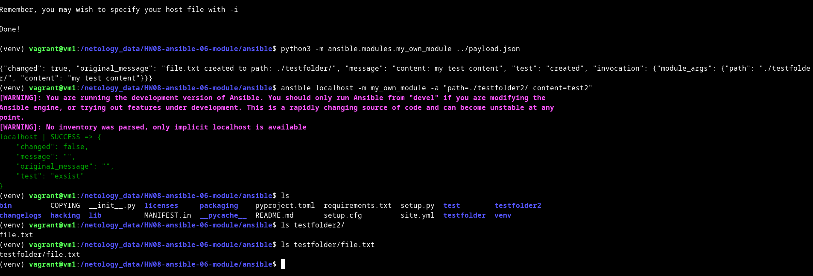
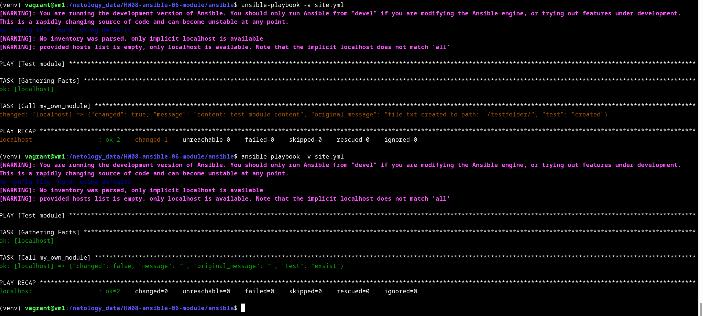
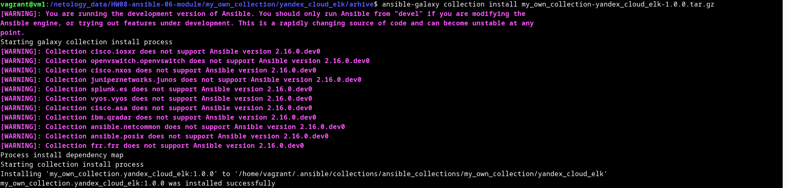
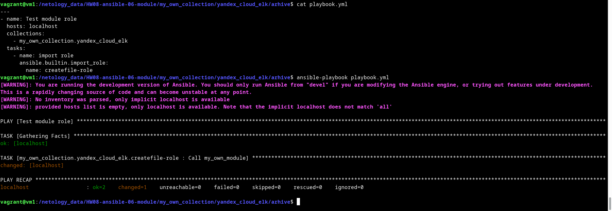

# Домашнее задание к занятию 6 «Создание собственных модулей»

## Подготовка к выполнению

1. Создайте пустой публичный репозиторий в своём любом проекте: `my_own_collection`.
2. Скачайте репозиторий Ansible: `git clone https://github.com/ansible/ansible.git` по любому, удобному вам пути.
3. Зайдите в директорию Ansible: `cd ansible`.
4. Создайте виртуальное окружение: `python3 -m venv venv`.
5. Активируйте виртуальное окружение: `. venv/bin/activate`. Дальнейшие действия производятся только в виртуальном окружении.
6. Установите зависимости `pip install -r requirements.txt`.
7. Запустите настройку окружения `. hacking/env-setup`.
8. Если все шаги прошли успешно — выйдите из виртуального окружения `deactivate`.
9. Ваше окружение настроено. Чтобы запустить его, нужно находиться в директории `ansible` и выполнить конструкцию `. venv/bin/activate && . hacking/env-setup`.

<details>
<summary>

</summary>

```bash
$ . venv/bin/activate && . hacking/env-setup
running egg_info
creating lib/ansible_core.egg-info
writing lib/ansible_core.egg-info/PKG-INFO
writing dependency_links to lib/ansible_core.egg-info/dependency_links.txt
writing entry points to lib/ansible_core.egg-info/entry_points.txt
writing requirements to lib/ansible_core.egg-info/requires.txt
writing top-level names to lib/ansible_core.egg-info/top_level.txt
writing manifest file 'lib/ansible_core.egg-info/SOURCES.txt'
reading manifest file 'lib/ansible_core.egg-info/SOURCES.txt'
reading manifest template 'MANIFEST.in'
warning: no files found matching 'changelogs/CHANGELOG*.rst'
writing manifest file 'lib/ansible_core.egg-info/SOURCES.txt'

Setting up Ansible to run out of checkout...

PATH=/netology_data/HW08-ansible-06-module/ansible/bin:/netology_data/HW08-ansible-06-module/ansible/venv/bin:/home/vagrant/.local/bin:/home/vagrant/yandex-cloud/bin:/usr/local/sbin:/usr/local/bin:/usr/sbin:/usr/bin:/sbin:/bin:/usr/games:/usr/local/games:/snap/bin
PYTHONPATH=/netology_data/HW08-ansible-06-module/ansible/test/lib:/netology_data/HW08-ansible-06-module/ansible/lib:/netology_data/HW08-ansible-06-module/ansible/test/lib:/netology_data/HW08-ansible-06-module/ansible/lib
MANPATH=/netology_data/HW08-ansible-06-module/ansible/docs/man:/usr/local/man:/usr/local/share/man:/usr/share/man

Remember, you may wish to specify your host file with -i

Done!

```
</details>

## Основная часть

Ваша цель — написать собственный module, который вы можете использовать в своей role через playbook. Всё это должно быть собрано в виде collection и отправлено в ваш репозиторий.

**Шаг 1.** В виртуальном окружении создайте новый `my_own_module.py` файл.

**Шаг 2.** Наполните его содержимым:

```python
#!/usr/bin/python

# Copyright: (c) 2018, Terry Jones <terry.jones@example.org>
# GNU General Public License v3.0+ (see COPYING or https://www.gnu.org/licenses/gpl-3.0.txt)
from __future__ import (absolute_import, division, print_function)
__metaclass__ = type

DOCUMENTATION = r'''
---
module: my_test

short_description: This is my test module

# If this is part of a collection, you need to use semantic versioning,
# i.e. the version is of the form "2.5.0" and not "2.4".
version_added: "1.0.0"

description: This is my longer description explaining my test module.

options:
    name:
        description: This is the message to send to the test module.
        required: true
        type: str
    new:
        description:
            - Control to demo if the result of this module is changed or not.
            - Parameter description can be a list as well.
        required: false
        type: bool
# Specify this value according to your collection
# in format of namespace.collection.doc_fragment_name
extends_documentation_fragment:
    - my_namespace.my_collection.my_doc_fragment_name

author:
    - Your Name (@yourGitHubHandle)
'''

EXAMPLES = r'''
# Pass in a message
- name: Test with a message
  my_namespace.my_collection.my_test:
    name: hello world

# pass in a message and have changed true
- name: Test with a message and changed output
  my_namespace.my_collection.my_test:
    name: hello world
    new: true

# fail the module
- name: Test failure of the module
  my_namespace.my_collection.my_test:
    name: fail me
'''

RETURN = r'''
# These are examples of possible return values, and in general should use other names for return values.
original_message:
    description: The original name param that was passed in.
    type: str
    returned: always
    sample: 'hello world'
message:
    description: The output message that the test module generates.
    type: str
    returned: always
    sample: 'goodbye'
'''

from ansible.module_utils.basic import AnsibleModule


def run_module():
    # define available arguments/parameters a user can pass to the module
    module_args = dict(
        name=dict(type='str', required=True),
        new=dict(type='bool', required=False, default=False)
    )

    # seed the result dict in the object
    # we primarily care about changed and state
    # changed is if this module effectively modified the target
    # state will include any data that you want your module to pass back
    # for consumption, for example, in a subsequent task
    result = dict(
        changed=False,
        original_message='',
        message=''
    )

    # the AnsibleModule object will be our abstraction working with Ansible
    # this includes instantiation, a couple of common attr would be the
    # args/params passed to the execution, as well as if the module
    # supports check mode
    module = AnsibleModule(
        argument_spec=module_args,
        supports_check_mode=True
    )

    # if the user is working with this module in only check mode we do not
    # want to make any changes to the environment, just return the current
    # state with no modifications
    if module.check_mode:
        module.exit_json(**result)

    # manipulate or modify the state as needed (this is going to be the
    # part where your module will do what it needs to do)
    result['original_message'] = module.params['name']
    result['message'] = 'goodbye'

    # use whatever logic you need to determine whether or not this module
    # made any modifications to your target
    if module.params['new']:
        result['changed'] = True

    # during the execution of the module, if there is an exception or a
    # conditional state that effectively causes a failure, run
    # AnsibleModule.fail_json() to pass in the message and the result
    if module.params['name'] == 'fail me':
        module.fail_json(msg='You requested this to fail', **result)

    # in the event of a successful module execution, you will want to
    # simple AnsibleModule.exit_json(), passing the key/value results
    module.exit_json(**result)


def main():
    run_module()


if __name__ == '__main__':
    main()
```
Или возьмите это наполнение [из статьи](https://docs.ansible.com/ansible/latest/dev_guide/developing_modules_general.html#creating-a-module).

**Шаг 3.** Заполните файл в соответствии с требованиями Ansible так, чтобы он выполнял основную задачу: module должен создавать текстовый файл на удалённом хосте по пути, определённом в параметре `path`, с содержимым, определённым в параметре `content`.

<details>
<summary>

</summary>


```python
#!/usr/bin/python

# Copyright: (c) 2018, Terry Jones <terry.jones@example.org>
# GNU General Public License v3.0+ (see COPYING or https://www.gnu.org/licenses/gpl-3.0.txt)
from __future__ import (absolute_import, division, print_function)
__metaclass__ = type

DOCUMENTATION = r'''
---
module: my_own_module

short_description: This is my test module

# If this is part of a collection, you need to use semantic versioning,
# i.e. the version is of the form "2.5.0" and not "2.4".
version_added: "1.0.0"

description: This is my longer description explaining my test module.

options:
    path:
        description: This is the path to file.txt.
        required: true
        type: str
    content:
        description: Text fot file.txt
        required: false
        type: str
# Specify this value according to your collection
# in format of namespace.collection.doc_fragment_name
extends_documentation_fragment:
    - my_namespace.my_collection.my_doc_fragment_name

author:
    - Alexey (@yourGitHubHandle)
'''

EXAMPLES = r'''
# Create file.txt
- name: Create file
  my_namespace.my_collection.my_test:
    path: "./new_folder/"
    content: test content

'''

RETURN = r'''
# These are examples of possible return values, and in general should use other names for return values.
original_message:
    description: The message about file creation and its contents
    type: str
    returned: always
    sample: 'hello world'
message:
    description: The output message that the test module generates.
    type: str
    returned: always
    sample: 'goodbye'
'''

import os
from ansible.module_utils.basic import AnsibleModule

def create_file(path, content):
    if not os.path.lexists(path):
        os.makedirs(path)
    if os.path.lexists(path+'file.txt'):
        return "exsist"
    else:
        try:
            with open(path+'file.txt', 'w') as fp:
                fp.write(content)
        except:
            raise
        return "created"

def run_module():
    # define available arguments/parameters a user can pass to the module
    module_args = dict(
        path=dict(type='str', required=True),
        content=dict(type='str', required=False, default='default text')
    )

    # seed the result dict in the object
    # we primarily care about changed and state
    # changed is if this module effectively modified the target
    # state will include any data that you want your module to pass back
    # for consumption, for example, in a subsequent task
    result = dict(
        changed=False,
        original_message='',
        message=''
    )

    # the AnsibleModule object will be our abstraction working with Ansible
    # this includes instantiation, a couple of common attr would be the
    # args/params passed to the execution, as well as if the module
    # supports check mode
    module = AnsibleModule(
        argument_spec=module_args,
        supports_check_mode=True
    )

    path = module.params['path']
    content = module.params['content']

    res = create_file(path, content)

    # if the user is working with this module in only check mode we do not
    # want to make any changes to the environment, just return the current
    # state with no modifications
    if module.check_mode:
        module.exit_json(**result)


    # use whatever logic you need to determine whether or not this module
    # made any modifications to your target
    if res == "created":
        result['original_message'] = 'file.txt created to path: {} with content: {}'.format(module.params['path'], module.params['content'])
        result['message'] = 'goodbye'
        result['changed'] = True


    # in the event of a successful module execution, you will want to
    # simple AnsibleModule.exit_json(), passing the key/value results
    module.exit_json(**result)


def main():
    run_module()


if __name__ == '__main__':
    main()

```

</details>

**Шаг 4.** Проверьте module на исполняемость локально.

<details>
<summary>

</summary>

```bash
(venv) vagrant@vm1:/netology_data/HW08-ansible-06-module/ansible$ python3 -m ansible.modules.my_own_module ../payload.json 

{"changed": true, "original_message": "file.txt created to path: ./testfolder/ with content: my test content", "message": "goodbye", "invocation": {"module_args": {"path": "./testfolder/", "content": "my test content"}}}
```

```bash
(venv) vagrant@vm1:/netology_data/HW08-ansible-06-module/ansible$ ansible localhost -m my_own_module -a "path=./testfolder2/ content=test2"
[WARNING]: You are running the development version of Ansible. You should only run Ansible from "devel" if you are modifying the
Ansible engine, or trying out features under development. This is a rapidly changing source of code and can become unstable at any
point.
[WARNING]: No inventory was parsed, only implicit localhost is available
localhost | CHANGED => {
    "changed": true,
    "message": "goodbye",
    "original_message": "file.txt created to path: ./testfolder2/ with content: test2"
}

```

</details>

**Шаг 5.** Напишите single task playbook и используйте module в нём.

<details>
<summary>

</summary>

```yaml
---
- name: Test module
  hosts: localhost
  tasks:
    - name: Call my_own_module
      my_own_module:
        path: "./testfolder/"
        content: "test module content"

```

```bash
(venv) vagrant@vm1:/netology_data/HW08-ansible-06-module/ansible$ ansible-playbook -v site.yml 
[WARNING]: You are running the development version of Ansible. You should only run Ansible from "devel" if you are modifying the
Ansible engine, or trying out features under development. This is a rapidly changing source of code and can become unstable at any
point.
No config file found; using defaults
[WARNING]: No inventory was parsed, only implicit localhost is available
[WARNING]: provided hosts list is empty, only localhost is available. Note that the implicit localhost does not match 'all'

PLAY [Test module] ********************************************************************************************************************

TASK [Gathering Facts] ****************************************************************************************************************
ok: [localhost]

TASK [Call my_own_module] *************************************************************************************************************
changed: [localhost] => {"changed": true, "message": "content: test module content", "original_message": "file.txt created to path: ./testfolder/", "test": "created"}

PLAY RECAP ****************************************************************************************************************************
localhost                  : ok=2    changed=1    unreachable=0    failed=0    skipped=0    rescued=0    ignored=0  
```

</details>

**Шаг 6.** Проверьте через playbook на идемпотентность.

<details>
<summary>

</summary>

```bash
(venv) vagrant@vm1:/netology_data/HW08-ansible-06-module/ansible$ ansible-playbook -v site.yml 
[WARNING]: You are running the development version of Ansible. You should only run Ansible from "devel" if you are modifying the
Ansible engine, or trying out features under development. This is a rapidly changing source of code and can become unstable at any
point.
No config file found; using defaults
[WARNING]: No inventory was parsed, only implicit localhost is available
[WARNING]: provided hosts list is empty, only localhost is available. Note that the implicit localhost does not match 'all'

PLAY [Test module] ********************************************************************************************************************

TASK [Gathering Facts] ****************************************************************************************************************
ok: [localhost]

TASK [Call my_own_module] *************************************************************************************************************
ok: [localhost] => {"changed": false, "message": "", "original_message": "", "test": "exsist"}

PLAY RECAP ****************************************************************************************************************************
localhost                  : ok=2    changed=0    unreachable=0    failed=0    skipped=0    rescued=0    ignored=0  
```

</details>


**Шаг 7.** Выйдите из виртуального окружения.

**Шаг 8.** Инициализируйте новую collection: `ansible-galaxy collection init my_own_namespace.yandex_cloud_elk`.

<details>
<summary>

</summary>

```bash
vagrant@vm1:/netology_data/HW08-ansible-06-module$ ansible-galaxy collection init my_own_collection.yandex_cloud_elk
[WARNING]: You are running the development version of Ansible. You should only run Ansible from "devel" if you are modifying the
Ansible engine, or trying out features under development. This is a rapidly changing source of code and can become unstable at any
point.
- Collection my_own_collection.yandex_cloud_elk was created successfully


```

</details>

**Шаг 9.** В эту collection перенесите свой module в соответствующую директорию.

**Шаг 10.** Single task playbook преобразуйте в single task role и перенесите в collection. У role должны быть default всех параметров module.

<details>
<summary>

</summary>

```bash
vagrant@vm1:/netology_data/HW08-ansible-06-module/my_own_collection/yandex_cloud_elk$ cat roles/createfile-role/defaults/main.yml 
---
path: "./testfolder/"
content: "test module content"

vagrant@vm1:/netology_data/HW08-ansible-06-module/my_own_collection/yandex_cloud_elk$ cat roles/createfile-role/tasks/main.yml 
---
- name: Call my_own_module
  my_own_collection.yandex_cloud_elk.my_own_module:
    path: "{{ path }}"
    content: "{{ content }}"  

```

</details>

**Шаг 11.** Создайте playbook для использования этой role.

<details>
<summary>

</summary>

```yaml
---
- name: Test module role
  hosts: localhost
  collections:
    - my_own_collection.yandex_cloud_elk
  tasks:
    - name: import role
      ansible.builtin.import_role:
        name: createfile-role
```

</details>

**Шаг 12.** Заполните всю документацию по collection, выложите в свой репозиторий, поставьте тег `1.0.0` на этот коммит.

<details>
<summary>

</summary>

https://github.com/alshelk/my_own_collection/tree/1.0.0

</details>

**Шаг 13.** Создайте .tar.gz этой collection: `ansible-galaxy collection build` в корневой директории collection.


<details>
<summary>

</summary>

```bash
vagrant@vm1:/netology_data/HW08-ansible-06-module/my_own_collection/yandex_cloud_elk$ ansible-galaxy collection build
[WARNING]: You are running the development version of Ansible. You should only run Ansible from "devel" if you are modifying the
Ansible engine, or trying out features under development. This is a rapidly changing source of code and can become unstable at any
point.
Created collection for my_own_collection.yandex_cloud_elk at /netology_data/HW08-ansible-06-module/my_own_collection/yandex_cloud_elk/my_own_collection-yandex_cloud_elk-1.0.0.tar.gz

```

</details>

**Шаг 14.** Создайте ещё одну директорию любого наименования, перенесите туда single task playbook и архив c collection.

<details>
<summary>

</summary>

[arhive](arhive)

</details>

**Шаг 15.** Установите collection из локального архива: `ansible-galaxy collection install <archivename>.tar.gz`.

<details>
<summary>

</summary>

```bash
vagrant@vm1:/netology_data/HW08-ansible-06-module/my_own_collection/yandex_cloud_elk/arhive$ ansible-galaxy collection install my_own_collection-yandex_cloud_elk-1.0.0.tar.gz 
[WARNING]: You are running the development version of Ansible. You should only run Ansible from "devel" if you are modifying the
Ansible engine, or trying out features under development. This is a rapidly changing source of code and can become unstable at any
point.
Starting galaxy collection install process
[WARNING]: Collection cisco.iosxr does not support Ansible version 2.16.0.dev0
[WARNING]: Collection openvswitch.openvswitch does not support Ansible version 2.16.0.dev0
[WARNING]: Collection cisco.nxos does not support Ansible version 2.16.0.dev0
[WARNING]: Collection junipernetworks.junos does not support Ansible version 2.16.0.dev0
[WARNING]: Collection splunk.es does not support Ansible version 2.16.0.dev0
[WARNING]: Collection vyos.vyos does not support Ansible version 2.16.0.dev0
[WARNING]: Collection cisco.asa does not support Ansible version 2.16.0.dev0
[WARNING]: Collection ibm.qradar does not support Ansible version 2.16.0.dev0
[WARNING]: Collection ansible.netcommon does not support Ansible version 2.16.0.dev0
[WARNING]: Collection ansible.posix does not support Ansible version 2.16.0.dev0
[WARNING]: Collection frr.frr does not support Ansible version 2.16.0.dev0
Process install dependency map
Starting collection install process
Installing 'my_own_collection.yandex_cloud_elk:1.0.0' to '/home/vagrant/.ansible/collections/ansible_collections/my_own_collection/yandex_cloud_elk'
my_own_collection.yandex_cloud_elk:1.0.0 was installed successfully
```

</details>

**Шаг 16.** Запустите playbook, убедитесь, что он работает.

<details>
<summary>

</summary>

```bash
vagrant@vm1:/netology_data/HW08-ansible-06-module/my_own_collection/yandex_cloud_elk/arhive$ cat playbook.yml 
---
- name: Test module role
  hosts: localhost
  collections:
    - my_own_collection.yandex_cloud_elk
  tasks:
    - name: import role
      ansible.builtin.import_role:
        name: createfile-role

vagrant@vm1:/netology_data/HW08-ansible-06-module/my_own_collection/yandex_cloud_elk/arhive$ ansible-playbook -v playbook.yml 
[WARNING]: You are running the development version of Ansible. You should only run Ansible from "devel" if you are modifying the
Ansible engine, or trying out features under development. This is a rapidly changing source of code and can become unstable at any
point.
No config file found; using defaults
[WARNING]: No inventory was parsed, only implicit localhost is available
[WARNING]: provided hosts list is empty, only localhost is available. Note that the implicit localhost does not match 'all'

PLAY [Test module role] ***************************************************************************************************************

TASK [Gathering Facts] ****************************************************************************************************************
ok: [localhost]

TASK [my_own_collection.yandex_cloud_elk.createfile-role : Call my_own_module] ********************************************************
changed: [localhost] => {"changed": true, "message": "content: test module content", "original_message": "file.txt created to path: ./testfolder/", "test": "created"}

PLAY RECAP ****************************************************************************************************************************
localhost                  : ok=2    changed=1    unreachable=0    failed=0    skipped=0    rescued=0    ignored=0 
```

</details>

**Шаг 17.** В ответ необходимо прислать ссылки на collection и tar.gz архив, а также скриншоты выполнения пунктов 4, 6, 15 и 16.

<details>
<summary>
Ответ:
</summary>

[my_own_collection](https://github.com/alshelk/my_own_collection/tree/main)

[my_own_collection-yandex_cloud_elk-1.0.0.tar.gz](https://github.com/alshelk/my_own_collection/blob/main/arhive/my_own_collection-yandex_cloud_elk-1.0.0.tar.gz)

**пункт 4:**



**пункт 5:**



**пункт 15:**



**пункт 16:**



</details>

## Необязательная часть

1. Реализуйте свой модуль для создания хостов в Yandex Cloud.
2. Модуль может и должен иметь зависимость от `yc`, основной функционал: создание ВМ с нужным сайзингом на основе нужной ОС. Дополнительные модули по созданию кластеров ClickHouse, MySQL и прочего реализовывать не надо, достаточно простейшего создания ВМ.
3. Модуль может формировать динамическое inventory, но эта часть не является обязательной, достаточно, чтобы он делал хосты с указанной спецификацией в YAML.
4. Протестируйте модуль на идемпотентность, исполнимость. При успехе добавьте этот модуль в свою коллекцию.
5. Измените playbook так, чтобы он умел создавать инфраструктуру под inventory, а после устанавливал весь ваш стек Observability на нужные хосты и настраивал его.
6. В итоге ваша коллекция обязательно должна содержать: clickhouse-role (если есть своя), lighthouse-role, vector-role, два модуля: my_own_module и модуль управления Yandex Cloud хостами и playbook, который демонстрирует создание Observability стека.

---