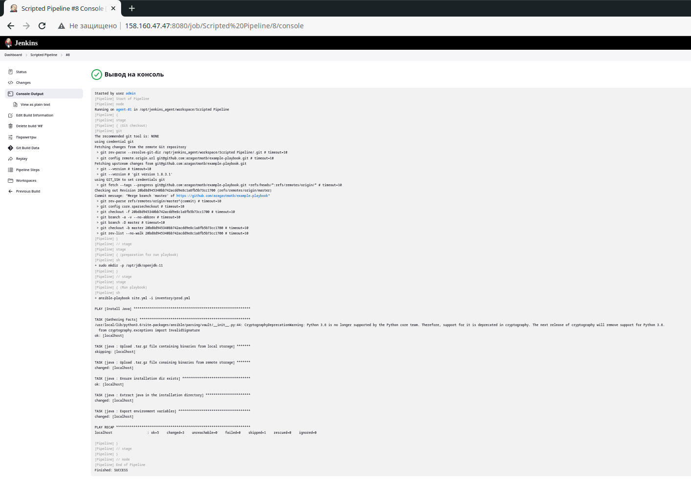
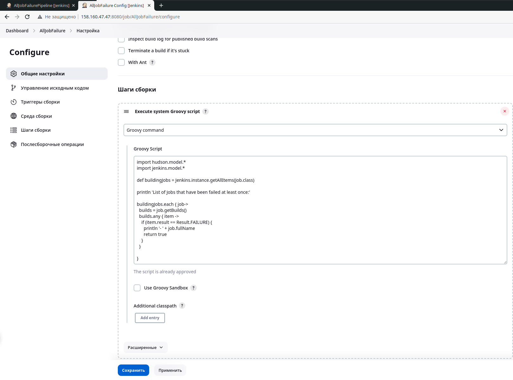

# Домашнее задание к занятию 10 «Jenkins»

## Подготовка к выполнению

1. Создать два VM: для jenkins-master и jenkins-agent.
2. Установить Jenkins при помощи playbook.
3. Запустить и проверить работоспособность.
4. Сделать первоначальную настройку.

## Основная часть

Сделать Freestyle Job, который будет запускать `molecule test` из любого вашего репозитория с ролью.

<details>
<summary>
Freestyle Job
</summary>


</details>

Сделать Declarative Pipeline Job, который будет запускать `molecule test` из любого вашего репозитория с ролью.

<details>
<summary>
Declarative Pipeline Job
</summary>


</details>

Перенести Declarative Pipeline в репозиторий в файл `Jenkinsfile`.


[Jenkisfile](https://github.com/alshelk/ansible-role-vector/blob/e64dc0c8dce1b5f05d769b3a30f6399b347fa5af/pipeline/jenkinsfile)

Создать Multibranch Pipeline на запуск `Jenkinsfile` из репозитория.

<details>
<summary>
Multibranch Pipeline
</summary>


</details>

Создать Scripted Pipeline, наполнить его скриптом из [pipeline](./pipeline).

<details>
<summary>
Scripted Pipeline
</summary>


</details>

Внести необходимые изменения, чтобы Pipeline запускал `ansible-playbook` без флагов `--check --diff`, если не установлен параметр при запуске джобы (prod_run = True). По умолчанию параметр имеет значение False и запускает прогон с флагами `--check --diff`.

<details>
<summary>
Pipeline
</summary>


```jenkins
node("linux"){
    parameters {
        booleanParam(name: "prod_run", defaultValue: false)
    }
    stage("Git checkout"){
        git credentialsId: 'git', url: 'git@github.com:aragastmatb/example-playbook.git'
    }
    stage('preparation for run playbook') {
        sh 'sudo mkdir -p /opt/jdk/openjdk-11'
    }
    stage("Run playbook"){
        if (params.prod_run){
            sh 'ansible-playbook site.yml -i inventory/prod.yml'
        }
        else{
            sh 'ansible-playbook site.yml -i inventory/prod.yml --check --diff'
        }

    }
}
```

</details>

Проверить работоспособность, исправить ошибки, исправленный Pipeline вложить в репозиторий в файл `ScriptedJenkinsfile`.


<details>
<summary>

</summary>




[ScriptedJenkinsfile](pipeline%2FScriptedJenkinsfile)

</details>

Отправить ссылку на репозиторий с ролью и Declarative Pipeline и Scripted Pipeline.


Role: 
[vector-role](https://github.com/alshelk/ansible-role-vector/tree/main)

FreestyleJob:
[FreesyleJenkinsfile](pipeline%2FFreesyleJenkinsfile)

Declarative Pipeline:
[jenkinsfile](https://github.com/alshelk/ansible-role-vector/blob/main/pipeline/jenkinsfile)

Scripted Pipelin:
[ScriptedJenkinsfile](pipeline%2FScriptedJenkinsfile)


## Необязательная часть

1. Создать скрипт на groovy, который будет собирать все Job, завершившиеся хотя бы раз неуспешно. Добавить скрипт в репозиторий с решением и названием `AllJobFailure.groovy`.

<details>
<summary>
AllJobFailure.groovy
</summary>

[AllJobFailure.groovy](pipeline%2FAllJobFailure.groovy):

```groove
import hudson.model.*
import jenkins.model.*

def buildingJobs = Jenkins.instance.getAllItems(Job.class)

println 'List of Jobs that have been failed at least once:'

buildingJobs.each { job->
  builds = job.getBuilds()
  builds.any { item ->
    if (item.result == Result.FAILURE) {
      println '- ' + job.fullName
      return true
    }
  }

}
```





</details>

2. Создать Scripted Pipeline так, чтобы он мог сначала запустить через Yandex Cloud CLI необходимое количество инстансов, прописать их в инвентори плейбука и после этого запускать плейбук. Мы должны при нажатии кнопки получить готовую к использованию систему.


<details>
<summary>
Yandex Cloud
</summary>


```log
Started by user admin
[Pipeline] Start of Pipeline
[Pipeline] node
Running on agent-01 in /opt/jenkins_agent/workspace/YandexCloud
[Pipeline] {
[Pipeline] stage
[Pipeline] { (install yc)
[Pipeline] sh
+ curl https://storage.yandexcloud.net/yandexcloud-yc/install.sh
+ bash -s -- -a
  % Total    % Received % Xferd  Average Speed   Time    Time     Time  Current
                                 Dload  Upload   Total   Spent    Left  Speed

  0     0    0     0    0     0      0      0 --:--:-- --:--:-- --:--:--     0
100  9739  100  9739    0     0  54521      0 --:--:-- --:--:-- --:--:-- 54713
Downloading yc 0.107.0
  % Total    % Received % Xferd  Average Speed   Time    Time     Time  Current
                                 Dload  Upload   Total   Spent    Left  Speed

  0     0    0     0    0     0      0      0 --:--:-- --:--:-- --:--:--     0
 70 99.0M   70 70.0M    0     0  82.5M      0  0:00:01 --:--:--  0:00:01 82.5M
100 99.0M  100 99.0M    0     0  91.5M      0  0:00:01  0:00:01 --:--:-- 91.5M
Yandex Cloud CLI 0.107.0 linux/amd64
To complete installation, start a new shell (exec -l $SHELL) or type 'source "/home/jenkins/.bashrc"' in the current one
[Pipeline] }
[Pipeline] // stage
[Pipeline] stage
[Pipeline] { (autentification in yc)
[Pipeline] sh
+ yc config profile list
[Pipeline] echo
profile already exists
[Pipeline] }
[Pipeline] // stage
[Pipeline] stage
[Pipeline] { (Git checkout)
[Pipeline] git
The recommended git tool is: NONE
using credential git
Fetching changes from the remote Git repository
 > git rev-parse --resolve-git-dir /opt/jenkins_agent/workspace/YandexCloud/.git # timeout=10
 > git config remote.origin.url git@github.com:alshelk/jenkinsLesson.git # timeout=10
Fetching upstream changes from git@github.com:alshelk/jenkinsLesson.git
 > git --version # timeout=10
 > git --version # 'git version 1.8.3.1'
using GIT_SSH to set credentials git
[INFO] Currently running in a labeled security context
[INFO] Currently SELinux is 'enforcing' on the host
 > /usr/bin/chcon --type=ssh_home_t /opt/jenkins_agent/workspace/YandexCloud@tmp/jenkins-gitclient-ssh8926719314037930853.key
 > git fetch --tags --progress git@github.com:alshelk/jenkinsLesson.git +refs/heads/*:refs/remotes/origin/* # timeout=10
Checking out Revision 2a4f9dea626dbd3a9823e5f4c23ea5c60de18c1a (refs/remotes/origin/main)
Commit message: "fix site.yml"
 > git rev-parse refs/remotes/origin/main^{commit} # timeout=10
 > git config core.sparsecheckout # timeout=10
 > git checkout -f 2a4f9dea626dbd3a9823e5f4c23ea5c60de18c1a # timeout=10
 > git branch -a -v --no-abbrev # timeout=10
 > git branch -D main # timeout=10
 > git checkout -b main 2a4f9dea626dbd3a9823e5f4c23ea5c60de18c1a # timeout=10
 > git rev-list --no-walk 2a4f9dea626dbd3a9823e5f4c23ea5c60de18c1a # timeout=10
[Pipeline] }
[Pipeline] // stage
[Pipeline] stage
[Pipeline] { (create vm in yc)
[Pipeline] sh
+ yc compute instance list --format yaml
[Pipeline] readYaml
[Pipeline] echo
instans jenkins-master-auto already exists
[Pipeline] sh
+ ssh-keygen -R 84.201.130.156
Host 84.201.130.156 not found in /home/jenkins/.ssh/known_hosts
[Pipeline] sh
+ ssh-keyscan -t ecdsa,ed25519 -H 84.201.130.156
[Pipeline] echo
instans jenkins-agent-auto already exists
[Pipeline] sh
+ ssh-keygen -R 158.160.44.179
Host 158.160.44.179 not found in /home/jenkins/.ssh/known_hosts
[Pipeline] sh
+ ssh-keyscan -t ecdsa,ed25519 -H 158.160.44.179
[Pipeline] echo
{jenkins-master-auto=84.201.130.156, jenkins-agent-auto=158.160.44.179}
[Pipeline] sh
+ ls
playbook
[Pipeline] sh
+ cat playbook/inventory/cicd/hosts.yml
---

all:
  hosts:
    jenkins-master-01:
      ansible_host: 158.160.47.47
    jenkins-agent-01:
      ansible_host: 158.160.54.24
  children:
    jenkins:
      children:
        jenkins_masters:
          hosts:
            jenkins-master-01:
        jenkins_agents:
          hosts:
            jenkins-agent-01:
  vars:
    ansible_connection_type: paramiko
    ansible_user: centos
[Pipeline] fileExists
[Pipeline] sh
+ rm playbook/inventory/cicd/hosts.yml
[Pipeline] readYaml
[Pipeline] writeYaml
[Pipeline] sh
+ ls
playbook
[Pipeline] sh
+ ls playbook/inventory/cicd/hosts.yml
playbook/inventory/cicd/hosts.yml
[Pipeline] sh
+ cat playbook/inventory/cicd/hosts.yml
all:
  hosts:
    jenkins-master-auto:
      ansible_host: 84.201.130.156
    jenkins-agent-auto:
      ansible_host: 158.160.44.179
  children:
    jenkins:
      children:
        jenkins_masters:
          hosts:
            jenkins-master-auto: null
        jenkins_agents:
          hosts:
            jenkins-agent-auto: null
  vars:
    ansible_connection_type: paramiko
    ansible_user: yc-user
[Pipeline] }
[Pipeline] // stage
[Pipeline] stage
[Pipeline] { (Run playbook)
[Pipeline] sh
+ ansible-playbook playbook/site.yml -i playbook/inventory/cicd/hosts.yml

PLAY [Preapre all hosts] *******************************************************

TASK [Gathering Facts] *********************************************************
/usr/local/lib/python3.6/site-packages/ansible/parsing/vault/__init__.py:44: CryptographyDeprecationWarning: Python 3.6 is no longer supported by the Python core team. Therefore, support for it is deprecated in cryptography. The next release of cryptography will remove support for Python 3.6.
  from cryptography.exceptions import InvalidSignature
ok: [jenkins-agent-auto]
ok: [jenkins-master-auto]

TASK [Create group] ************************************************************
changed: [jenkins-agent-auto]
changed: [jenkins-master-auto]

TASK [Create user] *************************************************************
changed: [jenkins-master-auto]
changed: [jenkins-agent-auto]

TASK [Install JDK] *************************************************************
changed: [jenkins-agent-auto]
changed: [jenkins-master-auto]

PLAY [Get Jenkins master installed] ********************************************

TASK [Gathering Facts] *********************************************************
ok: [jenkins-master-auto]

TASK [Get repo Jenkins] ********************************************************
changed: [jenkins-master-auto]

TASK [Add Jenkins key] *********************************************************
changed: [jenkins-master-auto]

TASK [Install epel-release] ****************************************************
changed: [jenkins-master-auto]

TASK [Install Jenkins and requirements] ****************************************
changed: [jenkins-master-auto]

TASK [Ensure jenkins agents are present in known_hosts file] *******************
# 158.160.44.179:22 SSH-2.0-OpenSSH_7.4
# 158.160.44.179:22 SSH-2.0-OpenSSH_7.4
# 158.160.44.179:22 SSH-2.0-OpenSSH_7.4
changed: [jenkins-master-auto] => (item=jenkins-agent-auto)
[WARNING]: Module remote_tmp /home/jenkins/.ansible/tmp did not exist and was
created with a mode of 0700, this may cause issues when running as another
user. To avoid this, create the remote_tmp dir with the correct permissions
manually

TASK [Start Jenkins] ***********************************************************
changed: [jenkins-master-auto]

PLAY [Prepare jenkins agent] ***************************************************

TASK [Gathering Facts] *********************************************************
ok: [jenkins-agent-auto]

TASK [Add master publickey into authorized_key] ********************************
changed: [jenkins-agent-auto]

TASK [Create agent_dir] ********************************************************
changed: [jenkins-agent-auto]

TASK [Add docker repo] *********************************************************
changed: [jenkins-agent-auto]

TASK [Install some required] ***************************************************
changed: [jenkins-agent-auto]

TASK [Update pip] **************************************************************
changed: [jenkins-agent-auto]

TASK [Install Ansible] *********************************************************
changed: [jenkins-agent-auto]

TASK [Reinstall Selinux] *******************************************************
changed: [jenkins-agent-auto]

TASK [Add local to PATH] *******************************************************
changed: [jenkins-agent-auto]

TASK [Create docker group] *****************************************************
ok: [jenkins-agent-auto]

TASK [Add jenkinsuser to dockergroup] ******************************************
changed: [jenkins-agent-auto]

TASK [Restart docker] **********************************************************
changed: [jenkins-agent-auto]

TASK [Install agent.jar] *******************************************************
changed: [jenkins-agent-auto]

PLAY RECAP *********************************************************************
jenkins-agent-auto         : ok=17   changed=14   unreachable=0    failed=0    skipped=0    rescued=0    ignored=0   
jenkins-master-auto        : ok=11   changed=9    unreachable=0    failed=0    skipped=0    rescued=0    ignored=0   

[Pipeline] }
[Pipeline] // stage
[Pipeline] }
[Pipeline] // node
[Pipeline] End of Pipeline
Finished: SUCCESS
```

</details>