# Домашнее задание к занятию 11 «Teamcity»

## Подготовка к выполнению

1. В Yandex Cloud создайте новый инстанс (4CPU4RAM) на основе образа `jetbrains/teamcity-server`.
2. Дождитесь запуска teamcity, выполните первоначальную настройку.
3. Создайте ещё один инстанс (2CPU4RAM) на основе образа `jetbrains/teamcity-agent`. Пропишите к нему переменную окружения `SERVER_URL: "http://<teamcity_url>:8111"`.
4. Авторизуйте агент.
5. Сделайте fork [репозитория](https://github.com/aragastmatb/example-teamcity).
6. Создайте VM (2CPU4RAM) и запустите [playbook](./infrastructure).

## Основная часть

1. Создайте новый проект в teamcity на основе fork.

<details>
<summary>

</summary>

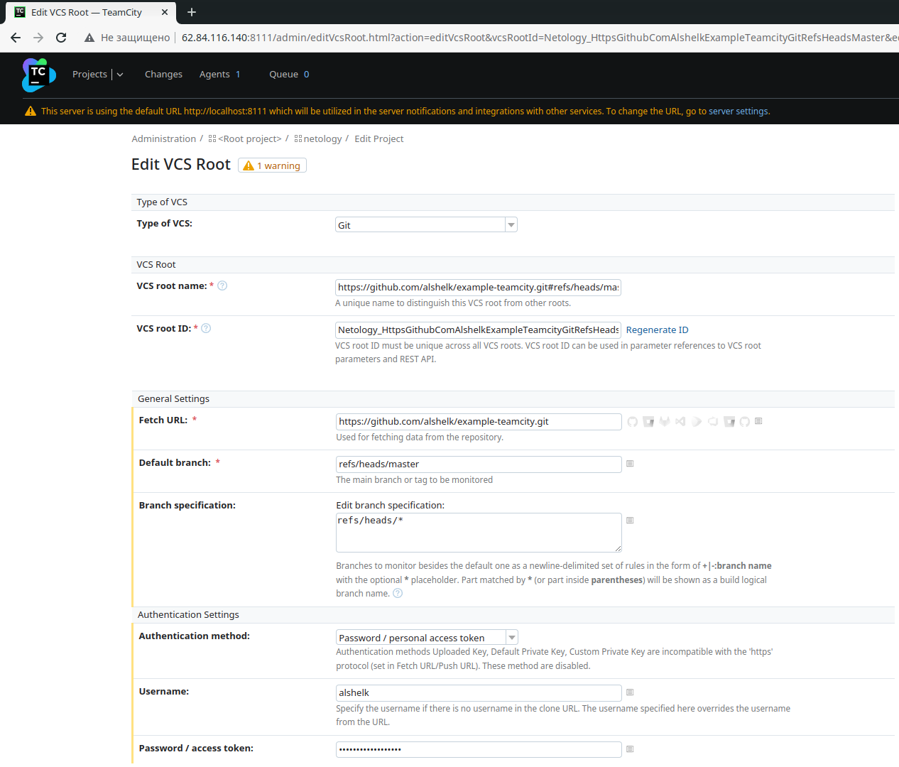

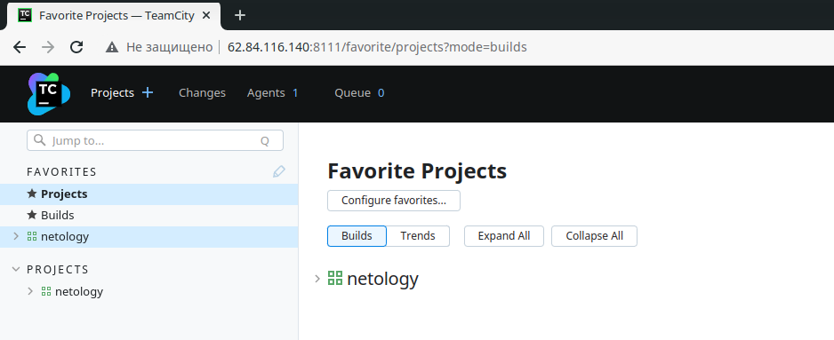

</details>

2. Сделайте autodetect конфигурации.

<details>
<summary>

</summary>

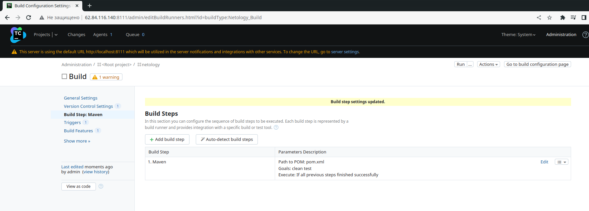

</details>

3. Сохраните необходимые шаги, запустите первую сборку master.

<details>
<summary>

</summary>

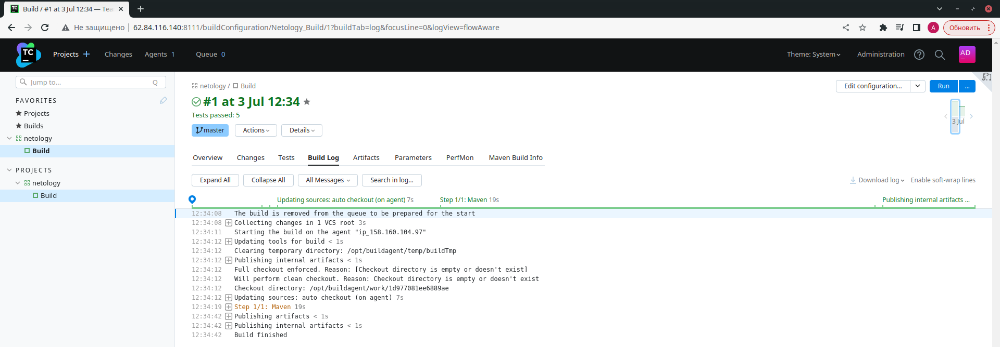

</details>

4. Поменяйте условия сборки: если сборка по ветке `master`, то должен происходит `mvn clean deploy`, иначе `mvn clean test`.

<details>
<summary>

</summary>

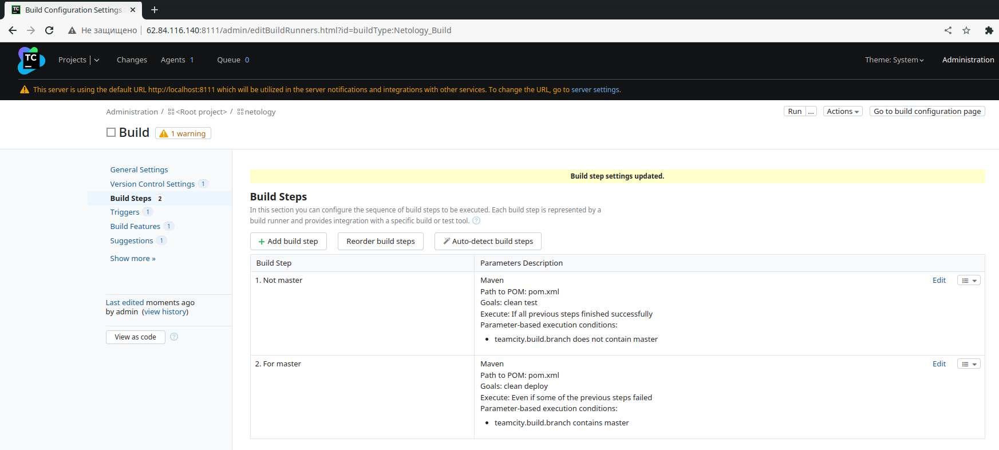

</details>

5. Для deploy будет необходимо загрузить [settings.xml](./teamcity/settings.xml) в набор конфигураций maven у teamcity, предварительно записав туда креды для подключения к nexus.

<details>
<summary>

</summary>

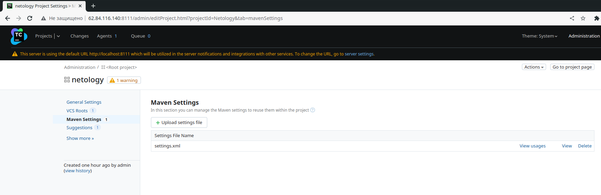

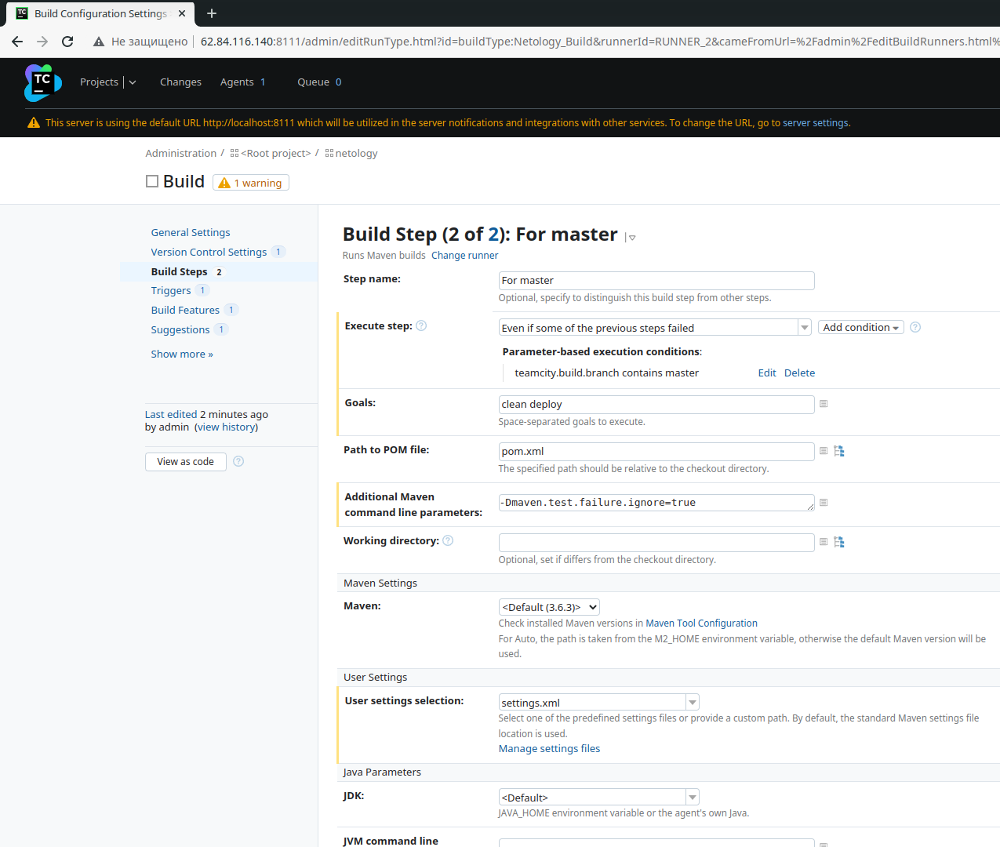

</details>

6. В pom.xml необходимо поменять ссылки на репозиторий и nexus.

<details>
<summary>

</summary>

[pom.xml](https://github.com/alshelk/example-teamcity/blob/1f11451e07a08188b3b15d1b3a2716e29fb92f86/pom.xml):

```xml
<?xml version="1.0" encoding="UTF-8"?>
<project xmlns="http://maven.apache.org/POM/4.0.0" xmlns:xsi="http://www.w3.org/2001/XMLSchema-instance"
	xsi:schemaLocation="http://maven.apache.org/POM/4.0.0 https://maven.apache.org/xsd/maven-4.0.0.xsd">
	<modelVersion>4.0.0</modelVersion>
	
	<groupId>org.netology</groupId>
	<artifactId>plaindoll</artifactId>
	<packaging>jar</packaging>
	<version>0.0.1</version>

	<properties>
		<maven.compiler.source>1.8</maven.compiler.source>
		<maven.compiler.target>1.8</maven.compiler.target>
	</properties>
	<distributionManagement>
		<repository>
				<id>nexus</id>
				<url>http://84.201.135.66:8081/repository/maven-releases</url>
		</repository>
	</distributionManagement>
	<dependencies>
		<dependency>
			<groupId>junit</groupId>
			<artifactId>junit</artifactId>
			<version>4.12</version>
			<scope>test</scope>
		</dependency>
	</dependencies>

	<build>
		<plugins>
			<plugin>
				<groupId>org.apache.maven.plugins</groupId>
				<artifactId>maven-shade-plugin</artifactId>
				<version>3.2.4</version>
				<executions>
					<execution>
						<phase>package</phase>
						<goals>
							<goal>shade</goal>
						</goals>
						<configuration>
							<transformers>
								<transformer implementation="org.apache.maven.plugins.shade.resource.ManifestResourceTransformer">
									<mainClass>plaindoll.HelloPlayer</mainClass>
								</transformer>
							</transformers>
						</configuration>
					</execution>
				</executions>
			</plugin>
		</plugins>
	</build>

</project>
```

</details>


7. Запустите сборку по master, убедитесь, что всё прошло успешно и артефакт появился в nexus.

<details>
<summary>

</summary>

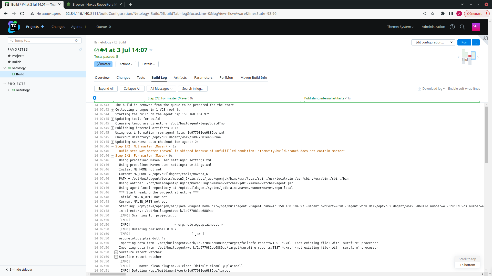

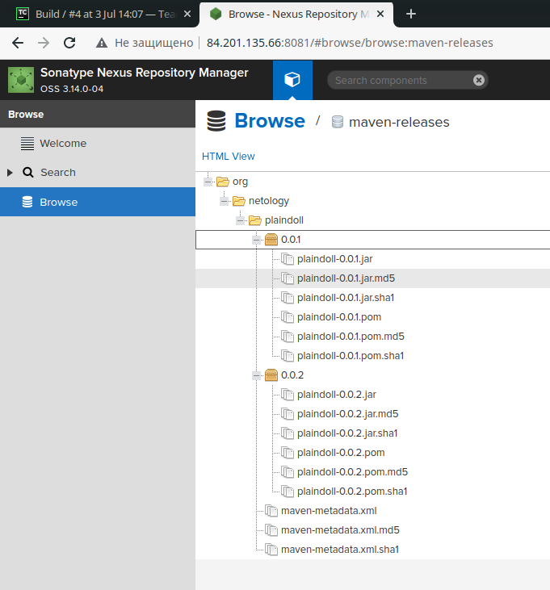

</details>

8. Мигрируйте `build configuration` в репозиторий.

<details>
<summary>

</summary>

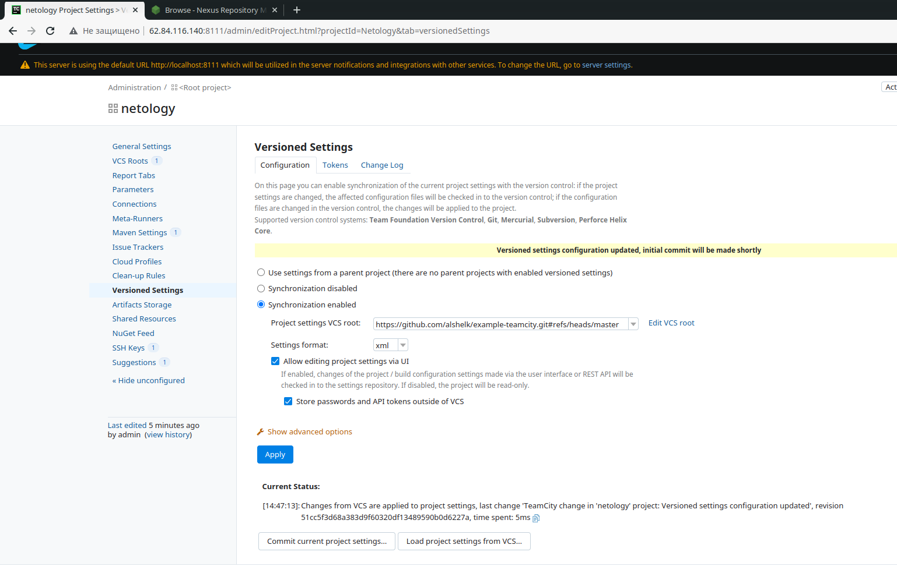

[git](https://github.com/alshelk/example-teamcity/tree/master/.teamcity/Netology)

</details>

9. Создайте отдельную ветку `feature/add_reply` в репозитории.

<details>
<summary>

</summary>


</details>

10. Напишите новый метод для класса Welcomer: метод должен возвращать произвольную реплику, содержащую слово `hunter`.

<details>
<summary>

</summary>

```java
    public String saySome(){
		return "Are you hungry hunter?";
	}
```

</details>

11. Дополните тест для нового метода на поиск слова `hunter` в новой реплике.

<details>
<summary>

</summary>

```java
	@Test
	public void welcomerSaysHunter() {
		assertThat(welcomer.sayWelcome(), containsString("hunter"));
		assertThat(welcomer.sayFarewell(), containsString("hunter"));
		assertThat(welcomer.sayAttention(), containsString("hunter"));
	}
```

</details>

12. Сделайте push всех изменений в новую ветку репозитория.

<details>
<summary>

</summary>

```bash
$ git push --set-upstream origin feature/add_reply
Enter passphrase for key '/home/vagrant/.ssh/id_ed25519': 
Enumerating objects: 361, done.
Counting objects: 100% (361/361), done.
Compressing objects: 100% (150/150), done.
Writing objects: 100% (361/361), 47.54 KiB | 2.80 MiB/s, done.
Total 361 (delta 120), reused 341 (delta 114)
remote: Resolving deltas: 100% (120/120), done.
remote: 
remote: Create a pull request for 'feature/add_reply' on GitHub by visiting:
remote:      https://github.com/alshelk/example-teamcity/pull/new/feature/add_reply
remote: 
To github.com:alshelk/example-teamcity.git
 * [new branch]      feature/add_reply -> feature/add_reply
Branch 'feature/add_reply' set up to track remote branch 'feature/add_reply' from 'origin'.

```

</details>

13. Убедитесь, что сборка самостоятельно запустилась, тесты прошли успешно.

<details>
<summary>

</summary>

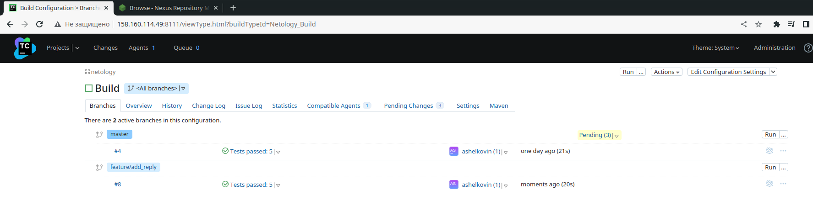

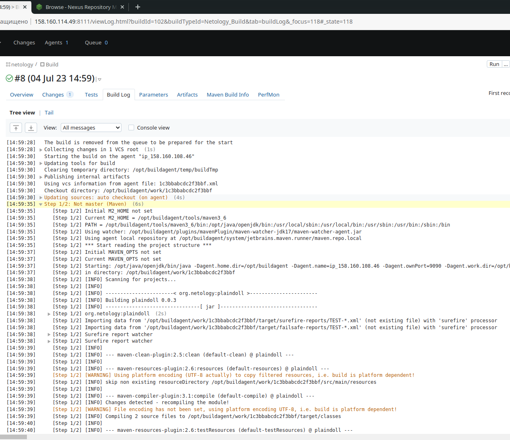

</details>

14. Внесите изменения из произвольной ветки `feature/add_reply` в `master` через `Merge`.
15. Убедитесь, что нет собранного артефакта в сборке по ветке `master`.
16. Настройте конфигурацию так, чтобы она собирала `.jar` в артефакты сборки.
17. Проведите повторную сборку мастера, убедитесь, что сбора прошла успешно и артефакты собраны.

<details>
<summary>

</summary>

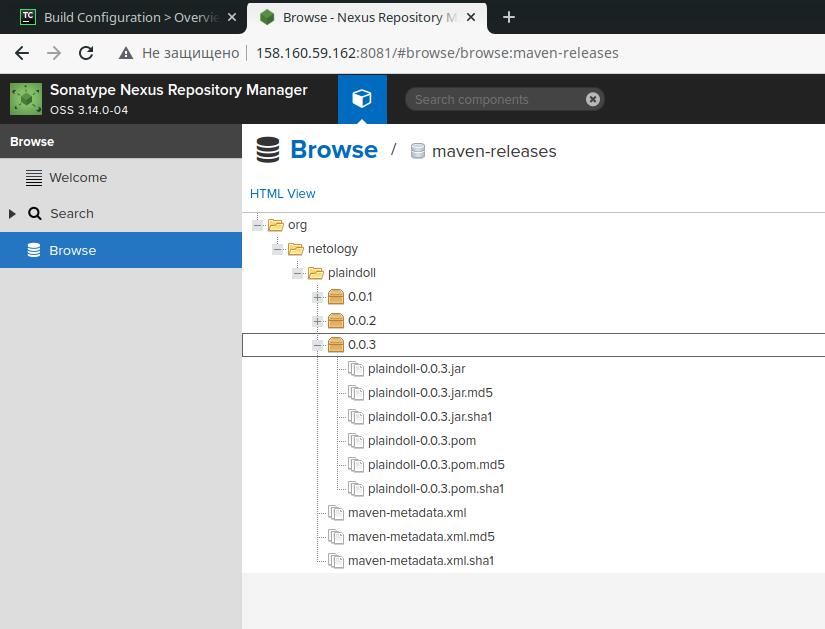

</details>

18. Проверьте, что конфигурация в репозитории содержит все настройки конфигурации из teamcity.
19. В ответе пришлите ссылку на репозиторий.


### Ответ:

[example-teamcity](https://github.com/alshelk/example-teamcity/tree/master)


---