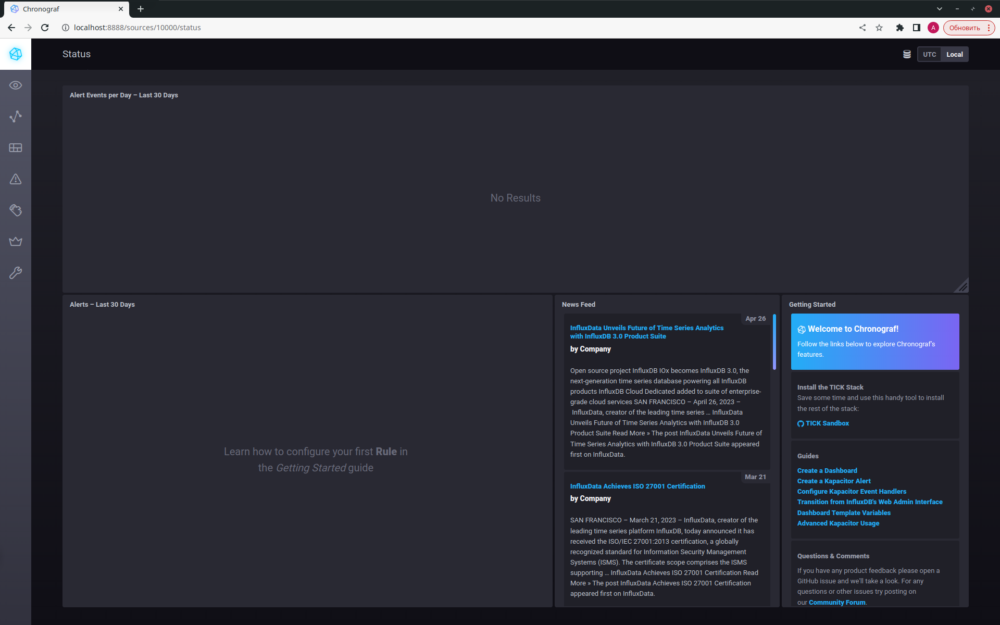
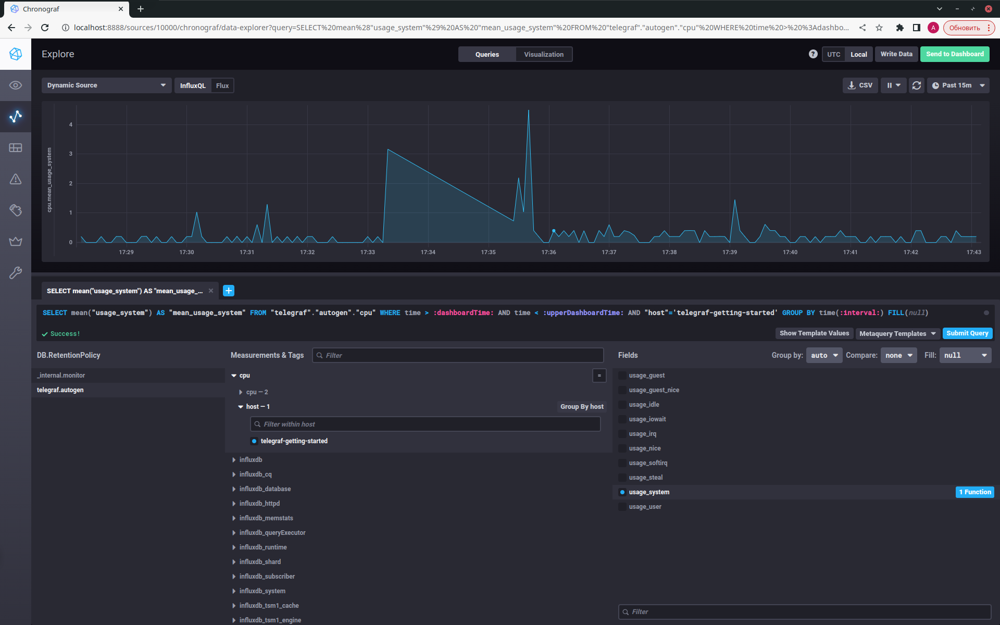
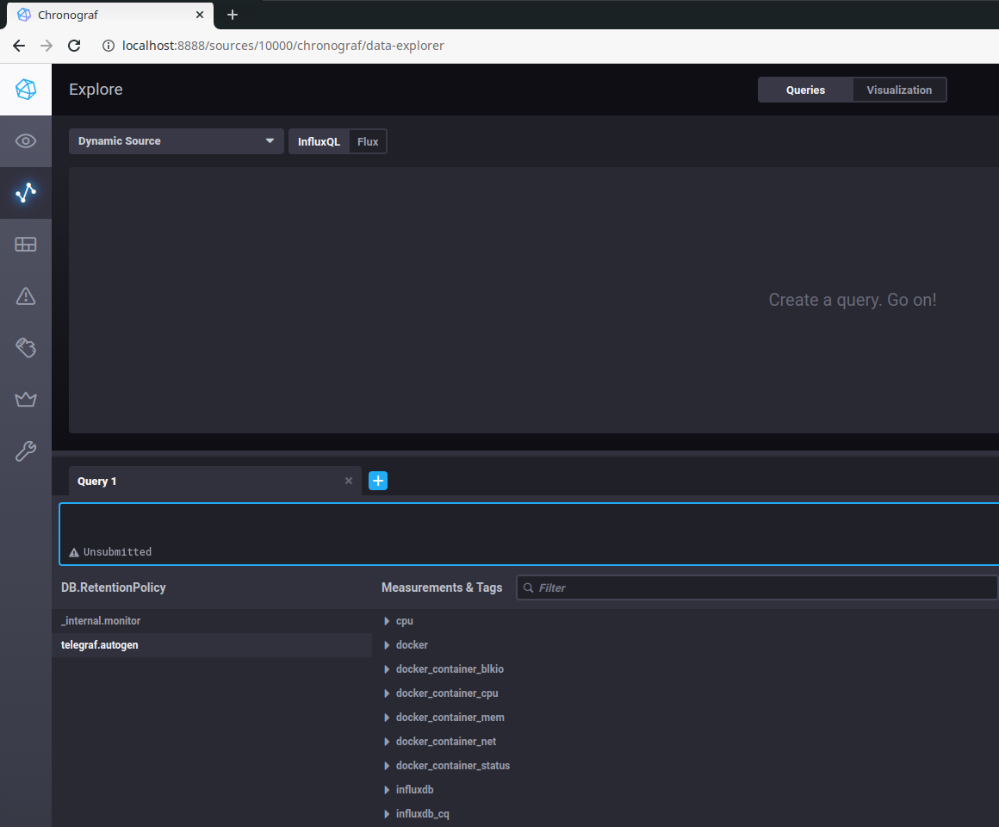
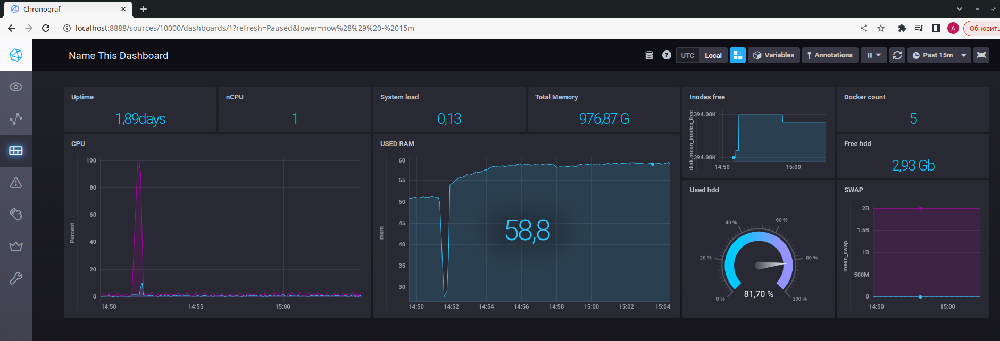

# Домашнее задание к занятию "13.Системы мониторинга"

## Обязательные задания

1. Вас пригласили настроить мониторинг на проект. На онбординге вам рассказали, что проект представляет из себя 
платформу для вычислений с выдачей текстовых отчетов, которые сохраняются на диск. Взаимодействие с платформой 
осуществляется по протоколу http. Также вам отметили, что вычисления загружают ЦПУ. Какой минимальный набор метрик вы
выведите в мониторинг и почему?

<details>
<summary>
Ответ
</summary>

```text
1. Так как текстовые отчеты сохраняются на диск, то стоит отслеживать свободное место на диске, так же не помешает следить
за состоянием дисков и нагрузкой на него. (время отклика (latency), число операций в секунду (IOPS))

2. По той же причине, что отчеты сохраняются на диск в виде отдельных файлов, отчеты текстовые и размер их может
быть маленьким, в то время как количество достаточно большим, стоит включить  мониторинг inodes что бы 
избежать переполнения дескрипторов.
 
3. Так как взаимодействие идет по протоколу HTTP, то следует мониторить доступность сервиса, отлавливать ответы с
кодами 4хх и 5хх. Можно считать количество ответов с кодами отличными от 4хх и 5хх для оценки количества запросов
к сервису.

4. Так как вычисления грузят ЦПУ, то необходимо знать насколько загружен процессор (load average) и не требуется ли увеличение ресурсов.
Можно добавить iowait который покажет процент времени ожидания процессора обращения к диску.

5. Так же нужно включить мониторинг за использованием RAM, что бы спастись от ООМ, вовремя реагировать на утечки памяти и 
расширять ресурсы при необходимости. Не помешает мониторинг нагрузки сети, так как приложение взаимодействует с пользователями 
по сети.

```

</details>

#
2. Менеджер продукта посмотрев на ваши метрики сказал, что ему непонятно что такое RAM/inodes/CPUla. Также он сказал, 
что хочет понимать, насколько мы выполняем свои обязанности перед клиентами и какое качество обслуживания. Что вы 
можете ему предложить?

<details>
<summary>
Ответ
</summary>

```text
   
Для понимания насколько мы выполняем свои обязанности перед клиентами и какое качество обслуживания, можно:

- вычислить среднее время формирования отчета (что покажет как быстро сервис обслуживает клиентов),
- количество входов клиента в платформу (позволит отследить динамику использования платформы клиентами)
- процент не сформированных отчетов ( даст относительное понимание об неудовлетворенных клиентах )
- средний срок взаимодействия с клиентом ( покажет какой процент клиентов возвращается к платформе и продолжает ей пользоваться)
- процент активных клиентов
- можно ввести систему голосования, понравилась/не понравилась  работа сервиса, и вычислить индекс недовольства клиентов, индекс лояльности, индекс удовлетворенности...
- время недоступности системы
- процент обращений в службу поддержки
- скорость решения заявок службой поддержки
- количество новых клиентов за период времени.
 
```

</details>

#
3. Вашей DevOps команде в этом году не выделили финансирование на построение системы сбора логов. Разработчики в свою 
очередь хотят видеть все ошибки, которые выдают их приложения. Какое решение вы можете предпринять в этой ситуации, 
чтобы разработчики получали ошибки приложения?

<details>
<summary>
Ответ
</summary>

```text
Самый простой и бюджетный способ, уже есть у разработчиков, кто мешает им ходить на свой сервер и смотреть логи.

Как вариант, если доступа к серверу нет и проект более серьезный, можно написать скрипт, который будет складывать
логи в доступное разрабам место.
 
Или, настроить Elasticsearch или Sentry, но для этого уже может понадобиться отдельный сервер, а это опять 
вопрос финансирования
```

</details>

#
4. Вы, как опытный SRE, сделали мониторинг, куда вывели отображения выполнения SLA=99% по http кодам ответов. 
Вычисляете этот параметр по следующей формуле: summ_2xx_requests/summ_all_requests. Данный параметр не поднимается выше 
70%, но при этом в вашей системе нет кодов ответа 5xx и 4xx. Где у вас ошибка?


<details>
<summary>
Ответ
</summary>

```text
в формулу нужно добавить коды 1хх и 3хх

(summ_1xx_requests + summ_2xx_requests + summ_3xx_requests)/summ_all_requests

```

</details>

#
5. Опишите основные плюсы и минусы pull и push систем мониторинга.


<details>
<summary>
Ответ
</summary>

```text
Pull-модель - данные отправляются от источника в систему мониторинга.

    +   централизованная настройка
        легче контролировать подлинность данных
        можно настроить единый proxy до всех агентов с tls
        упрощенная отладка полученных данных с агента
        нет проблем с перегрузкой очередей 
        безопасность выше, т.к. не требует открытия порта во вне

    -   могут потеряться метрики в случае нестабильного соединения
        не работает за NAT
        более высокое требование к ресурсам
        


Push-модель - система мониторинга сама запрашивает данные из источника.

    +   упрощение репликации данных в разные системы мониторинга или их резервные копии
        более гибкая настройка отправки пакетов данных с метриками
        UDP - менее затратный способ передачи данных, что может повлиять на производительность сбора метрик
        работа за NAT
        
    -   на каждом узле надо настраивать агент, хотя для этих целей есть автоматизация
        безопасность. Порт, для приема метрик всегда открыт
        UDP не гарантирует доставку данных

```

</details>

#
6. Какие из ниже перечисленных систем относятся к push модели, а какие к pull? А может есть гибридные?

    - Prometheus 
    - TICK
    - Zabbix
    - VictoriaMetrics
    - Nagios


<details>
<summary>
Ответ
</summary>

```text
    - Prometheus            pull (push через pushgateway)
    - TICK                  push
    - Zabbix                push и pull
    - VictoriaMetrics       push и pull
    - Nagios                pull (для push есть плагин nsca) 

```

</details>

#
7. Склонируйте себе [репозиторий](https://github.com/influxdata/sandbox/tree/master) и запустите TICK-стэк, 
используя технологии docker и docker-compose.

В виде решения на это упражнение приведите скриншот веб-интерфейса ПО chronograf (`http://localhost:8888`). 

P.S.: если при запуске некоторые контейнеры будут падать с ошибкой - проставьте им режим `Z`, например
`./data:/var/lib:Z`

<details>
<summary>
Ответ
</summary>



</details>

#
8. Перейдите в веб-интерфейс Chronograf (http://localhost:8888) и откройте вкладку Data explorer.
        
    - Нажмите на кнопку Add a query
    - Изучите вывод интерфейса и выберите БД telegraf.autogen
    - В `measurments` выберите cpu->host->telegraf-getting-started, а в `fields` выберите usage_system. Внизу появится график утилизации cpu.
    - Вверху вы можете увидеть запрос, аналогичный SQL-синтаксису. Поэкспериментируйте с запросом, попробуйте изменить группировку и интервал наблюдений.

Для выполнения задания приведите скриншот с отображением метрик утилизации cpu из веб-интерфейса.


<details>
<summary>
Ответ
</summary>



</details>

#
9. Изучите список [telegraf inputs](https://github.com/influxdata/telegraf/tree/master/plugins/inputs). 
Добавьте в конфигурацию telegraf следующий плагин - [docker](https://github.com/influxdata/telegraf/tree/master/plugins/inputs/docker):
```
[[inputs.docker]]
  endpoint = "unix:///var/run/docker.sock"
```

Дополнительно вам может потребоваться донастройка контейнера telegraf в `docker-compose.yml` дополнительного volume и 
режима privileged:
```
  telegraf:
    image: telegraf:1.4.0
    privileged: true
    volumes:
      - ./etc/telegraf.conf:/etc/telegraf/telegraf.conf:Z
      - /var/run/docker.sock:/var/run/docker.sock:Z
    links:
      - influxdb
    ports:
      - "8092:8092/udp"
      - "8094:8094"
      - "8125:8125/udp"
```

После настройке перезапустите telegraf, обновите веб интерфейс и приведите скриншотом список `measurments` в 
веб-интерфейсе базы telegraf.autogen . Там должны появиться метрики, связанные с docker.

<details>
<summary>
Ответ
</summary>

Приводим настройки контейнера telegraf к следующему виду:

```yaml
  telegraf:
    # Full tag list: https://hub.docker.com/r/library/telegraf/tags/
    build:
      context: ./images/telegraf/
      dockerfile: ./${TYPE}/Dockerfile
      args:
        TELEGRAF_TAG: ${TELEGRAF_TAG}
    image: "telegraf"
    user: telegraf:997
    environment:
      HOSTNAME: "telegraf-getting-started"
    # Telegraf requires network access to InfluxDB
    links:
      - influxdb
    volumes:
      # Mount for telegraf configuration
      - ./telegraf/:/etc/telegraf/
      # Mount for Docker API access
      - /var/run/docker.sock:/var/run/docker.sock
    depends_on:
      - influxdb

```

```bash
$ stat -c '%g' /var/run/docker.sock
997

```

в конфигурации telegraf плагин docker уже существует

скриншот Chronograf с доступным плагином Docker:



</details>

Факультативно можете изучить какие метрики собирает telegraf после выполнения данного задания.

## Дополнительное задание (со звездочкой*) - необязательно к выполнению

1. Вы устроились на работу в стартап. На данный момент у вас нет возможности развернуть полноценную систему 
мониторинга, и вы решили самостоятельно написать простой python3-скрипт для сбора основных метрик сервера. Вы, как 
опытный системный-администратор, знаете, что системная информация сервера лежит в директории `/proc`. 
Также, вы знаете, что в системе Linux есть  планировщик задач cron, который может запускать задачи по расписанию.

Суммировав все, вы спроектировали приложение, которое:
- является python3 скриптом
- собирает метрики из папки `/proc`
- складывает метрики в файл 'YY-MM-DD-awesome-monitoring.log' в директорию /var/log 
(YY - год, MM - месяц, DD - день)
- каждый сбор метрик складывается в виде json-строки, в виде:
  + timestamp (временная метка, int, unixtimestamp)
  + metric_1 (метрика 1)
  + metric_2 (метрика 2)
  
     ...
     
  + metric_N (метрика N)
  
- сбор метрик происходит каждую 1 минуту по cron-расписанию

Для успешного выполнения задания нужно привести:

а) работающий код python3-скрипта,

б) конфигурацию cron-расписания,

в) пример верно сформированного 'YY-MM-DD-awesome-monitoring.log', имеющий не менее 5 записей,

P.S.: количество собираемых метрик должно быть не менее 4-х.
P.P.S.: по желанию можно себя не ограничивать только сбором метрик из `/proc`.


<details>
<summary>
Ответ
</summary>

[monitoring.py](src/monitoring.py)

```python
#!/usr/bin/env python3

import json
import time
import datetime as dt
import os

def meminfo():
    mem = {}
    res = {}
    f = open('/proc/meminfo', 'r')
    lines = f.readlines()
    f.close()
    for line in lines:
        if len(line) < 2:
            continue
        name = line.split(':')[0]
        value = line.split(':')[1].split()[0]
        mem[name] = float(value)
    # Посчитаем используемую память
    mem['MemUsed'] = mem['MemTotal'] - mem['MemFree'] - mem['Buffers'] - mem['Cached']
    #собираем результат
    res['percent'] = int(round(mem['MemUsed'] / mem['MemTotal'] * 100))
    res['used'] = round(mem['MemUsed'] / (1024 * 1024), 2)
    res['MemTotal'] = round(mem['MemTotal'] / (1024 * 1024), 2)
    res['Buffers'] = round(mem['Buffers'] / (1024 * 1024), 2)
    return res

def loadavg():
    res = {}
    f = open("/proc/loadavg")
    lst = f.read().split()
    f.close()
    res['lavg_1']=lst[0]
    res['lavg_5']=lst[1]
    res['lavg_15']=lst[2]
    res['nr']=lst[3]
    prosess_list = res['nr'].split('/')
    res['running_prosess']=prosess_list[0]
    res['total_prosess']=prosess_list[1]
    res['last_pid']=lst[4]
    return res

def disk_size():
    hd={}
    res = {}
    disk = os.statvfs('/')
    hd['available'] = float(disk.f_bsize * disk.f_bavail)
    hd['capacity'] = float(disk.f_bsize * disk.f_blocks)
    hd['used'] = float((disk.f_blocks - disk.f_bfree) * disk.f_frsize)
    # собираем результат
    res['used'] = round(hd['used'] / (1024 * 1024 * 1024), 2)
    res['capacity'] = round(hd['capacity'] / (1024 * 1024 * 1024), 2)
    res['available'] = res['capacity'] - res['used']
    res['percent'] = int(round(float(res['used']) / res['capacity'] * 100))
    return res

def net_stat():
    res = {}
    f = open("/proc/net/dev")
    lines = f.readlines()
    f.close
    for line in lines[2:]:
        line = line.split(":")
        eth_name = line[0].strip()
        if eth_name != 'lo':
            net_data = {}
            net_data['received'] = round(float(line[1].split()[0]) / (1024.0 * 1024.0),2)
            net_data['transmited'] = round(float(line[1].split()[8]) / (1024.0 * 1024.0),2)
            res[eth_name] = net_data
    return res


pathlog = '/var/log/'

t = time.time()

data = {"timestamp": t}
data['memory'] = meminfo()
data['cpu'] = loadavg()
data['hd'] = disk_size()
data['net'] = net_stat()


# print(data)

with open(pathlog + dt.datetime.utcfromtimestamp(t).strftime("%y-%m-%d") + '-awesome-monitoring.log', 'a', encoding='utf-8') as f:
    json.dump(data, f, ensure_ascii=False, indent=None)
    f.write('\n')

```

[crontab](src%2Fcrontab)

```bash
$ sudo crontab -l
# Edit this file to introduce tasks to be run by cron.
# 
# Each task to run has to be defined through a single line
# indicating with different fields when the task will be run
# and what command to run for the task
# 
# To define the time you can provide concrete values for
# minute (m), hour (h), day of month (dom), month (mon),
# and day of week (dow) or use '*' in these fields (for 'any').
# 
# Notice that tasks will be started based on the cron's system
# daemon's notion of time and timezones.
# 
# Output of the crontab jobs (including errors) is sent through
# email to the user the crontab file belongs to (unless redirected).
# 
# For example, you can run a backup of all your user accounts
# at 5 a.m every week with:
# 0 5 * * 1 tar -zcf /var/backups/home.tgz /home/
# 
# For more information see the manual pages of crontab(5) and cron(8)
# 
# m h  dom mon dow   command

* * * * * /netology_data/HW10-monitoring-01-systems/src/monitoring.py

```

[23-07-20-awesome-monitoring.log](src%2F23-07-20-awesome-monitoring.log):

```bash
$ cat /var/log/23-07-20-awesome-monitoring.log 
{"timestamp": 1689863161.7120814, "memory": {"percent": 21, "used": 0.2, "MemTotal": 0.95, "Buffers": 0.02}, "cpu": {"lavg_1": "0.03", "lavg_5": "0.01", "lavg_15": "0.00", "nr": "1/154", "running_prosess": "1", "total_prosess": "154", "last_pid": "18532"}, "hd": {"used": 24.37, "capacity": 30.63, "available": 6.259999999999998, "percent": 80}, "net": {"eth1": {"received": 0.74, "transmited": 0.0}, "docker0": {"received": 0.0, "transmited": 0.0}, "eth0": {"received": 3.17, "transmited": 4.88}}}
{"timestamp": 1689863221.8210783, "memory": {"percent": 21, "used": 0.2, "MemTotal": 0.95, "Buffers": 0.02}, "cpu": {"lavg_1": "0.01", "lavg_5": "0.00", "lavg_15": "0.00", "nr": "1/155", "running_prosess": "1", "total_prosess": "155", "last_pid": "18539"}, "hd": {"used": 24.37, "capacity": 30.63, "available": 6.259999999999998, "percent": 80}, "net": {"eth1": {"received": 0.74, "transmited": 0.0}, "docker0": {"received": 0.0, "transmited": 0.0}, "eth0": {"received": 3.18, "transmited": 4.88}}}
{"timestamp": 1689863281.8732722, "memory": {"percent": 21, "used": 0.2, "MemTotal": 0.95, "Buffers": 0.02}, "cpu": {"lavg_1": "0.00", "lavg_5": "0.00", "lavg_15": "0.00", "nr": "1/155", "running_prosess": "1", "total_prosess": "155", "last_pid": "18544"}, "hd": {"used": 24.37, "capacity": 30.63, "available": 6.259999999999998, "percent": 80}, "net": {"eth1": {"received": 0.74, "transmited": 0.0}, "docker0": {"received": 0.0, "transmited": 0.0}, "eth0": {"received": 3.19, "transmited": 4.89}}}
{"timestamp": 1689863341.9499612, "memory": {"percent": 21, "used": 0.2, "MemTotal": 0.95, "Buffers": 0.02}, "cpu": {"lavg_1": "0.00", "lavg_5": "0.00", "lavg_15": "0.00", "nr": "1/155", "running_prosess": "1", "total_prosess": "155", "last_pid": "18555"}, "hd": {"used": 24.37, "capacity": 30.63, "available": 6.259999999999998, "percent": 80}, "net": {"eth1": {"received": 0.74, "transmited": 0.0}, "docker0": {"received": 0.0, "transmited": 0.0}, "eth0": {"received": 3.22, "transmited": 4.91}}}
{"timestamp": 1689863402.0041258, "memory": {"percent": 21, "used": 0.2, "MemTotal": 0.95, "Buffers": 0.02}, "cpu": {"lavg_1": "0.00", "lavg_5": "0.00", "lavg_15": "0.00", "nr": "1/155", "running_prosess": "1", "total_prosess": "155", "last_pid": "18561"}, "hd": {"used": 24.37, "capacity": 30.63, "available": 6.259999999999998, "percent": 80}, "net": {"eth1": {"received": 0.75, "transmited": 0.0}, "docker0": {"received": 0.0, "transmited": 0.0}, "eth0": {"received": 3.22, "transmited": 4.91}}}
{"timestamp": 1689863462.0860379, "memory": {"percent": 21, "used": 0.2, "MemTotal": 0.95, "Buffers": 0.02}, "cpu": {"lavg_1": "0.00", "lavg_5": "0.00", "lavg_15": "0.00", "nr": "1/155", "running_prosess": "1", "total_prosess": "155", "last_pid": "18567"}, "hd": {"used": 24.37, "capacity": 30.63, "available": 6.259999999999998, "percent": 80}, "net": {"eth1": {"received": 0.75, "transmited": 0.0}, "docker0": {"received": 0.0, "transmited": 0.0}, "eth0": {"received": 3.23, "transmited": 4.92}}}
{"timestamp": 1689863521.1430569, "memory": {"percent": 21, "used": 0.2, "MemTotal": 0.95, "Buffers": 0.02}, "cpu": {"lavg_1": "0.00", "lavg_5": "0.00", "lavg_15": "0.00", "nr": "1/154", "running_prosess": "1", "total_prosess": "154", "last_pid": "18577"}, "hd": {"used": 24.37, "capacity": 30.63, "available": 6.259999999999998, "percent": 80}, "net": {"eth1": {"received": 0.75, "transmited": 0.0}, "docker0": {"received": 0.0, "transmited": 0.0}, "eth0": {"received": 3.25, "transmited": 4.94}}}

```

</details>

#
2. В веб-интерфейсе откройте вкладку `Dashboards`. Попробуйте создать свой dashboard с отображением:

    - утилизации ЦПУ
    - количества использованного RAM
    - утилизации пространства на дисках
    - количество поднятых контейнеров
    - аптайм
    - ...
    - фантазируйте)
    


<details>
<summary>
Ответ
</summary>



</details>

---

