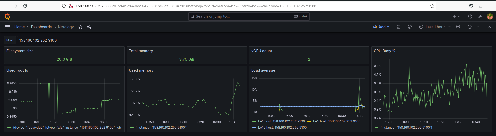

# Домашнее задание к занятию 14 «Средство визуализации Grafana»

## Задание повышенной сложности

**При решении задания 1** не используйте директорию [help](./help) для сборки проекта. Самостоятельно разверните grafana, где в роли источника данных будет выступать prometheus, а сборщиком данных будет node-exporter:

- grafana;
- prometheus-server;
- prometheus node-exporter.

За дополнительными материалами можете обратиться в официальную документацию grafana и prometheus.

В решении к домашнему заданию также приведите все конфигурации, скрипты, манифесты, которые вы 
использовали в процессе решения задания.

<details>
<summary>
Ответ
</summary>

[terraform](terraform)

[ansible](terraform%2Fansible)

</details>


**При решении задания 3** вы должны самостоятельно завести удобный для вас канал нотификации, например, Telegram или email, и отправить туда тестовые события.

В решении приведите скриншоты тестовых событий из каналов нотификаций.

<details>
<summary>
Ответ
</summary>


</details>


## Обязательные задания

### Задание 1

1. Используя директорию [help](./help) внутри этого домашнего задания, запустите связку prometheus-grafana.
1. Зайдите в веб-интерфейс grafana, используя авторизационные данные, указанные в манифесте docker-compose.
1. Подключите поднятый вами prometheus, как источник данных.
1. Решение домашнего задания — скриншот веб-интерфейса grafana со списком подключенных Datasource.

<details>
<summary>
Ответ
</summary>


</details>


## Задание 2

Изучите самостоятельно ресурсы:

1. [PromQL tutorial for beginners and humans](https://valyala.medium.com/promql-tutorial-for-beginners-9ab455142085).
1. [Understanding Machine CPU usage](https://www.robustperception.io/understanding-machine-cpu-usage).
1. [Introduction to PromQL, the Prometheus query language](https://grafana.com/blog/2020/02/04/introduction-to-promql-the-prometheus-query-language/).

Создайте Dashboard и в ней создайте Panels:

- утилизация CPU для nodeexporter (в процентах, 100-idle);
- CPULA 1/5/15;
- количество свободной оперативной памяти;
- количество места на файловой системе.

Для решения этого задания приведите promql-запросы для выдачи этих метрик, а также скриншот получившейся Dashboard.

<details>
<summary>
Ответ
</summary>


- утилизация CPU для nodeexporter (в процентах, 100-idle);

```text
100 - (avg by(instance) (rate(node_cpu_seconds_total{mode="idle", instance=~"$node"}[1m])) * 100)
```


- CPULA 1/5/15;

```text
A:
(avg by(instance) (node_load1{instance=~"$node"}) * 100) / count by(instance) (count by(cpu, instance) (node_cpu_seconds_total{instance=~"$node"}))

B:
(avg by(instance) (node_load5{instance=~"$node"}) * 100) / count by(instance) (count by(cpu, instance) (node_cpu_seconds_total{instance=~"$node"}))

C:
(avg by(instance) (node_load15{instance=~"$node"}) * 100) / count by(instance) (count by(cpu, instance) (node_cpu_seconds_total{instance=~"$node"}))
```

- количество свободной оперативной памяти;

```text
avg by (instance) (100 * ((avg_over_time(node_memory_MemFree_bytes{instance=~"$node"}[5m]) + avg_over_time(node_memory_Cached_bytes{instance=~"$node"}[5m]) + avg_over_time(node_memory_Buffers_bytes{instance=~"$node"}[5m])) / avg_over_time(node_memory_MemTotal_bytes{instance=~"$node"}[5m])))
```

- количество места на файловой системе.

```text
100 - (node_filesystem_avail_bytes{instance=~"$node",mountpoint="/"} * 100 / node_filesystem_size_bytes{instance=~"$node",mountpoint="/"})
```



</details>

## Задание 3

1. Создайте для каждой Dashboard подходящее правило alert — можно обратиться к первой лекции в блоке «Мониторинг».
1. В качестве решения задания приведите скриншот вашей итоговой Dashboard.

<details>
<summary>
Ответ
</summary>


</details>

## Задание 4

1. Сохраните ваш Dashboard.Для этого перейдите в настройки Dashboard, выберите в боковом меню «JSON MODEL». Далее скопируйте отображаемое json-содержимое в отдельный файл и сохраните его.
1. В качестве решения задания приведите листинг этого файла.


<details>
<summary>
Ответ
</summary>

[dashboard.json](dashboard.json)

```json
{
  "annotations": {
    "list": [
      {
        "builtIn": 1,
        "datasource": {
          "type": "grafana",
          "uid": "-- Grafana --"
        },
        "enable": true,
        "hide": true,
        "iconColor": "rgba(0, 211, 255, 1)",
        "name": "Annotations & Alerts",
        "type": "dashboard"
      }
    ]
  },
  "editable": true,
  "fiscalYearStartMonth": 0,
  "graphTooltip": 0,
  "id": 1,
  "links": [],
  "liveNow": false,
  "panels": [
    {
      "datasource": {
        "type": "prometheus",
        "uid": "cd627bcc-65db-4858-956a-f5d913d96007"
      },
      "fieldConfig": {
        "defaults": {
          "color": {
            "mode": "thresholds"
          },
          "mappings": [],
          "thresholds": {
            "mode": "absolute",
            "steps": [
              {
                "color": "green",
                "value": null
              }
            ]
          },
          "unit": "bytes"
        },
        "overrides": []
      },
      "gridPos": {
        "h": 2,
        "w": 6,
        "x": 0,
        "y": 0
      },
      "id": 9,
      "options": {
        "colorMode": "value",
        "graphMode": "none",
        "justifyMode": "auto",
        "orientation": "auto",
        "reduceOptions": {
          "calcs": [
            "lastNotNull"
          ],
          "fields": "",
          "values": false
        },
        "textMode": "auto"
      },
      "pluginVersion": "10.0.2",
      "targets": [
        {
          "datasource": {
            "type": "prometheus",
            "uid": "cd627bcc-65db-4858-956a-f5d913d96007"
          },
          "editorMode": "code",
          "expr": "avg by (instance) (node_filesystem_size_bytes{instance=~\"$node\",mountpoint=\"/\"})",
          "instant": false,
          "range": true,
          "refId": "A"
        }
      ],
      "title": "Filesystem size",
      "type": "stat"
    },
    {
      "datasource": {
        "type": "prometheus",
        "uid": "cd627bcc-65db-4858-956a-f5d913d96007"
      },
      "fieldConfig": {
        "defaults": {
          "color": {
            "mode": "thresholds"
          },
          "mappings": [],
          "thresholds": {
            "mode": "absolute",
            "steps": [
              {
                "color": "green",
                "value": null
              }
            ]
          },
          "unit": "bytes"
        },
        "overrides": []
      },
      "gridPos": {
        "h": 2,
        "w": 6,
        "x": 6,
        "y": 0
      },
      "id": 10,
      "options": {
        "colorMode": "value",
        "graphMode": "none",
        "justifyMode": "auto",
        "orientation": "auto",
        "reduceOptions": {
          "calcs": [
            "lastNotNull"
          ],
          "fields": "",
          "values": false
        },
        "textMode": "auto"
      },
      "pluginVersion": "10.0.2",
      "targets": [
        {
          "datasource": {
            "type": "prometheus",
            "uid": "cd627bcc-65db-4858-956a-f5d913d96007"
          },
          "editorMode": "code",
          "expr": "node_memory_MemTotal_bytes{instance=~\"$node\"}",
          "instant": false,
          "range": true,
          "refId": "A"
        }
      ],
      "title": "Total memory",
      "type": "stat"
    },
    {
      "datasource": {
        "type": "prometheus",
        "uid": "cd627bcc-65db-4858-956a-f5d913d96007"
      },
      "fieldConfig": {
        "defaults": {
          "color": {
            "mode": "thresholds"
          },
          "mappings": [],
          "thresholds": {
            "mode": "absolute",
            "steps": [
              {
                "color": "green",
                "value": null
              }
            ]
          },
          "unit": "none"
        },
        "overrides": []
      },
      "gridPos": {
        "h": 2,
        "w": 6,
        "x": 12,
        "y": 0
      },
      "id": 11,
      "options": {
        "colorMode": "value",
        "graphMode": "none",
        "justifyMode": "auto",
        "orientation": "auto",
        "reduceOptions": {
          "calcs": [
            "lastNotNull"
          ],
          "fields": "",
          "values": false
        },
        "textMode": "auto"
      },
      "pluginVersion": "10.0.2",
      "targets": [
        {
          "datasource": {
            "type": "prometheus",
            "uid": "cd627bcc-65db-4858-956a-f5d913d96007"
          },
          "editorMode": "code",
          "expr": "count(count(node_cpu_seconds_total{instance=~\"$node\"}) by (cpu))",
          "instant": false,
          "range": true,
          "refId": "A"
        }
      ],
      "title": "vCPU count",
      "type": "stat"
    },
    {
      "datasource": {
        "type": "prometheus",
        "uid": "cd627bcc-65db-4858-956a-f5d913d96007"
      },
      "fieldConfig": {
        "defaults": {
          "color": {
            "mode": "palette-classic"
          },
          "custom": {
            "axisCenteredZero": false,
            "axisColorMode": "text",
            "axisLabel": "",
            "axisPlacement": "auto",
            "barAlignment": 0,
            "drawStyle": "line",
            "fillOpacity": 0,
            "gradientMode": "none",
            "hideFrom": {
              "legend": false,
              "tooltip": false,
              "viz": false
            },
            "lineInterpolation": "linear",
            "lineWidth": 1,
            "pointSize": 5,
            "scaleDistribution": {
              "type": "linear"
            },
            "showPoints": "auto",
            "spanNulls": false,
            "stacking": {
              "group": "A",
              "mode": "none"
            },
            "thresholdsStyle": {
              "mode": "off"
            }
          },
          "mappings": [],
          "thresholds": {
            "mode": "absolute",
            "steps": [
              {
                "color": "green",
                "value": null
              },
              {
                "color": "red",
                "value": 80
              }
            ]
          },
          "unit": "percent"
        },
        "overrides": []
      },
      "gridPos": {
        "h": 9,
        "w": 6,
        "x": 18,
        "y": 0
      },
      "id": 1,
      "options": {
        "legend": {
          "calcs": [],
          "displayMode": "list",
          "placement": "bottom",
          "showLegend": true
        },
        "tooltip": {
          "mode": "single",
          "sort": "none"
        }
      },
      "pluginVersion": "10.0.2",
      "targets": [
        {
          "datasource": {
            "type": "prometheus",
            "uid": "cd627bcc-65db-4858-956a-f5d913d96007"
          },
          "editorMode": "code",
          "expr": "100 - (avg by(instance) (rate(node_cpu_seconds_total{mode=\"idle\", instance=~\"$node\"}[1m])) * 100)",
          "hide": false,
          "instant": false,
          "range": true,
          "refId": "A"
        }
      ],
      "title": "CPU Busy %",
      "type": "timeseries"
    },
    {
      "datasource": {
        "type": "prometheus",
        "uid": "cd627bcc-65db-4858-956a-f5d913d96007"
      },
      "fieldConfig": {
        "defaults": {
          "color": {
            "mode": "palette-classic"
          },
          "custom": {
            "axisCenteredZero": false,
            "axisColorMode": "text",
            "axisLabel": "",
            "axisPlacement": "auto",
            "barAlignment": 0,
            "drawStyle": "line",
            "fillOpacity": 0,
            "gradientMode": "none",
            "hideFrom": {
              "legend": false,
              "tooltip": false,
              "viz": false
            },
            "lineInterpolation": "linear",
            "lineWidth": 1,
            "pointSize": 5,
            "scaleDistribution": {
              "type": "linear"
            },
            "showPoints": "auto",
            "spanNulls": false,
            "stacking": {
              "group": "A",
              "mode": "none"
            },
            "thresholdsStyle": {
              "mode": "off"
            }
          },
          "mappings": [],
          "thresholds": {
            "mode": "absolute",
            "steps": [
              {
                "color": "green",
                "value": null
              },
              {
                "color": "red",
                "value": 80
              }
            ]
          },
          "unit": "percent"
        },
        "overrides": []
      },
      "gridPos": {
        "h": 7,
        "w": 6,
        "x": 0,
        "y": 2
      },
      "id": 8,
      "options": {
        "legend": {
          "calcs": [],
          "displayMode": "list",
          "placement": "bottom",
          "showLegend": true
        },
        "tooltip": {
          "mode": "single",
          "sort": "none"
        }
      },
      "targets": [
        {
          "datasource": {
            "type": "prometheus",
            "uid": "cd627bcc-65db-4858-956a-f5d913d96007"
          },
          "editorMode": "code",
          "expr": "100 - (node_filesystem_avail_bytes{instance=~\"$node\",mountpoint=\"/\"} * 100 / node_filesystem_size_bytes{instance=~\"$node\",mountpoint=\"/\"})",
          "instant": false,
          "range": true,
          "refId": "A"
        }
      ],
      "title": "Used root fs",
      "type": "timeseries"
    },
    {
      "datasource": {
        "type": "prometheus",
        "uid": "cd627bcc-65db-4858-956a-f5d913d96007"
      },
      "fieldConfig": {
        "defaults": {
          "color": {
            "mode": "palette-classic"
          },
          "custom": {
            "axisCenteredZero": false,
            "axisColorMode": "text",
            "axisLabel": "",
            "axisPlacement": "auto",
            "barAlignment": 0,
            "drawStyle": "line",
            "fillOpacity": 0,
            "gradientMode": "none",
            "hideFrom": {
              "legend": false,
              "tooltip": false,
              "viz": false
            },
            "lineInterpolation": "linear",
            "lineWidth": 1,
            "pointSize": 5,
            "scaleDistribution": {
              "type": "linear"
            },
            "showPoints": "auto",
            "spanNulls": false,
            "stacking": {
              "group": "A",
              "mode": "none"
            },
            "thresholdsStyle": {
              "mode": "off"
            }
          },
          "mappings": [],
          "thresholds": {
            "mode": "absolute",
            "steps": [
              {
                "color": "green",
                "value": null
              },
              {
                "color": "red",
                "value": 80
              }
            ]
          },
          "unit": "percent"
        },
        "overrides": []
      },
      "gridPos": {
        "h": 7,
        "w": 6,
        "x": 6,
        "y": 2
      },
      "id": 7,
      "options": {
        "legend": {
          "calcs": [],
          "displayMode": "list",
          "placement": "bottom",
          "showLegend": true
        },
        "tooltip": {
          "mode": "single",
          "sort": "none"
        }
      },
      "targets": [
        {
          "datasource": {
            "type": "prometheus",
            "uid": "cd627bcc-65db-4858-956a-f5d913d96007"
          },
          "editorMode": "code",
          "expr": "avg by (instance) (100 * ((avg_over_time(node_memory_MemFree_bytes{instance=~\"$node\"}[5m]) + avg_over_time(node_memory_Cached_bytes{instance=~\"$node\"}[5m]) + avg_over_time(node_memory_Buffers_bytes{instance=~\"$node\"}[5m])) / avg_over_time(node_memory_MemTotal_bytes{instance=~\"$node\"}[5m])))",
          "instant": false,
          "range": true,
          "refId": "A"
        }
      ],
      "title": "Used memory",
      "type": "timeseries"
    },
    {
      "datasource": {
        "type": "prometheus",
        "uid": "cd627bcc-65db-4858-956a-f5d913d96007"
      },
      "fieldConfig": {
        "defaults": {
          "color": {
            "mode": "palette-classic"
          },
          "custom": {
            "axisCenteredZero": false,
            "axisColorMode": "text",
            "axisLabel": "",
            "axisPlacement": "auto",
            "barAlignment": 0,
            "drawStyle": "line",
            "fillOpacity": 0,
            "gradientMode": "none",
            "hideFrom": {
              "legend": false,
              "tooltip": false,
              "viz": false
            },
            "lineInterpolation": "linear",
            "lineStyle": {
              "fill": "solid"
            },
            "lineWidth": 1,
            "pointSize": 5,
            "scaleDistribution": {
              "type": "linear"
            },
            "showPoints": "auto",
            "spanNulls": false,
            "stacking": {
              "group": "A",
              "mode": "none"
            },
            "thresholdsStyle": {
              "mode": "off"
            }
          },
          "mappings": [],
          "thresholds": {
            "mode": "absolute",
            "steps": [
              {
                "color": "green",
                "value": null
              },
              {
                "color": "red",
                "value": 80
              }
            ]
          },
          "unit": "percent"
        },
        "overrides": []
      },
      "gridPos": {
        "h": 7,
        "w": 6,
        "x": 12,
        "y": 2
      },
      "id": 6,
      "options": {
        "legend": {
          "calcs": [],
          "displayMode": "list",
          "placement": "bottom",
          "showLegend": true
        },
        "tooltip": {
          "mode": "single",
          "sort": "asc"
        }
      },
      "targets": [
        {
          "datasource": {
            "type": "prometheus",
            "uid": "cd627bcc-65db-4858-956a-f5d913d96007"
          },
          "editorMode": "code",
          "exemplar": false,
          "expr": "(avg by(instance) (node_load1{instance=~\"$node\"}) * 100) / count by(instance) (count by(cpu, instance) (node_cpu_seconds_total{instance=~\"$node\"}))",
          "hide": false,
          "instant": false,
          "interval": "",
          "legendFormat": "LA1 host: {{instance}}",
          "range": true,
          "refId": "A"
        },
        {
          "datasource": {
            "type": "prometheus",
            "uid": "cd627bcc-65db-4858-956a-f5d913d96007"
          },
          "editorMode": "code",
          "expr": "(avg by(instance) (node_load5{instance=~\"$node\"}) * 100) / count by(instance) (count by(cpu, instance) (node_cpu_seconds_total{instance=~\"$node\"}))",
          "hide": false,
          "instant": false,
          "legendFormat": "LA5 host: {{instance}}",
          "range": true,
          "refId": "B"
        },
        {
          "datasource": {
            "type": "prometheus",
            "uid": "cd627bcc-65db-4858-956a-f5d913d96007"
          },
          "editorMode": "code",
          "expr": "(avg by(instance) (node_load15{instance=~\"$node\"}) * 100) / count by(instance) (count by(cpu, instance) (node_cpu_seconds_total{instance=~\"$node\"}))",
          "hide": false,
          "instant": false,
          "legendFormat": "LA15 host: {{instance}}",
          "range": true,
          "refId": "C"
        }
      ],
      "title": "Load average",
      "type": "timeseries"
    }
  ],
  "refresh": "",
  "schemaVersion": 38,
  "style": "dark",
  "tags": [],
  "templating": {
    "list": [
      {
        "current": {
          "selected": true,
          "text": [
            "158.160.102.252:9100"
          ],
          "value": [
            "158.160.102.252:9100"
          ]
        },
        "datasource": {
          "type": "prometheus",
          "uid": "cd627bcc-65db-4858-956a-f5d913d96007"
        },
        "definition": "label_values(node_exporter_build_info,instance)",
        "hide": 0,
        "includeAll": true,
        "label": "Host",
        "multi": true,
        "name": "node",
        "options": [],
        "query": {
          "query": "label_values(node_exporter_build_info,instance)",
          "refId": "PrometheusVariableQueryEditor-VariableQuery"
        },
        "refresh": 1,
        "regex": "",
        "skipUrlSync": false,
        "sort": 0,
        "type": "query"
      }
    ]
  },
  "time": {
    "from": "now-1h",
    "to": "now"
  },
  "timepicker": {
    "hidden": false
  },
  "timezone": "",
  "title": "Netology",
  "uid": "bd4b2f44-dec3-4753-81be-2fe0318479c0",
  "version": 12,
  "weekStart": ""
}
```

</details>

---
