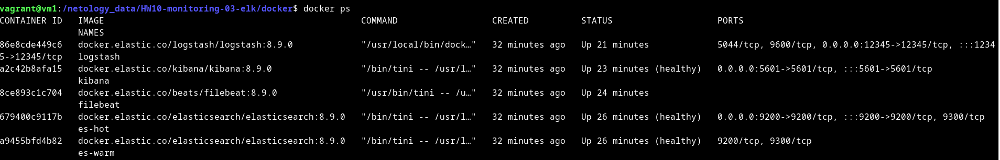

# Домашнее задание к занятию 15 «Система сбора логов Elastic Stack»

## Дополнительные ссылки

При выполнении задания используйте дополнительные ресурсы:

- [поднимаем elk в docker](https://www.elastic.co/guide/en/elastic-stack-get-started/current/get-started-docker.html);
- [поднимаем elk в docker с filebeat и docker-логами](https://www.sarulabs.com/post/5/2019-08-12/sending-docker-logs-to-elasticsearch-and-kibana-with-filebeat.html);
- [конфигурируем logstash](https://www.elastic.co/guide/en/logstash/current/configuration.html);
- [плагины filter для logstash](https://www.elastic.co/guide/en/logstash/current/filter-plugins.html);
- [конфигурируем filebeat](https://www.elastic.co/guide/en/beats/libbeat/5.3/config-file-format.html);
- [привязываем индексы из elastic в kibana](https://www.elastic.co/guide/en/kibana/current/index-patterns.html);
- [как просматривать логи в kibana](https://www.elastic.co/guide/en/kibana/current/discover.html);
- [решение ошибки increase vm.max_map_count elasticsearch](https://stackoverflow.com/questions/42889241/how-to-increase-vm-max-map-count).

В процессе выполнения в зависимости от системы могут также возникнуть не указанные здесь проблемы.

Используйте output stdout filebeat/kibana и api elasticsearch для изучения корня проблемы и её устранения.

## Задание повышенной сложности

Не используйте директорию [help](./help) при выполнении домашнего задания.

## Задание 1

Вам необходимо поднять в докере и связать между собой:

- elasticsearch (hot и warm ноды);
- logstash;
- kibana;
- filebeat.

Logstash следует сконфигурировать для приёма по tcp json-сообщений.

Filebeat следует сконфигурировать для отправки логов docker вашей системы в logstash.

В директории [help](./help) находится манифест docker-compose и конфигурации filebeat/logstash для быстрого 
выполнения этого задания.

Результатом выполнения задания должны быть:

- скриншот `docker ps` через 5 минут после старта всех контейнеров (их должно быть 5);
- скриншот интерфейса kibana;
- docker-compose манифест (если вы не использовали директорию help);
- ваши yml-конфигурации для стека (если вы не использовали директорию help).

<details>
<summary>
Ответ
</summary>

- скриншот `docker ps` через 5 минут после старта всех контейнеров (их должно быть 5):



- скриншот интерфейса kibana:


- docker-compose манифест:

[docker-compose.yml](docker%2Fdocker-compose.yml)

```yaml
version: "2.2"

services:
  setup:
    image: docker.elastic.co/elasticsearch/elasticsearch:8.9.0
    volumes:
      - certs:/usr/share/elasticsearch/config/certs
    user: "0"
    command: >
      bash -c '
        if [ x${ELASTIC_PASSWORD} == x ]; then
          echo "Set the ELASTIC_PASSWORD environment variable in the .env file";
          exit 1;
        elif [ x${KIBANA_PASSWORD} == x ]; then
          echo "Set the KIBANA_PASSWORD environment variable in the .env file";
          exit 1;
        fi;
        if [ ! -f config/certs/ca.zip ]; then
          echo "Creating CA";
          bin/elasticsearch-certutil ca --silent --pem -out config/certs/ca.zip;
          unzip config/certs/ca.zip -d config/certs;
        fi;
        if [ ! -f config/certs/certs.zip ]; then
          echo "Creating certs";
          echo -ne \
          "instances:\n"\
          "  - name: es-hot\n"\
          "    dns:\n"\
          "      - es-hot\n"\
          "      - localhost\n"\
          "    ip:\n"\
          "      - 127.0.0.1\n"\
          "  - name: es-warm\n"\
          "    dns:\n"\
          "      - es-warm\n"\
          "      - localhost\n"\
          "    ip:\n"\
          "      - 127.0.0.1\n"\
          > config/certs/instances.yml;
          bin/elasticsearch-certutil cert --silent --pem -out config/certs/certs.zip --in config/certs/instances.yml --ca-cert config/certs/ca/ca.crt --ca-key config/certs/ca/ca.key;
          unzip config/certs/certs.zip -d config/certs;
        fi;
        echo "Setting file permissions"
        chown -R root:root config/certs;
        find . -type d -exec chmod 750 \{\} \;;
        find . -type f -exec chmod 640 \{\} \;;
        echo "Waiting for Elasticsearch availability";
        until curl -s --cacert config/certs/ca/ca.crt https://es-hot:9200 | grep -q "missing authentication credentials"; do sleep 30; done;
        echo "Setting kibana_system password";
        until curl -s -X POST --cacert config/certs/ca/ca.crt -u "elastic:${ELASTIC_PASSWORD}" -H "Content-Type: application/json" https://es-hot:9200/_security/user/kibana_system/_password -d "{\"password\":\"${KIBANA_PASSWORD}\"}" | grep -q "^{}"; do sleep 10; done;
        echo "All done!";
      '
    healthcheck:
      test: ["CMD-SHELL", "[ -f config/certs/es-hot/es-hot.crt ]"]
      interval: 1s
      timeout: 5s
      retries: 120

  es-hot:
    depends_on:
      setup:
        condition: service_healthy
    image: docker.elastic.co/elasticsearch/elasticsearch:${STACK_VERSION}
    container_name: es-hot
    environment:
      - node.name=es-hot
      - cluster.name=${CLUSTER_NAME}
      - cluster.initial_master_nodes=es-hot,es-warm
      - discovery.seed_hosts=es-hot,es-warm
      - node.roles=master,data_content,data_hot
      - bootstrap.memory_lock=true
      - ELASTIC_USERNAME=elastic
      - ELASTIC_PASSWORD=${ELASTIC_PASSWORD}
      - "ES_JAVA_OPTS=-Xms512m -Xmx512m"
      - "http.host=0.0.0.0"
      - xpack.security.enabled=true
      - xpack.security.http.ssl.enabled=true
      - xpack.security.http.ssl.key=certs/es-hot/es-hot.key
      - xpack.security.http.ssl.certificate=certs/es-hot/es-hot.crt
      - xpack.security.http.ssl.certificate_authorities=certs/ca/ca.crt
      - xpack.security.transport.ssl.enabled=true
      - xpack.security.transport.ssl.key=certs/es-hot/es-hot.key
      - xpack.security.transport.ssl.certificate=certs/es-hot/es-hot.crt
      - xpack.security.transport.ssl.certificate_authorities=certs/ca/ca.crt
      - xpack.security.transport.ssl.verification_mode=certificate
      - xpack.license.self_generated.type=${LICENSE}
    volumes:
      - certs:/usr/share/elasticsearch/config/certs
      - esdata01:/usr/share/elasticsearch
    mem_limit: ${MEM_LIMIT}
    ulimits:
      memlock:
        soft: -1
        hard: -1
    ports:
      - ${ES_PORT}:9200
    networks:
      - default
    healthcheck:
      test:
        [
          "CMD-SHELL",
          "curl -s --cacert config/certs/ca/ca.crt https://localhost:9200 | grep -q 'missing authentication credentials'",
        ]
      interval: 10s
      timeout: 10s
      retries: 120

  es-warm:
    depends_on:
      setup:
        condition: service_healthy
    image: docker.elastic.co/elasticsearch/elasticsearch:${STACK_VERSION}
    container_name: es-warm
    environment:
      - node.name=es-warm
      - cluster.name=${CLUSTER_NAME}
      - cluster.initial_master_nodes=es-hot,es-warm
      - discovery.seed_hosts=es-hot,es-warm
      - node.roles=master,data_warm
      - ELASTIC_USERNAME=elastic
      - ELASTIC_PASSWORD=${ELASTIC_PASSWORD}
      - "ES_JAVA_OPTS=-Xms512m -Xmx512m"
      - "http.host=0.0.0.0"
      - xpack.security.enabled=true
      - xpack.security.http.ssl.enabled=true
      - xpack.security.http.ssl.key=certs/es-warm/es-warm.key
      - xpack.security.http.ssl.certificate=certs/es-warm/es-warm.crt
      - xpack.security.http.ssl.certificate_authorities=certs/ca/ca.crt
      - xpack.security.transport.ssl.enabled=true
      - xpack.security.transport.ssl.key=certs/es-warm/es-warm.key
      - xpack.security.transport.ssl.certificate=certs/es-warm/es-warm.crt
      - xpack.security.transport.ssl.certificate_authorities=certs/ca/ca.crt
      - xpack.security.transport.ssl.verification_mode=certificate
      - xpack.license.self_generated.type=${LICENSE}
    volumes:
      - certs:/usr/share/elasticsearch/config/certs
      - esdata02:/usr/share/elasticsearch/data
    mem_limit: ${MEM_LIMIT}
    ulimits:
      memlock:
        soft: -1
        hard: -1
    networks:
      - default
    healthcheck:
      test:
        [
          "CMD-SHELL",
          "curl -s --cacert config/certs/ca/ca.crt https://localhost:9200 | grep -q 'missing authentication credentials'",
        ]
      interval: 10s
      timeout: 10s
      retries: 120

  kibana:
    depends_on:
      es-hot:
        condition: service_healthy
      es-warm:
        condition: service_healthy
    image: docker.elastic.co/kibana/kibana:${STACK_VERSION}
    container_name: kibana
    volumes:
      - certs:/usr/share/kibana/config/certs
      - kibanadata:/usr/share/kibana/data
    ports:
      - ${KIBANA_PORT}:5601
    environment:
#      - SERVERNAME=kibana
      - ELASTICSEARCH_URL=https://es-hot:9200
      - ELASTICSEARCH_HOSTS=["https://es-hot:9200","https://es-warm:9200"]
      - ELASTICSEARCH_USERNAME=kibana_system
      - ELASTICSEARCH_PASSWORD=${KIBANA_PASSWORD}
      - ELASTICSEARCH_SSL_CERTIFICATEAUTHORITIES=config/certs/ca/ca.crt
    mem_limit: ${MEM_LIMIT}
    networks:
      - default
    healthcheck:
      test:
        [
          "CMD-SHELL",
          "curl -s -I http://localhost:5601 | grep -q 'HTTP/1.1 302 Found'",
        ]
      interval: 10s
      timeout: 10s
      retries: 120

  logstash:
    image: docker.elastic.co/logstash/logstash:${STACK_VERSION}
    container_name: logstash
    user: root
    volumes:
      - certs:/usr/share/logstash/certs
      - logstashdata:/usr/share/logstash/data
      - ./logstash/pipeline/:/usr/share/logstash/pipeline/:ro
      - ./logstash/settings/logstash.yml:/usr/share/logstash/config/logstash.yml
    ports:
      - 12345:12345
    depends_on:
      es-hot:
        condition: service_healthy
      es-warm:
        condition: service_healthy
      kibana:
        condition: service_healthy
    environment:
      - "LS_JAVA_OPTS=-Xmx512m -Xms512m"
      - xpack.monitoring.enabled=false
      - ELASTIC_USER=elastic
      - ELASTIC_PASSWORD=${ELASTIC_PASSWORD}
      - ELASTIC_HOSTS=https://es-hot:9200
    networks:
      - default

  filebeat:
    depends_on:
     es-hot:
       condition: service_healthy
    image: docker.elastic.co/beats/filebeat:${STACK_VERSION}
    container_name: filebeat
    privileged: true
    user: root
    command: filebeat -e -strict.perms=false
    volumes:
      - certs:/usr/share/filebeat/certs
      - filebeatdata:/usr/share/filebeat/data
      - "./filebeat/filebeat.yml:/usr/share/filebeat/filebeat.yml"
      - /var/lib/docker:/var/lib/docker:ro
      - /var/run/docker.sock:/var/run/docker.sock:ro
    environment:
      - ELASTIC_USER=elastic
      - ELASTIC_PASSWORD=${ELASTIC_PASSWORD}
      - ELASTIC_HOSTS=https://es-hot:9200
      - KIBANA_HOSTS=http://kibana:5601
      - LOGSTASH_HOSTS=http://logstash:9600
    networks:
      - default

  some_application:
    image: library/python:3.9-alpine
    container_name: some_app
    volumes:
      - ./pinger/:/opt/
    entrypoint: python3 /opt/run.py

volumes:
  certs:
    driver: local
  esdata01:
    driver: local
  esdata02:
    driver: local
  kibanadata:
    driver: local
  logstashdata:
    driver: local
  filebeatdata:
    driver: local

networks:
  default:
    driver: bridge

```

- yml-конфигурации для стека:

[logstash.conf](docker%2Flogstash%2Fpipeline%2Flogstash.conf)

```
input {
#   tcp {
#     port => 12345
#     codec => json
#   }
  beats {
    port => 12345
  }
}
filter{
    json{
        source => "message"
    }
}
output {
  elasticsearch {
    index => "logstash-%{+YYYY.MM.dd}"
    hosts=> "${ELASTIC_HOSTS}"
    user=> "${ELASTIC_USER}"
    password=> "${ELASTIC_PASSWORD}"
    cacert=> "certs/ca/ca.crt"
  }
  stdout { codec => rubydebug }
}
```

[logstash.yml](docker%2Flogstash%2Fsettings%2Flogstash.yml)

```yaml
http.host: 0.0.0.0
xpack.monitoring.enabled: false
```

[filebeat.yml](docker%2Ffilebeat%2Ffilebeat.yml)

```yaml
filebeat.inputs:
  - type: container
    paths:
      - '/var/lib/docker/containers/*/*.log'

processors:
  - add_docker_metadata:
      host: "unix:///var/run/docker.sock"

  - decode_json_fields:
      fields: ["message"]
      target: "json"
      overwrite_keys: true

output.logstash:
  hosts: ["logstash:12345"]
  protocol: tcp

logging.json: true
logging.metrics.enabled: false
```

.env

```
# Password for the 'elastic' user (at least 6 characters)
ELASTIC_PASSWORD=password

# Password for the 'kibana_system' user (at least 6 characters)
KIBANA_PASSWORD=password

# Version of Elastic products
STACK_VERSION=8.9.0

# Set the cluster name
CLUSTER_NAME=docker-cluster

# Set to 'basic' or 'trial' to automatically start the 30-day trial
LICENSE=basic

# Port to expose Elasticsearch HTTP API to the host
ES_PORT=9200

# Port to expose Kibana to the host
KIBANA_PORT=5601

# Increase or decrease based on the available host memory (in bytes)
MEM_LIMIT=1073741824

```

</details>


## Задание 2

Перейдите в меню [создания index-patterns  в kibana](http://localhost:5601/app/management/kibana/indexPatterns/create) и создайте несколько index-patterns из имеющихся.

<details>
<summary>

</summary>


</details>

Перейдите в меню просмотра логов в kibana (Discover) и самостоятельно изучите, как отображаются логи и как производить поиск по логам.

<details>
<summary>

</summary>


</details>

В манифесте директории help также приведенно dummy-приложение, которое генерирует рандомные события в stdout-контейнера.
Эти логи должны порождать индекс logstash-* в elasticsearch. Если этого индекса нет — воспользуйтесь советами и источниками из раздела «Дополнительные ссылки» этого задания.
 
<details>
<summary>

</summary>


</details>

---


 
