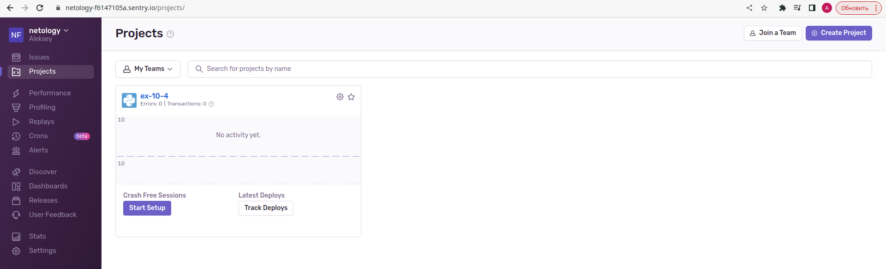
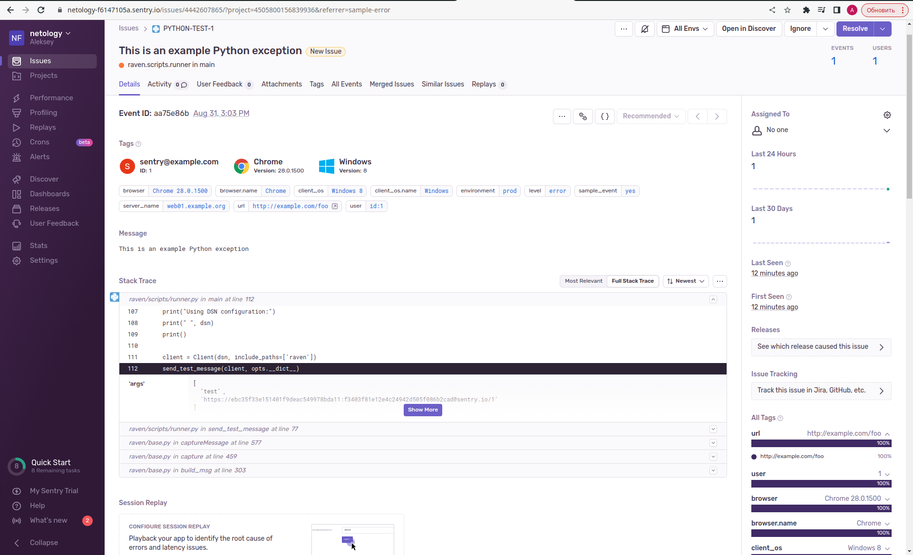
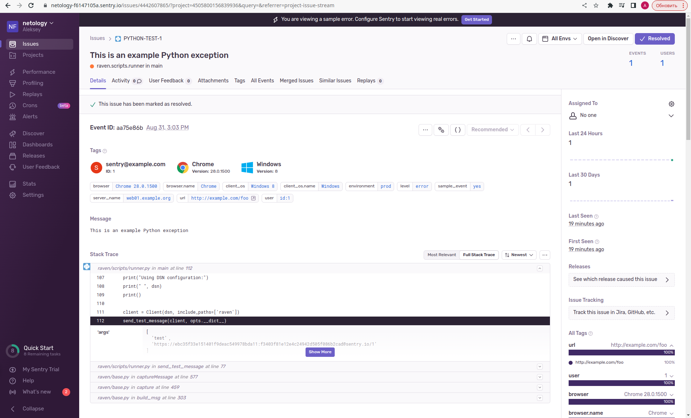
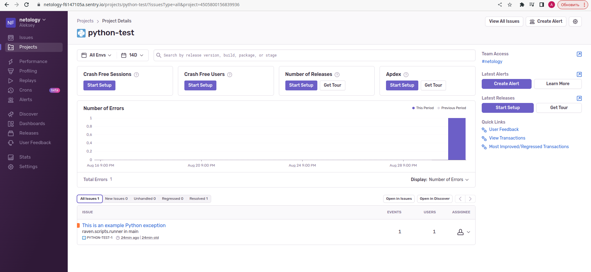
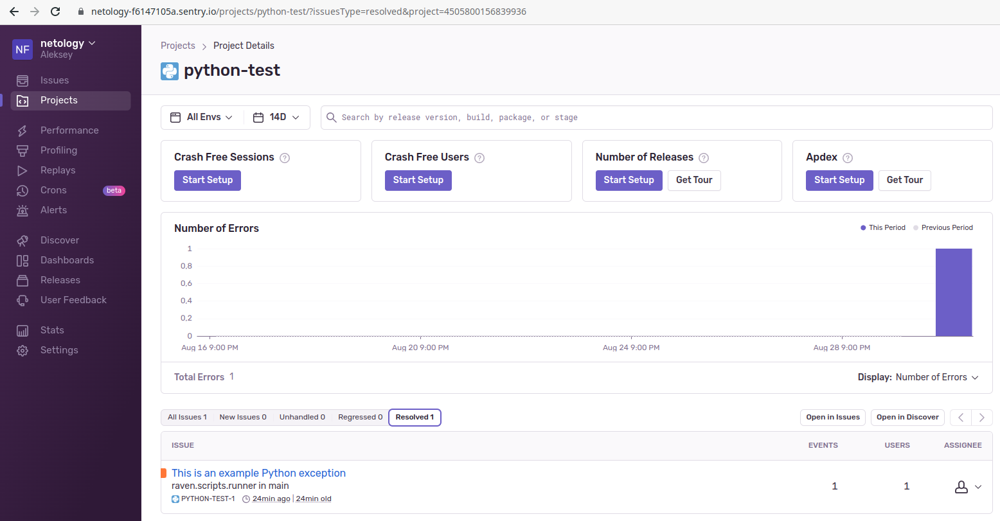
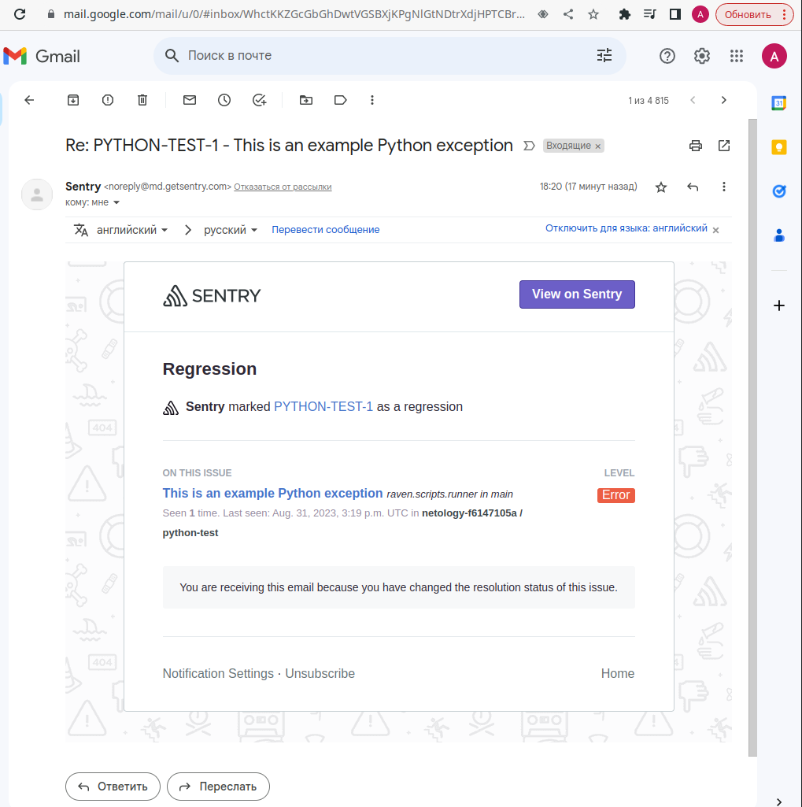
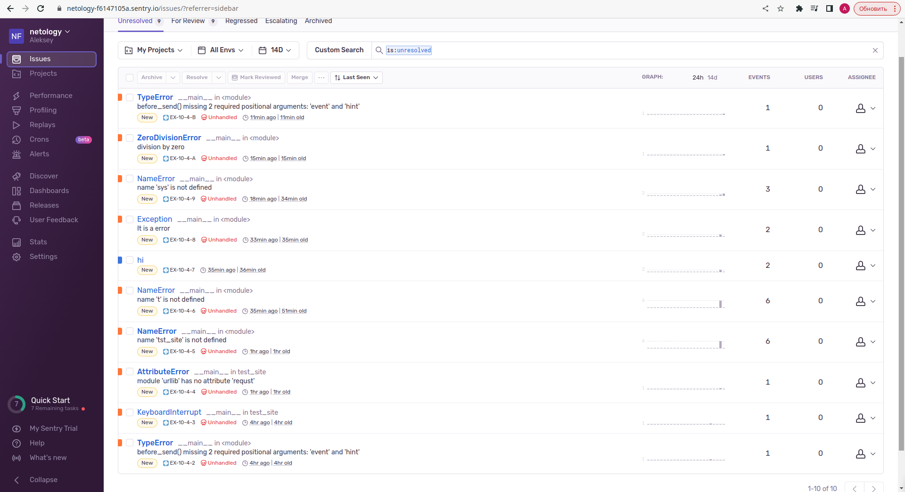
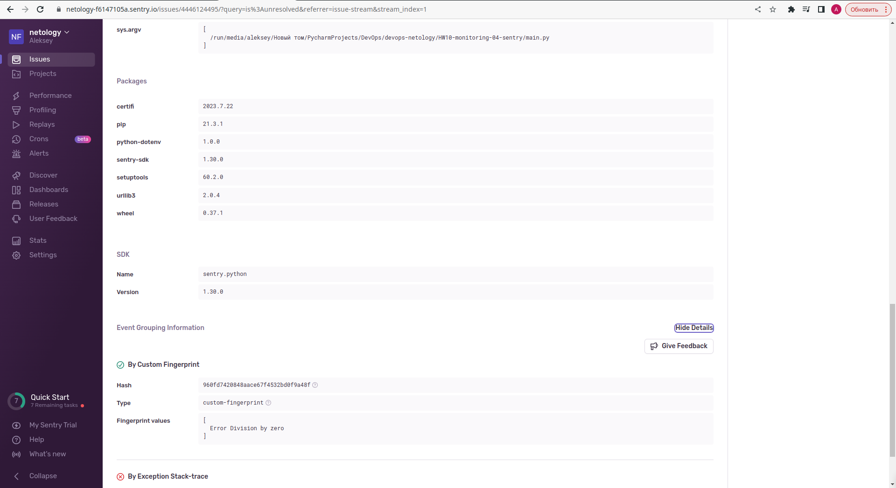
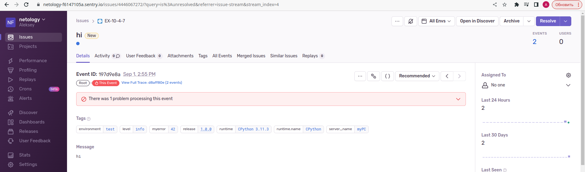
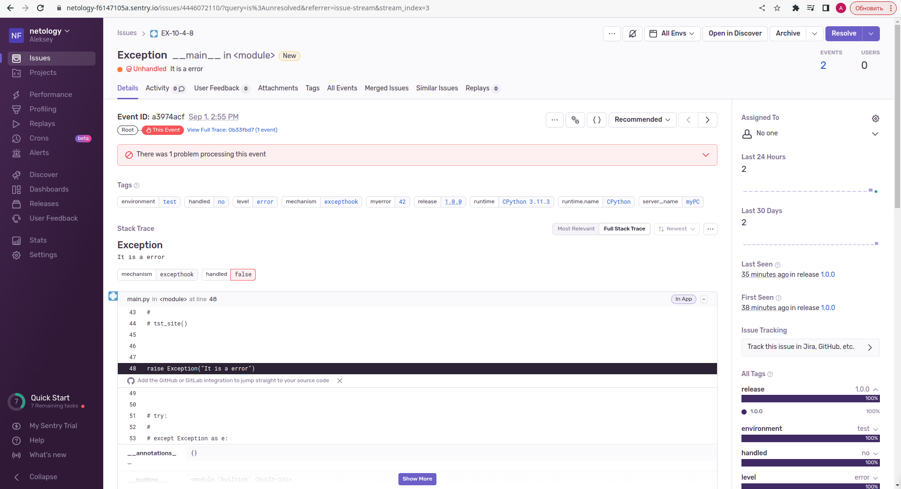

# Домашнее задание к занятию 16 «Платформа мониторинга Sentry»

## Задание 1

Так как Self-Hosted Sentry довольно требовательная к ресурсам система, мы будем использовать Free Сloud account.

Free Cloud account имеет ограничения:

- 5 000 errors;
- 10 000 transactions;
- 1 GB attachments.

Для подключения Free Cloud account:

- зайдите на sentry.io;
- нажмите «Try for free»;
- используйте авторизацию через ваш GitHub-аккаунт;
- далее следуйте инструкциям.

В качестве решения задания пришлите скриншот меню Projects.

<details>
<summary>
Решение
</summary>



</details>

## Задание 2

1. Создайте python-проект и нажмите `Generate sample event` для генерации тестового события.
2. Изучите информацию, представленную в событии.
3. Перейдите в список событий проекта, выберите созданное вами и нажмите `Resolved`.
4. В качестве решения задание предоставьте скриншот `Stack trace` из этого события и список событий проекта после нажатия `Resolved`.

<details>
<summary>
Решение
</summary>









</details>

## Задание 3

1. Перейдите в создание правил алёртинга.
2. Выберите проект и создайте дефолтное правило алёртинга без настройки полей.
3. Снова сгенерируйте событие `Generate sample event`.
Если всё было выполнено правильно — через некоторое время вам на почту, привязанную к GitHub-аккаунту, придёт оповещение о произошедшем событии.
4. Если сообщение не пришло — проверьте настройки аккаунта Sentry (например, привязанную почту), что у вас не было 
`sample issue` до того, как вы его сгенерировали, и то, что правило алёртинга выставлено по дефолту (во всех полях all).
Также проверьте проект, в котором вы создаёте событие — возможно алёрт привязан к другому.
5. В качестве решения задания пришлите скриншот тела сообщения из оповещения на почте.
6. Дополнительно поэкспериментируйте с правилами алёртинга. Выбирайте разные условия отправки и создавайте sample events. 

<details>
<summary>
Решение
</summary>



</details>

## Задание повышенной сложности

1. Создайте проект на ЯП Python или GO (около 10–20 строк), подключите к нему sentry SDK и отправьте несколько тестовых событий.
2. Поэкспериментируйте с различными передаваемыми параметрами, но помните об ограничениях Free учётной записи Cloud Sentry.
3. В качестве решения задания пришлите скриншот меню issues вашего проекта и пример кода подключения sentry sdk/отсылки событий.

<details>
<summary>
Решение
</summary>

[main.py](main.py)

```python
import sentry_sdk
from os import getenv
from dotenv import load_dotenv, find_dotenv


def before_send(event, hint):
    if 'exc_info' in hint:
        exc_type, exc_value, tb = hint['exc_info']
        if isinstance(exc_value, ZeroDivisionError):
            event['fingerprint'] = ['Error Division by zero']
    return event

load_dotenv(find_dotenv())

print(getenv("SENTRY_DSN"))

sentry_sdk.init(
    dsn=getenv("SENTRY_DSN"),
    # Set traces_sample_rate to 1.0 to capture 100%
    # of transactions for performance monitoring.
    # We recommend adjusting this value in production.
    traces_sample_rate=1.0,
    # Set profiles_sample_rate to 1.0 to profile 100%
    # of sampled transactions.
    # We recommend adjusting this value in production.
    profiles_sample_rate=1.0,
    environment="test",
    release="py_script@1.0.0",
    before_send=before_send,
)

sentry_sdk.set_tag("myerror", 42)

my_err = int(input('Введите номер ошибки от 0 до 5:'))

match my_err:
    case 0:
        sentry_sdk.capture_message("hi")
    case 1:
        raise Exception("It is a error")
    case 2:
        print(test_fn)
    case 3:
        division_by_zero = 1 / 0
    case 4:
        sentry_sdk.capture_mssage("hi")
    case 5:
        before_send()

```









</details>

---
