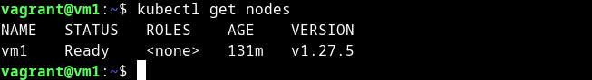

# Домашнее задание к занятию «Kubernetes. Причины появления. Команда kubectl»

### Цель задания

Для экспериментов и валидации ваших решений вам нужно подготовить тестовую среду для работы с Kubernetes. Оптимальное решение — развернуть на рабочей машине или на отдельной виртуальной машине MicroK8S.

------

### Чеклист готовности к домашнему заданию

1. Личный компьютер с ОС Linux или MacOS 

или

2. ВМ c ОС Linux в облаке либо ВМ на локальной машине для установки MicroK8S  

------

### Инструкция к заданию

1. Установка MicroK8S:
    - sudo apt update,
    - sudo apt install snapd,
    - sudo snap install microk8s --classic,
    - добавить локального пользователя в группу `sudo usermod -a -G microk8s $USER`,
    - изменить права на папку с конфигурацией `sudo chown -f -R $USER ~/.kube`.

2. Полезные команды:
    - проверить статус `microk8s status --wait-ready`;
    - подключиться к microK8s и получить информацию можно через команду `microk8s command`, например, `microk8s kubectl get nodes`;
    - включить addon можно через команду `microk8s enable`; 
    - список addon `microk8s status`;
    - вывод конфигурации `microk8s config`;
    - проброс порта для подключения локально `microk8s kubectl port-forward -n kube-system service/kubernetes-dashboard 10443:443`.

3. Настройка внешнего подключения:
    - отредактировать файл /var/snap/microk8s/current/certs/csr.conf.template
    ```shell
    # [ alt_names ]
    # Add
    # IP.4 = 123.45.67.89
    ```
    - обновить сертификаты `sudo microk8s refresh-certs --cert front-proxy-client.crt`.

4. Установка kubectl:
    - curl -LO https://storage.googleapis.com/kubernetes-release/release/`curl -s https://storage.googleapis.com/kubernetes-release/release/stable.txt`/bin/linux/amd64/kubectl;
    - chmod +x ./kubectl;
    - sudo mv ./kubectl /usr/local/bin/kubectl;
    - настройка автодополнения в текущую сессию `bash source <(kubectl completion bash)`;
    - добавление автодополнения в командную оболочку bash `echo "source <(kubectl completion bash)" >> ~/.bashrc`.

------

### Инструменты и дополнительные материалы, которые пригодятся для выполнения задания

1. [Инструкция](https://microk8s.io/docs/getting-started) по установке MicroK8S.
2. [Инструкция](https://kubernetes.io/ru/docs/reference/kubectl/cheatsheet/#bash) по установке автодополнения **kubectl**.
3. [Шпаргалка](https://kubernetes.io/ru/docs/reference/kubectl/cheatsheet/) по **kubectl**.

------

### Задание 1. Установка MicroK8S

1. Установить MicroK8S на локальную машину или на удалённую виртуальную машину.

<details>
<summary>

</summary>

```bash
vagrant@vm1:~$ microk8s status --wait-ready
microk8s is running
high-availability: no
  datastore master nodes: 127.0.0.1:19001
  datastore standby nodes: none
addons:
  enabled:
    dns                  # (core) CoreDNS
    ha-cluster           # (core) Configure high availability on the current node
    helm                 # (core) Helm - the package manager for Kubernetes
    helm3                # (core) Helm 3 - the package manager for Kubernetes
  disabled:
    cert-manager         # (core) Cloud native certificate management
    community            # (core) The community addons repository
    dashboard            # (core) The Kubernetes dashboard
    gpu                  # (core) Automatic enablement of Nvidia CUDA
    host-access          # (core) Allow Pods connecting to Host services smoothly
    hostpath-storage     # (core) Storage class; allocates storage from host directory
    ingress              # (core) Ingress controller for external access
    kube-ovn             # (core) An advanced network fabric for Kubernetes
    mayastor             # (core) OpenEBS MayaStor
    metallb              # (core) Loadbalancer for your Kubernetes cluster
    metrics-server       # (core) K8s Metrics Server for API access to service metrics
    minio                # (core) MinIO object storage
    observability        # (core) A lightweight observability stack for logs, traces and metrics
    prometheus           # (core) Prometheus operator for monitoring and logging
    rbac                 # (core) Role-Based Access Control for authorisation
    registry             # (core) Private image registry exposed on localhost:32000
    storage              # (core) Alias to hostpath-storage add-on, deprecated

```

</details>

2. Установить dashboard.

<details>
<summary>

</summary>

```bash
vagrant@vm1:~$ microk8s enable dashboard
Infer repository core for addon dashboard
Enabling Kubernetes Dashboard
Infer repository core for addon metrics-server
Enabling Metrics-Server
serviceaccount/metrics-server created
clusterrole.rbac.authorization.k8s.io/system:aggregated-metrics-reader created
clusterrole.rbac.authorization.k8s.io/system:metrics-server created
rolebinding.rbac.authorization.k8s.io/metrics-server-auth-reader created
clusterrolebinding.rbac.authorization.k8s.io/metrics-server:system:auth-delegator created
clusterrolebinding.rbac.authorization.k8s.io/system:metrics-server created
service/metrics-server created
deployment.apps/metrics-server created
apiservice.apiregistration.k8s.io/v1beta1.metrics.k8s.io created
clusterrolebinding.rbac.authorization.k8s.io/microk8s-admin created
Metrics-Server is enabled
Applying manifest
serviceaccount/kubernetes-dashboard created
service/kubernetes-dashboard created
secret/kubernetes-dashboard-certs created
secret/kubernetes-dashboard-csrf created
secret/kubernetes-dashboard-key-holder created
configmap/kubernetes-dashboard-settings created
role.rbac.authorization.k8s.io/kubernetes-dashboard created
clusterrole.rbac.authorization.k8s.io/kubernetes-dashboard created
rolebinding.rbac.authorization.k8s.io/kubernetes-dashboard created
clusterrolebinding.rbac.authorization.k8s.io/kubernetes-dashboard created
deployment.apps/kubernetes-dashboard created
service/dashboard-metrics-scraper created
deployment.apps/dashboard-metrics-scraper created
secret/microk8s-dashboard-token created

If RBAC is not enabled access the dashboard using the token retrieved with:

microk8s kubectl describe secret -n kube-system microk8s-dashboard-token

Use this token in the https login UI of the kubernetes-dashboard service.

In an RBAC enabled setup (microk8s enable RBAC) you need to create a user with restricted
permissions as shown in:
https://github.com/kubernetes/dashboard/blob/master/docs/user/access-control/creating-sample-user.md

vagrant@vm1:~$ microk8s status --wait-ready
microk8s is running
high-availability: no
  datastore master nodes: 127.0.0.1:19001
  datastore standby nodes: none
addons:
  enabled:
    dashboard            # (core) The Kubernetes dashboard
    dns                  # (core) CoreDNS
    ha-cluster           # (core) Configure high availability on the current node
    helm                 # (core) Helm - the package manager for Kubernetes
    helm3                # (core) Helm 3 - the package manager for Kubernetes
    metrics-server       # (core) K8s Metrics Server for API access to service metrics
  disabled:
    cert-manager         # (core) Cloud native certificate management
    community            # (core) The community addons repository
    gpu                  # (core) Automatic enablement of Nvidia CUDA
    host-access          # (core) Allow Pods connecting to Host services smoothly
    hostpath-storage     # (core) Storage class; allocates storage from host directory
    ingress              # (core) Ingress controller for external access
    kube-ovn             # (core) An advanced network fabric for Kubernetes
    mayastor             # (core) OpenEBS MayaStor
    metallb              # (core) Loadbalancer for your Kubernetes cluster
    minio                # (core) MinIO object storage
    observability        # (core) A lightweight observability stack for logs, traces and metrics
    prometheus           # (core) Prometheus operator for monitoring and logging
    rbac                 # (core) Role-Based Access Control for authorisation
    registry             # (core) Private image registry exposed on localhost:32000
    storage              # (core) Alias to hostpath-storage add-on, deprecated

```

</details>

3. Сгенерировать сертификат для подключения к внешнему ip-адресу.


------

### Задание 2. Установка и настройка локального kubectl
1. Установить на локальную машину kubectl.

<details>
<summary>

</summary>

```bash
vagrant@vm1:~$ kubectl version
Client Version: v1.28.2
Kustomize Version: v5.0.4-0.20230601165947-6ce0bf390ce3
Server Version: v1.27.5

```

</details>

2. Настроить локально подключение к кластеру.

<details>
<summary>

</summary>

```bash
vagrant@vm1:~$ cat ~/.kube/config 
apiVersion: v1
clusters:
- cluster:
    certificate-authority-data: LS0tLS1CRUdJTiBDRVJUSUZJQ0FURS0tLS0tCk1J2UREekNDQWZlZ0F3SUJBZ0lVZWVCY2Uxb0VKWVg3cEhUbU84c3FCeVpYeVVJd0RRWUpLb1pJaHZjTkFRRUwKQlFBd0Z6RVZNQk1HQTFVRUF3d01NVEF1TVRVeUxqRTRNeTR4TUI0WERUSXpNRGt5TmpFNU1USTFObG9YRFRNegpNRGt5TXpFNU1USTFObG93RnpFVk1CTUdBMVVFQXd3TU1UQXVNVFV5TGpFNE15NHhNSUlCSWpBTkJna3Foa2lHCjl3MEJBUUVGQUFPQ0FROEFNSUlCQ2dLQ0FRRUF6eUdPQjZySjhNM2NoTk15RndKdHpzWGxTVHRNRi9qQldzVXcKREhiOVZwclhpd0dDMlI2dmp6YkZRU3lybzl0TFNwWTlCTjNVVWdOR3JrNytNdURONjFDc2xYNjNhai81Z3NkdAp4MU50VitwVnIyN1hPL0dBb0tjcXkzSWVQYmViMXVVM3NjdFcxT2lXZEVka1U2Zk9SSmJaanRHbDRxY0QwR3NjCjFkb002eExKTFlCZFRyZVl4UmxVSTRnbVcycFVQT1d0MU0vZi9HMkJQL2tPQXpERjJ6SFNoVURPOHN5ZVdVclcKMVAzcXc0dXh1SWphODR4S1NvNjBxOWlJQUNQakpWT1FYSUpWQ2VkS1VnVUIyWnFuSTVTeitFZkJvZk9sektxWAozdWl5Lyt6clNVS2J6dThIaGVYYndCQTZ4dFFqTS9Eci9oN1BlaW50SklDU2grL0NWd0lEQVFBQm8xTXdVVEFkCkJnTlZIUTRFRmdRVXByRG5KSFh0ZmR2R1pjY3JwYVorcnM5REkvTXdId1lEVlIwakJCZ3dGb0FVcHJEbkpIWHQKZmR2R1pjY3JwYVorcnM5REkvTXdEd1lEVlIwVEFRSC9CQVV3QXdFQi96QU5CZ2txaGtpRzl3MEJBUXNGQUFPQwpBUUVBQlVTNDFWeVljWC9QK2NHajhsY0IxeTNrcmV6Nk5JT1BORWdZcEhiMWVJV29qalNTSVF2Z1dEcEFJcFpPClZueFozWklWamhac29uL0R1TUxIbEVzL3hqNlNWR2NYeUcvTWlCdTMyM24zYUp1d2NvU3pNL0kxbTk2eStHelUKN3p2ZkhzVXVySUd0VlNYV3k4V093Q3cwbDdXeWpZWjhheHk4bHlmNENFdmpqOWlGL2pabC9qdEpZYmthdFVvSQp5RDBRck91REJhTUFSOUZER2Z6b29sMzlhN3QrczRML01QcWFUR2orbWVxWXdOMWc3bU9SZEE1Z1FRSXdFTjVVCkZiUlM0ZVlrM2dUOG1LSXhOaGJ2MndoaTdPS3ErZTZ6ZHhpcHFVcFQ1QW5WeDVlL1hyOXlsYVJpZVk2bmZzdUgKZ3FwaThpTlZ2TGlLek9tc0ZQNFFPR1FYdWc9PQotLS0tLUVORCBDRVJUSUZJQ0FURS0tLS0tCg==
    server: https://10.0.2.15:16443
  name: microk8s-cluster
contexts:
- context:
    cluster: microk8s-cluster
    user: admin
  name: microk8s
current-context: microk8s
kind: Config
preferences: {}
users:
- name: admin
  user:
    token: aG1TU0hTcUtaYWo0NDNDSHJ2YlpMeFVRcFFCZkE3aVNzb2w4K1h1eDF5UT0K

```

</details>

3. Подключиться к дашборду с помощью port-forward.

<details>
<summary>

</summary>

```bash
vagrant@vm1:~$ microk8s kubectl port-forward --address 0.0.0.0 -n kube-system service/kubernetes-dashboard 10443:443
Forwarding from 0.0.0.0:10443 -> 8443
```

</details>

------

### Правила приёма работы

1. Домашняя работа оформляется в своём Git-репозитории в файле README.md. Выполненное домашнее задание пришлите ссылкой на .md-файл в вашем репозитории.
2. Файл README.md должен содержать скриншоты вывода команд `kubectl get nodes` и скриншот дашборда.

<details>
<summary>

**скриншоты:**

</summary>




</details>

------