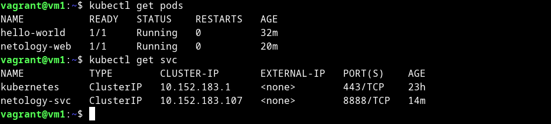
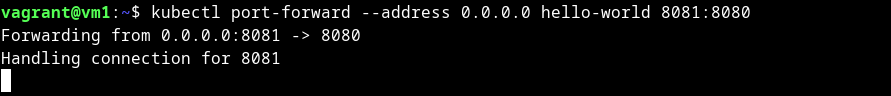
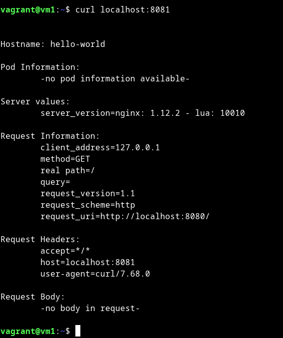
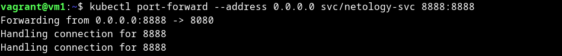
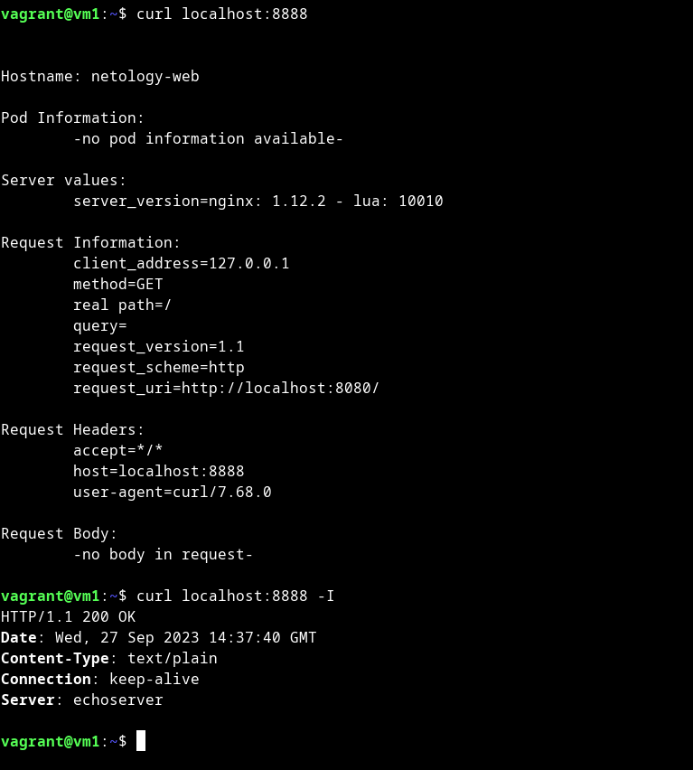

# Домашнее задание к занятию «Базовые объекты K8S»

### Цель задания

В тестовой среде для работы с Kubernetes, установленной в предыдущем ДЗ, необходимо развернуть Pod с приложением и подключиться к нему со своего локального компьютера. 

------

### Чеклист готовности к домашнему заданию

1. Установленное k8s-решение (например, MicroK8S).
2. Установленный локальный kubectl.
3. Редактор YAML-файлов с подключенным Git-репозиторием.

------

### Инструменты и дополнительные материалы, которые пригодятся для выполнения задания

1. Описание [Pod](https://kubernetes.io/docs/concepts/workloads/pods/) и примеры манифестов.
2. Описание [Service](https://kubernetes.io/docs/concepts/services-networking/service/).

------

### Задание 1. Создать Pod с именем hello-world

1. Создать манифест (yaml-конфигурацию) Pod.
2. Использовать image - gcr.io/kubernetes-e2e-test-images/echoserver:2.2.
3. Подключиться локально к Pod с помощью `kubectl port-forward` и вывести значение (curl или в браузере).

<details>
<summary>

</summary>

```bash
vagrant@vm1:~$ kubectl get pod
No resources found in default namespace.
vagrant@vm1:~$ cat microk8s/pod.yml
apiVersion: v1
kind: Pod
metadata:
  name: hello-world
  labels:
    app: hello-world
spec:
  containers:
  - name: hello-world
    image: gcr.io/kubernetes-e2e-test-images/echoserver:2.2
vagrant@vm1:~$ kubectl apply -f microk8s/pod.yml 
pod/hello-world created
vagrant@vm1:~$ kubectl get po
NAME          READY   STATUS    RESTARTS   AGE
hello-world   1/1     Running   0          4m31s

vagrant@vm1:~$ curl localhost:8081


Hostname: hello-world

Pod Information:
	-no pod information available-

Server values:
	server_version=nginx: 1.12.2 - lua: 10010

Request Information:
	client_address=127.0.0.1
	method=GET
	real path=/
	query=
	request_version=1.1
	request_scheme=http
	request_uri=http://localhost:8080/

Request Headers:
	accept=*/*  
	host=localhost:8081  
	user-agent=curl/7.68.0  

Request Body:
	-no body in request-

vagrant@vm1:~$ curl localhost:8081 -I
HTTP/1.1 200 OK
Date: Wed, 27 Sep 2023 14:09:58 GMT
Content-Type: text/plain
Connection: keep-alive
Server: echoserver

```

</details>

------

### Задание 2. Создать Service и подключить его к Pod

1. Создать Pod с именем netology-web.
2. Использовать image — gcr.io/kubernetes-e2e-test-images/echoserver:2.2.
3. Создать Service с именем netology-svc и подключить к netology-web.
4. Подключиться локально к Service с помощью `kubectl port-forward` и вывести значение (curl или в браузере).

<details>
<summary>

</summary>

```bash
vagrant@vm1:~$ kubectl apply -f microk8s/pod.yml 
pod/hello-world unchanged
pod/netology-web created
vagrant@vm1:~$ cat microk8s/pod.yml 
apiVersion: v1
kind: Pod
metadata:
  name: hello-world
  labels:
    app: hello-world
spec:
  containers:
  - name: hello-world
    image: gcr.io/kubernetes-e2e-test-images/echoserver:2.2
---
apiVersion: v1
kind: Pod
metadata:
  name: netology-web
  labels:
    app: netology-web
spec:
  containers:
  - name: netology-web
    image: gcr.io/kubernetes-e2e-test-images/echoserver:2.2
vagrant@vm1:~$ kubectl get po
NAME           READY   STATUS    RESTARTS   AGE
hello-world    1/1     Running   0          11m
netology-web   1/1     Running   0          20s

vagrant@vm1:~$ cat microk8s/service.yml 
apiVersion: v1
kind: Service
metadata:
  name: netology-svc
spec:
  selector:
    app: netology-web
  ports:
    - protocol: TCP
      port: 8888
      targetPort: 8080
vagrant@vm1:~$ kubectl apply -f microk8s/service.yml 
service/netology-svc created
vagrant@vm1:~$ kubectl get svc
NAME           TYPE        CLUSTER-IP       EXTERNAL-IP   PORT(S)    AGE
kubernetes     ClusterIP   10.152.183.1     <none>        443/TCP    23h
netology-svc   ClusterIP   10.152.183.107   <none>        8888/TCP   10s

vagrant@vm1:~$ curl localhost:8888


Hostname: netology-web

Pod Information:
	-no pod information available-

Server values:
	server_version=nginx: 1.12.2 - lua: 10010

Request Information:
	client_address=127.0.0.1
	method=GET
	real path=/
	query=
	request_version=1.1
	request_scheme=http
	request_uri=http://localhost:8080/

Request Headers:
	accept=*/*  
	host=localhost:8888  
	user-agent=curl/7.68.0  

Request Body:
	-no body in request-

vagrant@vm1:~$ curl localhost:8888 -I
HTTP/1.1 200 OK
Date: Wed, 27 Sep 2023 14:31:31 GMT
Content-Type: text/plain
Connection: keep-alive
Server: echoserver

```

```bash
vagrant@vm1:~$ kubectl port-forward --address 0.0.0.0 svc/netology-svc 8888:8888
Forwarding from 0.0.0.0:8888 -> 8080
Handling connection for 8888
Handling connection for 8888
```


</details>

------

### Правила приёма работы

1. Домашняя работа оформляется в своем Git-репозитории в файле README.md. Выполненное домашнее задание пришлите ссылкой на .md-файл в вашем репозитории.
2. Файл README.md должен содержать скриншоты вывода команд `kubectl get pods`, а также скриншот результата подключения.
3. Репозиторий должен содержать файлы манифестов и ссылки на них в файле README.md.

<details>
<summary>

**скриншоты:**

</summary>











</details>

------