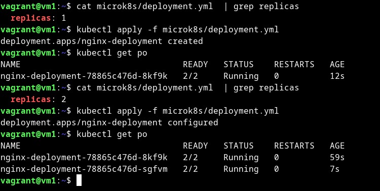
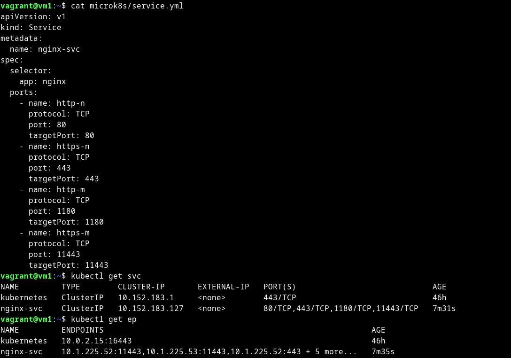
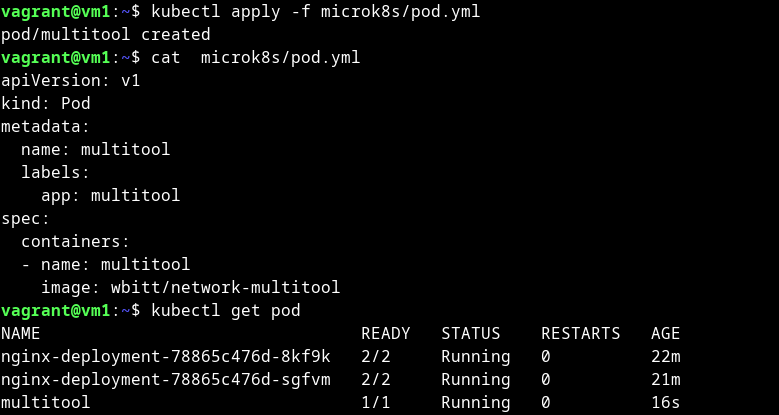
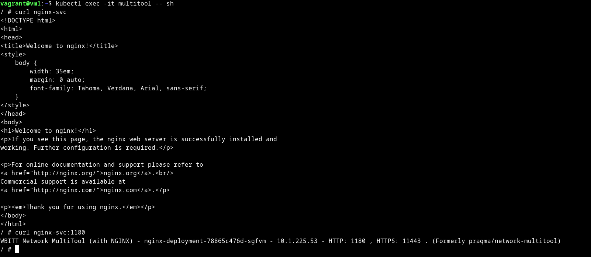
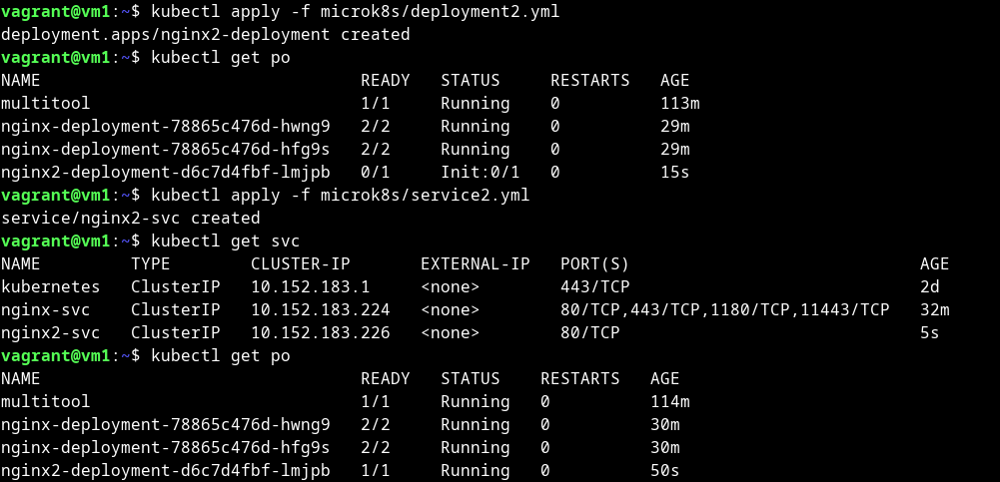

w# Домашнее задание к занятию «Запуск приложений в K8S»

### Цель задания

В тестовой среде для работы с Kubernetes, установленной в предыдущем ДЗ, необходимо развернуть Deployment с приложением, состоящим из нескольких контейнеров, и масштабировать его.

------

### Чеклист готовности к домашнему заданию

1. Установленное k8s-решение (например, MicroK8S).
2. Установленный локальный kubectl.
3. Редактор YAML-файлов с подключённым git-репозиторием.

------

### Инструменты и дополнительные материалы, которые пригодятся для выполнения задания

1. [Описание](https://kubernetes.io/docs/concepts/workloads/controllers/deployment/) Deployment и примеры манифестов.
2. [Описание](https://kubernetes.io/docs/concepts/workloads/pods/init-containers/) Init-контейнеров.
3. [Описание](https://github.com/wbitt/Network-MultiTool) Multitool.

------

### Задание 1. Создать Deployment и обеспечить доступ к репликам приложения из другого Pod

1. Создать Deployment приложения, состоящего из двух контейнеров — nginx и multitool. Решить возникшую ошибку.

<details>
<summary>

</summary>

```bash
vagrant@vm1:~$ cat microk8s/deployment.yml 
apiVersion: apps/v1
kind: Deployment
metadata:
  name: nginx-deployment
  labels:
    app: nginx
spec:
  replicas: 1
  selector:
    matchLabels:
      app: nginx
  template:
    metadata:
      labels:
        app: nginx
    spec:
      containers:
      - name: nginx
        image: nginx:1.14.2
      - name: multitool
        image: wbitt/network-multitool

vagrant@vm1:~$ kubectl get pod -w
NAME                               READY   STATUS    RESTARTS   AGE
nginx-deployment-79cddc58d-cgdzj   0/2     Pending   0          0s
nginx-deployment-79cddc58d-cgdzj   0/2     Pending   0          0s
nginx-deployment-79cddc58d-cgdzj   0/2     ContainerCreating   0          0s
nginx-deployment-79cddc58d-cgdzj   0/2     ContainerCreating   0          1s
nginx-deployment-79cddc58d-cgdzj   2/2     Running             0          3s
nginx-deployment-79cddc58d-cgdzj   1/2     Error               0          6s
nginx-deployment-79cddc58d-cgdzj   2/2     Running             1 (4s ago)   9s
nginx-deployment-79cddc58d-cgdzj   1/2     Error               1 (7s ago)   12s

vagrant@vm1:~$ kubectl get pod 
NAME                               READY   STATUS   RESTARTS      AGE
nginx-deployment-79cddc58d-cgdzj   1/2     Error    4 (56s ago)   116s
vagrant@vm1:~$ kubectl get deployment
NAME               READY   UP-TO-DATE   AVAILABLE   AGE
nginx-deployment   0/1     1            0           4m43s

```

```bash
vagrant@vm1:~$ cat microk8s/deployment.yml 
apiVersion: apps/v1
kind: Deployment
metadata:
  name: nginx-deployment
  labels:
    app: nginx
spec:
  replicas: 1
  selector:
    matchLabels:
      app: nginx
  template:
    metadata:
      labels:
        app: nginx
    spec:
      containers:
      - name: nginx
        image: nginx:1.14.2
      - name: multitool
        image: wbitt/network-multitool
        env:
        - name: HTTP_PORT
          value: "1180"
        - name: HTTPS_PORT
          value: "11443"
        ports:
        - containerPort: 1180
          name: http-port
        - containerPort: 11443
          name: https-port

vagrant@vm1:~$ kubectl get po
NAME                                READY   STATUS    RESTARTS   AGE
nginx-deployment-78865c476d-vlfhf   2/2     Running   0          14s
vagrant@vm1:~$ kubectl get deployment
NAME               READY   UP-TO-DATE   AVAILABLE   AGE
nginx-deployment   1/1     1            1           8m8s

```

</details>

2. После запуска увеличить количество реплик работающего приложения до 2.

<details>
<summary>

</summary>

```bash
vagrant@vm1:~$ cat microk8s/deployment.yml 
apiVersion: apps/v1
kind: Deployment
metadata:
  name: nginx-deployment
  labels:
    app: nginx
spec:
  replicas: 2
  selector:
    matchLabels:
      app: nginx
  template:
    metadata:
      labels:
        app: nginx
    spec:
      containers:
      - name: nginx
        image: nginx:1.14.2
      - name: multitool
        image: wbitt/network-multitool
        env:
        - name: HTTP_PORT
          value: "1180"
        - name: HTTPS_PORT
          value: "11443"
        ports:
        - containerPort: 1180
          name: http-port
        - containerPort: 11443
          name: https-port
vagrant@vm1:~$ kubectl get pod
NAME                                READY   STATUS    RESTARTS   AGE
nginx-deployment-78865c476d-vlfhf   2/2     Running   0          12m
nginx-deployment-78865c476d-tjmcj   2/2     Running   0          21s

```

</details>

3. Продемонстрировать количество подов до и после масштабирования.

<details>
<summary>

</summary>



</details>

4. Создать Service, который обеспечит доступ до реплик приложений из п.1.

<details>
<summary>

</summary>

```bash
vagrant@vm1:~$ cat microk8s/service.yml 
apiVersion: v1
kind: Service
metadata:
  name: nginx-svc
spec:
  selector:
    app: nginx
  ports:
    - name: http-n
      protocol: TCP
      port: 80
      targetPort: 80
    - name: https-n
      protocol: TCP
      port: 443
      targetPort: 443
    - name: http-m
      protocol: TCP
      port: 1180
      targetPort: 1180
    - name: https-m
      protocol: TCP
      port: 11443
      targetPort: 11443
vagrant@vm1:~$ kubectl get svc 
NAME         TYPE        CLUSTER-IP       EXTERNAL-IP   PORT(S)                             AGE
kubernetes   ClusterIP   10.152.183.1     <none>        443/TCP                             46h
nginx-svc    ClusterIP   10.152.183.127   <none>        80/TCP,443/TCP,1180/TCP,11443/TCP   7m31s
vagrant@vm1:~$ kubectl get ep
NAME         ENDPOINTS                                                         AGE
kubernetes   10.0.2.15:16443                                                   46h
nginx-svc    10.1.225.52:11443,10.1.225.53:11443,10.1.225.52:443 + 5 more...   7m35s

```



</details>

5. Создать отдельный Pod с приложением multitool и убедиться с помощью `curl`, что из пода есть доступ до приложений из п.1.

<details>
<summary>

</summary>

```bash
vagrant@vm1:~$ cat  microk8s/pod.yml 
apiVersion: v1
kind: Pod
metadata:
  name: multitool
  labels:
    app: multitool
spec:
  containers:
  - name: multitool
    image: wbitt/network-multitool
vagrant@vm1:~$ kubectl get pod
NAME                                READY   STATUS    RESTARTS   AGE
nginx-deployment-78865c476d-8kf9k   2/2     Running   0          22m
nginx-deployment-78865c476d-sgfvm   2/2     Running   0          21m
multitool                           1/1     Running   0          16s
vagrant@vm1:~$ kubectl exec -it multitool -- sh
/ # curl nginx-svc
<!DOCTYPE html>
<html>
<head>
<title>Welcome to nginx!</title>
<style>
    body {
        width: 35em;
        margin: 0 auto;
        font-family: Tahoma, Verdana, Arial, sans-serif;
    }
</style>
</head>
<body>
<h1>Welcome to nginx!</h1>
<p>If you see this page, the nginx web server is successfully installed and
working. Further configuration is required.</p>

<p>For online documentation and support please refer to
<a href="http://nginx.org/">nginx.org</a>.<br/>
Commercial support is available at
<a href="http://nginx.com/">nginx.com</a>.</p>

<p><em>Thank you for using nginx.</em></p>
</body>
</html>
/ # curl nginx-svc:1180
WBITT Network MultiTool (with NGINX) - nginx-deployment-78865c476d-sgfvm - 10.1.225.53 - HTTP: 1180 , HTTPS: 11443 . (Formerly praqma/network-multitool)

```





</details>

------

### Задание 2. Создать Deployment и обеспечить старт основного контейнера при выполнении условий

1. Создать Deployment приложения nginx и обеспечить старт контейнера только после того, как будет запущен сервис этого приложения.

<details>
<summary>

</summary>

```bash
vagrant@vm1:~$ cat microk8s/deployment2.yml 
apiVersion: apps/v1
kind: Deployment
metadata:
  name: nginx2-deployment
  labels:
    app: nginx2
spec:
  replicas: 1
  selector:
    matchLabels:
      app: nginx2
  template:
    metadata:
      labels:
        app: nginx2
    spec:
      initContainers:
      - name: busybox
        image: busybox
        command: ['sh', '-c', 'until nslookup nginx2-svc.default.svc.cluster.local; do echo waiting for service nginx2-svc to start; sleep 5; done;']
      containers:
      - name: nginx
        image: nginx:1.14.2
        ports:
        - containerPort: 80

```

</details>

2. Убедиться, что nginx не стартует. В качестве Init-контейнера взять busybox.

<details>
<summary>

</summary>

```bash
vagrant@vm1:~$ kubectl apply -f microk8s/deployment2.yml 
deployment.apps/nginx2-deployment created
vagrant@vm1:~$ kubectl get po
NAME                                READY   STATUS     RESTARTS   AGE
multitool                           1/1     Running    0          113m
nginx-deployment-78865c476d-hwng9   2/2     Running    0          29m
nginx-deployment-78865c476d-hfg9s   2/2     Running    0          29m
nginx2-deployment-d6c7d4fbf-lmjpb   0/1     Init:0/1   0          15s

vagrant@vm1:~$ kubectl logs nginx2-deployment-d6c7d4fbf-lmjpb -c busybox
Server:		10.152.183.10
Address:	10.152.183.10:53

** server can't find nginx2-svc.default.svc.cluster.local: NXDOMAIN

** server can't find nginx2-svc.default.svc.cluster.local: NXDOMAIN

waiting for service nginx2-svc to start
Server:		10.152.183.10
Address:	10.152.183.10:53

** server can't find nginx2-svc.default.svc.cluster.local: NXDOMAIN

** server can't find nginx2-svc.default.svc.cluster.local: NXDOMAIN

waiting for service nginx2-svc to start
Server:		10.152.183.10
Address:	10.152.183.10:53

** server can't find nginx2-svc.default.svc.cluster.local: NXDOMAIN

** server can't find nginx2-svc.default.svc.cluster.local: NXDOMAIN

waiting for service nginx2-svc to start


```
</details>

3. Создать и запустить Service. Убедиться, что Init запустился.

<details>
<summary>

</summary>

```bash
vagrant@vm1:~$ cat microk8s/service2.yml 
apiVersion: v1
kind: Service
metadata:
  name: nginx2-svc
spec:
  selector:
    app: nginx2
  ports:
    - name: http
      protocol: TCP
      port: 80
      targetPort: 80
      
vagrant@vm1:~$ kubectl get svc
NAME         TYPE        CLUSTER-IP       EXTERNAL-IP   PORT(S)                             AGE
kubernetes   ClusterIP   10.152.183.1     <none>        443/TCP                             2d
nginx-svc    ClusterIP   10.152.183.224   <none>        80/TCP,443/TCP,1180/TCP,11443/TCP   32m
nginx2-svc   ClusterIP   10.152.183.226   <none>        80/TCP   
                           5s
vagrant@vm1:~$ kubectl get po
NAME                                READY   STATUS    RESTARTS   AGE
multitool                           1/1     Running   0          114m
nginx-deployment-78865c476d-hwng9   2/2     Running   0          30m
nginx-deployment-78865c476d-hfg9s   2/2     Running   0          30m
nginx2-deployment-d6c7d4fbf-lmjpb   1/1     Running   0          50s

vagrant@vm1:~$ kubectl logs nginx2-deployment-d6c7d4fbf-lmjpb -c busybox
Server:		10.152.183.10
Address:	10.152.183.10:53

** server can't find nginx2-svc.default.svc.cluster.local: NXDOMAIN

** server can't find nginx2-svc.default.svc.cluster.local: NXDOMAIN

waiting for service nginx2-svc to start
Server:		10.152.183.10
Address:	10.152.183.10:53

** server can't find nginx2-svc.default.svc.cluster.local: NXDOMAIN

** server can't find nginx2-svc.default.svc.cluster.local: NXDOMAIN

waiting for service nginx2-svc to start
...
Server:		10.152.183.10
Address:	10.152.183.10:53

Name:	nginx2-svc.default.svc.cluster.local
Address: 10.152.183.226
```

</details>

4. Продемонстрировать состояние пода до и после запуска сервиса.

<details>
<summary>

</summary>



</details>


------

### Правила приема работы

1. Домашняя работа оформляется в своем Git-репозитории в файле README.md. Выполненное домашнее задание пришлите ссылкой на .md-файл в вашем репозитории.
2. Файл README.md должен содержать скриншоты вывода необходимых команд `kubectl` и скриншоты результатов.
3. Репозиторий должен содержать файлы манифестов и ссылки на них в файле README.md.

------