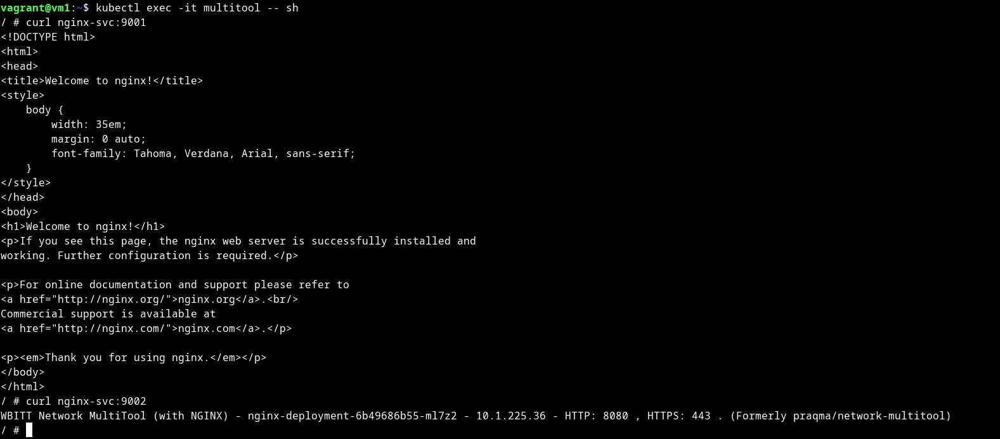
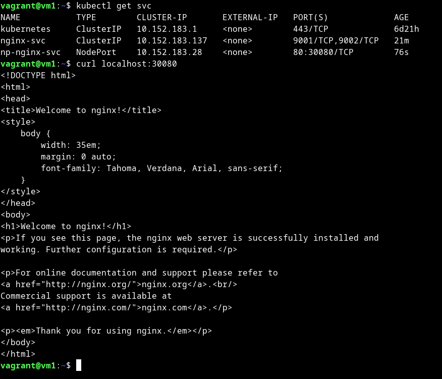

# Домашнее задание к занятию «Сетевое взаимодействие в K8S. Часть 1»

### Цель задания

В тестовой среде Kubernetes необходимо обеспечить доступ к приложению, установленному в предыдущем ДЗ и состоящему из двух контейнеров, по разным портам в разные контейнеры как внутри кластера, так и снаружи.

------

### Чеклист готовности к домашнему заданию

1. Установленное k8s-решение (например, MicroK8S).
2. Установленный локальный kubectl.
3. Редактор YAML-файлов с подключённым Git-репозиторием.

------

### Инструменты и дополнительные материалы, которые пригодятся для выполнения задания

1. [Описание](https://kubernetes.io/docs/concepts/workloads/controllers/deployment/) Deployment и примеры манифестов.
2. [Описание](https://kubernetes.io/docs/concepts/services-networking/service/) Описание Service.
3. [Описание](https://github.com/wbitt/Network-MultiTool) Multitool.

------

### Задание 1. Создать Deployment и обеспечить доступ к контейнерам приложения по разным портам из другого Pod внутри кластера

1. Создать Deployment приложения, состоящего из двух контейнеров (nginx и multitool), с количеством реплик 3 шт.
2. Создать Service, который обеспечит доступ внутри кластера до контейнеров приложения из п.1 по порту 9001 — nginx 80, по 9002 — multitool 8080.
3. Создать отдельный Pod с приложением multitool и убедиться с помощью `curl`, что из пода есть доступ до приложения из п.1 по разным портам в разные контейнеры.
4. Продемонстрировать доступ с помощью `curl` по доменному имени сервиса.
5. Предоставить манифесты Deployment и Service в решении, а также скриншоты или вывод команды п.4.

<details>
<summary>

</summary>

```bash
vagrant@vm1:~$ cat microk8s/deployment.yml 
apiVersion: apps/v1
kind: Deployment
metadata:
  name: nginx-deployment
  labels:
    app: nginx
spec:
  replicas: 3
  selector:
    matchLabels:
      app: nginx
  template:
    metadata:
      labels:
        app: nginx
    spec:
      containers:
      - name: nginx
        image: nginx:1.14.2
      - name: multitool
        image: wbitt/network-multitool
        env:
        - name: HTTP_PORT
          value: "8080"
        ports:
        - containerPort: 8080
          name: http-port
          
vagrant@vm1:~$ kubectl get po
NAME                                READY   STATUS    RESTARTS   AGE
nginx-deployment-6b49686b55-ml7z2   2/2     Running   0          9m47s
nginx-deployment-6b49686b55-n8bts   2/2     Running   0          9m36s
nginx-deployment-6b49686b55-9r7q8   2/2     Running   0          9m31s

vagrant@vm1:~$ cat microk8s/service.yml 
apiVersion: v1
kind: Service
metadata:
  name: nginx-svc
spec:
  selector:
    app: nginx
  ports:
    - name: http-n
      protocol: TCP
      port: 9001
      targetPort: 80
    - name: http-m
      protocol: TCP
      port: 9002
      targetPort: 8080

vagrant@vm1:~$ kubectl get svc
NAME         TYPE        CLUSTER-IP       EXTERNAL-IP   PORT(S)             AGE
kubernetes   ClusterIP   10.152.183.1     <none>        443/TCP             6d20h
nginx-svc    ClusterIP   10.152.183.137   <none>        9001/TCP,9002/TCP   7m55s

vagrant@vm1:~$ cat microk8s/pod.yml 
apiVersion: v1
kind: Pod
metadata:
  name: multitool
  labels:
    app: multitool
spec:
  containers:
  - name: multitool
    image: wbitt/network-multitool

vagrant@vm1:~$ kubectl exec -it multitool -- sh
/ # curl nginx-svc:9001
<!DOCTYPE html>
<html>
<head>
<title>Welcome to nginx!</title>
<style>
    body {
        width: 35em;
        margin: 0 auto;
        font-family: Tahoma, Verdana, Arial, sans-serif;
    }
</style>
</head>
<body>
<h1>Welcome to nginx!</h1>
<p>If you see this page, the nginx web server is successfully installed and
working. Further configuration is required.</p>

<p>For online documentation and support please refer to
<a href="http://nginx.org/">nginx.org</a>.<br/>
Commercial support is available at
<a href="http://nginx.com/">nginx.com</a>.</p>

<p><em>Thank you for using nginx.</em></p>
</body>
</html>
/ # curl nginx-svc:9002
WBITT Network MultiTool (with NGINX) - nginx-deployment-6b49686b55-ml7z2 - 10.1.225.36 - HTTP: 8080 , HTTPS: 443 . (Formerly praqma/network-multitool)
/ # 


```

[deployment.yml](microk8s%2Fdeployment.yml)

[service.yml](microk8s%2Fservice.yml)



</details>

------

### Задание 2. Создать Service и обеспечить доступ к приложениям снаружи кластера

1. Создать отдельный Service приложения из Задания 1 с возможностью доступа снаружи кластера к nginx, используя тип NodePort.
2. Продемонстрировать доступ с помощью браузера или `curl` с локального компьютера.
3. Предоставить манифест и Service в решении, а также скриншоты или вывод команды п.2.

<details>
<summary>

</summary>

```bash
vagrant@vm1:~$ cat microk8s/np-service.yml 
apiVersion: v1
kind: Service
metadata:
  name: np-nginx-svc
  namespace: default
spec:
  selector:
    app: nginx
  ports:
    - name: http
      protocol: TCP
      port: 80
      nodePort: 30080
  type: NodePort

vagrant@vm1:~$ kubectl get svc
NAME           TYPE        CLUSTER-IP       EXTERNAL-IP   PORT(S)             AGE
kubernetes     ClusterIP   10.152.183.1     <none>        443/TCP             6d21h
nginx-svc      ClusterIP   10.152.183.137   <none>        9001/TCP,9002/TCP   21m
np-nginx-svc   NodePort    10.152.183.28    <none>        80:30080/TCP        76s

vagrant@vm1:~$ curl localhost:30080
<!DOCTYPE html>
<html>
<head>
<title>Welcome to nginx!</title>
<style>
    body {
        width: 35em;
        margin: 0 auto;
        font-family: Tahoma, Verdana, Arial, sans-serif;
    }
</style>
</head>
<body>
<h1>Welcome to nginx!</h1>
<p>If you see this page, the nginx web server is successfully installed and
working. Further configuration is required.</p>

<p>For online documentation and support please refer to
<a href="http://nginx.org/">nginx.org</a>.<br/>
Commercial support is available at
<a href="http://nginx.com/">nginx.com</a>.</p>

<p><em>Thank you for using nginx.</em></p>
</body>
</html>

```

[np-service.yml](microk8s%2Fnp-service.yml)



</details>

------

### Правила приёма работы

1. Домашняя работа оформляется в своем Git-репозитории в файле README.md. Выполненное домашнее задание пришлите ссылкой на .md-файл в вашем репозитории.
2. Файл README.md должен содержать скриншоты вывода необходимых команд `kubectl` и скриншоты результатов.
3. Репозиторий должен содержать тексты манифестов или ссылки на них в файле README.md.
