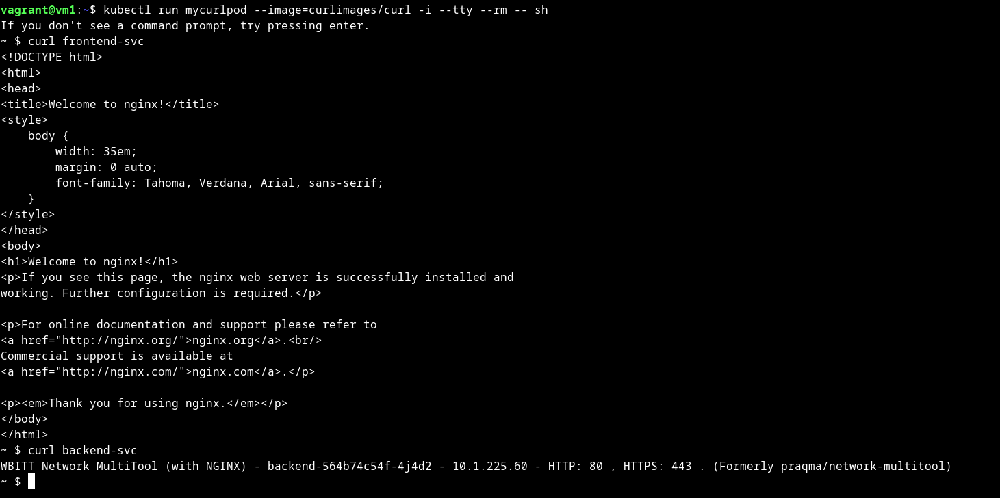

# Домашнее задание к занятию «Сетевое взаимодействие в K8S. Часть 2»

### Цель задания

В тестовой среде Kubernetes необходимо обеспечить доступ к двум приложениям снаружи кластера по разным путям.

------

### Чеклист готовности к домашнему заданию

1. Установленное k8s-решение (например, MicroK8S).
2. Установленный локальный kubectl.
3. Редактор YAML-файлов с подключённым Git-репозиторием.

------

### Инструменты и дополнительные материалы, которые пригодятся для выполнения задания

1. [Инструкция](https://microk8s.io/docs/getting-started) по установке MicroK8S.
2. [Описание](https://kubernetes.io/docs/concepts/services-networking/service/) Service.
3. [Описание](https://kubernetes.io/docs/concepts/services-networking/ingress/) Ingress.
4. [Описание](https://github.com/wbitt/Network-MultiTool) Multitool.

------

### Задание 1. Создать Deployment приложений backend и frontend

1. Создать Deployment приложения _frontend_ из образа nginx с количеством реплик 3 шт.
2. Создать Deployment приложения _backend_ из образа multitool. 
3. Добавить Service, которые обеспечат доступ к обоим приложениям внутри кластера. 
4. Продемонстрировать, что приложения видят друг друга с помощью Service.
5. Предоставить манифесты Deployment и Service в решении, а также скриншоты или вывод команды п.4.

<details>
<summary>

</summary>

```bash
vagrant@vm1:~$ cat microk8s/dep-frontend.yml 
apiVersion: apps/v1
kind: Deployment
metadata:
  name: frontend
  labels:
    app: frontend
spec:
  replicas: 3
  selector:
    matchLabels:
      app: frontend
  template:
    metadata:
      labels:
        app: frontend
    spec:
      containers:
      - name: frontend
        image: nginx:1.14.2

vagrant@vm1:~$ kubectl get po
NAME                        READY   STATUS    RESTARTS   AGE
frontend-788b77fcc9-jdhwg   1/1     Running   0          9s
frontend-788b77fcc9-cc79w   1/1     Running   0          9s
frontend-788b77fcc9-26j5j   1/1     Running   0          9s

vagrant@vm1:~$ cat microk8s/dep-backend.yml 
apiVersion: apps/v1
kind: Deployment
metadata:
  name: backend
  labels:
    app: backend
spec:
  replicas: 1
  selector:
    matchLabels:
      app: backend
  template:
    metadata:
      labels:
        app: backend
    spec:
      containers:
      - name: backend
        image: wbitt/network-multitool
        env:
        - name: HTTP_PORT
          value: "80"
        ports:
        - containerPort: 80
          name: http-port

vagrant@vm1:~$ kubectl get po
NAME                        READY   STATUS    RESTARTS   AGE
frontend-67bbcb858c-754qq   1/1     Running   0          12s
frontend-67bbcb858c-f26ld   1/1     Running   0          12s
frontend-67bbcb858c-kvjpb   1/1     Running   0          12s
backend-564b74c54f-4j4d2    1/1     Running   0          7s

vagrant@vm1:~$ cat microk8s/service.yml 
apiVersion: v1
kind: Service
metadata:
  name: frontend-svc
spec:
  selector:
    app: frontend
  ports:
    - name: http
      protocol: TCP
      port: 80
      targetPort: 80
---
apiVersion: v1
kind: Service
metadata:
  name: backend-svc
spec:
  selector:
    app: backend
  ports:
    - name: http
      protocol: TCP
      port: 80
      targetPort: 80

vagrant@vm1:~$ kubectl get svc
NAME           TYPE        CLUSTER-IP       EXTERNAL-IP   PORT(S)   AGE
kubernetes     ClusterIP   10.152.183.1     <none>        443/TCP   6d23h
frontend-svc   ClusterIP   10.152.183.53    <none>        80/TCP    11s
backend-svc    ClusterIP   10.152.183.206   <none>        80/TCP    11s

vagrant@vm1:~$ kubectl get ep
NAME           ENDPOINTS                                      AGE
kubernetes     10.0.2.15:16443                                6d23h
frontend-svc   10.1.225.52:80,10.1.225.58:80,10.1.225.59:80   23s
backend-svc    10.1.225.60:80                                 23s

vagrant@vm1:~$ kubectl run mycurlpod --image=curlimages/curl -i --tty --rm -- sh
If you don't see a command prompt, try pressing enter.
~ $ curl frontend-svc
<!DOCTYPE html>
<html>
<head>
<title>Welcome to nginx!</title>
<style>
    body {
        width: 35em;
        margin: 0 auto;
        font-family: Tahoma, Verdana, Arial, sans-serif;
    }
</style>
</head>
<body>
<h1>Welcome to nginx!</h1>
<p>If you see this page, the nginx web server is successfully installed and
working. Further configuration is required.</p>

<p>For online documentation and support please refer to
<a href="http://nginx.org/">nginx.org</a>.<br/>
Commercial support is available at
<a href="http://nginx.com/">nginx.com</a>.</p>

<p><em>Thank you for using nginx.</em></p>
</body>
</html>
~ $ curl backend-svc
WBITT Network MultiTool (with NGINX) - backend-564b74c54f-4j4d2 - 10.1.225.60 - HTTP: 80 , HTTPS: 443 . (Formerly praqma/network-multitool)
~ $ exit
Session ended, resume using 'kubectl attach mycurlpod -c mycurlpod -i -t' command when the pod is running
pod "mycurlpod" deleted

```

[service.yml](microk8s%2Fservice.yml)

[dep-frontend.yml](microk8s%2Fdep-frontend.yml)

[dep-backend.yml](microk8s%2Fdep-backend.yml)



</details>

------

### Задание 2. Создать Ingress и обеспечить доступ к приложениям снаружи кластера

1. Включить Ingress-controller в MicroK8S.
2. Создать Ingress, обеспечивающий доступ снаружи по IP-адресу кластера MicroK8S так, чтобы при запросе только по адресу открывался _frontend_ а при добавлении /api - _backend_.
3. Продемонстрировать доступ с помощью браузера или `curl` с локального компьютера.
4. Предоставить манифесты и скриншоты или вывод команды п.2.


<details>
<summary>

</summary>

```bash
vagrant@vm1:~$ microk8s enable ingress
Infer repository core for addon ingress
Enabling Ingress
ingressclass.networking.k8s.io/public created
ingressclass.networking.k8s.io/nginx created
namespace/ingress created
serviceaccount/nginx-ingress-microk8s-serviceaccount created
clusterrole.rbac.authorization.k8s.io/nginx-ingress-microk8s-clusterrole created
role.rbac.authorization.k8s.io/nginx-ingress-microk8s-role created
clusterrolebinding.rbac.authorization.k8s.io/nginx-ingress-microk8s created
rolebinding.rbac.authorization.k8s.io/nginx-ingress-microk8s created
configmap/nginx-load-balancer-microk8s-conf created
configmap/nginx-ingress-tcp-microk8s-conf created
configmap/nginx-ingress-udp-microk8s-conf created
daemonset.apps/nginx-ingress-microk8s-controller created
Ingress is enabled

vagrant@vm1:~$ kubectl get ingress
NAME      CLASS    HOSTS      ADDRESS     PORTS   AGE
ingress   public   web.test   127.0.0.1   80      4m35s

vagrant@vm1:~$ cat microk8s/ingress.yml 
apiVersion: networking.k8s.io/v1
kind: Ingress
metadata:
  name: ingress
  annotations:
    nginx.ingress.kubernetes.io/rewrite-target: /
spec:
  rules:
  - host: web.test
    http:
      paths:
      - path: /
        pathType: Prefix
        backend:
          service:
            name: frontend-svc
            port:
              number: 80
      - path: /api
        pathType: Prefix
        backend:
          service:
            name: backend-svc
            port:
              number: 80

vagrant@vm1:~$ curl web.test
<!DOCTYPE html>
<html>
<head>
<title>Welcome to nginx!</title>
<style>
    body {
        width: 35em;
        margin: 0 auto;
        font-family: Tahoma, Verdana, Arial, sans-serif;
    }
</style>
</head>
<body>
<h1>Welcome to nginx!</h1>
<p>If you see this page, the nginx web server is successfully installed and
working. Further configuration is required.</p>

<p>For online documentation and support please refer to
<a href="http://nginx.org/">nginx.org</a>.<br/>
Commercial support is available at
<a href="http://nginx.com/">nginx.com</a>.</p>

<p><em>Thank you for using nginx.</em></p>
</body>
</html>
vagrant@vm1:~$ curl web.test/api
WBITT Network MultiTool (with NGINX) - backend-564b74c54f-4j4d2 - 10.1.225.60 - HTTP: 80 , HTTPS: 443 . (Formerly praqma/network-multitool)

```

[ingress.yml](microk8s%2Fingress.yml)


</details>

------

### Правила приема работы

1. Домашняя работа оформляется в своем Git-репозитории в файле README.md. Выполненное домашнее задание пришлите ссылкой на .md-файл в вашем репозитории.
2. Файл README.md должен содержать скриншоты вывода необходимых команд `kubectl` и скриншоты результатов.
3. Репозиторий должен содержать тексты манифестов или ссылки на них в файле README.md.

------