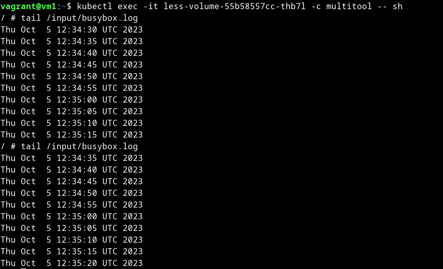
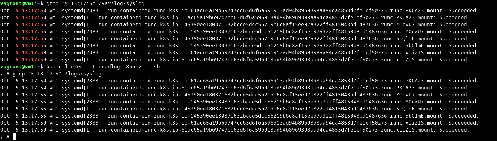

# Домашнее задание к занятию «Хранение в K8s. Часть 1»

### Цель задания

В тестовой среде Kubernetes нужно обеспечить обмен файлами между контейнерам пода и доступ к логам ноды.

------

### Чеклист готовности к домашнему заданию

1. Установленное K8s-решение (например, MicroK8S).
2. Установленный локальный kubectl.
3. Редактор YAML-файлов с подключенным GitHub-репозиторием.

------

### Дополнительные материалы для выполнения задания

1. [Инструкция по установке MicroK8S](https://microk8s.io/docs/getting-started).
2. [Описание Volumes](https://kubernetes.io/docs/concepts/storage/volumes/).
3. [Описание Multitool](https://github.com/wbitt/Network-MultiTool).

------

### Задание 1 

**Что нужно сделать**

Создать Deployment приложения, состоящего из двух контейнеров и обменивающихся данными.

1. Создать Deployment приложения, состоящего из контейнеров busybox и multitool.
2. Сделать так, чтобы busybox писал каждые пять секунд в некий файл в общей директории.
3. Обеспечить возможность чтения файла контейнером multitool.
4. Продемонстрировать, что multitool может читать файл, который периодоически обновляется.
5. Предоставить манифесты Deployment в решении, а также скриншоты или вывод команды из п. 4.


<details>
<summary>

</summary>

```bash
vagrant@vm1:~$ cat microk8s/deployment.yml 
apiVersion: apps/v1
kind: Deployment
metadata:
  name: less-volume
  labels:
    app: less-volume
spec:
  replicas: 1
  selector:
    matchLabels:
      app: less-volume
  template:
    metadata:
      labels:
        app: less-volume
    spec:
      containers:
      - name: multitool
        image: wbitt/network-multitool
        volumeMounts:
        - name: exch
          mountPath: /input
      - name: busybox
        image: busybox
        command: ['sh', '-c', 'while true; do date >> /output/busybox.log; sleep 5; done;']
        volumeMounts:
        - name: exch
          mountPath: /output
      volumes:
      - name: exch
        emptyDir: {}

vagrant@vm1:~$ kubectl get po
NAME                           READY   STATUS    RESTARTS   AGE
less-volume-55b58557cc-thb7l   2/2     Running   0          8s

vagrant@vm1:~$ kubectl exec -it less-volume-55b58557cc-thb7l -c busybox -- sh
/ # cat /output/busybox.log 
Thu Oct  5 12:32:20 UTC 2023
Thu Oct  5 12:32:25 UTC 2023
Thu Oct  5 12:32:30 UTC 2023
Thu Oct  5 12:32:35 UTC 2023
Thu Oct  5 12:32:40 UTC 2023
Thu Oct  5 12:32:45 UTC 2023
Thu Oct  5 12:32:50 UTC 2023
Thu Oct  5 12:32:55 UTC 2023
Thu Oct  5 12:33:00 UTC 2023
Thu Oct  5 12:33:05 UTC 2023
Thu Oct  5 12:33:10 UTC 2023
Thu Oct  5 12:33:15 UTC 2023
Thu Oct  5 12:33:20 UTC 2023
Thu Oct  5 12:33:25 UTC 2023
Thu Oct  5 12:33:30 UTC 2023

vagrant@vm1:~$ kubectl exec -it less-volume-55b58557cc-thb7l -c multitool -- sh
/ # tail /input/busybox.log 
Thu Oct  5 12:34:30 UTC 2023
Thu Oct  5 12:34:35 UTC 2023
Thu Oct  5 12:34:40 UTC 2023
Thu Oct  5 12:34:45 UTC 2023
Thu Oct  5 12:34:50 UTC 2023
Thu Oct  5 12:34:55 UTC 2023
Thu Oct  5 12:35:00 UTC 2023
Thu Oct  5 12:35:05 UTC 2023
Thu Oct  5 12:35:10 UTC 2023
Thu Oct  5 12:35:15 UTC 2023
/ # tail /input/busybox.log 
Thu Oct  5 12:34:35 UTC 2023
Thu Oct  5 12:34:40 UTC 2023
Thu Oct  5 12:34:45 UTC 2023
Thu Oct  5 12:34:50 UTC 2023
Thu Oct  5 12:34:55 UTC 2023
Thu Oct  5 12:35:00 UTC 2023
Thu Oct  5 12:35:05 UTC 2023
Thu Oct  5 12:35:10 UTC 2023
Thu Oct  5 12:35:15 UTC 2023
Thu Oct  5 12:35:20 UTC 2023

```

[deployment.yml](microk8s%2Fdeployment.yml)



</details>

------

### Задание 2

**Что нужно сделать**

Создать DaemonSet приложения, которое может прочитать логи ноды.

1. Создать DaemonSet приложения, состоящего из multitool.
2. Обеспечить возможность чтения файла `/var/log/syslog` кластера MicroK8S.
3. Продемонстрировать возможность чтения файла изнутри пода.
4. Предоставить манифесты Deployment, а также скриншоты или вывод команды из п. 2.


<details>
<summary>

</summary>

```bash
vagrant@vm1:~$ cat microk8s/daemonset.yml
apiVersion: apps/v1
kind: DaemonSet
metadata:
  name: readlogs
  labels:
    app: readlogs
spec:
  selector:
    matchLabels:
      app: readlogs
  template:
    metadata:
      labels:
        app: readlogs
    spec:
      containers:
      - name: multitool
        image: wbitt/network-multitool
        volumeMounts:
        - name: syslog
          mountPath: /logs/syslog
          readOnly: true
      volumes:
      - name: syslog
        hostPath:
          path: /var/log/syslog

vagrant@vm1:~$ kubectl get ds
NAME       DESIRED   CURRENT   READY   UP-TO-DATE   AVAILABLE   NODE SELECTOR   AGE
readlogs   1         1         1       1            1           <none>          8s
vagrant@vm1:~$ kubectl get po
NAME                           READY   STATUS    RESTARTS   AGE
less-volume-55b58557cc-thb7l   2/2     Running   0          32m
readlogs-86ppz                 1/1     Running   0          4m30s

vagrant@vm1:~$ grep "5 13:17:5" /var/log/syslog
Oct  5 13:17:50 vm1 systemd[2383]: run-containerd-runc-k8s.io-61ac65a19b69747cc63d6f6a596913ad94b8969398aa94ca4853d7fe1ef50273-runc.PKCA23.mount: Succeeded.
Oct  5 13:17:50 vm1 systemd[1]: run-containerd-runc-k8s.io-61ac65a19b69747cc63d6f6a596913ad94b8969398aa94ca4853d7fe1ef50273-runc.PKCA23.mount: Succeeded.
Oct  5 13:17:55 vm1 systemd[1]: run-containerd-runc-k8s.io-145390ee180371632bcce5dcc56219b6c8af15ee97a322ff4815048bd1487636-runc.YOcWU7.mount: Succeeded.
Oct  5 13:17:55 vm1 systemd[2383]: run-containerd-runc-k8s.io-145390ee180371632bcce5dcc56219b6c8af15ee97a322ff4815048bd1487636-runc.YOcWU7.mount: Succeeded.
Oct  5 13:17:55 vm1 systemd[1]: run-containerd-runc-k8s.io-145390ee180371632bcce5dcc56219b6c8af15ee97a322ff4815048bd1487636-runc.5bQlmE.mount: Succeeded.
Oct  5 13:17:55 vm1 systemd[2383]: run-containerd-runc-k8s.io-145390ee180371632bcce5dcc56219b6c8af15ee97a322ff4815048bd1487636-runc.5bQlmE.mount: Succeeded.
Oct  5 13:17:59 vm1 systemd[2383]: run-containerd-runc-k8s.io-61ac65a19b69747cc63d6f6a596913ad94b8969398aa94ca4853d7fe1ef50273-runc.xiiZIS.mount: Succeeded.
Oct  5 13:17:59 vm1 systemd[1]: run-containerd-runc-k8s.io-61ac65a19b69747cc63d6f6a596913ad94b8969398aa94ca4853d7fe1ef50273-runc.xiiZIS.mount: Succeeded.

vagrant@vm1:~$ kubectl exec -it readlogs-86ppz -- sh
/ # grep "5 13:17:5" /logs/syslog 
Oct  5 13:17:50 vm1 systemd[2383]: run-containerd-runc-k8s.io-61ac65a19b69747cc63d6f6a596913ad94b8969398aa94ca4853d7fe1ef50273-runc.PKCA23.mount: Succeeded.
Oct  5 13:17:50 vm1 systemd[1]: run-containerd-runc-k8s.io-61ac65a19b69747cc63d6f6a596913ad94b8969398aa94ca4853d7fe1ef50273-runc.PKCA23.mount: Succeeded.
Oct  5 13:17:55 vm1 systemd[1]: run-containerd-runc-k8s.io-145390ee180371632bcce5dcc56219b6c8af15ee97a322ff4815048bd1487636-runc.YOcWU7.mount: Succeeded.
Oct  5 13:17:55 vm1 systemd[2383]: run-containerd-runc-k8s.io-145390ee180371632bcce5dcc56219b6c8af15ee97a322ff4815048bd1487636-runc.YOcWU7.mount: Succeeded.
Oct  5 13:17:55 vm1 systemd[1]: run-containerd-runc-k8s.io-145390ee180371632bcce5dcc56219b6c8af15ee97a322ff4815048bd1487636-runc.5bQlmE.mount: Succeeded.
Oct  5 13:17:55 vm1 systemd[2383]: run-containerd-runc-k8s.io-145390ee180371632bcce5dcc56219b6c8af15ee97a322ff4815048bd1487636-runc.5bQlmE.mount: Succeeded.
Oct  5 13:17:59 vm1 systemd[2383]: run-containerd-runc-k8s.io-61ac65a19b69747cc63d6f6a596913ad94b8969398aa94ca4853d7fe1ef50273-runc.xiiZIS.mount: Succeeded.
Oct  5 13:17:59 vm1 systemd[1]: run-containerd-runc-k8s.io-61ac65a19b69747cc63d6f6a596913ad94b8969398aa94ca4853d7fe1ef50273-runc.xiiZIS.mount: Succeeded.

```

[daemonset.yml](microk8s%2Fdaemonset.yml)



</details>

------

### Правила приёма работы

1. Домашняя работа оформляется в своём Git-репозитории в файле README.md. Выполненное задание пришлите ссылкой на .md-файл в вашем репозитории.
2. Файл README.md должен содержать скриншоты вывода необходимых команд `kubectl`, а также скриншоты результатов.
3. Репозиторий должен содержать тексты манифестов или ссылки на них в файле README.md.

------