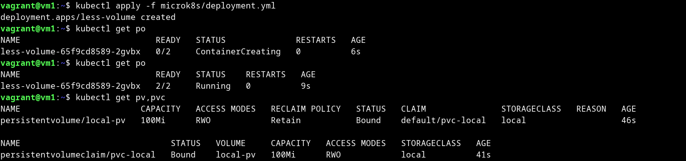
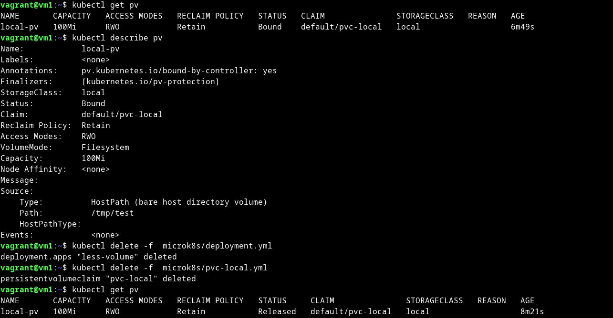
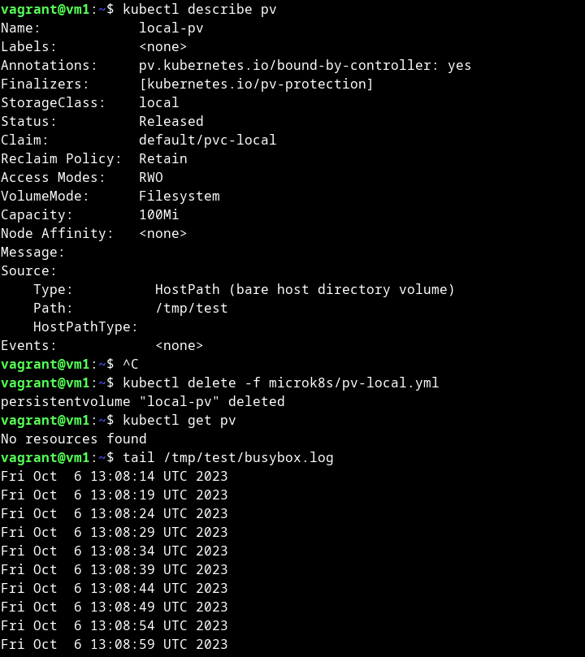
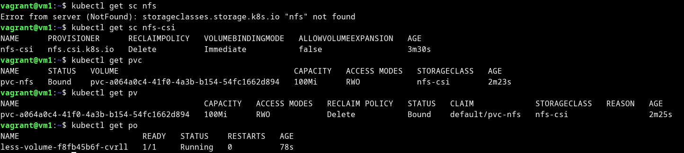
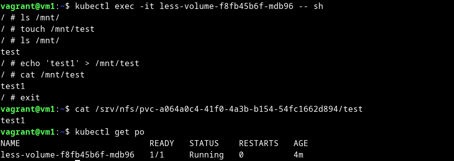

# Домашнее задание к занятию «Хранение в K8s. Часть 2»

### Цель задания

В тестовой среде Kubernetes нужно создать PV и продемострировать запись и хранение файлов.

------

### Чеклист готовности к домашнему заданию

1. Установленное K8s-решение (например, MicroK8S).
2. Установленный локальный kubectl.
3. Редактор YAML-файлов с подключенным GitHub-репозиторием.

------

### Дополнительные материалы для выполнения задания

1. [Инструкция по установке NFS в MicroK8S](https://microk8s.io/docs/nfs). 
2. [Описание Persistent Volumes](https://kubernetes.io/docs/concepts/storage/persistent-volumes/). 
3. [Описание динамического провижининга](https://kubernetes.io/docs/concepts/storage/dynamic-provisioning/). 
4. [Описание Multitool](https://github.com/wbitt/Network-MultiTool).

------

### Задание 1

**Что нужно сделать**

Создать Deployment приложения, использующего локальный PV, созданный вручную.

1. Создать Deployment приложения, состоящего из контейнеров busybox и multitool.
2. Создать PV и PVC для подключения папки на локальной ноде, которая будет использована в поде.
3. Продемонстрировать, что multitool может читать файл, в который busybox пишет каждые пять секунд в общей директории. 
4. Удалить Deployment и PVC. Продемонстрировать, что после этого произошло с PV. Пояснить, почему.
5. Продемонстрировать, что файл сохранился на локальном диске ноды. Удалить PV.  Продемонстрировать что произошло с файлом после удаления PV. Пояснить, почему.
5. Предоставить манифесты, а также скриншоты или вывод необходимых команд.


<details>
<summary>

</summary>

```bash
vagrant@vm1:~$ cat microk8s/deployment.yml 
apiVersion: apps/v1
kind: Deployment
metadata:
  name: less-volume
  labels:
    app: less-volume
  namespace: default
spec:
  replicas: 1
  selector:
    matchLabels:
      app: less-volume
  template:
    metadata:
      labels:
        app: less-volume
    spec:
      containers:
      - name: multitool
        image: wbitt/network-multitool
        volumeMounts:
        - name: exch
          mountPath: /input
      - name: busybox
        image: busybox
        command: ['sh', '-c', 'while true; do date >> /output/busybox.log; sleep 5; done;']
        volumeMounts:
        - name: exch
          mountPath: /output
      volumes:
      - name: exch
        persistentVolumeClaim:
          claimName: pvc-local

vagrant@vm1:~$ kubectl get po
NAME                           READY   STATUS    RESTARTS   AGE
less-volume-65f9cd8589-9vx2n   0/2     Pending   0          5s

vagrant@vm1:~$ cat microk8s/sc-hostpath.yml 
apiVersion: storage.k8s.io/v1
kind: StorageClass
metadata:
  name: local
provisioner: kubernetes.io/no-provisioner 
#так же работает:
#provisioner: microk8s.io/hostpath 
reclaimPolicy: Delete
volumeBindingMode: WaitForFirstConsumer

vagrant@vm1:~$ kubectl get sc local
NAME    PROVISIONER            RECLAIMPOLICY   VOLUMEBINDINGMODE      ALLOWVOLUMEEXPANSION   AGE
local   microk8s.io/hostpath   Delete          WaitForFirstConsumer   false                  4m19s


vagrant@vm1:~$ cat microk8s/pv-local.yml 
apiVersion: v1
kind: PersistentVolume
metadata:
  name: local-pv
spec:
  capacity:
    storage: 100Mi
  accessModes:
  - ReadWriteOnce
  storageClassName: local
  hostPath:
    path: /tmp/test
    
vagrant@vm1:~$ cat microk8s/pvc-local.yml 
apiVersion: v1
kind: PersistentVolumeClaim
metadata:
  name: pvc-local
  namespace: default
spec:
  storageClassName: local
  volumeMode: Filesystem
  accessModes:
  - ReadWriteOnce
  resources:
    requests:
      storage: 100Mi

vagrant@vm1:~$ kubectl get po,pvc,pv
NAME                               READY   STATUS    RESTARTS   AGE
pod/less-volume-65f9cd8589-2gvbx   2/2     Running   0          2m13s

NAME                              STATUS   VOLUME     CAPACITY   ACCESS MODES   STORAGECLASS   AGE
persistentvolumeclaim/pvc-local   Bound    local-pv   100Mi      RWO            local          2m40s

NAME                        CAPACITY   ACCESS MODES   RECLAIM POLICY   STATUS   CLAIM               STORAGECLASS   REASON   AGE
persistentvolume/local-pv   100Mi      RWO            Retain           Bound    default/pvc-local   local                   2m45s

vagrant@vm1:~$ kubectl exec -it pod/less-volume-65f9cd8589-2gvbx -c multitool -- sh
/ # tail /input/busybox.log 
Fri Oct  6 13:05:54 UTC 2023
Fri Oct  6 13:05:59 UTC 2023
Fri Oct  6 13:06:04 UTC 2023
Fri Oct  6 13:06:09 UTC 2023
Fri Oct  6 13:06:14 UTC 2023
Fri Oct  6 13:06:19 UTC 2023
Fri Oct  6 13:06:24 UTC 2023
Fri Oct  6 13:06:29 UTC 2023
Fri Oct  6 13:06:34 UTC 2023
Fri Oct  6 13:06:39 UTC 2023
/ # tail /input/busybox.log 
Fri Oct  6 13:06:04 UTC 2023
Fri Oct  6 13:06:09 UTC 2023
Fri Oct  6 13:06:14 UTC 2023
Fri Oct  6 13:06:19 UTC 2023
Fri Oct  6 13:06:24 UTC 2023
Fri Oct  6 13:06:29 UTC 2023
Fri Oct  6 13:06:34 UTC 2023
Fri Oct  6 13:06:39 UTC 2023
Fri Oct  6 13:06:44 UTC 2023
Fri Oct  6 13:06:49 UTC 2023


vagrant@vm1:~$ kubectl delete -f  microk8s/deployment.yml 
deployment.apps "less-volume" deleted
vagrant@vm1:~$ kubectl delete -f  microk8s/pvc-local.yml 
persistentvolumeclaim "pvc-local" deleted
vagrant@vm1:~$ kubectl get pv
NAME       CAPACITY   ACCESS MODES   RECLAIM POLICY   STATUS     CLAIM               STORAGECLASS   REASON   AGE
local-pv   100Mi      RWO            Retain           Released   default/pvc-local   local                   8m21s

vagrant@vm1:~$ kubectl describe pv
Name:            local-pv
Labels:          <none>
Annotations:     pv.kubernetes.io/bound-by-controller: yes
Finalizers:      [kubernetes.io/pv-protection]
StorageClass:    local
Status:          Released
Claim:           default/pvc-local
Reclaim Policy:  Retain
Access Modes:    RWO
VolumeMode:      Filesystem
Capacity:        100Mi
Node Affinity:   <none>
Message:         
Source:
    Type:          HostPath (bare host directory volume)
    Path:          /tmp/test
    HostPathType:  
Events:            <none>
```

После удаления Deployment и PVC, PV переходит в статус Released(освобожденный) и может быть выдан другому PVC при 
совпадении параметров запроса и соответствующей политике возврата. Released говорит, что PVC было удалено, 
но связанный с ним ресурс хранения еще не возвращен кластером. Подтверждение этому можно увидеть при помощи describe 
(Claim:  default/pvc-local). Можно повторно поднять тот же POD и PVC и получить доступ к данным. Политика же 
возврата (Retain), сообщает что делать с томом после того, как он был освобожден от своего требования. 
Retain (удерживать) позволяет восстанавливать ресурс вручную. Получается что наш том в данный момент не доступен 
для другого запроса, так как он хранит данные предыдущего запроса. И согласно политике мы можем в ручную 
восстановить том (Удалив PV, очистив данные и удалив связанные ресурсы). Если надо повторно использовать тот же
ресурс хранения, можно создать новый PV с тем же определением ресурса хранения. Если же нужно перевести PV в статус
Available, то необходимо удалить ClaimRef запись из спецификации PV.  


```bash


vagrant@vm1:~$ tail /tmp/test/busybox.log 
Fri Oct  6 13:08:14 UTC 2023
Fri Oct  6 13:08:19 UTC 2023
Fri Oct  6 13:08:24 UTC 2023
Fri Oct  6 13:08:29 UTC 2023
Fri Oct  6 13:08:34 UTC 2023
Fri Oct  6 13:08:39 UTC 2023
Fri Oct  6 13:08:44 UTC 2023
Fri Oct  6 13:08:49 UTC 2023
Fri Oct  6 13:08:54 UTC 2023
Fri Oct  6 13:08:59 UTC 2023

vagrant@vm1:~$ kubectl delete -f microk8s/pv-local.yml 
persistentvolume "local-pv" deleted
vagrant@vm1:~$ kubectl get pv
No resources found
vagrant@vm1:~$ tail /tmp/test/busybox.log 
Fri Oct  6 13:08:14 UTC 2023
Fri Oct  6 13:08:19 UTC 2023
Fri Oct  6 13:08:24 UTC 2023
Fri Oct  6 13:08:29 UTC 2023
Fri Oct  6 13:08:34 UTC 2023
Fri Oct  6 13:08:39 UTC 2023
Fri Oct  6 13:08:44 UTC 2023
Fri Oct  6 13:08:49 UTC 2023
Fri Oct  6 13:08:54 UTC 2023
Fri Oct  6 13:08:59 UTC 2023
```

Файл в хранилище после удаления PV остался на месте. Это происходит по тому, что подсистема PV - предоставляет 
API взаимодействия с хранилищем, по этому при удалении PV теряется только связь с хранилищем, а данные находящиеся в 
нем остаются на месте.

[deployment.yml](microk8s%2Fdeployment.yml)

[sc-hostpath.yml](microk8s%2Fsc-hostpath.yml)

[pv-local.yml](microk8s%2Fpv-local.yml)

[pvc-local.yml](microk8s%2Fpvc-local.yml)







</details>

------

### Задание 2

**Что нужно сделать**

Создать Deployment приложения, которое может хранить файлы на NFS с динамическим созданием PV.

1. Включить и настроить NFS-сервер на MicroK8S.
2. Создать Deployment приложения состоящего из multitool, и подключить к нему PV, созданный автоматически на сервере NFS.
3. Продемонстрировать возможность чтения и записи файла изнутри пода. 
4. Предоставить манифесты, а также скриншоты или вывод необходимых команд.

<details>
<summary>

</summary>

<details>
<summary>

NFS-сервер

</summary>

```bash
vagrant@vm1:~$ sudo apt-get install nfs-kernel-server
Reading package lists... Done
Building dependency tree       
Reading state information... Done
The following packages were automatically installed and are no longer required:
  ieee-data python3-argcomplete python3-dnspython python3-libcloud python3-lockfile python3-netaddr python3-selinux
Use 'sudo apt autoremove' to remove them.
The following additional packages will be installed:
  keyutils libnfsidmap2 libtirpc-common libtirpc3 nfs-common rpcbind
Suggested packages:
  watchdog
The following NEW packages will be installed:
  keyutils libnfsidmap2 libtirpc-common libtirpc3 nfs-common nfs-kernel-server rpcbind
0 upgraded, 7 newly installed, 0 to remove and 223 not upgraded.
Need to get 504 kB of archives.
After this operation, 1,938 kB of additional disk space will be used.
Do you want to continue? [Y/n] Y
Get:1 http://in.archive.ubuntu.com/ubuntu focal-updates/main amd64 libtirpc-common all 1.2.5-1ubuntu0.1 [7,712 B]
...
Creating config file /etc/idmapd.conf with new version
Adding system user `statd' (UID 114) ...
Adding new user `statd' (UID 114) with group `nogroup' ...
Not creating home directory `/var/lib/nfs'.
Created symlink /etc/systemd/system/multi-user.target.wants/nfs-client.target → /lib/systemd/system/nfs-client.target.
Created symlink /etc/systemd/system/remote-fs.target.wants/nfs-client.target → /lib/systemd/system/nfs-client.target.
nfs-utils.service is a disabled or a static unit, not starting it.
Setting up nfs-kernel-server (1:1.3.4-2.5ubuntu3.5) ...
Created symlink /etc/systemd/system/multi-user.target.wants/nfs-server.service → /lib/systemd/system/nfs-server.service.
Job for nfs-server.service canceled.

Creating config file /etc/exports with new version

Creating config file /etc/default/nfs-kernel-server with new version
Processing triggers for systemd (245.4-4ubuntu3.17) ...
Processing triggers for man-db (2.9.1-1) ...
Processing triggers for libc-bin (2.31-0ubuntu9.9) ...
vagrant@vm1:~$ sudo mkdir -p /srv/nfs
vagrant@vm1:~$ sudo chown nobody:nogroup /srv/nfs
vagrant@vm1:~$ sudo chmod 0777 /srv/nfs
vagrant@vm1:~$ echo '/srv/nfs 10.0.0.0/24(rw,sync,no_subtree_check)' | sudo tee /etc/exports
/srv/nfs 10.0.2.15/24(rw,sync,no_subtree_check)
vagrant@vm1:~$ sudo systemctl restart nfs-kernel-server

agrant@vm1:~$ microk8s enable helm3
Infer repository core for addon helm3
Addon core/helm3 is already enabled
vagrant@vm1:~$ microk8s helm3 repo add csi-driver-nfs https://raw.githubusercontent.com/kubernetes-csi/csi-driver-nfs/master/charts
"csi-driver-nfs" has been added to your repositories
vagrant@vm1:~$ microk8s helm3 repo update
Hang tight while we grab the latest from your chart repositories...
...Successfully got an update from the "csi-driver-nfs" chart repository
Update Complete. ⎈Happy Helming!⎈
vagrant@vm1:~$ microk8s helm3 install csi-driver-nfs csi-driver-nfs/csi-driver-nfs \
>     --namespace kube-system \
>     --set kubeletDir=/var/snap/microk8s/common/var/lib/kubelet
NAME: csi-driver-nfs
LAST DEPLOYED: Thu Oct  5 14:58:02 2023
NAMESPACE: kube-system
STATUS: deployed
REVISION: 1
TEST SUITE: None
NOTES:
The CSI NFS Driver is getting deployed to your cluster.

To check CSI NFS Driver pods status, please run:

  kubectl --namespace=kube-system get pods --selector="app.kubernetes.io/instance=csi-driver-nfs" --watch

vagrant@vm1:~$ microk8s kubectl wait pod --selector app.kubernetes.io/name=csi-driver-nfs --for condition=ready --namespace kube-system
pod/csi-nfs-node-lfsjs condition met
pod/csi-nfs-controller-5866c464d5-kfw69 condition met

vagrant@vm1:~$  kubectl --namespace=kube-system get pods --selector="app.kubernetes.io/instance=csi-driver-nfs" 
NAME                                  READY   STATUS    RESTARTS   AGE
csi-nfs-node-lfsjs                    3/3     Running   0          7m33s
csi-nfs-controller-5866c464d5-kfw69   4/4     Running   0          7m33s
vagrant@vm1:~$ microk8s kubectl get csidrivers
NAME             ATTACHREQUIRED   PODINFOONMOUNT   STORAGECAPACITY   TOKENREQUESTS   REQUIRESREPUBLISH   MODES        AGE
nfs.csi.k8s.io   false            false            false             <unset>         false               Persistent   7m46s

```

</details>

```bash
vagrant@vm1:~$ cat microk8s/sc-nfs.yml 
---
apiVersion: storage.k8s.io/v1
kind: StorageClass
metadata:
  name: nfs-csi
provisioner: nfs.csi.k8s.io
parameters:
  server: 10.0.2.15
  share: /srv/nfs
reclaimPolicy: Delete
volumeBindingMode: Immediate
mountOptions:
  - hard
  - nfsvers=4.1
vagrant@vm1:~$ kubectl get sc nfs-csi
NAME      PROVISIONER      RECLAIMPOLICY   VOLUMEBINDINGMODE   ALLOWVOLUMEEXPANSION   AGE
nfs-csi   nfs.csi.k8s.io   Delete          Immediate           false                  3m30s
vagrant@vm1:~$ cat microk8s/pvc-nfs.yml 
apiVersion: v1
kind: PersistentVolumeClaim
metadata:
  name: pvc-nfs
spec:
  storageClassName: "nfs-csi"
  accessModes: [ReadWriteOnce]
  resources:
    requests:
      storage: 100Mi
vagrant@vm1:~$ kubectl get pvc
NAME      STATUS   VOLUME                                     CAPACITY   ACCESS MODES   STORAGECLASS   AGE
pvc-nfs   Bound    pvc-a064a0c4-41f0-4a3b-b154-54fc1662d894   100Mi      RWO            nfs-csi        4m26s
vagrant@vm1:~$ kubectl get pv
NAME                                       CAPACITY   ACCESS MODES   RECLAIM POLICY   STATUS   CLAIM             STORAGECLASS   REASON   AGE
pvc-a064a0c4-41f0-4a3b-b154-54fc1662d894   100Mi      RWO            Delete           Bound    default/pvc-nfs   nfs-csi                 4m28s
vagrant@vm1:~$ kubectl describe pvc
Name:          pvc-nfs
Namespace:     default
StorageClass:  nfs-csi
Status:        Bound
Volume:        pvc-a064a0c4-41f0-4a3b-b154-54fc1662d894
Labels:        <none>
Annotations:   pv.kubernetes.io/bind-completed: yes
               pv.kubernetes.io/bound-by-controller: yes
               volume.beta.kubernetes.io/storage-provisioner: nfs.csi.k8s.io
               volume.kubernetes.io/storage-provisioner: nfs.csi.k8s.io
Finalizers:    [kubernetes.io/pvc-protection]
Capacity:      100Mi
Access Modes:  RWO
VolumeMode:    Filesystem
Used By:       <none>
Events:
  Type    Reason                 Age                From                                                     Message
  ----    ------                 ----               ----                                                     -------
  Normal  Provisioning           18s                nfs.csi.k8s.io_vm1_639ab9cf-90f2-4c81-b2fa-05ec57cb3e9d  External provisioner is provisioning volume for claim "default/pvc-nfs"
  Normal  ExternalProvisioning   18s (x2 over 18s)  persistentvolume-controller                              waiting for a volume to be created, either by external provisioner "nfs.csi.k8s.io" or manually created by system administrator
  Normal  ProvisioningSucceeded  18s                nfs.csi.k8s.io_vm1_639ab9cf-90f2-4c81-b2fa-05ec57cb3e9d  Successfully provisioned volume pvc-a064a0c4-41f0-4a3b-b154-54fc1662d894
vagrant@vm1:~$ cat microk8s/dep-multitool.yml 
apiVersion: apps/v1
kind: Deployment
metadata:
  name: less-volume
  labels:
    app: less-volume
  namespace: default
spec:
  replicas: 1
  selector:
    matchLabels:
      app: less-volume
  template:
    metadata:
      labels:
        app: less-volume
    spec:
      containers:
      - name: multitool
        image: wbitt/network-multitool
        volumeMounts:
        - name: vol-nfs
          mountPath: /mnt
      volumes:
      - name: vol-nfs
        persistentVolumeClaim:
          claimName: pvc-nfs
vagrant@vm1:~$ kubectl get pod
NAME                          READY   STATUS    RESTARTS   AGE
less-volume-f8fb45b6f-mdb96   1/1     Running   0          14s
vagrant@vm1:~$ kubectl exec -it less-volume-f8fb45b6f-mdb96 -- sh
/ # ls /mnt/
/ # touch /mnt/test
/ # ls /mnt/
test
/ # echo 'test1' > /mnt/test 
/ # cat /mnt/test 
test1
/ # exit
vagrant@vm1:~$ cat /srv/nfs/pvc-a064a0c4-41f0-4a3b-b154-54fc1662d894/test 
test1


```





[sc-nfs.yml](microk8s%2Fsc-nfs.yml)

[pvc-nfs.yml](microk8s%2Fpvc-nfs.yml)

[dep-multitool.yml](microk8s%2Fdep-multitool.yml)

</details>

------

### Правила приёма работы

1. Домашняя работа оформляется в своём Git-репозитории в файле README.md. Выполненное задание пришлите ссылкой на .md-файл в вашем репозитории.
2. Файл README.md должен содержать скриншоты вывода необходимых команд `kubectl`, а также скриншоты результатов.
3. Репозиторий должен содержать тексты манифестов или ссылки на них в файле README.md.