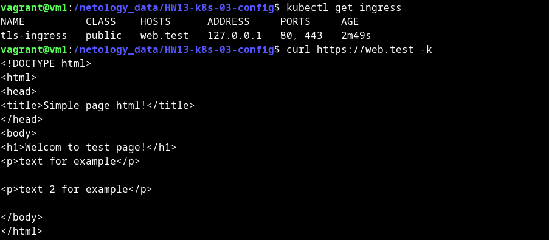

# Домашнее задание к занятию «Конфигурация приложений»

### Цель задания

В тестовой среде Kubernetes необходимо создать конфигурацию и продемонстрировать работу приложения.

------

### Чеклист готовности к домашнему заданию

1. Установленное K8s-решение (например, MicroK8s).
2. Установленный локальный kubectl.
3. Редактор YAML-файлов с подключённым GitHub-репозиторием.

------

### Инструменты и дополнительные материалы, которые пригодятся для выполнения задания

1. [Описание](https://kubernetes.io/docs/concepts/configuration/secret/) Secret.
2. [Описание](https://kubernetes.io/docs/concepts/configuration/configmap/) ConfigMap.
3. [Описание](https://github.com/wbitt/Network-MultiTool) Multitool.

------

### Задание 1. Создать Deployment приложения и решить возникшую проблему с помощью ConfigMap. Добавить веб-страницу

1. Создать Deployment приложения, состоящего из контейнеров busybox и multitool.
2. Решить возникшую проблему с помощью ConfigMap.
3. Продемонстрировать, что pod стартовал и оба конейнера работают.
4. Сделать простую веб-страницу и подключить её к Nginx с помощью ConfigMap. Подключить Service и показать вывод curl или в браузере.
5. Предоставить манифесты, а также скриншоты или вывод необходимых команд.

<details>
<summary>

</summary>

```bash
vagrant@vm1:/netology_data/HW13-k8s-03-config$ cat microk8s/deployment.yml 
apiVersion: apps/v1
kind: Deployment
metadata:
  name: lesson-deployment
  labels:
    app: lesson13-3
spec:
  replicas: 1
  selector:
    matchLabels:
      app: lesson13-3
  template:
    metadata:
      labels:
        app: lesson13-3
    spec:
      containers:
      - name: nginx
        image: nginx:1.14.2
        ports:
        - containerPort: 80
      - name: multitool
        image: wbitt/network-multitool
        envFrom:
          - configMapRef:
              name: my-configmap
              
vagrant@vm1:/netology_data/HW13-k8s-03-config$ cat microk8s/configmap.yml 
apiVersion: v1
kind: ConfigMap
metadata:
  name: my-configmap
data:
  HTTP_PORT: "1180"
  HTTPS_PORT: "11443"
  
vagrant@vm1:/netology_data/HW13-k8s-03-config$ kubectl get po
NAME                                 READY   STATUS    RESTARTS   AGE
lesson-deployment-6877f5fc8b-mpxtt   2/2     Running   0          34m

vagrant@vm1:/netology_data/HW13-k8s-03-config$ cat microk8s/cm-index.yml 
apiVersion: v1
kind: ConfigMap
metadata:
  name: cm-index
data:
  index.html: |
    <!DOCTYPE html>
    <html>
    <head>
    <title>Simple page html!</title>
    </head>
    <body>
    <h1>Welcom to test page!</h1>
    <p>text for example</p>

    <p>text 2 for example</p>

    </body>
    </html>

vagrant@vm1:/netology_data/HW13-k8s-03-config$ cat microk8s/deployment.yml 
apiVersion: apps/v1
kind: Deployment
metadata:
  name: lesson-deployment
  labels:
    app: lesson13-3
spec:
  replicas: 1
  selector:
    matchLabels:
      app: lesson13-3
  template:
    metadata:
      labels:
        app: lesson13-3
    spec:
      containers:
      - name: nginx
        image: nginx:1.14.2
        ports:
        - containerPort: 80
        volumeMounts:
        - mountPath: /usr/share/nginx/html/index.html
          subPath: index.html
          name: index-html
      - name: multitool
        image: wbitt/network-multitool
        envFrom:
          - configMapRef:
              name: my-configmap
      volumes:
      - name: index-html
        configMap:
          name: cm-index

vagrant@vm1:/netology_data/HW13-k8s-03-config$ kubectl get cm
NAME               DATA   AGE
kube-root-ca.crt   1      14d
my-configmap       2      83m
cm-index           1      8s

vagrant@vm1:/netology_data/HW13-k8s-03-config$ cat microk8s/service.yml 
apiVersion: v1
kind: Service
metadata:
  name: nginx-svc
spec:
  selector:
    app: lesson13-3
  ports:
    - name: http
      protocol: TCP
      port: 80
      targetPort: 80
    - name: https
      protocol: TCP
      port: 443
      targetPort: 443
    - name: http-m
      protocol: TCP
      port: 1180
      targetPort: 1180
    - name: https-m
      protocol: TCP
      port: 11443
      targetPort: 11443


vagrant@vm1:/netology_data/HW13-k8s-03-config$ kubectl get svc
NAME         TYPE        CLUSTER-IP       EXTERNAL-IP   PORT(S)                             AGE
kubernetes   ClusterIP   10.152.183.1     <none>        443/TCP                             14d
nginx-svc    ClusterIP   10.152.183.231   <none>        80/TCP,443/TCP,1180/TCP,11443/TCP   107s


vagrant@vm1:~$ kubectl port-forward --address 0.0.0.0 svc/nginx-svc 8888:80
Forwarding from 0.0.0.0:8888 -> 80
Handling connection for 8888

vagrant@vm1:/netology_data/HW13-k8s-03-config$ curl localhost:8888
<!DOCTYPE html>
<html>
<head>
<title>Simple page html!</title>
</head>
<body>
<h1>Welcom to test page!</h1>
<p>text for example</p>

<p>text 2 for example</p>

</body>
</html>


```


[deployment.yml](microk8s%2Fdeployment.yml)

[configmap.yml](microk8s%2Fconfigmap.yml)

[cm-index.yml](microk8s%2Fcm-index.yml)

[service.yml](microk8s%2Fservice.yml)

<details>
<summary>

Скриншоты

</summary>


</details>

</details>

------

### Задание 2. Создать приложение с вашей веб-страницей, доступной по HTTPS 

1. Создать Deployment приложения, состоящего из Nginx.
2. Создать собственную веб-страницу и подключить её как ConfigMap к приложению.
3. Выпустить самоподписной сертификат SSL. Создать Secret для использования сертификата.
4. Создать Ingress и необходимый Service, подключить к нему SSL в вид. Продемонстировать доступ к приложению по HTTPS. 
4. Предоставить манифесты, а также скриншоты или вывод необходимых команд.


<details>
<summary>

</summary>

```bash
vagrant@vm1:/netology_data/HW13-k8s-03-config$ cat microk8s/dep-nginx.yml 
apiVersion: apps/v1
kind: Deployment
metadata:
  name: nginx
  labels:
    app: nginx
spec:
  replicas: 1
  selector:
    matchLabels:
      app: nginx
  template:
    metadata:
      labels:
        app: nginx
    spec:
      containers:
      - name: nginx
        image: nginx:1.14.2
        ports:
        - containerPort: 80
        volumeMounts:
        - mountPath: /usr/share/nginx/html/index.html
          subPath: index.html
          name: index-html
      volumes:
      - name: index-html
        configMap:
          name: cm-index
vagrant@vm1:/netology_data/HW13-k8s-03-config$ cat microk8s/cm-index.yml 
apiVersion: v1
kind: ConfigMap
metadata:
  name: cm-index
data:
  index.html: |
    <!DOCTYPE html>
    <html>
    <head>
    <title>Simple page html!</title>
    </head>
    <body>
    <h1>Welcom to test page!</h1>
    <p>text for example</p>

    <p>text 2 for example</p>

    </body>
    </html>

vagrant@vm1:/netology_data/HW13-k8s-03-config$ kubectl get po
NAME                     READY   STATUS    RESTARTS   AGE
nginx-5fcd48f98b-5krwn   1/1     Running   0          22m

vagrant@vm1:/netology_data/HW13-k8s-03-config$ kubectl describe cm cm-index
Name:         cm-index
Namespace:    default
Labels:       <none>
Annotations:  <none>

Data
====
index.html:
----
<!DOCTYPE html>
<html>
<head>
<title>Simple page html!</title>
</head>
<body>
<h1>Welcom to test page!</h1>
<p>text for example</p>

<p>text 2 for example</p>

</body>
</html>


BinaryData
====

Events:  <none>


vagrant@vm1:/netology_data/HW13-k8s-03-config$ openssl req -x509 -nodes -days 365 -newkey rsa:2048 -keyout microk8s/server.key -out microk8s/server.pem -subj "/CN=web.test/O=web.test"
Generating a RSA private key
.......+++++
..................................................+++++
writing new private key to 'microk8s/server.key'
-----
vagrant@vm1:/netology_data/HW13-k8s-03-config$ ls microk8s/server*
microk8s/server.key  microk8s/server.pem

vagrant@vm1:/netology_data/HW13-k8s-03-config$ kubectl create secret tls tls-secret --key microk8s/server.key --cert microk8s/server.pem 
secret/tls-secret created

vagrant@vm1:/netology_data/HW13-k8s-03-config$ kubectl get secret tls-secret -o yaml
apiVersion: v1
data:
  tls.crt: LS0tLS1CRUdJTiBDRVJUSUZJQ0FURS0tLS0tCk1JSURMVENDQWhXZ0F3SUJBZ0lVUHNMMTRnZVlpSVdtVFlmMXIreVgzYmNzWnlvd0RRWUpLb1pJaHZjTkFRRUwKQlFBd0pqRVJNQThHQTFVRUF3d0lkMlZpTG5SbGMzUXhFVEFQQmdOVkJBb01DSGRsWWk1MFpYTjBNQjRYRFRJegpNVEF4TVRFMU1EZ3dNVm9YRFRJME1UQXhNREUxTURnd01Wb3dKakVSTUE4R0ExVUVBd3dJZDJWaUxuUmxjM1F4CkVUQVBCZ05WQkFvTUNIZGxZaTUwWlhOME1JSUJJakFOQmdrcWhraUc5dzBCQVFFRkFBT0NBUThBTUlJQkNnS0MKQVFFQXVycCt1dGZ5SEU2alA2Q3N2dld6WHZWaHhWekc5TEh3QitnaGFCazBETUJveTA2WDdrb05hOU9WR0FzYQpTSVdQQzM3QmpxaDhDenNVSzVabWppYnhha3FvQVlVVVlUMFlmTkN0dmdrejRVTEVXU3hDbHo5bE9BemdnWnJrCjNmdWJxbkNuY1loU3BwNTQzNDJVSDJGVWd0ZkQ0L0QwaWh5azdLVGxTZmt1SnhJdmpZK0RienY3OFd1MTBhc3QKS2Jta3l3YTNWOUNNS3M1ZERyYVgxaWNrbVQzczZDRFQwVmFqVVFYdWV6cVlUZEVpampmM2tUS1VBek0vMXdoQQo1a3JvM2poRGIxZ09qaFNDRFQ3V0V4aTQxbU5wdTVyOFdCTlJRMEQxdW5EaFNwdWlzMSt6dnhUeDM2ZFp4RC93CmkwOE44YU5CKzlGYUsvVnZYV3QwbVNBWm93SURBUUFCbzFNd1VUQWRCZ05WSFE0RUZnUVVnTVRLdlRzSTVZZ0YKNHBMVi94OWJJeUl2bkVNd0h3WURWUjBqQkJnd0ZvQVVnTVRLdlRzSTVZZ0Y0cExWL3g5Ykl5SXZuRU13RHdZRApWUjBUQVFIL0JBVXdBd0VCL3pBTkJna3Foa2lHOXcwQkFRc0ZBQU9DQVFFQU82VTJjQ040VzBvRGFCWXZHZ0k5CmRoUmlXV2VIQWowUVBWZWxBZ09RUEtPbmZOcFRQYW5mVGduWFJxN1JpNXZBRVRhckVZbi9aYnBiOU5ON2U5Y0wKS2lSdHpXelJpbURyMFJiOS9jcDBESkNkWExsWmQxRk5vSEFrQXFwRmR4UENEL3llZkRXckRxQmMrQkFUbDUyUgpCRi9WeVhiMVAvZkVTUUtvVXhudzBoZmFzUGpHWHRyMVFza29FYlQyVW52ektzQmdidjhCYkQ5b1Q1UXE2NlNMCmk1ZllEWldGRnVJajd5TTkrZExSVjBXeWVJaXZZVXoza1dXWUV1RVJCeVlJZGg1WTlTcEhQdGE1aW55VlEwcnQKTjl0bEJJM293REVKUXVrc2dhRGdqdFZaR3UrSjRtV3loZzJ2UWZEUml2QjB2RFFqbkpqajFxcXlCdmdMKzdTRwpoQT09Ci0tLS0tRU5EIENFUlRJRklDQVRFLS0tLS0K
  tls.key: LS0tLS1CRUdJTiBQUklWQVRFIEtFWS0tLS0tCk1JSUV2QUlCQURBTkJna3Foa2lHOXcwQkFRRUZBQVNDQktZd2dnU2lBZ0VBQW9JQkFRQzZ1bjY2MS9JY1RxTS8Kb0t5KzliTmU5V0hGWE1iMHNmQUg2Q0ZvR1RRTXdHakxUcGZ1U2cxcjA1VVlDeHBJaFk4TGZzR09xSHdMT3hRcgpsbWFPSnZGcVNxZ0JoUlJoUFJoODBLMitDVFBoUXNSWkxFS1hQMlU0RE9DQm11VGQrNXVxY0tkeGlGS21ubmpmCmpaUWZZVlNDMThQajhQU0tIS1RzcE9WSitTNG5FaStOajROdk8vdnhhN1hScXkwcHVhVExCcmRYMEl3cXpsME8KdHBmV0p5U1pQZXpvSU5QUlZxTlJCZTU3T3BoTjBTS09OL2VSTXBRRE16L1hDRURtU3VqZU9FTnZXQTZPRklJTgpQdFlUR0xqV1kybTdtdnhZRTFGRFFQVzZjT0ZLbTZLelg3Ty9GUEhmcDFuRVAvQ0xUdzN4bzBINzBWb3I5VzlkCmEzU1pJQm1qQWdNQkFBRUNnZ0VBYS81V014dVhnL1diQnI2WGllMnlLclpDTUpJQzR4eFNGVkNVbVk4U0FsbjUKZ2JQWHZOSUpSeFpjZ1VaU2tpVGtZU0tUTVQyU1dEQjM3dW1TTUo2bk92RW9qNUIzQS9JQXlwY3FGT0ZmcHVVbApoK2xJTGc5VkxBQ09pNGFZM1NXYWx3MkdXZXdjMlE2SUc4clhJdnI0bEovVFJHNWtEOGlYUGVIMFZqOE9DVHZHCmREeTY5UnFoZjc1N0ZkZ3M4bFMrNEt1R0ZtaUFlNjNNRFJud3ZwQXg2NERoM0xlR3VlckNvSmJlcEtmeCtHL00KbzdPQVFVbWpBTVZiajJrNS9YYkYrcUh4MXU3K3o0Qzd1YlJja1MxanYwMzN2UkxNTDhLWmhoVWVrVEFIQnJ3ZQpiSkVOd0lMQ0FMTjR0WTJKcGpWczAxclRlTitnM1B6SFVGZEYwOC9raVFLQmdRRHVvNDJHOHlVbnVhTDE5S1pUClZobEp6V0JxYkhVWjY5UXFJZERLNW9OSVVLdzVGd0crVGMrS1Vlblo1VE5RbVN0NWtFdG1CQUxuU1U4NVg1RDQKTXUrUFhUV0FnTnhqc2tES2U5YnlEcUhydXhPblNWRlpMb2pxTnhEMTVOK0lXTHJ0OEVBMEs5UmdDQStpdUFETQpydDFsQWI2RlNkM3JyM2QzUjJIRjJIK2c5d0tCZ1FESVVDZS9QV1RRZGNsclZYUzcwbFRwTWZvL3BDd0ZGQnQyCjhJNzFJOFozRTFrckU1RENUcWRLYWUzTXhDNk92OUFyZUh1VWJoLzdwczdaVm1MS0ZYdFR4Rmw1VTQ4ZE9PTksKV2Z6c3FMWE1DcWF5cEVBdngwd1VxQjFhaTlmS2hDOElPWHAxemhPci9hbUYxS2J4TlFzbGJnajh4NmF1RW1OSgoxakc3c3c5TnRRS0JnUURvWEg1ZzZYM0RLWUZncGVBU0F5TEtkdHlybzRGK1JOK29TcGJvQ2YzSXV5eUd4ajBmClZOcUJuM0xwaE1BcmVZa1liQVRPaDVkZ0owU3A0OERmdTVFQmNrdTNIVUg3SFVUekpCUk9TeXNrd2xySHA1ODcKREJHcXBRV3h1REpqcTZvUUpzQU5US1FWQWFSZjEzU0gyTGlnTWt1VnN6QVAzaUdnRmZSQTFhYW9Ud0ovTHZLYQpYamdGYU5ZeVh2V29abHpsaWNJczVMMlZrNXNpMUwyTXcrZWVuRW5zbkN2NXdaQ3RwTU11K004Q0duTGFWMVhsCm9PUXVtc3g5cm5LUXRNeFVHMDNwcW9YckJPNVFWeHpBS3JkZjVIS2FuMFBmeDFMdWdlamsrRlBPUDZpN1hUSWIKZ1lETEc0UllOd1dnR3VoVHRISVZxU2toNTZwbm11YVl3V1UyTVFLQmdRQ1VJN1libWU0L0MvYjJENlFBK2RGeQpzOFJlMHN1cDdvbUtCQ1VlT0k1blo4YUxKZ3JReDdTZGlKRG9iN0ZpZXo0dXFPYmh5aTBqaUlqaytWQ3JXOFZnCnQzTW82ZDBTMGtKWnNiZzdqb2xsWkU2K2M4VVFHNkZGR1lpSDdHTENLaWJLcEpvOFdYeW5iQnJKdU1OOU0yOGoKcnk2OVZwSERWeGhyaXA5bkYwRlo0dz09Ci0tLS0tRU5EIFBSSVZBVEUgS0VZLS0tLS0K
kind: Secret
metadata:
  creationTimestamp: "2023-10-12T10:36:13Z"
  name: tls-secret
  namespace: default
  resourceVersion: "2176064"
  uid: d77553d9-7d32-4f6d-9957-d0c1756682fe
type: kubernetes.io/tls

vagrant@vm1:/netology_data/HW13-k8s-03-config$ kubectl get svc
NAME         TYPE        CLUSTER-IP      EXTERNAL-IP   PORT(S)   AGE
kubernetes   ClusterIP   10.152.183.1    <none>        443/TCP   15d
svc-nginx    ClusterIP   10.152.183.42   <none>        80/TCP    4s

vagrant@vm1:/netology_data/HW13-k8s-03-config$ cat microk8s/svc-nginx.yml 
apiVersion: v1
kind: Service
metadata:
  name: svc-nginx
spec:
  selector:
    app: nginx
  ports:
    - name: http
      protocol: TCP
      port: 80
      targetPort: 80
      
vagrant@vm1:/netology_data/HW13-k8s-03-config$ kubectl get ingress 
NAME          CLASS    HOSTS      ADDRESS     PORTS     AGE
tls-ingress   public   web.test   127.0.0.1   80, 443   2m49s
      
^Cvagrant@vm1:/netology_data/HW13-k8s-03-config$ cat microk8s/ingress.yml 
apiVersion: networking.k8s.io/v1
kind: Ingress
metadata:
  name: tls-ingress
  annotations:
    nginx.ingress.kubernetes.io/rewrite-target: /
spec:
  tls:
  - hosts:
    - web.test
    secretName: tls-secret
  rules:
  - host: web.test
    http:
      paths:
      - path: /
        pathType: Prefix
        backend:
          service:
            name: svc-nginx
            port:
              number: 80

vagrant@vm1:/netology_data/HW13-k8s-03-config$ cat /etc/hosts | grep web
127.0.0.1 web.test

vagrant@vm1:/netology_data/HW13-k8s-03-config$ curl https://web.test -k
<!DOCTYPE html>
<html>
<head>
<title>Simple page html!</title>
</head>
<body>
<h1>Welcom to test page!</h1>
<p>text for example</p>

<p>text 2 for example</p>

</body>
</html>

```

[dep-nginx.yml](microk8s%2Fdep-nginx.yml)

[cm-index.yml](microk8s%2Fcm-index.yml)

[secret.yml](microk8s%2Fsecret.yml)

[svc-nginx.yml](microk8s%2Fsvc-nginx.yml)

[ingress.yml](microk8s%2Fingress.yml)

<details>
<summary>

Скриншоты

</summary>




</details>

</details>

------

### Правила приёма работы

1. Домашняя работа оформляется в своём GitHub-репозитории в файле README.md. Выполненное домашнее задание пришлите ссылкой на .md-файл в вашем репозитории.
2. Файл README.md должен содержать скриншоты вывода необходимых команд `kubectl`, а также скриншоты результатов.
3. Репозиторий должен содержать тексты манифестов или ссылки на них в файле README.md.

------