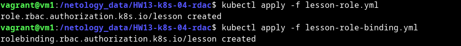

# Домашнее задание к занятию «Управление доступом»

### Цель задания

В тестовой среде Kubernetes нужно предоставить ограниченный доступ пользователю.

------

### Чеклист готовности к домашнему заданию

1. Установлено k8s-решение, например MicroK8S.
2. Установленный локальный kubectl.
3. Редактор YAML-файлов с подключённым github-репозиторием.

------

### Инструменты / дополнительные материалы, которые пригодятся для выполнения задания

1. [Описание](https://kubernetes.io/docs/reference/access-authn-authz/rbac/) RBAC.
2. [Пользователи и авторизация RBAC в Kubernetes](https://habr.com/ru/company/flant/blog/470503/).
3. [RBAC with Kubernetes in Minikube](https://medium.com/@HoussemDellai/rbac-with-kubernetes-in-minikube-4deed658ea7b).

------

### Задание 1. Создайте конфигурацию для подключения пользователя

1. Создайте и подпишите SSL-сертификат для подключения к кластеру.
2. Настройте конфигурационный файл kubectl для подключения.
3. Создайте роли и все необходимые настройки для пользователя.
4. Предусмотрите права пользователя. Пользователь может просматривать логи подов и их конфигурацию (`kubectl logs pod <pod_id>`, `kubectl describe pod <pod_id>`).
5. Предоставьте манифесты и скриншоты и/или вывод необходимых команд.


<details>
<summary>

</summary>

<details>
<summary>

1

</summary>

```bash
vagrant@vm1:/netology_data/HW13-k8s-04-rdac$ openssl genrsa -out lesson.key 2048
Generating RSA private key, 2048 bit long modulus (2 primes)
.......................+++++
......................................+++++
e is 65537 (0x010001)
vagrant@vm1:/netology_data/HW13-k8s-04-rdac$ openssl req -new -key lesson.key -out lesson.csr -subj "/CN=lesson/O=netology"
vagrant@vm1:/netology_data/HW13-k8s-04-rdac$ ls | grep lesson
lesson.csr
lesson.key
vagrant@vm1:/netology_data/HW13-k8s-04-rdac$ openssl x509 -req -in lesson.csr -CA /var/snap/microk8s/current/certs/ca.crt -CAkey /var/snap/microk8s/current/certs/ca.key -CAcreateserial -out lesson.crt -days 500
Signature ok
subject=CN = lesson, O = netology
Getting CA Private Key
vagrant@vm1:/netology_data/HW13-k8s-04-rdac$ ls | grep lesson
lesson.crt
lesson.csr
lesson.key

```

</details>

<details>
<summary>

2

</summary>

```bash
vagrant@vm1:/netology_data/HW13-k8s-04-rdac$ kubectl config set-credentials lesson --client-certificate=lesson.crt --client-key=lesson.key --embed-certs=true
User "lesson" set.
vagrant@vm1:/netology_data/HW13-k8s-04-rdac$ kubectl config set-context lesson --cluster=microk8s-cluster --user=lesson
Context "lesson" created.
vagrant@vm1:/netology_data/HW13-k8s-04-rdac$ kubectl config get-contexts
CURRENT   NAME       CLUSTER            AUTHINFO   NAMESPACE
          lesson     microk8s-cluster   lesson     
*         microk8s   microk8s-cluster   admin      

```

</details>

<details>
<summary>

3

</summary>

```bash
vagrant@vm1:/netology_data/HW13-k8s-04-rdac$ kubectl apply -f lesson-role.yml 
role.rbac.authorization.k8s.io/lesson created
vagrant@vm1:/netology_data/HW13-k8s-04-rdac$ kubectl apply -f lesson-role-binding.yml 
rolebinding.rbac.authorization.k8s.io/lesson created
vagrant@vm1:/netology_data/HW13-k8s-04-rdac$ cat lesson-role.yml 
apiVersion: rbac.authorization.k8s.io/v1
kind: Role
metadata:
  name: lesson
  namespace: default
rules:
- apiGroups: [""]
  resources: ["pods", "pods/log", "pods/describe"]
  verbs: ["get", "watch", "list"] 
vagrant@vm1:/netology_data/HW13-k8s-04-rdac$ cat lesson-role-binding.yml 
apiVersion: rbac.authorization.k8s.io/v1
kind: RoleBinding
metadata:
  name: lesson
  namespace: default
subjects:
- kind: User
  name: lesson
  apiGroup: rbac.authorization.k8s.io
roleRef:
  kind: Role
  name: lesson
  apiGroup: rbac.authorization.k8s.io
```

</details>

<details>
<summary>

4

</summary>

```bash
vagrant@vm1:/netology_data/HW13-k8s-04-rdac$ microk8s status
microk8s is running
high-availability: no
  datastore master nodes: 127.0.0.1:19001
  datastore standby nodes: none
addons:
  enabled:
    dashboard            # (core) The Kubernetes dashboard
    dns                  # (core) CoreDNS
    ha-cluster           # (core) Configure high availability on the current node
    helm                 # (core) Helm - the package manager for Kubernetes
    helm3                # (core) Helm 3 - the package manager for Kubernetes
    hostpath-storage     # (core) Storage class; allocates storage from host directory
    ingress              # (core) Ingress controller for external access
    metrics-server       # (core) K8s Metrics Server for API access to service metrics
    storage              # (core) Alias to hostpath-storage add-on, deprecated
  disabled:
    cert-manager         # (core) Cloud native certificate management
    community            # (core) The community addons repository
    gpu                  # (core) Automatic enablement of Nvidia CUDA
    host-access          # (core) Allow Pods connecting to Host services smoothly
    kube-ovn             # (core) An advanced network fabric for Kubernetes
    mayastor             # (core) OpenEBS MayaStor
    metallb              # (core) Loadbalancer for your Kubernetes cluster
    minio                # (core) MinIO object storage
    observability        # (core) A lightweight observability stack for logs, traces and metrics
    prometheus           # (core) Prometheus operator for monitoring and logging
    rbac                 # (core) Role-Based Access Control for authorisation
    registry             # (core) Private image registry exposed on localhost:32000
vagrant@vm1:/netology_data/HW13-k8s-04-rdac$ microk8s enable rbac
Infer repository core for addon rbac
Enabling RBAC
Reconfiguring apiserver
Restarting apiserver
RBAC is enabled
vagrant@vm1:/netology_data/HW13-k8s-04-rdac$ kubectl config get-contexts
CURRENT   NAME       CLUSTER            AUTHINFO   NAMESPACE
          lesson     microk8s-cluster   lesson     
*         microk8s   microk8s-cluster   admin  
vagrant@vm1:/netology_data/HW13-k8s-04-rdac$ kubectl config use-context lesson
Switched to context "lesson".
vagrant@vm1:/netology_data/HW13-k8s-04-rdac$ kubectl get pod
NAME        READY   STATUS    RESTARTS   AGE
multitool   1/1     Running   0          5m6s
vagrant@vm1:/netology_data/HW13-k8s-04-rdac$ kubectl logs pod/multitool
The directory /usr/share/nginx/html is not mounted.
Therefore, over-writing the default index.html file with some useful information:
WBITT Network MultiTool (with NGINX) - multitool - 10.1.225.22 - HTTP: 80 , HTTPS: 443 . (Formerly praqma/network-multitool)
vagrant@vm1:/netology_data/HW13-k8s-04-rdac$ kubectl describe pod/multitool
Name:             multitool
Namespace:        default
Priority:         0
Service Account:  default
Node:             vm1/10.0.2.15
Start Time:       Tue, 31 Oct 2023 10:05:43 +0000
Labels:           app=multitool
Annotations:      cni.projectcalico.org/containerID: b4f1cef906931fa140e3b27b4c5f64ba298016308c4a82e7eabc760b29f0e249
                  cni.projectcalico.org/podIP: 10.1.225.22/32
                  cni.projectcalico.org/podIPs: 10.1.225.22/32
Status:           Running
IP:               10.1.225.22
IPs:
  IP:  10.1.225.22
Containers:
  multitool:
    Container ID:   containerd://a5f43938e45809260f7f6e66d83879058d494fbd4005d840850c0cac04f14260
    Image:          wbitt/network-multitool
    Image ID:       docker.io/wbitt/network-multitool@sha256:d1137e87af76ee15cd0b3d4c7e2fcd111ffbd510ccd0af076fc98dddfc50a735
    Port:           <none>
    Host Port:      <none>
    State:          Running
      Started:      Tue, 31 Oct 2023 10:05:47 +0000
    Ready:          True
    Restart Count:  0
    Environment:    <none>
    Mounts:
      /var/run/secrets/kubernetes.io/serviceaccount from kube-api-access-dsdk8 (ro)
Conditions:
  Type              Status
  Initialized       True 
  Ready             True 
  ContainersReady   True 
  PodScheduled      True 
Volumes:
  kube-api-access-dsdk8:
    Type:                    Projected (a volume that contains injected data from multiple sources)
    TokenExpirationSeconds:  3607
    ConfigMapName:           kube-root-ca.crt
    ConfigMapOptional:       <nil>
    DownwardAPI:             true
QoS Class:                   BestEffort
Node-Selectors:              <none>
Tolerations:                 node.kubernetes.io/not-ready:NoExecute op=Exists for 300s
                             node.kubernetes.io/unreachable:NoExecute op=Exists for 300s
Events:                      <none>
vagrant@vm1:/netology_data/HW13-k8s-04-rdac$ kubectl get nodes
Error from server (Forbidden): nodes is forbidden: User "lesson" cannot list resource "nodes" in API group "" at the cluster scope

```

</details>

[lesson-role.yml](lesson-role.yml)

[lesson-role-binding.yml](lesson-role-binding.yml)

<details>
<summary>

скриншоты

</summary>





</details>

</details>

------

### Правила приёма работы

1. Домашняя работа оформляется в своём Git-репозитории в файле README.md. Выполненное домашнее задание пришлите ссылкой на .md-файл в вашем репозитории.
2. Файл README.md должен содержать скриншоты вывода необходимых команд `kubectl`, скриншоты результатов.
3. Репозиторий должен содержать тексты манифестов или ссылки на них в файле README.md.