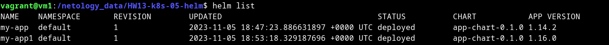
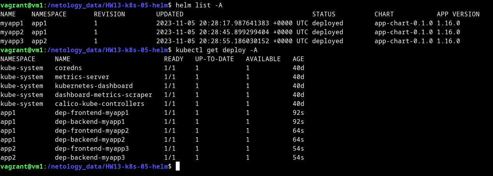

# Домашнее задание к занятию «Helm»

### Цель задания

В тестовой среде Kubernetes необходимо установить и обновить приложения с помощью Helm.

------

### Чеклист готовности к домашнему заданию

1. Установленное k8s-решение, например, MicroK8S.
2. Установленный локальный kubectl.
3. Установленный локальный Helm.
4. Редактор YAML-файлов с подключенным репозиторием GitHub.

------

### Инструменты и дополнительные материалы, которые пригодятся для выполнения задания

1. [Инструкция](https://helm.sh/docs/intro/install/) по установке Helm. [Helm completion](https://helm.sh/docs/helm/helm_completion/).

------

### Задание 1. Подготовить Helm-чарт для приложения

1. Необходимо упаковать приложение в чарт для деплоя в разные окружения. 
2. Каждый компонент приложения деплоится отдельным deployment’ом или statefulset’ом.
3. В переменных чарта измените образ приложения для изменения версии.

<details>
<summary>

</summary>

```bash
vagrant@vm1:/netology_data/HW13-k8s-05-helm$ helm install my-app app-chart/
NAME: my-app
LAST DEPLOYED: Sun Nov  5 16:58:43 2023
NAMESPACE: default
STATUS: deployed
REVISION: 1
TEST SUITE: None
vagrant@vm1:/netology_data/HW13-k8s-05-helm$ helm list
NAME  	NAMESPACE	REVISION	UPDATED                                	STATUS  	CHART          	APP VERSION
my-app	default  	1       	2023-11-05 16:58:43.322454582 +0000 UTC	deployed	app-chart-0.1.0	1.14.2     

vagrant@vm1:/netology_data/HW13-k8s-05-helm$ cat app-chart/values.yaml 
# Default values for my-app-chart.
# This is a YAML-formatted file.
# Declare variables to be passed into your templates.

replicaCount: 1

image:
  frontend:
    repository: nginx
    # Overrides the image tag whose default is the chart appVersion.
    tag: ""
  backend:
    repository: wbitt/network-multitool
    tag: "latest"

volumes:
  mountPath: /usr/share/nginx/html/
  subPath: index.html

ingress:
  hostname: web.test
  rwtarget: /
  frontPath: /
  backPath: /api
  pathType: Prefix

service:
  port: 80
  targetPort: 80

data:
  index: |
    <!DOCTYPE html>
    <html>
    <head>
    <title>Simple page html!</title>
    </head>
    <body>
    <h1>Welcom to test page!</h1>
    <p>text for example</p>

    <p>text 2 for example</p>

    </body>
    </html>
    
vagrant@vm1:/netology_data/HW13-k8s-05-helm$ cat app-chart/Chart.yaml 
apiVersion: v2
name: app-chart
description: A Helm chart for Kubernetes
type: application
version: 0.1.0
appVersion: "1.14.2"

vagrant@vm1:/netology_data/HW13-k8s-05-helm$ cat app-chart/templates/dep-frontend.yaml 
apiVersion: apps/v1
kind: Deployment
metadata:
  name: dep-frontend-{{ .Release.Name }}
  labels:
    app: dep-frontend-{{ .Release.Name }}
spec:
  replicas: {{ .Values.replicaCount }}
  selector:
    matchLabels:
      app: frontend-{{ .Release.Name }}
  template:
    metadata:
      labels:
        app: frontend-{{ .Release.Name }}
    spec:
      containers:
      - name: frontend-{{ .Release.Name }}
        image: "{{ .Values.image.frontend.repository }}:{{ .Values.image.frontend.tag | default .Chart.AppVersion }}"
        ports:
        - name: http
          containerPort: {{ .Values.service.port }}
          protocol: TCP
        volumeMounts:
        - mountPath: "{{ .Values.volumes.mountPath }}{{ .Values.volumes.subPath }}"
          subPath: {{ .Values.volumes.subPath }}
          name: index-html
      volumes:
      - name: index-html
        configMap:
          name: cm-index
vagrant@vm1:/netology_data/HW13-k8s-05-helm$ cat app-chart/templates/dep-backend.yaml 
apiVersion: apps/v1
kind: Deployment
metadata:
  name: dep-backend-{{ .Release.Name }}
  labels:
    app: dep-backend-{{ .Release.Name }}
spec:
  replicas: {{ .Values.replicaCount }}
  selector:
    matchLabels:
      app: backend-{{ .Release.Name }}
  template:
    metadata:
      labels:
        app: backend-{{ .Release.Name }}
    spec:
      containers:
      - name: backend-{{ .Release.Name }}
        image: "{{ .Values.image.backend.repository }}:{{ .Values.image.backend.tag }}"
        ports:
        - name: http
          containerPort: {{ .Values.service.port }}
          protocol: TCP
vagrant@vm1:/netology_data/HW13-k8s-05-helm$ cat app-chart/templates/service.yaml 
apiVersion: v1
kind: Service
metadata:
  name: frontend-svc-{{ .Release.Name }}
spec:
  selector:
    app: frontend-{{ .Release.Name }}
  ports:
    - name: http
      protocol: TCP
      port: {{ .Values.service.port }}
      targetPort: {{ .Values.service.targetPort }}
---
apiVersion: v1
kind: Service
metadata:
  name: backend-svc-{{ .Release.Name }}
spec:
  selector:
    app: backend-{{ .Release.Name }}
  ports:
    - name: http
      protocol: TCP
      port: {{ .Values.service.port }}
      targetPort: {{ .Values.service.targetPort }}
vagrant@vm1:/netology_data/HW13-k8s-05-helm$ cat app-chart/templates/ingress.yaml 
apiVersion: networking.k8s.io/v1
kind: Ingress
metadata:
  name: ingress-{{ .Release.Name }}
  annotations:
    nginx.ingress.kubernetes.io/rewrite-target: {{ .Values.ingress.rwtarget }}
spec:
  rules:
  - host: {{ .Values.ingress.hostname }}
    http:
      paths:
      - path: {{ .Values.ingress.frontPath }}
        pathType: {{ .Values.ingress.pathType }}
        backend:
          service:
            name: frontend-svc-{{ .Release.Name }}
            port:
              number: {{ .Values.service.port }}
      - path: {{ .Values.ingress.backPath }}
        pathType: {{ .Values.ingress.pathType }}
        backend:
          service:
            name: backend-svc-{{ .Release.Name }}
            port:
              number: {{ .Values.service.port }}
vagrant@vm1:/netology_data/HW13-k8s-05-helm$ cat app-chart/templates/cm-index.yaml 
apiVersion: v1
kind: ConfigMap
metadata:
  name: cm-index-{{ .Release.Name }}
data:
  index.html: "{{ .Values.data.index }}"

vagrant@vm1:/netology_data/HW13-k8s-05-helm$ kubectl get po
NAME                                  READY   STATUS    RESTARTS   AGE
dep-frontend-my-app-8b66db994-qjvxk   1/1     Running   0          12s
dep-backend-my-app-6947cdd5b4-wffpw   1/1     Running   0          12s
vagrant@vm1:/netology_data/HW13-k8s-05-helm$ kubectl get deployments
NAME                  READY   UP-TO-DATE   AVAILABLE   AGE
dep-frontend-my-app   1/1     1            1           19m
dep-backend-my-app    1/1     1            1           19m
     
```

В переменных чарта измените образ приложения для изменения версии:


```bash
vagrant@vm1:/netology_data/HW13-k8s-05-helm$ helm install my-app1 app-chart/ 
NAME: my-app1
LAST DEPLOYED: Sun Nov  5 18:53:18 2023
NAMESPACE: default
STATUS: deployed
REVISION: 1
TEST SUITE: None
vagrant@vm1:/netology_data/HW13-k8s-05-helm$ helm list
NAME   	NAMESPACE	REVISION	UPDATED                                	STATUS  	CHART          	APP VERSION
my-app 	default  	1       	2023-11-05 18:47:23.886631897 +0000 UTC	deployed	app-chart-0.1.0	1.14.2     
my-app1	default  	1       	2023-11-05 18:53:18.329187696 +0000 UTC	deployed	app-chart-0.1.0	1.16.0    
```



```bash
vagrant@vm1:/netology_data/HW13-k8s-05-helm$ helm package app-chart/
Successfully packaged chart and saved it to: /netology_data/HW13-k8s-05-helm/app-chart-0.1.0.tgz
vagrant@vm1:/netology_data/HW13-k8s-05-helm$ ls
app-chart  app-chart-0.1.0.tgz  img_1.png  img_2.png  img.png  my-app  README.md
vagrant@vm1:/netology_data/HW13-k8s-05-helm$ helm install app4 app-chart-0.1.0.tgz 
NAME: app4
LAST DEPLOYED: Sun Nov  5 20:24:34 2023
NAMESPACE: default
STATUS: deployed
REVISION: 1
TEST SUITE: None
vagrant@vm1:/netology_data/HW13-k8s-05-helm$ helm list
NAME	NAMESPACE	REVISION	UPDATED                                	STATUS  	CHART          	APP VERSION
app4	default  	1       	2023-11-05 20:24:34.087281482 +0000 UTC	deployed	app-chart-0.1.0	1.16.0
```

[app-chart](app-chart)

</details>

------
### Задание 2. Запустить две версии в разных неймспейсах

1. Подготовив чарт, необходимо его проверить. Запуститe несколько копий приложения.
2. Одну версию в namespace=app1, вторую версию в том же неймспейсе, третью версию в namespace=app2.
3. Продемонстрируйте результат.

<details>
<summary>

</summary>

```bash
vagrant@vm1:/netology_data/HW13-k8s-05-helm$ helm install myapp1 app-chart-0.1.0.tgz --create-namespace --namespace app1
NAME: myapp1
LAST DEPLOYED: Sun Nov  5 20:28:17 2023
NAMESPACE: app1
STATUS: deployed
REVISION: 1
TEST SUITE: None
vagrant@vm1:/netology_data/HW13-k8s-05-helm$ helm list -n app1
NAME  	NAMESPACE	REVISION	UPDATED                                	STATUS  	CHART          	APP VERSION
myapp1	app1     	1       	2023-11-05 20:28:17.987641383 +0000 UTC	deployed	app-chart-0.1.0	1.16.0     
vagrant@vm1:/netology_data/HW13-k8s-05-helm$ helm install myapp2 app-chart-0.1.0.tgz  --namespace app1
NAME: myapp2
LAST DEPLOYED: Sun Nov  5 20:28:45 2023
NAMESPACE: app1
STATUS: deployed
REVISION: 1
TEST SUITE: None
vagrant@vm1:/netology_data/HW13-k8s-05-helm$ helm install myapp3 app-chart-0.1.0.tgz  --namespace app2
NAME: myapp3
LAST DEPLOYED: Sun Nov  5 20:28:55 2023
NAMESPACE: app2
STATUS: deployed
REVISION: 1
TEST SUITE: None
vagrant@vm1:/netology_data/HW13-k8s-05-helm$ helm list -A
NAME  	NAMESPACE	REVISION	UPDATED                                	STATUS  	CHART          	APP VERSION
myapp1	app1     	1       	2023-11-05 20:28:17.987641383 +0000 UTC	deployed	app-chart-0.1.0	1.16.0     
myapp2	app1     	1       	2023-11-05 20:28:45.899299404 +0000 UTC	deployed	app-chart-0.1.0	1.16.0     
myapp3	app2     	1       	2023-11-05 20:28:55.186030152 +0000 UTC	deployed	app-chart-0.1.0	1.16.0     
vagrant@vm1:/netology_data/HW13-k8s-05-helm$ kubectl get deploy -A
NAMESPACE     NAME                        READY   UP-TO-DATE   AVAILABLE   AGE
kube-system   coredns                     1/1     1            1           40d
kube-system   metrics-server              1/1     1            1           40d
kube-system   kubernetes-dashboard        1/1     1            1           40d
kube-system   dashboard-metrics-scraper   1/1     1            1           40d
kube-system   calico-kube-controllers     1/1     1            1           40d
app1          dep-frontend-myapp1         1/1     1            1           92s
app1          dep-backend-myapp1          1/1     1            1           92s
app1          dep-frontend-myapp2         1/1     1            1           64s
app1          dep-backend-myapp2          1/1     1            1           64s
app2          dep-frontend-myapp3         1/1     1            1           54s
app2          dep-backend-myapp3          1/1     1            1           54s
 
```



</details>


### Правила приёма работы

1. Домашняя работа оформляется в своём Git репозитории в файле README.md. Выполненное домашнее задание пришлите ссылкой на .md-файл в вашем репозитории.
2. Файл README.md должен содержать скриншоты вывода необходимых команд `kubectl`, `helm`, а также скриншоты результатов.
3. Репозиторий должен содержать тексты манифестов или ссылки на них в файле README.md.
