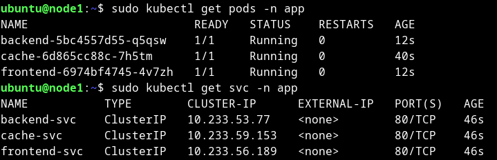
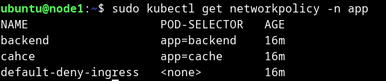
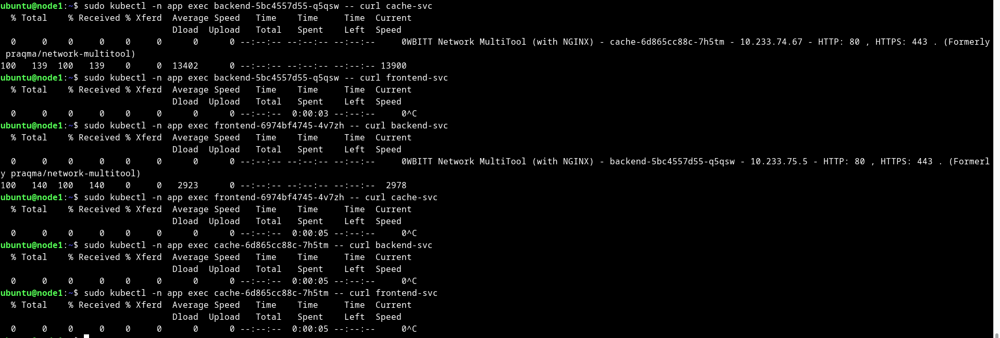

# Домашнее задание к занятию «Как работает сеть в K8s»

### Цель задания

Настроить сетевую политику доступа к подам.

### Чеклист готовности к домашнему заданию

1. Кластер K8s с установленным сетевым плагином Calico.

### Инструменты и дополнительные материалы, которые пригодятся для выполнения задания

1. [Документация Calico](https://www.tigera.io/project-calico/).
2. [Network Policy](https://kubernetes.io/docs/concepts/services-networking/network-policies/).
3. [About Network Policy](https://docs.projectcalico.org/about/about-network-policy).

-----

### Задание 1. Создать сетевую политику или несколько политик для обеспечения доступа

1. Создать deployment'ы приложений frontend, backend и cache и соответсвующие сервисы.
2. В качестве образа использовать network-multitool.
3. Разместить поды в namespace App.
4. Создать политики, чтобы обеспечить доступ frontend -> backend -> cache. Другие виды подключений должны быть запрещены.
5. Продемонстрировать, что трафик разрешён и запрещён.

<details>
<summary>
Ответ

</summary>

[create-ns.yml](create-ns.yml)

[deployment.yml](deployment.yml)

```bash
ubuntu@node1:~$ sudo kubectl get pods -n app
NAME                        READY   STATUS    RESTARTS   AGE
backend-5bc4557d55-q5qsw    1/1     Running   0          12s
cache-6d865cc88c-7h5tm      1/1     Running   0          40s
frontend-6974bf4745-4v7zh   1/1     Running   0          12s
ubuntu@node1:~$ sudo kubectl get svc -n app
NAME           TYPE        CLUSTER-IP      EXTERNAL-IP   PORT(S)   AGE
backend-svc    ClusterIP   10.233.53.77    <none>        80/TCP    46s
cache-svc      ClusterIP   10.233.59.153   <none>        80/TCP    46s
frontend-svc   ClusterIP   10.233.56.189   <none>        80/TCP    46s

```

[networkpolicy.yml](networkpolicy.yml)

```bash
ubuntu@node1:~$ sudo kubectl get networkpolicy -n app
NAME                   POD-SELECTOR   AGE
backend                app=backend    16m
cahce                  app=cache      16m
default-deny-ingress   <none>         16m

```

```bash
ubuntu@node1:~$ sudo kubectl -n app exec backend-5bc4557d55-q5qsw -- curl cache-svc
  % Total    % Received % Xferd  Average Speed   Time    Time     Time  Current
                                 Dload  Upload   Total   Spent    Left  Speed
  0     0    0     0    0     0      0      0 --:--:-- --:--:-- --:--:--     0WBITT Network MultiTool (with NGINX) - cache-6d865cc88c-7h5tm - 10.233.74.67 - HTTP: 80 , HTTPS: 443 . (Formerly praqma/network-multitool)
100   139  100   139    0     0  13402      0 --:--:-- --:--:-- --:--:-- 13900
ubuntu@node1:~$ sudo kubectl -n app exec backend-5bc4557d55-q5qsw -- curl frontend-svc
  % Total    % Received % Xferd  Average Speed   Time    Time     Time  Current
                                 Dload  Upload   Total   Spent    Left  Speed
  0     0    0     0    0     0      0      0 --:--:--  0:00:03 --:--:--     0^C
ubuntu@node1:~$ sudo kubectl -n app exec frontend-6974bf4745-4v7zh -- curl backend-svc
  % Total    % Received % Xferd  Average Speed   Time    Time     Time  Current
                                 Dload  Upload   Total   Spent    Left  Speed
  0     0    0     0    0     0      0      0 --:--:-- --:--:-- --:--:--     0WBITT Network MultiTool (with NGINX) - backend-5bc4557d55-q5qsw - 10.233.75.5 - HTTP: 80 , HTTPS: 443 . (Formerly praqma/network-multitool)
100   140  100   140    0     0   2923      0 --:--:-- --:--:-- --:--:--  2978
ubuntu@node1:~$ sudo kubectl -n app exec frontend-6974bf4745-4v7zh -- curl cache-svc
  % Total    % Received % Xferd  Average Speed   Time    Time     Time  Current
                                 Dload  Upload   Total   Spent    Left  Speed
  0     0    0     0    0     0      0      0 --:--:--  0:00:05 --:--:--     0^C
ubuntu@node1:~$ sudo kubectl -n app exec cache-6d865cc88c-7h5tm -- curl backend-svc
  % Total    % Received % Xferd  Average Speed   Time    Time     Time  Current
                                 Dload  Upload   Total   Spent    Left  Speed
  0     0    0     0    0     0      0      0 --:--:--  0:00:05 --:--:--     0^C
ubuntu@node1:~$ sudo kubectl -n app exec cache-6d865cc88c-7h5tm -- curl frontend-svc
  % Total    % Received % Xferd  Average Speed   Time    Time     Time  Current
                                 Dload  Upload   Total   Spent    Left  Speed
  0     0    0     0    0     0      0      0 --:--:--  0:00:05 --:--:--     0^C

```

<details>
<summary>
Скриншоты:

</summary>







</details>

</details>

### Правила приёма работы

1. Домашняя работа оформляется в своём Git-репозитории в файле README.md. Выполненное домашнее задание пришлите ссылкой на .md-файл в вашем репозитории.
2. Файл README.md должен содержать скриншоты вывода необходимых команд, а также скриншоты результатов.
3. Репозиторий должен содержать тексты манифестов или ссылки на них в файле README.md.