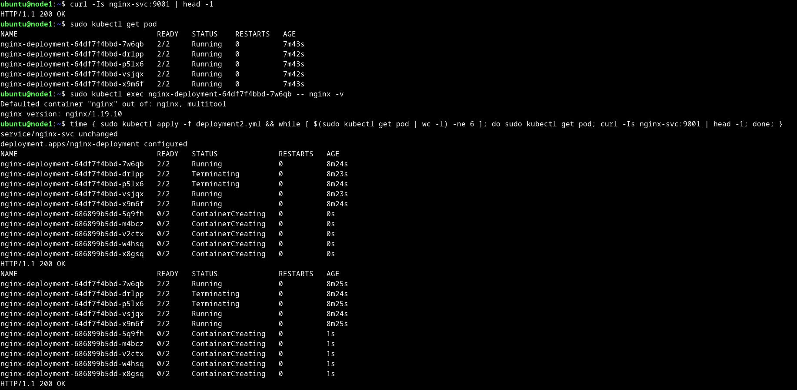
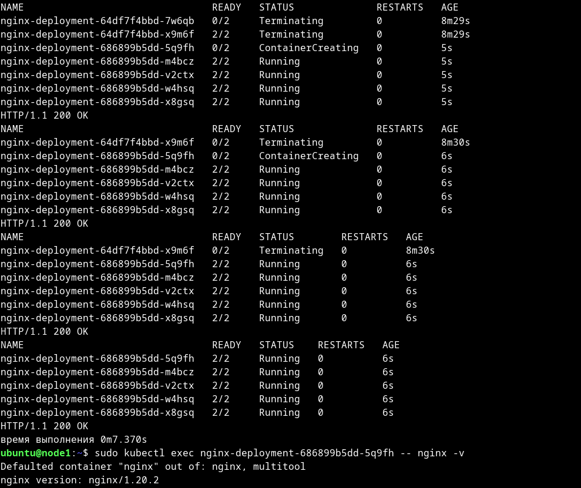
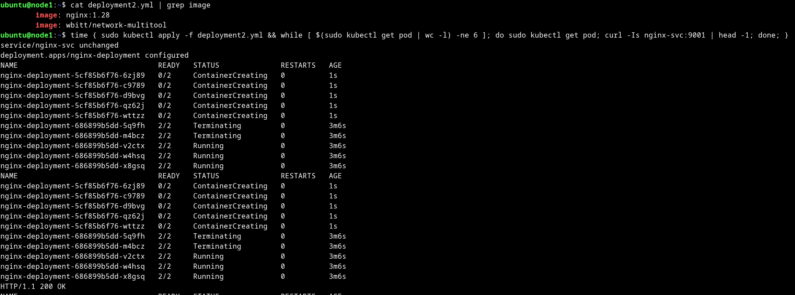
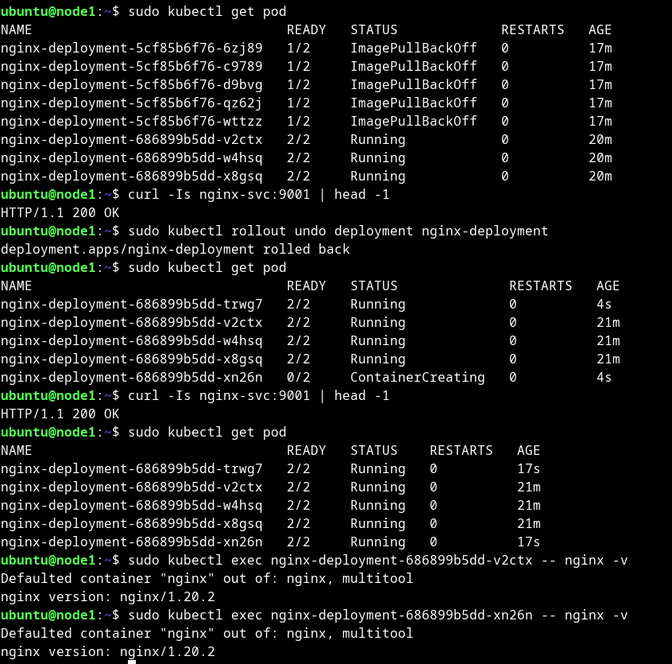
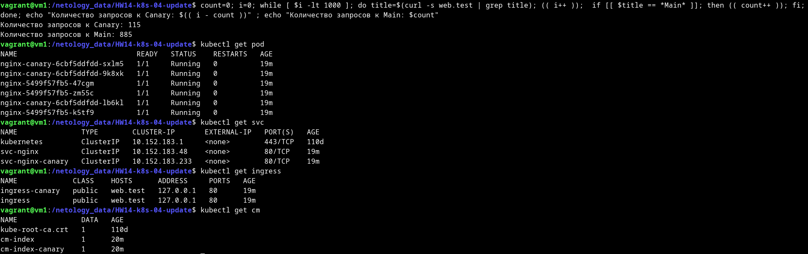

# Домашнее задание к занятию «Обновление приложений»

### Цель задания

Выбрать и настроить стратегию обновления приложения.

### Чеклист готовности к домашнему заданию

1. Кластер K8s.

### Инструменты и дополнительные материалы, которые пригодятся для выполнения задания

1. [Документация Updating a Deployment](https://kubernetes.io/docs/concepts/workloads/controllers/deployment/#updating-a-deployment).
2. [Статья про стратегии обновлений](https://habr.com/ru/companies/flant/articles/471620/).

-----

### Задание 1. Выбрать стратегию обновления приложения и описать ваш выбор

1. Имеется приложение, состоящее из нескольких реплик, которое требуется обновить.
2. Ресурсы, выделенные для приложения, ограничены, и нет возможности их увеличить.
3. Запас по ресурсам в менее загруженный момент времени составляет 20%.
4. Обновление мажорное, новые версии приложения не умеют работать со старыми.
5. Вам нужно объяснить свой выбор стратегии обновления приложения.

<details>
<summary>
Ответ:

</summary>


```text
Т.к. ресурсы ограничены, и нет возможности их увеличить, то единственный метод обновления который подходит без 
дополнительных уточнений, это Recreate. При этом методе сначала убиваются все старые приложения, потом стартуют новые -
это удовлетворяется условию, ограниченности ресурсов, несовместимости версий приложений. Так же не выставлено
требование постоянной доступности приложения. Значит, есть временной промежуток для обслуживания или кратковременная 
остановка приложения не критична.
```


</details>

### Задание 2. Обновить приложение

1. Создать deployment приложения с контейнерами nginx и multitool. Версию nginx взять 1.19. Количество реплик — 5.
2. Обновить версию nginx в приложении до версии 1.20, сократив время обновления до минимума. Приложение должно быть доступно.
3. Попытаться обновить nginx до версии 1.28, приложение должно оставаться доступным.
4. Откатиться после неудачного обновления.

<details>
<summary>
Ответ:

</summary>

```bash
ubuntu@node1:~$ curl -Is nginx-svc:9001 | head -1
HTTP/1.1 200 OK
ubuntu@node1:~$ sudo kubectl get pod
NAME                                READY   STATUS    RESTARTS   AGE
nginx-deployment-64df7f4bbd-7w6qb   2/2     Running   0          7m43s
nginx-deployment-64df7f4bbd-drlpp   2/2     Running   0          7m42s
nginx-deployment-64df7f4bbd-p5lx6   2/2     Running   0          7m43s
nginx-deployment-64df7f4bbd-vsjqx   2/2     Running   0          7m42s
nginx-deployment-64df7f4bbd-x9m6f   2/2     Running   0          7m43s
ubuntu@node1:~$ sudo kubectl exec nginx-deployment-64df7f4bbd-7w6qb -- nginx -v
Defaulted container "nginx" out of: nginx, multitool
nginx version: nginx/1.19.10
ubuntu@node1:~$ time { sudo kubectl apply -f deployment2.yml && while [ $(sudo kubectl get pod | wc -l) -ne 6 ]; do sudo kubectl get pod; curl -Is nginx-svc:9001 | head -1; done; }
service/nginx-svc unchanged
deployment.apps/nginx-deployment configured
NAME                                READY   STATUS              RESTARTS   AGE
nginx-deployment-64df7f4bbd-7w6qb   2/2     Running             0          8m24s
nginx-deployment-64df7f4bbd-drlpp   2/2     Terminating         0          8m23s
nginx-deployment-64df7f4bbd-p5lx6   2/2     Terminating         0          8m24s
nginx-deployment-64df7f4bbd-vsjqx   2/2     Running             0          8m23s
nginx-deployment-64df7f4bbd-x9m6f   2/2     Running             0          8m24s
nginx-deployment-686899b5dd-5q9fh   0/2     ContainerCreating   0          0s
nginx-deployment-686899b5dd-m4bcz   0/2     ContainerCreating   0          0s
nginx-deployment-686899b5dd-v2ctx   0/2     ContainerCreating   0          0s
nginx-deployment-686899b5dd-w4hsq   0/2     ContainerCreating   0          0s
nginx-deployment-686899b5dd-x8gsq   0/2     ContainerCreating   0          0s
HTTP/1.1 200 OK
NAME                                READY   STATUS              RESTARTS   AGE
nginx-deployment-64df7f4bbd-7w6qb   2/2     Running             0          8m25s
nginx-deployment-64df7f4bbd-drlpp   2/2     Terminating         0          8m24s
nginx-deployment-64df7f4bbd-p5lx6   2/2     Terminating         0          8m25s
nginx-deployment-64df7f4bbd-vsjqx   2/2     Running             0          8m24s
nginx-deployment-64df7f4bbd-x9m6f   2/2     Running             0          8m25s
nginx-deployment-686899b5dd-5q9fh   0/2     ContainerCreating   0          1s
nginx-deployment-686899b5dd-m4bcz   0/2     ContainerCreating   0          1s
nginx-deployment-686899b5dd-v2ctx   0/2     ContainerCreating   0          1s
nginx-deployment-686899b5dd-w4hsq   0/2     ContainerCreating   0          1s
nginx-deployment-686899b5dd-x8gsq   0/2     ContainerCreating   0          1s
HTTP/1.1 200 OK
...
NAME                                READY   STATUS              RESTARTS   AGE
nginx-deployment-64df7f4bbd-x9m6f   0/2     Terminating         0          8m30s
nginx-deployment-686899b5dd-5q9fh   0/2     ContainerCreating   0          6s
nginx-deployment-686899b5dd-m4bcz   2/2     Running             0          6s
nginx-deployment-686899b5dd-v2ctx   2/2     Running             0          6s
nginx-deployment-686899b5dd-w4hsq   2/2     Running             0          6s
nginx-deployment-686899b5dd-x8gsq   2/2     Running             0          6s
HTTP/1.1 200 OK
NAME                                READY   STATUS        RESTARTS   AGE
nginx-deployment-64df7f4bbd-x9m6f   0/2     Terminating   0          8m30s
nginx-deployment-686899b5dd-5q9fh   2/2     Running       0          6s
nginx-deployment-686899b5dd-m4bcz   2/2     Running       0          6s
nginx-deployment-686899b5dd-v2ctx   2/2     Running       0          6s
nginx-deployment-686899b5dd-w4hsq   2/2     Running       0          6s
nginx-deployment-686899b5dd-x8gsq   2/2     Running       0          6s
HTTP/1.1 200 OK
NAME                                READY   STATUS    RESTARTS   AGE
nginx-deployment-686899b5dd-5q9fh   2/2     Running   0          6s
nginx-deployment-686899b5dd-m4bcz   2/2     Running   0          6s
nginx-deployment-686899b5dd-v2ctx   2/2     Running   0          6s
nginx-deployment-686899b5dd-w4hsq   2/2     Running   0          6s
nginx-deployment-686899b5dd-x8gsq   2/2     Running   0          6s
HTTP/1.1 200 OK
время выполнения 0m7.370s
ubuntu@node1:~$ sudo kubectl exec nginx-deployment-686899b5dd-5q9fh -- nginx -v
Defaulted container "nginx" out of: nginx, multitool
nginx version: nginx/1.20.2
ubuntu@node1:~$ cat deployment2.yml | grep image
        image: nginx:1.28
        image: wbitt/network-multitool
ubuntu@node1:~$ sudo kubectl apply -f deployment2.yml && while [ $(sudo kubectl get pod | wc -l) -ne 6 ]; do sudo kubectl get pod; curl -Is nginx-svc:9001 | head -1; done;
service/nginx-svc unchanged
deployment.apps/nginx-deployment configured
NAME                                READY   STATUS              RESTARTS   AGE
nginx-deployment-5cf85b6f76-6zj89   0/2     ContainerCreating   0          1s
nginx-deployment-5cf85b6f76-c9789   0/2     ContainerCreating   0          1s
nginx-deployment-5cf85b6f76-d9bvg   0/2     ContainerCreating   0          1s
nginx-deployment-5cf85b6f76-qz62j   0/2     ContainerCreating   0          1s
nginx-deployment-5cf85b6f76-wttzz   0/2     ContainerCreating   0          1s
nginx-deployment-686899b5dd-5q9fh   2/2     Terminating         0          3m6s
nginx-deployment-686899b5dd-m4bcz   2/2     Terminating         0          3m6s
nginx-deployment-686899b5dd-v2ctx   2/2     Running             0          3m6s
nginx-deployment-686899b5dd-w4hsq   2/2     Running             0          3m6s
nginx-deployment-686899b5dd-x8gsq   2/2     Running             0          3m6s
NAME                                READY   STATUS              RESTARTS   AGE
nginx-deployment-5cf85b6f76-6zj89   0/2     ContainerCreating   0          1s
nginx-deployment-5cf85b6f76-c9789   0/2     ContainerCreating   0          1s
nginx-deployment-5cf85b6f76-d9bvg   0/2     ContainerCreating   0          1s
nginx-deployment-5cf85b6f76-qz62j   0/2     ContainerCreating   0          1s
nginx-deployment-5cf85b6f76-wttzz   0/2     ContainerCreating   0          1s
nginx-deployment-686899b5dd-5q9fh   2/2     Terminating         0          3m6s
nginx-deployment-686899b5dd-m4bcz   2/2     Terminating         0          3m6s
nginx-deployment-686899b5dd-v2ctx   2/2     Running             0          3m6s
nginx-deployment-686899b5dd-w4hsq   2/2     Running             0          3m6s
nginx-deployment-686899b5dd-x8gsq   2/2     Running             0          3m6s
HTTP/1.1 200 OK
NAME                                READY   STATUS              RESTARTS   AGE
nginx-deployment-5cf85b6f76-6zj89   1/2     ImagePullBackOff    0          8s
nginx-deployment-5cf85b6f76-c9789   1/2     ImagePullBackOff    0          8s
nginx-deployment-5cf85b6f76-d9bvg   0/2     ContainerCreating   0          8s
nginx-deployment-5cf85b6f76-qz62j   1/2     ErrImagePull        0          8s
nginx-deployment-5cf85b6f76-wttzz   1/2     ImagePullBackOff    0          8s
nginx-deployment-686899b5dd-v2ctx   2/2     Running             0          3m13s
nginx-deployment-686899b5dd-w4hsq   2/2     Running             0          3m13s
nginx-deployment-686899b5dd-x8gsq   2/2     Running             0          3m13s
HTTP/1.1 200 OK
NAME                                READY   STATUS             RESTARTS   AGE
nginx-deployment-5cf85b6f76-6zj89   1/2     ImagePullBackOff   0          8s
nginx-deployment-5cf85b6f76-c9789   1/2     ImagePullBackOff   0          8s
nginx-deployment-5cf85b6f76-d9bvg   1/2     ErrImagePull       0          8s
nginx-deployment-5cf85b6f76-qz62j   1/2     ImagePullBackOff   0          8s
nginx-deployment-5cf85b6f76-wttzz   1/2     ImagePullBackOff   0          8s
nginx-deployment-686899b5dd-v2ctx   2/2     Running            0          3m13s
nginx-deployment-686899b5dd-w4hsq   2/2     Running            0          3m13s
nginx-deployment-686899b5dd-x8gsq   2/2     Running            0          3m13s
HTTP/1.1 200 OK
...
ubuntu@node1:~$ sudo kubectl get pod
NAME                                READY   STATUS             RESTARTS   AGE
nginx-deployment-5cf85b6f76-6zj89   1/2     ImagePullBackOff   0          17m
nginx-deployment-5cf85b6f76-c9789   1/2     ImagePullBackOff   0          17m
nginx-deployment-5cf85b6f76-d9bvg   1/2     ImagePullBackOff   0          17m
nginx-deployment-5cf85b6f76-qz62j   1/2     ImagePullBackOff   0          17m
nginx-deployment-5cf85b6f76-wttzz   1/2     ImagePullBackOff   0          17m
nginx-deployment-686899b5dd-v2ctx   2/2     Running            0          20m
nginx-deployment-686899b5dd-w4hsq   2/2     Running            0          20m
nginx-deployment-686899b5dd-x8gsq   2/2     Running            0          20m
ubuntu@node1:~$ curl -Is nginx-svc:9001 | head -1
HTTP/1.1 200 OK
ubuntu@node1:~$ sudo kubectl rollout undo deployment nginx-deployment
deployment.apps/nginx-deployment rolled back
ubuntu@node1:~$ sudo kubectl get pod
NAME                                READY   STATUS              RESTARTS   AGE
nginx-deployment-686899b5dd-trwg7   2/2     Running             0          4s
nginx-deployment-686899b5dd-v2ctx   2/2     Running             0          21m
nginx-deployment-686899b5dd-w4hsq   2/2     Running             0          21m
nginx-deployment-686899b5dd-x8gsq   2/2     Running             0          21m
nginx-deployment-686899b5dd-xn26n   0/2     ContainerCreating   0          4s
ubuntu@node1:~$ curl -Is nginx-svc:9001 | head -1
HTTP/1.1 200 OK
ubuntu@node1:~$ sudo kubectl get pod
NAME                                READY   STATUS    RESTARTS   AGE
nginx-deployment-686899b5dd-trwg7   2/2     Running   0          17s
nginx-deployment-686899b5dd-v2ctx   2/2     Running   0          21m
nginx-deployment-686899b5dd-w4hsq   2/2     Running   0          21m
nginx-deployment-686899b5dd-x8gsq   2/2     Running   0          21m
nginx-deployment-686899b5dd-xn26n   2/2     Running   0          17s
ubuntu@node1:~$ sudo kubectl exec nginx-deployment-686899b5dd-v2ctx -- nginx -v
Defaulted container "nginx" out of: nginx, multitool
nginx version: nginx/1.20.2
ubuntu@node1:~$ sudo kubectl exec nginx-deployment-686899b5dd-xn26n -- nginx -v
Defaulted container "nginx" out of: nginx, multitool
nginx version: nginx/1.20.2

```

[deployment.yml](deployment.yml)

<details>
<summary>
Скриншоты:

</summary>









</details>

</details>

## Дополнительные задания — со звёздочкой*

Задания дополнительные, необязательные к выполнению, они не повлияют на получение зачёта по домашнему заданию. **Но мы настоятельно рекомендуем вам выполнять все задания со звёздочкой.** Это поможет лучше разобраться в материале.   

### Задание 3*. Создать Canary deployment

1. Создать два deployment'а приложения nginx.
2. При помощи разных ConfigMap сделать две версии приложения — веб-страницы.
3. С помощью ingress создать канареечный деплоймент, чтобы можно было часть трафика перебросить на разные версии приложения.

<details>
<summary>
Ответ:

</summary>

```bash
vagrant@vm1:/netology_data/HW14-k8s-04-update$ count=0; i=0; while [ $i -lt 1000 ]; do title=$(curl -s web.test | grep title); (( i++ ));  if [[ $title == *Main* ]]; then (( count++ )); fi; done; echo "Количество запросов к Canary: $(( i - count ))" ; echo "Количество запросов к Main: $count"
Количество запросов к Canary: 115
Количество запросов к Main: 885
vagrant@vm1:/netology_data/HW14-k8s-04-update$ kubectl get pod
NAME                            READY   STATUS    RESTARTS   AGE
nginx-canary-6cbf5ddfdd-sxlm5   1/1     Running   0          19m
nginx-canary-6cbf5ddfdd-9k8xk   1/1     Running   0          19m
nginx-5499f57fb5-47cgm          1/1     Running   0          19m
nginx-5499f57fb5-zm55c          1/1     Running   0          19m
nginx-canary-6cbf5ddfdd-lb6kl   1/1     Running   0          19m
nginx-5499f57fb5-k5tf9          1/1     Running   0          19m
vagrant@vm1:/netology_data/HW14-k8s-04-update$ kubectl get svc
NAME               TYPE        CLUSTER-IP       EXTERNAL-IP   PORT(S)   AGE
kubernetes         ClusterIP   10.152.183.1     <none>        443/TCP   110d
svc-nginx          ClusterIP   10.152.183.48    <none>        80/TCP    19m
svc-nginx-canary   ClusterIP   10.152.183.233   <none>        80/TCP    19m
vagrant@vm1:/netology_data/HW14-k8s-04-update$ kubectl get ingress
NAME             CLASS    HOSTS      ADDRESS     PORTS   AGE
ingress-canary   public   web.test   127.0.0.1   80      19m
ingress          public   web.test   127.0.0.1   80      19m
vagrant@vm1:/netology_data/HW14-k8s-04-update$ kubectl get cm
NAME               DATA   AGE
kube-root-ca.crt   1      110d
cm-index           1      20m
cm-index-canary    1      20m

```

[cm-index.yml](cm-index.yml)

[dep-nginx.yml](dep-nginx.yml)

[ingress.yml](ingress.yml)

<details>
<summary>
Скриншоты:

</summary>



</details>

</details>

### Правила приёма работы

1. Домашняя работа оформляется в своем Git-репозитории в файле README.md. Выполненное домашнее задание пришлите ссылкой на .md-файл в вашем репозитории.
2. Файл README.md должен содержать скриншоты вывода необходимых команд, а также скриншоты результатов.
3. Репозиторий должен содержать тексты манифестов или ссылки на них в файле README.md.