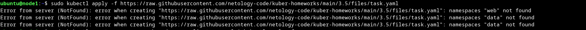
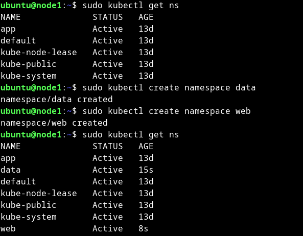
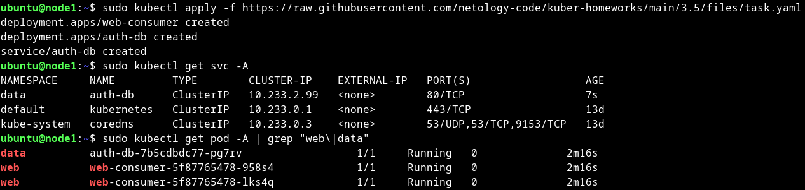

# Домашнее задание к занятию Troubleshooting

### Цель задания

Устранить неисправности при деплое приложения.

### Чеклист готовности к домашнему заданию

1. Кластер K8s.

### Задание. При деплое приложение web-consumer не может подключиться к auth-db. Необходимо это исправить

1. Установить приложение по команде:
```shell
kubectl apply -f https://raw.githubusercontent.com/netology-code/kuber-homeworks/main/3.5/files/task.yaml
```
2. Выявить проблему и описать.
3. Исправить проблему, описать, что сделано.
4. Продемонстрировать, что проблема решена.

<details>
<summary>
Ответ
</summary>

```bash
ubuntu@node1:~$ sudo kubectl apply -f https://raw.githubusercontent.com/netology-code/kuber-homeworks/main/3.5/files/task.yaml
Error from server (NotFound): error when creating "https://raw.githubusercontent.com/netology-code/kuber-homeworks/main/3.5/files/task.yaml": namespaces "web" not found
Error from server (NotFound): error when creating "https://raw.githubusercontent.com/netology-code/kuber-homeworks/main/3.5/files/task.yaml": namespaces "data" not found
Error from server (NotFound): error when creating "https://raw.githubusercontent.com/netology-code/kuber-homeworks/main/3.5/files/task.yaml": namespaces "data" not found
ubuntu@node1:~$ sudo kubectl get ns
NAME              STATUS   AGE
app               Active   13d
default           Active   13d
kube-node-lease   Active   13d
kube-public       Active   13d
kube-system       Active   13d
```

Из ошибок видно, что namespace "web" и "data" не существуют.

Для исправления проблемы, создадим необходимые namespace.

```bash
ubuntu@node1:~$ sudo kubectl create namespace data
namespace/data created
ubuntu@node1:~$ sudo kubectl create namespace web
namespace/web created
```

Проблема решена

```bash
ubuntu@node1:~$ sudo kubectl apply -f https://raw.githubusercontent.com/netology-code/kuber-homeworks/main/3.5/files/task.yaml
deployment.apps/web-consumer created
deployment.apps/auth-db created
service/auth-db created
ubuntu@node1:~$ sudo kubectl get svc -A
NAMESPACE     NAME         TYPE        CLUSTER-IP    EXTERNAL-IP   PORT(S)                  AGE
data          auth-db      ClusterIP   10.233.2.99   <none>        80/TCP                   7s
default       kubernetes   ClusterIP   10.233.0.1    <none>        443/TCP                  13d
kube-system   coredns      ClusterIP   10.233.0.3    <none>        53/UDP,53/TCP,9153/TCP   13d
ubuntu@node1:~$ sudo kubectl get pod -A | grep "web\|data"
data          auth-db-7b5cdbdc77-pg7rv                  1/1     Running   0              2m16s
web           web-consumer-5f87765478-958s4             1/1     Running   0              2m16s
web           web-consumer-5f87765478-lks4q             1/1     Running   0              2m16s
ubuntu@node1:~$ curl -Is 10.233.2.99
HTTP/1.1 200 OK
Server: nginx/1.19.1
Date: Mon, 22 Jan 2024 20:51:57 GMT
Content-Type: text/html
Content-Length: 612
Last-Modified: Tue, 07 Jul 2020 15:52:25 GMT
Connection: keep-alive
ETag: "5f049a39-264"
Accept-Ranges: bytes
```

<details>
<summary>Скриншоты:</summary>







</details>

</details>

### Правила приёма работы

1. Домашняя работа оформляется в своём Git-репозитории в файле README.md. Выполненное домашнее задание пришлите ссылкой на .md-файл в вашем репозитории.
2. Файл README.md должен содержать скриншоты вывода необходимых команд, а также скриншоты результатов.
3. Репозиторий должен содержать тексты манифестов или ссылки на них в файле README.md.