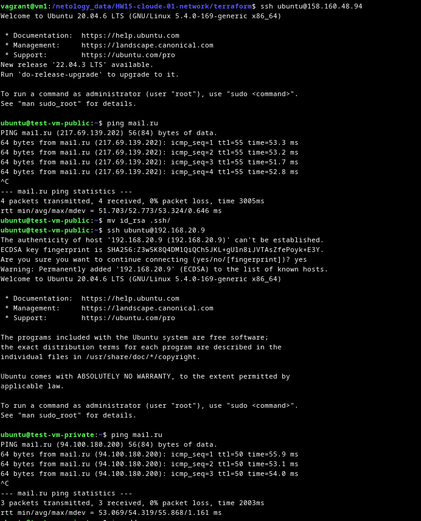

# Домашнее задание к занятию «Организация сети»

### Подготовка к выполнению задания

1. Домашнее задание состоит из обязательной части, которую нужно выполнить на провайдере Yandex Cloud, и дополнительной части в AWS (выполняется по желанию). 
2. Все домашние задания в блоке 15 связаны друг с другом и в конце представляют пример законченной инфраструктуры.  
3. Все задания нужно выполнить с помощью Terraform. Результатом выполненного домашнего задания будет код в репозитории. 
4. Перед началом работы настройте доступ к облачным ресурсам из Terraform, используя материалы прошлых лекций и домашнее задание по теме «Облачные провайдеры и синтаксис Terraform». Заранее выберите регион (в случае AWS) и зону.

---
### Задание 1. Yandex Cloud 

**Что нужно сделать**

1. Создать пустую VPC. Выбрать зону.
2. Публичная подсеть.
 - Создать в VPC subnet с названием public, сетью 192.168.10.0/24.
 - Создать в этой подсети NAT-инстанс, присвоив ему адрес 192.168.10.254. В качестве image_id использовать fd80mrhj8fl2oe87o4e1.
 - Создать в этой публичной подсети виртуалку с публичным IP, подключиться к ней и убедиться, что есть доступ к интернету.
3. Приватная подсеть.
 - Создать в VPC subnet с названием private, сетью 192.168.20.0/24.
 - Создать route table. Добавить статический маршрут, направляющий весь исходящий трафик private сети в NAT-инстанс.
 - Создать в этой приватной подсети виртуалку с внутренним IP, подключиться к ней через виртуалку, созданную ранее, и убедиться, что есть доступ к интернету.

<details>
<summary>Ответ</summary>

[terraform](terraform)

```bash
$ terraform apply
data.yandex_compute_image.ubuntu: Reading...
data.yandex_compute_image.ubuntu: Read complete after 0s [id=fd8m2ak64lipvicd94sf]

Terraform used the selected providers to generate the following execution plan. Resource actions are indicated with the following symbols:
  + create

Terraform will perform the following actions:

  # yandex_compute_instance.nat_instance will be created
  + resource "yandex_compute_instance" "nat_instance" {
      + created_at                = (known after apply)
      + folder_id                 = (known after apply)
      + fqdn                      = (known after apply)
      + gpu_cluster_id            = (known after apply)
      + hostname                  = (known after apply)
      + id                        = (known after apply)
      + metadata                  = {
          + "user-data" = <<-EOT
                #cloud-config
                users:
                  - name: ubuntu
                    groups: sudo
                    shell: /bin/bash
                    sudo: ['ALL=(ALL) NOPASSWD:ALL']
                    ssh-authorized-keys:
                      - ssh-rsa AAAAB3NzaC1yc2EAAAADAQABAAABgQDbN7gyACw/jGT6S7io+TyedWcnu9MYt2DPRwlWCcG/ae8FIWIulM3fkv/2hQpM5KD4pK1ycJ0nhBxryPp79i0i68bGu4OxpLHBewiBSLUqdnL2EgbaUnEjxqxTjKGwN6WhPkKDBBU3GkTd01pdQefKrFDDmVCMh8gL/nKc89xF5mJKPCzlhLFiYEAIiQhp+bdC2JdF1FrE+Atih6yTJh6v0GdxfY1SIKgIYK7+ixe8jmhnTd6MSBOM90E+5OGmF9q1m5dZmXgHpP49DzrVLtlvMq1mvUac/TN8aFmdSPr8p6ppGHGEDBqK2YN1bb4cIqEK+dL1sx/8bkpN871xYEpg1AjCJfg4Pkk7pzVHt9CW8ptxBwoxjpLTBydMc6f5AqAZuFk3i8TTBxAHp3IU2z5DJVCytwj6swUcsjVbCbnLcydV6BOo+dwMDlhII4d+GesNSIk1Eo4kneJni9FwP+HSSAoPhQXY3mG4z3m6X6mulYw4c7yMcrHWIi0Mgg8v6dc= vagrant@vm1
            EOT
        }
      + name                      = "nat-inst"
      + network_acceleration_type = "standard"
      + platform_id               = "standard-v3"
      + service_account_id        = (known after apply)
      + status                    = (known after apply)
      + zone                      = "ru-central1-a"

      + boot_disk {
          + auto_delete = true
          + device_name = (known after apply)
          + disk_id     = (known after apply)
          + mode        = (known after apply)

          + initialize_params {
              + block_size  = (known after apply)
              + description = (known after apply)
              + image_id    = "fd80mrhj8fl2oe87o4e1"
              + name        = (known after apply)
              + size        = (known after apply)
              + snapshot_id = (known after apply)
              + type        = "network-hdd"
            }
        }

      + network_interface {
          + index              = (known after apply)
          + ip_address         = "192.168.10.254"
          + ipv4               = true
          + ipv6               = (known after apply)
          + ipv6_address       = (known after apply)
          + mac_address        = (known after apply)
          + nat                = true
          + nat_ip_address     = (known after apply)
          + nat_ip_version     = (known after apply)
          + security_group_ids = (known after apply)
          + subnet_id          = (known after apply)
        }

      + resources {
          + core_fraction = 20
          + cores         = 2
          + memory        = 2
        }
    }

  # yandex_compute_instance.test_vm_private will be created
  + resource "yandex_compute_instance" "test_vm_private" {
      + created_at                = (known after apply)
      + folder_id                 = (known after apply)
      + fqdn                      = (known after apply)
      + gpu_cluster_id            = (known after apply)
      + hostname                  = "test-vm-private"
      + id                        = (known after apply)
      + metadata                  = {
          + "serial-port-enable" = "1"
          + "ssh-keys"           = <<-EOT
                ubuntu:ssh-rsa AAAAB3NzaC1yc2EAAAADAQABAAABgQDbN7gyACw/jGT6S7io+TyedWcnu9MYt2DPRwlWCcG/ae8FIWIulM3fkv/2hQpM5KD4pK1ycJ0nhBxryPp79i0i68bGu4OxpLHBewiBSLUqdnL2EgbaUnEjxqxTjKGwN6WhPkKDBBU3GkTd01pdQefKrFDDmVCMh8gL/nKc89xF5mJKPCzlhLFiYEAIiQhp+bdC2JdF1FrE+Atih6yTJh6v0GdxfY1SIKgIYK7+ixe8jmhnTd6MSBOM90E+5OGmF9q1m5dZmXgHpP49DzrVLtlvMq1mvUac/TN8aFmdSPr8p6ppGHGEDBqK2YN1bb4cIqEK+dL1sx/8bkpN871xYEpg1AjCJfg4Pkk7pzVHt9CW8ptxBwoxjpLTBydMc6f5AqAZuFk3i8TTBxAHp3IU2z5DJVCytwj6swUcsjVbCbnLcydV6BOo+dwMDlhII4d+GesNSIk1Eo4kneJni9FwP+HSSAoPhQXY3mG4z3m6X6mulYw4c7yMcrHWIi0Mgg8v6dc= vagrant@vm1
            EOT
        }
      + name                      = "test-vm-private"
      + network_acceleration_type = "standard"
      + platform_id               = "standard-v1"
      + service_account_id        = (known after apply)
      + status                    = (known after apply)
      + zone                      = (known after apply)

      + boot_disk {
          + auto_delete = true
          + device_name = (known after apply)
          + disk_id     = (known after apply)
          + mode        = (known after apply)

          + initialize_params {
              + block_size  = (known after apply)
              + description = (known after apply)
              + image_id    = "fd8m2ak64lipvicd94sf"
              + name        = (known after apply)
              + size        = 50
              + snapshot_id = (known after apply)
              + type        = "network-hdd"
            }
        }

      + network_interface {
          + index              = (known after apply)
          + ip_address         = (known after apply)
          + ipv4               = true
          + ipv6               = (known after apply)
          + ipv6_address       = (known after apply)
          + mac_address        = (known after apply)
          + nat                = false
          + nat_ip_address     = (known after apply)
          + nat_ip_version     = (known after apply)
          + security_group_ids = (known after apply)
          + subnet_id          = (known after apply)
        }

      + resources {
          + core_fraction = 20
          + cores         = 2
          + memory        = 2
        }

      + scheduling_policy {
          + preemptible = true
        }
    }

  # yandex_compute_instance.test_vm_public will be created
  + resource "yandex_compute_instance" "test_vm_public" {
      + created_at                = (known after apply)
      + folder_id                 = (known after apply)
      + fqdn                      = (known after apply)
      + gpu_cluster_id            = (known after apply)
      + hostname                  = "test-vm-public"
      + id                        = (known after apply)
      + metadata                  = {
          + "serial-port-enable" = "1"
          + "ssh-keys"           = <<-EOT
                ubuntu:ssh-rsa AAAAB3NzaC1yc2EAAAADAQABAAABgQDbN7gyACw/jGT6S7io+TyedWcnu9MYt2DPRwlWCcG/ae8FIWIulM3fkv/2hQpM5KD4pK1ycJ0nhBxryPp79i0i68bGu4OxpLHBewiBSLUqdnL2EgbaUnEjxqxTjKGwN6WhPkKDBBU3GkTd01pdQefKrFDDmVCMh8gL/nKc89xF5mJKPCzlhLFiYEAIiQhp+bdC2JdF1FrE+Atih6yTJh6v0GdxfY1SIKgIYK7+ixe8jmhnTd6MSBOM90E+5OGmF9q1m5dZmXgHpP49DzrVLtlvMq1mvUac/TN8aFmdSPr8p6ppGHGEDBqK2YN1bb4cIqEK+dL1sx/8bkpN871xYEpg1AjCJfg4Pkk7pzVHt9CW8ptxBwoxjpLTBydMc6f5AqAZuFk3i8TTBxAHp3IU2z5DJVCytwj6swUcsjVbCbnLcydV6BOo+dwMDlhII4d+GesNSIk1Eo4kneJni9FwP+HSSAoPhQXY3mG4z3m6X6mulYw4c7yMcrHWIi0Mgg8v6dc= vagrant@vm1
            EOT
        }
      + name                      = "test-vm-public"
      + network_acceleration_type = "standard"
      + platform_id               = "standard-v1"
      + service_account_id        = (known after apply)
      + status                    = (known after apply)
      + zone                      = (known after apply)

      + boot_disk {
          + auto_delete = true
          + device_name = (known after apply)
          + disk_id     = (known after apply)
          + mode        = (known after apply)

          + initialize_params {
              + block_size  = (known after apply)
              + description = (known after apply)
              + image_id    = "fd8m2ak64lipvicd94sf"
              + name        = (known after apply)
              + size        = 50
              + snapshot_id = (known after apply)
              + type        = "network-hdd"
            }
        }

      + network_interface {
          + index              = (known after apply)
          + ip_address         = (known after apply)
          + ipv4               = true
          + ipv6               = (known after apply)
          + ipv6_address       = (known after apply)
          + mac_address        = (known after apply)
          + nat                = true
          + nat_ip_address     = (known after apply)
          + nat_ip_version     = (known after apply)
          + security_group_ids = (known after apply)
          + subnet_id          = (known after apply)
        }

      + resources {
          + core_fraction = 20
          + cores         = 2
          + memory        = 2
        }

      + scheduling_policy {
          + preemptible = true
        }
    }

  # yandex_vpc_network.my-vpc will be created
  + resource "yandex_vpc_network" "my-vpc" {
      + created_at                = (known after apply)
      + default_security_group_id = (known after apply)
      + folder_id                 = (known after apply)
      + id                        = (known after apply)
      + labels                    = (known after apply)
      + name                      = "my-vpc"
      + subnet_ids                = (known after apply)
    }

  # yandex_vpc_route_table.nat-instance-route will be created
  + resource "yandex_vpc_route_table" "nat-instance-route" {
      + created_at = (known after apply)
      + folder_id  = (known after apply)
      + id         = (known after apply)
      + labels     = (known after apply)
      + name       = "nat-instance-route"
      + network_id = (known after apply)

      + static_route {
          + destination_prefix = "0.0.0.0/0"
          + next_hop_address   = "192.168.10.254"
        }
    }

  # yandex_vpc_subnet.private will be created
  + resource "yandex_vpc_subnet" "private" {
      + created_at     = (known after apply)
      + folder_id      = (known after apply)
      + id             = (known after apply)
      + labels         = (known after apply)
      + name           = "private"
      + network_id     = (known after apply)
      + route_table_id = (known after apply)
      + v4_cidr_blocks = [
          + "192.168.20.0/24",
        ]
      + v6_cidr_blocks = (known after apply)
      + zone           = "ru-central1-a"
    }

  # yandex_vpc_subnet.public will be created
  + resource "yandex_vpc_subnet" "public" {
      + created_at     = (known after apply)
      + folder_id      = (known after apply)
      + id             = (known after apply)
      + labels         = (known after apply)
      + name           = "public"
      + network_id     = (known after apply)
      + v4_cidr_blocks = [
          + "192.168.10.0/24",
        ]
      + v6_cidr_blocks = (known after apply)
      + zone           = "ru-central1-a"
    }

Plan: 7 to add, 0 to change, 0 to destroy.

Changes to Outputs:
  + instances   = [
      + {
          + ip   = "192.168.10.254"
          + name = "nat-inst"
        },
      + {
          + ext_ip = (known after apply)
          + ip     = (known after apply)
          + name   = "test-vm-public"
        },
      + {
          + ext_ip = (known after apply)
          + ip     = (known after apply)
          + name   = "test-vm-private"
        },
    ]
  + route_table = [
      + {
          + id           = (known after apply)
          + static_route = [
              + {
                  + destination_prefix = "0.0.0.0/0"
                  + gateway_id         = ""
                  + next_hop_address   = "192.168.10.254"
                },
            ]
        },
    ]
  + subnet      = [
      + {
          + public_subnet = "public"
          + route_table   = null
        },
      + {
          + private_subnet = "private"
          + route_table    = (known after apply)
        },
    ]
  + vpc         = "my-vpc"

Do you want to perform these actions?
  Terraform will perform the actions described above.
  Only 'yes' will be accepted to approve.

  Enter a value: yes

yandex_vpc_network.my-vpc: Creating...
yandex_vpc_network.my-vpc: Creation complete after 2s [id=enp44ars3ik2d8ub0ffm]
yandex_vpc_subnet.public: Creating...
yandex_vpc_subnet.public: Creation complete after 0s [id=e9bcgvht0du6373tc4ca]
yandex_compute_instance.test_vm_public: Creating...
yandex_compute_instance.nat_instance: Creating...
yandex_compute_instance.test_vm_public: Still creating... [10s elapsed]
yandex_compute_instance.nat_instance: Still creating... [10s elapsed]
yandex_compute_instance.test_vm_public: Still creating... [20s elapsed]
yandex_compute_instance.nat_instance: Still creating... [20s elapsed]
yandex_compute_instance.test_vm_public: Still creating... [30s elapsed]
yandex_compute_instance.nat_instance: Still creating... [30s elapsed]
yandex_compute_instance.test_vm_public: Creation complete after 40s [id=fhm20s9tl241l7c3djim]
yandex_compute_instance.nat_instance: Still creating... [40s elapsed]
yandex_compute_instance.nat_instance: Still creating... [50s elapsed]
yandex_compute_instance.nat_instance: Creation complete after 57s [id=fhm6q5oav8ks2i3mb8a1]
yandex_vpc_route_table.nat-instance-route: Creating...
yandex_vpc_route_table.nat-instance-route: Creation complete after 2s [id=enpi9aotfqt8bmseuf24]
yandex_vpc_subnet.private: Creating...
yandex_vpc_subnet.private: Creation complete after 0s [id=e9bh962rsn9lth34e3s0]
yandex_compute_instance.test_vm_private: Creating...
yandex_compute_instance.test_vm_private: Still creating... [10s elapsed]
yandex_compute_instance.test_vm_private: Still creating... [20s elapsed]
yandex_compute_instance.test_vm_private: Still creating... [30s elapsed]
yandex_compute_instance.test_vm_private: Creation complete after 39s [id=fhmo94g82ps3e9bg478u]

Apply complete! Resources: 7 added, 0 changed, 0 destroyed.

Outputs:

instances = [
  {
    "ip" = "192.168.10.254"
    "name" = "nat-inst"
  },
  {
    "ext_ip" = "158.160.48.94"
    "ip" = "192.168.10.11"
    "name" = "test-vm-public"
  },
  {
    "ext_ip" = ""
    "ip" = "192.168.20.9"
    "name" = "test-vm-private"
  },
]
route_table = [
  {
    "id" = "enpi9aotfqt8bmseuf24"
    "static_route" = toset([
      {
        "destination_prefix" = "0.0.0.0/0"
        "gateway_id" = ""
        "next_hop_address" = "192.168.10.254"
      },
    ])
  },
]
subnet = [
  {
    "public_subnet" = "public"
    "route_table" = ""
  },
  {
    "private_subnet" = "private"
    "route_table" = "enpi9aotfqt8bmseuf24"
  },
]
vpc = "my-vpc"

$ ssh ubuntu@158.160.48.94
Welcome to Ubuntu 20.04.6 LTS (GNU/Linux 5.4.0-169-generic x86_64)

 * Documentation:  https://help.ubuntu.com
 * Management:     https://landscape.canonical.com
 * Support:        https://ubuntu.com/pro
New release '22.04.3 LTS' available.
Run 'do-release-upgrade' to upgrade to it.

To run a command as administrator (user "root"), use "sudo <command>".
See "man sudo_root" for details.

ubuntu@test-vm-public:~$ ping mail.ru
PING mail.ru (217.69.139.202) 56(84) bytes of data.
64 bytes from mail.ru (217.69.139.202): icmp_seq=1 ttl=55 time=53.3 ms
64 bytes from mail.ru (217.69.139.202): icmp_seq=2 ttl=55 time=53.2 ms
64 bytes from mail.ru (217.69.139.202): icmp_seq=3 ttl=55 time=51.7 ms
64 bytes from mail.ru (217.69.139.202): icmp_seq=4 ttl=55 time=52.8 ms
^C
--- mail.ru ping statistics ---
4 packets transmitted, 4 received, 0% packet loss, time 3005ms
rtt min/avg/max/mdev = 51.703/52.773/53.324/0.646 ms

ubuntu@test-vm-public:~$ ssh ubuntu@192.168.20.9
The authenticity of host '192.168.20.9 (192.168.20.9)' can't be established.
ECDSA key fingerprint is SHA256:Z3w5K8Q4DM1QiQCh5JKL+gUln8iJVTAsZfePoyk+E3Y.
Are you sure you want to continue connecting (yes/no/[fingerprint])? yes
Warning: Permanently added '192.168.20.9' (ECDSA) to the list of known hosts.
Welcome to Ubuntu 20.04.6 LTS (GNU/Linux 5.4.0-169-generic x86_64)

 * Documentation:  https://help.ubuntu.com
 * Management:     https://landscape.canonical.com
 * Support:        https://ubuntu.com/pro

The programs included with the Ubuntu system are free software;
the exact distribution terms for each program are described in the
individual files in /usr/share/doc/*/copyright.

Ubuntu comes with ABSOLUTELY NO WARRANTY, to the extent permitted by
applicable law.

To run a command as administrator (user "root"), use "sudo <command>".
See "man sudo_root" for details.

ubuntu@test-vm-private:~$ ping mail.ru
PING mail.ru (94.100.180.200) 56(84) bytes of data.
64 bytes from mail.ru (94.100.180.200): icmp_seq=1 ttl=50 time=55.9 ms
64 bytes from mail.ru (94.100.180.200): icmp_seq=2 ttl=50 time=53.1 ms
64 bytes from mail.ru (94.100.180.200): icmp_seq=3 ttl=50 time=54.0 ms
^C
--- mail.ru ping statistics ---
3 packets transmitted, 3 received, 0% packet loss, time 2003ms
rtt min/avg/max/mdev = 53.069/54.319/55.868/1.161 ms

```

</details>


<details>
<summary>Скриншоты:</summary>




</details>

Resource Terraform для Yandex Cloud:

- [VPC subnet](https://registry.terraform.io/providers/yandex-cloud/yandex/latest/docs/resources/vpc_subnet).
- [Route table](https://registry.terraform.io/providers/yandex-cloud/yandex/latest/docs/resources/vpc_route_table).
- [Compute Instance](https://registry.terraform.io/providers/yandex-cloud/yandex/latest/docs/resources/compute_instance).

---
### Задание 2. AWS* (задание со звёздочкой)

Это необязательное задание. Его выполнение не влияет на получение зачёта по домашней работе.

**Что нужно сделать**

1. Создать пустую VPC с подсетью 10.10.0.0/16.
2. Публичная подсеть.

 - Создать в VPC subnet с названием public, сетью 10.10.1.0/24.
 - Разрешить в этой subnet присвоение public IP по-умолчанию.
 - Создать Internet gateway.
 - Добавить в таблицу маршрутизации маршрут, направляющий весь исходящий трафик в Internet gateway.
 - Создать security group с разрешающими правилами на SSH и ICMP. Привязать эту security group на все, создаваемые в этом ДЗ, виртуалки.
 - Создать в этой подсети виртуалку и убедиться, что инстанс имеет публичный IP. Подключиться к ней, убедиться, что есть доступ к интернету.
 - Добавить NAT gateway в public subnet.
3. Приватная подсеть.
 - Создать в VPC subnet с названием private, сетью 10.10.2.0/24.
 - Создать отдельную таблицу маршрутизации и привязать её к private подсети.
 - Добавить Route, направляющий весь исходящий трафик private сети в NAT.
 - Создать виртуалку в приватной сети.
 - Подключиться к ней по SSH по приватному IP через виртуалку, созданную ранее в публичной подсети, и убедиться, что с виртуалки есть выход в интернет.

Resource Terraform:

1. [VPC](https://registry.terraform.io/providers/hashicorp/aws/latest/docs/resources/vpc).
1. [Subnet](https://registry.terraform.io/providers/hashicorp/aws/latest/docs/resources/subnet).
1. [Internet Gateway](https://registry.terraform.io/providers/hashicorp/aws/latest/docs/resources/internet_gateway).

### Правила приёма работы

Домашняя работа оформляется в своём Git репозитории в файле README.md. Выполненное домашнее задание пришлите ссылкой на .md-файл в вашем репозитории.
Файл README.md должен содержать скриншоты вывода необходимых команд, а также скриншоты результатов.
Репозиторий должен содержать тексты манифестов или ссылки на них в файле README.md.