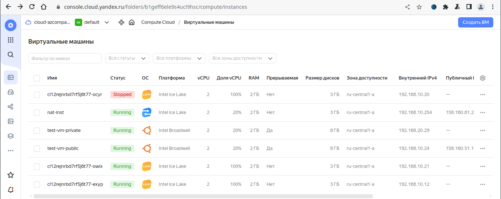
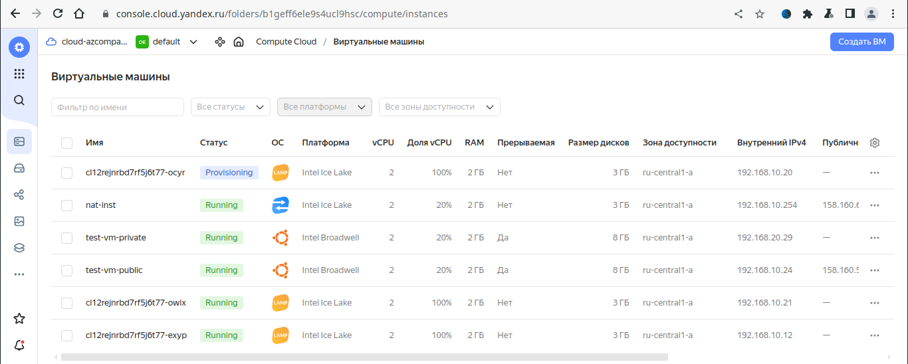
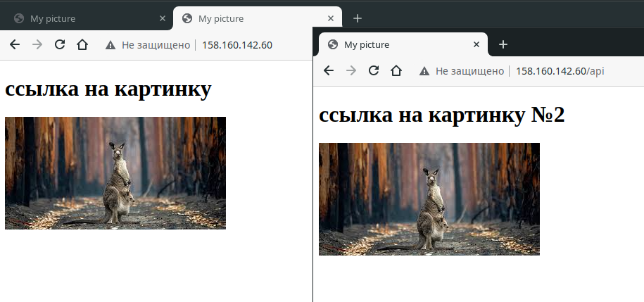
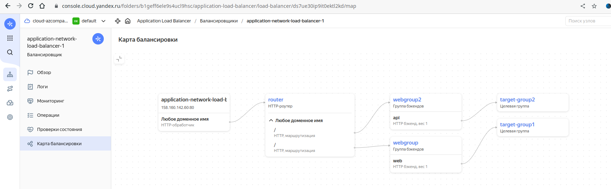
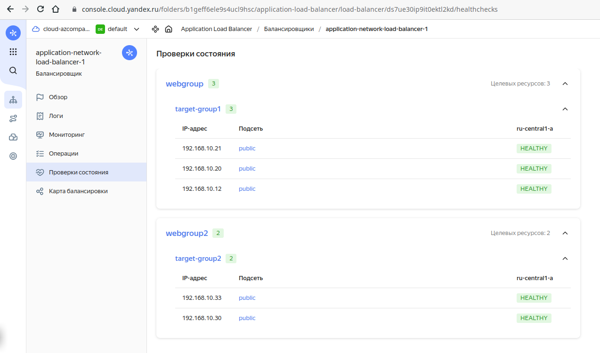

# Домашнее задание к занятию «Вычислительные мощности. Балансировщики нагрузки»  

### Подготовка к выполнению задания

1. Домашнее задание состоит из обязательной части, которую нужно выполнить на провайдере Yandex Cloud, и дополнительной части в AWS (выполняется по желанию). 
2. Все домашние задания в блоке 15 связаны друг с другом и в конце представляют пример законченной инфраструктуры.  
3. Все задания нужно выполнить с помощью Terraform. Результатом выполненного домашнего задания будет код в репозитории. 
4. Перед началом работы настройте доступ к облачным ресурсам из Terraform, используя материалы прошлых лекций и домашних заданий.

---
## Задание 1. Yandex Cloud 

**Что нужно сделать**

1. Создать бакет Object Storage и разместить в нём файл с картинкой:

 - Создать бакет в Object Storage с произвольным именем (например, _имя_студента_дата_).
 - Положить в бакет файл с картинкой.
 - Сделать файл доступным из интернета.
 
2. Создать группу ВМ в public подсети фиксированного размера с шаблоном LAMP и веб-страницей, содержащей ссылку на картинку из бакета:

 - Создать Instance Group с тремя ВМ и шаблоном LAMP. Для LAMP рекомендуется использовать `image_id = fd827b91d99psvq5fjit`.
 - Для создания стартовой веб-страницы рекомендуется использовать раздел `user_data` в [meta_data](https://cloud.yandex.ru/docs/compute/concepts/vm-metadata).
 - Разместить в стартовой веб-странице шаблонной ВМ ссылку на картинку из бакета.
 - Настроить проверку состояния ВМ.
 
3. Подключить группу к сетевому балансировщику:

 - Создать сетевой балансировщик.
 - Проверить работоспособность, удалив одну или несколько ВМ.
4. (дополнительно)* Создать Application Load Balancer с использованием Instance group и проверкой состояния.

<details>
<summary>Ответ</summary>

[terraform](terraform)

```bash
$ terraform apply
data.yandex_compute_image.ubuntu: Reading...
data.yandex_compute_image.ubuntu: Read complete after 0s [id=fd82qs98ootbak6lkmmj]

Terraform used the selected providers to generate the following execution plan. Resource actions are indicated with the following symbols:
  + create

Terraform will perform the following actions:

  # yandex_compute_instance.nat_instance will be created
  + resource "yandex_compute_instance" "nat_instance" {
      + created_at                = (known after apply)
      + folder_id                 = (known after apply)
      + fqdn                      = (known after apply)
      + gpu_cluster_id            = (known after apply)
      + hostname                  = (known after apply)
      + id                        = (known after apply)
      + metadata                  = {
          + "user-data" = <<-EOT
                #cloud-config
                users:
                  - name: ubuntu
                    groups: sudo
                    shell: /bin/bash
                    sudo: ['ALL=(ALL) NOPASSWD:ALL']
                    ssh-authorized-keys:
                      - ssh-rsa AAAAB3NzaC1yc2EAAAADAQABAAABgQDbN7gyACw/jGT6S7io+TyedWcnu9MYt2DPRwlWCcG/ae8FIWIulM3fkv/2hQpM5KD4pK1ycJ0nhBxryPp79i0i68bGu4OxpLHBewiBSLUqdnL2EgbaUnEjxqxTjKGwN6WhPkKDBBU3GkTd01pdQefKrFDDmVCMh8gL/nKc89xF5mJKPCzlhLFiYEAIiQhp+bdC2JdF1FrE+Atih6yTJh6v0GdxfY1SIKgIYK7+ixe8jmhnTd6MSBOM90E+5OGmF9q1m5dZmXgHpP49DzrVLtlvMq1mvUac/TN8aFmdSPr8p6ppGHGEDBqK2YN1bb4cIqEK+dL1sx/8bkpN871xYEpg1AjCJfg4Pkk7pzVHt9CW8ptxBwoxjpLTBydMc6f5AqAZuFk3i8TTBxAHp3IU2z5DJVCytwj6swUcsjVbCbnLcydV6BOo+dwMDlhII4d+GesNSIk1Eo4kneJni9FwP+HSSAoPhQXY3mG4z3m6X6mulYw4c7yMcrHWIi0Mgg8v6dc= vagrant@vm1
            EOT
        }
      + name                      = "nat-inst"
      + network_acceleration_type = "standard"
      + platform_id               = "standard-v3"
      + service_account_id        = (known after apply)
      + status                    = (known after apply)
      + zone                      = "ru-central1-a"

      + boot_disk {
          + auto_delete = true
          + device_name = (known after apply)
          + disk_id     = (known after apply)
          + mode        = (known after apply)

          + initialize_params {
              + block_size  = (known after apply)
              + description = (known after apply)
              + image_id    = "fd80mrhj8fl2oe87o4e1"
              + name        = (known after apply)
              + size        = (known after apply)
              + snapshot_id = (known after apply)
              + type        = "network-hdd"
            }
        }

      + network_interface {
          + index              = (known after apply)
          + ip_address         = "192.168.10.254"
          + ipv4               = true
          + ipv6               = (known after apply)
          + ipv6_address       = (known after apply)
          + mac_address        = (known after apply)
          + nat                = true
          + nat_ip_address     = (known after apply)
          + nat_ip_version     = (known after apply)
          + security_group_ids = (known after apply)
          + subnet_id          = (known after apply)
        }

      + resources {
          + core_fraction = 20
          + cores         = 2
          + memory        = 2
        }
    }

  # yandex_compute_instance.test_vm_private will be created
  + resource "yandex_compute_instance" "test_vm_private" {
      + created_at                = (known after apply)
      + folder_id                 = (known after apply)
      + fqdn                      = (known after apply)
      + gpu_cluster_id            = (known after apply)
      + hostname                  = "test-vm-private"
      + id                        = (known after apply)
      + metadata                  = {
          + "serial-port-enable" = "1"
          + "ssh-keys"           = <<-EOT
                ubuntu:ssh-rsa AAAAB3NzaC1yc2EAAAADAQABAAABgQDbN7gyACw/jGT6S7io+TyedWcnu9MYt2DPRwlWCcG/ae8FIWIulM3fkv/2hQpM5KD4pK1ycJ0nhBxryPp79i0i68bGu4OxpLHBewiBSLUqdnL2EgbaUnEjxqxTjKGwN6WhPkKDBBU3GkTd01pdQefKrFDDmVCMh8gL/nKc89xF5mJKPCzlhLFiYEAIiQhp+bdC2JdF1FrE+Atih6yTJh6v0GdxfY1SIKgIYK7+ixe8jmhnTd6MSBOM90E+5OGmF9q1m5dZmXgHpP49DzrVLtlvMq1mvUac/TN8aFmdSPr8p6ppGHGEDBqK2YN1bb4cIqEK+dL1sx/8bkpN871xYEpg1AjCJfg4Pkk7pzVHt9CW8ptxBwoxjpLTBydMc6f5AqAZuFk3i8TTBxAHp3IU2z5DJVCytwj6swUcsjVbCbnLcydV6BOo+dwMDlhII4d+GesNSIk1Eo4kneJni9FwP+HSSAoPhQXY3mG4z3m6X6mulYw4c7yMcrHWIi0Mgg8v6dc= vagrant@vm1
            EOT
        }
      + name                      = "test-vm-private"
      + network_acceleration_type = "standard"
      + platform_id               = "standard-v1"
      + service_account_id        = (known after apply)
      + status                    = (known after apply)
      + zone                      = (known after apply)

      + boot_disk {
          + auto_delete = true
          + device_name = (known after apply)
          + disk_id     = (known after apply)
          + mode        = (known after apply)

          + initialize_params {
              + block_size  = (known after apply)
              + description = (known after apply)
              + image_id    = "fd82qs98ootbak6lkmmj"
              + name        = (known after apply)
              + size        = 8
              + snapshot_id = (known after apply)
              + type        = "network-hdd"
            }
        }

      + network_interface {
          + index              = (known after apply)
          + ip_address         = (known after apply)
          + ipv4               = true
          + ipv6               = (known after apply)
          + ipv6_address       = (known after apply)
          + mac_address        = (known after apply)
          + nat                = false
          + nat_ip_address     = (known after apply)
          + nat_ip_version     = (known after apply)
          + security_group_ids = (known after apply)
          + subnet_id          = (known after apply)
        }

      + resources {
          + core_fraction = 20
          + cores         = 2
          + memory        = 2
        }

      + scheduling_policy {
          + preemptible = true
        }
    }

  # yandex_compute_instance.test_vm_public will be created
  + resource "yandex_compute_instance" "test_vm_public" {
      + created_at                = (known after apply)
      + folder_id                 = (known after apply)
      + fqdn                      = (known after apply)
      + gpu_cluster_id            = (known after apply)
      + hostname                  = "test-vm-public"
      + id                        = (known after apply)
      + metadata                  = {
          + "serial-port-enable" = "1"
          + "ssh-keys"           = <<-EOT
                ubuntu:ssh-rsa AAAAB3NzaC1yc2EAAAADAQABAAABgQDbN7gyACw/jGT6S7io+TyedWcnu9MYt2DPRwlWCcG/ae8FIWIulM3fkv/2hQpM5KD4pK1ycJ0nhBxryPp79i0i68bGu4OxpLHBewiBSLUqdnL2EgbaUnEjxqxTjKGwN6WhPkKDBBU3GkTd01pdQefKrFDDmVCMh8gL/nKc89xF5mJKPCzlhLFiYEAIiQhp+bdC2JdF1FrE+Atih6yTJh6v0GdxfY1SIKgIYK7+ixe8jmhnTd6MSBOM90E+5OGmF9q1m5dZmXgHpP49DzrVLtlvMq1mvUac/TN8aFmdSPr8p6ppGHGEDBqK2YN1bb4cIqEK+dL1sx/8bkpN871xYEpg1AjCJfg4Pkk7pzVHt9CW8ptxBwoxjpLTBydMc6f5AqAZuFk3i8TTBxAHp3IU2z5DJVCytwj6swUcsjVbCbnLcydV6BOo+dwMDlhII4d+GesNSIk1Eo4kneJni9FwP+HSSAoPhQXY3mG4z3m6X6mulYw4c7yMcrHWIi0Mgg8v6dc= vagrant@vm1
            EOT
        }
      + name                      = "test-vm-public"
      + network_acceleration_type = "standard"
      + platform_id               = "standard-v1"
      + service_account_id        = (known after apply)
      + status                    = (known after apply)
      + zone                      = (known after apply)

      + boot_disk {
          + auto_delete = true
          + device_name = (known after apply)
          + disk_id     = (known after apply)
          + mode        = (known after apply)

          + initialize_params {
              + block_size  = (known after apply)
              + description = (known after apply)
              + image_id    = "fd82qs98ootbak6lkmmj"
              + name        = (known after apply)
              + size        = 8
              + snapshot_id = (known after apply)
              + type        = "network-hdd"
            }
        }

      + network_interface {
          + index              = (known after apply)
          + ip_address         = (known after apply)
          + ipv4               = true
          + ipv6               = (known after apply)
          + ipv6_address       = (known after apply)
          + mac_address        = (known after apply)
          + nat                = true
          + nat_ip_address     = (known after apply)
          + nat_ip_version     = (known after apply)
          + security_group_ids = (known after apply)
          + subnet_id          = (known after apply)
        }

      + resources {
          + core_fraction = 20
          + cores         = 2
          + memory        = 2
        }

      + scheduling_policy {
          + preemptible = true
        }
    }

  # yandex_compute_instance_group.ig-1 will be created
  + resource "yandex_compute_instance_group" "ig-1" {
      + created_at          = (known after apply)
      + deletion_protection = false
      + folder_id           = "b1geff6ele9s4ucl9hsc"
      + id                  = (known after apply)
      + instances           = (known after apply)
      + name                = "ig-lamp"
      + service_account_id  = (known after apply)
      + status              = (known after apply)

      + allocation_policy {
          + zones = [
              + "ru-central1-a",
            ]
        }

      + deploy_policy {
          + max_creating     = 0
          + max_deleting     = 0
          + max_expansion    = 0
          + max_unavailable  = 1
          + startup_duration = 0
          + strategy         = (known after apply)
        }

      + health_check {
          + healthy_threshold   = 2
          + unhealthy_threshold = 2

          + http_options {
              + path = "/index.html"
              + port = 80
            }
        }

      + instance_template {
          + labels      = (known after apply)
          + metadata    = (known after apply)
          + platform_id = "standard-v3"

          + boot_disk {
              + device_name = (known after apply)
              + mode        = "READ_WRITE"

              + initialize_params {
                  + image_id    = "fd827b91d99psvq5fjit"
                  + size        = (known after apply)
                  + snapshot_id = (known after apply)
                  + type        = "network-hdd"
                }
            }

          + network_interface {
              + ip_address   = (known after apply)
              + ipv4         = true
              + ipv6         = (known after apply)
              + ipv6_address = (known after apply)
              + nat          = (known after apply)
              + network_id   = (known after apply)
              + subnet_ids   = (known after apply)
            }

          + resources {
              + core_fraction = 100
              + cores         = 2
              + memory        = 2
            }
        }

      + load_balancer {
          + status_message           = (known after apply)
          + target_group_description = "load balancer target group"
          + target_group_id          = (known after apply)
          + target_group_name        = "target-group"
        }

      + scale_policy {
          + fixed_scale {
              + size = 3
            }
        }
    }

  # yandex_iam_service_account.sa will be created
  + resource "yandex_iam_service_account" "sa" {
      + created_at = (known after apply)
      + folder_id  = (known after apply)
      + id         = (known after apply)
      + name       = "sa-for-bucket"
    }

  # yandex_iam_service_account_static_access_key.sa-static-key will be created
  + resource "yandex_iam_service_account_static_access_key" "sa-static-key" {
      + access_key           = (known after apply)
      + created_at           = (known after apply)
      + description          = "static access key for object storage"
      + encrypted_secret_key = (known after apply)
      + id                   = (known after apply)
      + key_fingerprint      = (known after apply)
      + secret_key           = (sensitive value)
      + service_account_id   = (known after apply)
    }

  # yandex_lb_network_load_balancer.lb-1 will be created
  + resource "yandex_lb_network_load_balancer" "lb-1" {
      + created_at          = (known after apply)
      + deletion_protection = (known after apply)
      + folder_id           = (known after apply)
      + id                  = (known after apply)
      + name                = "network-load-balancer-1"
      + region_id           = (known after apply)
      + type                = "external"

      + attached_target_group {
          + target_group_id = (known after apply)

          + healthcheck {
              + healthy_threshold   = 2
              + interval            = 2
              + name                = "http"
              + timeout             = 1
              + unhealthy_threshold = 2

              + http_options {
                  + path = "/index.html"
                  + port = 80
                }
            }
        }

      + listener {
          + name        = "network-load-balancer-1-listener"
          + port        = 80
          + protocol    = (known after apply)
          + target_port = (known after apply)

          + external_address_spec {
              + address    = (known after apply)
              + ip_version = "ipv4"
            }
        }
    }

  # yandex_resourcemanager_folder_iam_member.sa-editor will be created
  + resource "yandex_resourcemanager_folder_iam_member" "sa-editor" {
      + folder_id = "b1geff6ele9s4ucl9hsc"
      + id        = (known after apply)
      + member    = (known after apply)
      + role      = "editor"
    }

  # yandex_storage_bucket.bucket will be created
  + resource "yandex_storage_bucket" "bucket" {
      + access_key            = (known after apply)
      + bucket                = "netology-lesson"
      + bucket_domain_name    = (known after apply)
      + default_storage_class = (known after apply)
      + folder_id             = (known after apply)
      + force_destroy         = false
      + id                    = (known after apply)
      + secret_key            = (sensitive value)
      + website_domain        = (known after apply)
      + website_endpoint      = (known after apply)

      + anonymous_access_flags {
          + list = false
          + read = true
        }
    }

  # yandex_storage_object.my_store will be created
  + resource "yandex_storage_object" "my_store" {
      + access_key                    = (known after apply)
      + acl                           = "private"
      + bucket                        = "netology-lesson"
      + content_type                  = (known after apply)
      + id                            = (known after apply)
      + key                           = "picture1.jpeg"
      + object_lock_legal_hold_status = "OFF"
      + secret_key                    = (sensitive value)
      + source                        = "../images.jpeg"
      + tags                          = {
          + "test" = "value"
        }
    }

  # yandex_vpc_network.my-vpc will be created
  + resource "yandex_vpc_network" "my-vpc" {
      + created_at                = (known after apply)
      + default_security_group_id = (known after apply)
      + folder_id                 = (known after apply)
      + id                        = (known after apply)
      + labels                    = (known after apply)
      + name                      = "my-vpc"
      + subnet_ids                = (known after apply)
    }

  # yandex_vpc_route_table.nat-instance-route will be created
  + resource "yandex_vpc_route_table" "nat-instance-route" {
      + created_at = (known after apply)
      + folder_id  = (known after apply)
      + id         = (known after apply)
      + labels     = (known after apply)
      + name       = "nat-instance-route"
      + network_id = (known after apply)

      + static_route {
          + destination_prefix = "0.0.0.0/0"
          + next_hop_address   = "192.168.10.254"
        }
    }

  # yandex_vpc_subnet.private will be created
  + resource "yandex_vpc_subnet" "private" {
      + created_at     = (known after apply)
      + folder_id      = (known after apply)
      + id             = (known after apply)
      + labels         = (known after apply)
      + name           = "private"
      + network_id     = (known after apply)
      + route_table_id = (known after apply)
      + v4_cidr_blocks = [
          + "192.168.20.0/24",
        ]
      + v6_cidr_blocks = (known after apply)
      + zone           = "ru-central1-a"
    }

  # yandex_vpc_subnet.public will be created
  + resource "yandex_vpc_subnet" "public" {
      + created_at     = (known after apply)
      + folder_id      = (known after apply)
      + id             = (known after apply)
      + labels         = (known after apply)
      + name           = "public"
      + network_id     = (known after apply)
      + v4_cidr_blocks = [
          + "192.168.10.0/24",
        ]
      + v6_cidr_blocks = (known after apply)
      + zone           = "ru-central1-a"
    }

Plan: 14 to add, 0 to change, 0 to destroy.

Changes to Outputs:
  + instances     = [
      + {
          + ip   = "192.168.10.254"
          + name = "nat-inst"
        },
      + {
          + ext_ip = (known after apply)
          + ip     = (known after apply)
          + name   = "test-vm-public"
        },
      + {
          + ext_ip = (known after apply)
          + ip     = (known after apply)
          + name   = "test-vm-private"
        },
    ]
  + load_balancer = [
      + {
          + external_address_spec = [
              + {
                  + address    = (known after apply)
                  + ip_version = "ipv4"
                },
            ]
          + internal_address_spec = []
          + name                  = "network-load-balancer-1-listener"
          + port                  = 80
          + protocol              = (known after apply)
          + target_port           = (known after apply)
        },
    ]
  + mybacket      = (known after apply)
  + mystore       = "picture1.jpeg"
  + route_table   = [
      + {
          + id           = (known after apply)
          + static_route = [
              + {
                  + destination_prefix = "0.0.0.0/0"
                  + gateway_id         = ""
                  + next_hop_address   = "192.168.10.254"
                },
            ]
        },
    ]
  + subnet        = [
      + {
          + public_subnet = "public"
          + route_table   = null
        },
      + {
          + private_subnet = "private"
          + route_table    = (known after apply)
        },
    ]
  + vpc           = "my-vpc"

Do you want to perform these actions?
  Terraform will perform the actions described above.
  Only 'yes' will be accepted to approve.

  Enter a value: yes

yandex_vpc_network.my-vpc: Creating...
yandex_iam_service_account.sa: Creating...
yandex_vpc_network.my-vpc: Creation complete after 2s [id=enp9svskmc24ef42bqfj]
yandex_vpc_subnet.public: Creating...
yandex_iam_service_account.sa: Creation complete after 2s [id=aje2s0h784948glo8opj]
yandex_resourcemanager_folder_iam_member.sa-editor: Creating...
yandex_iam_service_account_static_access_key.sa-static-key: Creating...
yandex_vpc_subnet.public: Creation complete after 1s [id=e9bm58liq79uo3ubhis9]
yandex_compute_instance.test_vm_public: Creating...
yandex_compute_instance.nat_instance: Creating...
yandex_iam_service_account_static_access_key.sa-static-key: Creation complete after 2s [id=aje2ac5bs6j9l7aj0nvs]
yandex_storage_bucket.bucket: Creating...
yandex_resourcemanager_folder_iam_member.sa-editor: Creation complete after 3s [id=b1geff6ele9s4ucl9hsc/editor/serviceAccount:aje2s0h784948glo8opj]
yandex_storage_bucket.bucket: Creation complete after 6s [id=netology-lesson]
yandex_storage_object.my_store: Creating...
yandex_storage_object.my_store: Creation complete after 0s [id=picture1.jpeg]
yandex_compute_instance_group.ig-1: Creating...
yandex_compute_instance.test_vm_public: Still creating... [10s elapsed]
yandex_compute_instance.nat_instance: Still creating... [10s elapsed]
yandex_compute_instance_group.ig-1: Still creating... [10s elapsed]
yandex_compute_instance.test_vm_public: Still creating... [20s elapsed]
yandex_compute_instance.nat_instance: Still creating... [20s elapsed]
yandex_compute_instance_group.ig-1: Still creating... [20s elapsed]
yandex_compute_instance.test_vm_public: Still creating... [30s elapsed]
yandex_compute_instance.nat_instance: Still creating... [30s elapsed]
yandex_compute_instance.test_vm_public: Creation complete after 33s [id=fhmfgladu2nuc36n0dn3]
yandex_compute_instance_group.ig-1: Still creating... [30s elapsed]
yandex_compute_instance.nat_instance: Still creating... [40s elapsed]
yandex_compute_instance_group.ig-1: Still creating... [40s elapsed]
yandex_compute_instance.nat_instance: Still creating... [50s elapsed]
yandex_compute_instance_group.ig-1: Still creating... [50s elapsed]
yandex_compute_instance.nat_instance: Still creating... [1m0s elapsed]
yandex_compute_instance_group.ig-1: Still creating... [1m0s elapsed]
yandex_compute_instance.nat_instance: Still creating... [1m10s elapsed]
yandex_compute_instance.nat_instance: Creation complete after 1m15s [id=fhm8lgriraj9abbo2st6]
yandex_vpc_route_table.nat-instance-route: Creating...
yandex_vpc_route_table.nat-instance-route: Creation complete after 1s [id=enps9soau8ttghsq463e]
yandex_vpc_subnet.private: Creating...
yandex_vpc_subnet.private: Creation complete after 1s [id=e9b9kl54vcahlbqhuqfq]
yandex_compute_instance.test_vm_private: Creating...
yandex_compute_instance_group.ig-1: Still creating... [1m10s elapsed]
yandex_compute_instance.test_vm_private: Still creating... [10s elapsed]
yandex_compute_instance_group.ig-1: Still creating... [1m20s elapsed]
yandex_compute_instance.test_vm_private: Still creating... [20s elapsed]
yandex_compute_instance_group.ig-1: Still creating... [1m30s elapsed]
yandex_compute_instance.test_vm_private: Still creating... [30s elapsed]
yandex_compute_instance_group.ig-1: Still creating... [1m40s elapsed]
yandex_compute_instance.test_vm_private: Creation complete after 38s [id=fhmcd14c00f20sbk722f]
yandex_compute_instance_group.ig-1: Still creating... [1m50s elapsed]
yandex_compute_instance_group.ig-1: Still creating... [2m0s elapsed]
yandex_compute_instance_group.ig-1: Still creating... [2m10s elapsed]
yandex_compute_instance_group.ig-1: Still creating... [2m20s elapsed]
yandex_compute_instance_group.ig-1: Creation complete after 2m28s [id=cl12rejnrbd7rf5j6t77]
yandex_lb_network_load_balancer.lb-1: Creating...
yandex_lb_network_load_balancer.lb-1: Creation complete after 2s [id=enpn6v24kvgflalnfco3]

Apply complete! Resources: 14 added, 0 changed, 0 destroyed.

Outputs:

instances = [
  {
    "ip" = "192.168.10.254"
    "name" = "nat-inst"
  },
  {
    "ext_ip" = "158.160.51.185"
    "ip" = "192.168.10.24"
    "name" = "test-vm-public"
  },
  {
    "ext_ip" = ""
    "ip" = "192.168.20.29"
    "name" = "test-vm-private"
  },
]
load_balancer = toset([
  {
    "external_address_spec" = toset([
      {
        "address" = "158.160.144.2"
        "ip_version" = "ipv4"
      },
    ])
    "internal_address_spec" = toset([])
    "name" = "network-load-balancer-1-listener"
    "port" = 80
    "protocol" = "tcp"
    "target_port" = 80
  },
])
mybacket = "netology-lesson.storage.yandexcloud.net"
mystore = "picture1.jpeg"
route_table = [
  {
    "id" = "enps9soau8ttghsq463e"
    "static_route" = toset([
      {
        "destination_prefix" = "0.0.0.0/0"
        "gateway_id" = ""
        "next_hop_address" = "192.168.10.254"
      },
    ])
  },
]
subnet = [
  {
    "public_subnet" = "public"
    "route_table" = ""
  },
  {
    "private_subnet" = "private"
    "route_table" = "enps9soau8ttghsq463e"
  },
]
vpc = "my-vpc"

```


```bash
ubuntu@fhm8lgriraj9abbo2st6:~$ curl http://158.160.144.2
<!doctype html><html><head><meta http-equiv="Content-Type" content="text/html; charset=utf-8"><title>My picture</title></head><body><h1>ссылка на картинку</h1></body> </html>
ubuntu@fhm8lgriraj9abbo2st6:~$ ping 192.168.10.20
PING 192.168.10.20 (192.168.10.20) 56(84) bytes of data.
^C
--- 192.168.10.20 ping statistics ---
5 packets transmitted, 0 received, 100% packet loss, time 4098ms

```





```bash
Outputs:

application_load_balancer = tolist([
  {
    "endpoint" = tolist([
      {
        "address" = tolist([
          {
            "external_ipv4_address" = tolist([
              {
                "address" = "158.160.142.60"
              },
            ])
            "external_ipv6_address" = tolist([])
            "internal_ipv4_address" = tolist([])
          },
        ])
        "ports" = tolist([
          80,
        ])
      },
    ])
    "http" = tolist([
      {
        "handler" = tolist([
          {
            "allow_http10" = false
            "http2_options" = tolist([])
            "http_router_id" = "ds70pfcf7u6fggu40pd4"
            "rewrite_request_id" = false
          },
        ])
        "redirects" = tolist([])
      },
    ])
    "name" = "application-network-load-balancer-1-listener"
    "stream" = tolist([])
    "tls" = tolist([])
  },
])
instances = [
  {
    "ip" = "192.168.10.254"
    "name" = "nat-inst"
  },
  {
    "ext_ip" = "158.160.51.185"
    "ip" = "192.168.10.24"
    "name" = "test-vm-public"
  },
  {
    "ext_ip" = ""
    "ip" = "192.168.20.29"
    "name" = "test-vm-private"
  },
]
load_balancer = toset([
  {
    "external_address_spec" = toset([
      {
        "address" = "158.160.144.2"
        "ip_version" = "ipv4"
      },
    ])
    "internal_address_spec" = toset([])
    "name" = "network-load-balancer-1-listener"
    "port" = 80
    "protocol" = "tcp"
    "target_port" = 80
  },
])
mybacket = "netology-lesson.storage.yandexcloud.net"
mystore = "picture1.jpeg"
route_table = [
  {
    "id" = "enps9soau8ttghsq463e"
    "static_route" = toset([
      {
        "destination_prefix" = "0.0.0.0/0"
        "gateway_id" = ""
        "next_hop_address" = "192.168.10.254"
      },
    ])
  },
]
subnet = [
  {
    "public_subnet" = "public"
    "route_table" = ""
  },
  {
    "private_subnet" = "private"
    "route_table" = "enps9soau8ttghsq463e"
  },
]
vpc = "my-vpc"

```

[load_balancer.tf](terraform%2Fload_balancer.tf)







</details>

Полезные документы:

- [Compute instance group](https://registry.terraform.io/providers/yandex-cloud/yandex/latest/docs/resources/compute_instance_group).
- [Network Load Balancer](https://registry.terraform.io/providers/yandex-cloud/yandex/latest/docs/resources/lb_network_load_balancer).
- [Группа ВМ с сетевым балансировщиком](https://cloud.yandex.ru/docs/compute/operations/instance-groups/create-with-balancer).

---
## Задание 2*. AWS (задание со звёздочкой)

Это необязательное задание. Его выполнение не влияет на получение зачёта по домашней работе.

**Что нужно сделать**

Используя конфигурации, выполненные в домашнем задании из предыдущего занятия, добавить к Production like сети Autoscaling group из трёх EC2-инстансов с  автоматической установкой веб-сервера в private домен.

1. Создать бакет S3 и разместить в нём файл с картинкой:

 - Создать бакет в S3 с произвольным именем (например, _имя_студента_дата_).
 - Положить в бакет файл с картинкой.
 - Сделать доступным из интернета.
2. Сделать Launch configurations с использованием bootstrap-скрипта с созданием веб-страницы, на которой будет ссылка на картинку в S3. 
3. Загрузить три ЕС2-инстанса и настроить LB с помощью Autoscaling Group.

Resource Terraform:

- [S3 bucket](https://registry.terraform.io/providers/hashicorp/aws/latest/docs/resources/s3_bucket)
- [Launch Template](https://registry.terraform.io/providers/hashicorp/aws/latest/docs/resources/launch_template).
- [Autoscaling group](https://registry.terraform.io/providers/hashicorp/aws/latest/docs/resources/autoscaling_group).
- [Launch configuration](https://registry.terraform.io/providers/hashicorp/aws/latest/docs/resources/launch_configuration).

Пример bootstrap-скрипта:

```
#!/bin/bash
yum install httpd -y
service httpd start
chkconfig httpd on
cd /var/www/html
echo "<html><h1>My cool web-server</h1></html>" > index.html
```
### Правила приёма работы

Домашняя работа оформляется в своём Git репозитории в файле README.md. Выполненное домашнее задание пришлите ссылкой на .md-файл в вашем репозитории.
Файл README.md должен содержать скриншоты вывода необходимых команд, а также скриншоты результатов.
Репозиторий должен содержать тексты манифестов или ссылки на них в файле README.md.