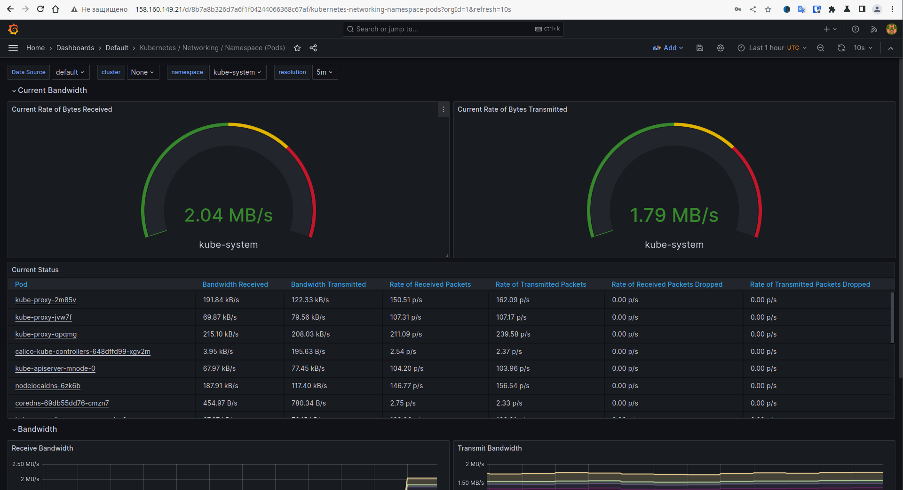
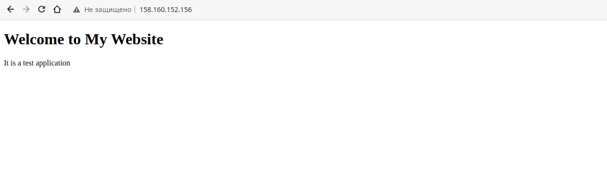
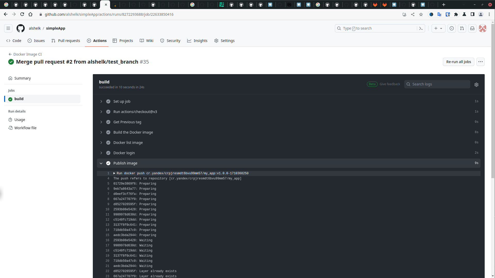
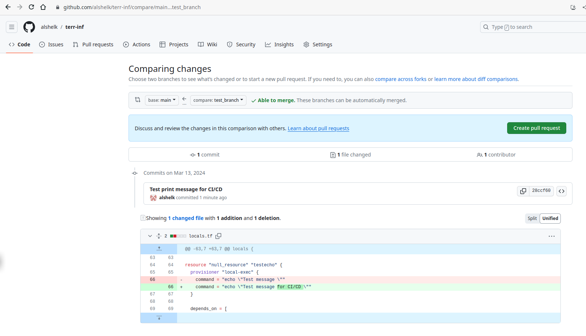
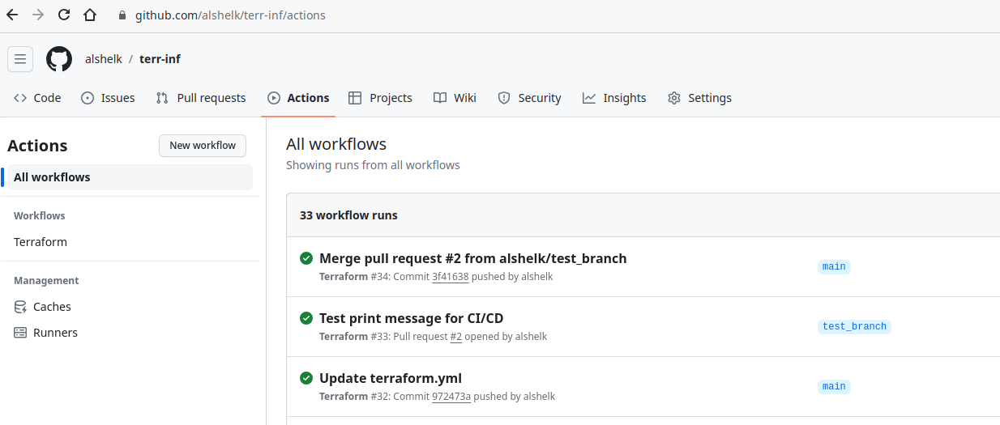
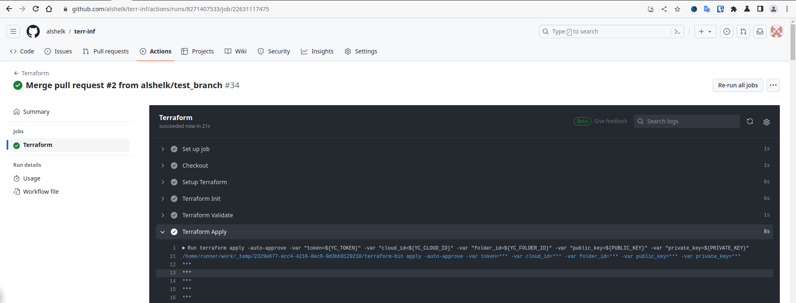

# Дипломный практикум в Yandex.Cloud
  * [Цели:](#цели)
  * [Этапы выполнения:](#этапы-выполнения)
     * [Создание облачной инфраструктуры](#создание-облачной-инфраструктуры)
     * [Создание Kubernetes кластера](#создание-kubernetes-кластера)
     * [Создание тестового приложения](#создание-тестового-приложения)
     * [Подготовка cистемы мониторинга и деплой приложения](#подготовка-cистемы-мониторинга-и-деплой-приложения)
     * [Установка и настройка CI/CD](#установка-и-настройка-cicd)
  * [Что необходимо для сдачи задания?](#что-необходимо-для-сдачи-задания)
  * [Как правильно задавать вопросы дипломному руководителю?](#как-правильно-задавать-вопросы-дипломному-руководителю)

**Перед началом работы над дипломным заданием изучите [Инструкция по экономии облачных ресурсов](https://github.com/netology-code/devops-materials/blob/master/cloudwork.MD).**

---
## Цели:

1. Подготовить облачную инфраструктуру на базе облачного провайдера Яндекс.Облако.
2. Запустить и сконфигурировать Kubernetes кластер.
3. Установить и настроить систему мониторинга.
4. Настроить и автоматизировать сборку тестового приложения с использованием Docker-контейнеров.
5. Настроить CI для автоматической сборки и тестирования.
6. Настроить CD для автоматического развёртывания приложения.

---
## Этапы выполнения:


### Создание облачной инфраструктуры

Для начала необходимо подготовить облачную инфраструктуру в ЯО при помощи [Terraform](https://www.terraform.io/).

Особенности выполнения:

- Бюджет купона ограничен, что следует иметь в виду при проектировании инфраструктуры и использовании ресурсов;
Для облачного k8s используйте региональный мастер(неотказоустойчивый). Для self-hosted k8s минимизируйте ресурсы ВМ и долю ЦПУ. В обоих вариантах используйте прерываемые ВМ для worker nodes.
- Следует использовать версию [Terraform](https://www.terraform.io/) не старше 1.5.x .

Предварительная подготовка к установке и запуску Kubernetes кластера.

1. Создайте сервисный аккаунт, который будет в дальнейшем использоваться Terraform для работы с инфраструктурой с необходимыми и достаточными правами. Не стоит использовать права суперпользователя
2. Подготовьте [backend](https://www.terraform.io/docs/language/settings/backends/index.html) для Terraform:  
   а. Рекомендуемый вариант: S3 bucket в созданном ЯО аккаунте(создание бакета через TF)
   б. Альтернативный вариант:  [Terraform Cloud](https://app.terraform.io/)  
3. Создайте VPC с подсетями в разных зонах доступности.
4. Убедитесь, что теперь вы можете выполнить команды `terraform destroy` и `terraform apply` без дополнительных ручных действий.
5. В случае использования [Terraform Cloud](https://app.terraform.io/) в качестве [backend](https://www.terraform.io/docs/language/settings/backends/index.html) убедитесь, что применение изменений успешно проходит, используя web-интерфейс Terraform cloud.

Ожидаемые результаты:

1. Terraform сконфигурирован и создание инфраструктуры посредством Terraform возможно без дополнительных ручных действий.
2. Полученная конфигурация инфраструктуры является предварительной, поэтому в ходе дальнейшего выполнения задания возможны изменения.


<details>
<summary>шаги:</summary>

```bash
vagrant@vm1:/netology_data/WorkFinal/terraform/create_sa_and_s3$ terraform init

Initializing the backend...

Initializing provider plugins...
- Finding latest version of yandex-cloud/yandex...
- Finding latest version of hashicorp/local...
- Installing yandex-cloud/yandex v0.108.0...
- Installed yandex-cloud/yandex v0.108.0 (unauthenticated)
- Installing hashicorp/local v2.4.1...
- Installed hashicorp/local v2.4.1 (unauthenticated)

Terraform has created a lock file .terraform.lock.hcl to record the provider
selections it made above. Include this file in your version control repository
so that Terraform can guarantee to make the same selections by default when
you run "terraform init" in the future.

╷
│ Warning: Incomplete lock file information for providers
│ 
│ Due to your customized provider installation methods, Terraform was forced to calculate lock file checksums locally for the following providers:
│   - hashicorp/local
│   - yandex-cloud/yandex
│ 
│ The current .terraform.lock.hcl file only includes checksums for linux_amd64, so Terraform running on another platform will fail to install these providers.
│ 
│ To calculate additional checksums for another platform, run:
│   terraform providers lock -platform=linux_amd64
│ (where linux_amd64 is the platform to generate)
╵

Terraform has been successfully initialized!

You may now begin working with Terraform. Try running "terraform plan" to see                                                                                                     
any changes that are required for your infrastructure. All Terraform commands                                                                                                     
should now work.                                                                                                                                                                  
                                                                                                                                                                                  
If you ever set or change modules or backend configuration for Terraform,                                                                                                         
rerun this command to reinitialize your working directory. If you forget, other                                                                                                   
commands will detect it and remind you to do so if necessary.                             
```

```bash
vagrant@vm1:/netology_data/WorkFinal/terraform/create_sa_and_s3$ terraform apply

Terraform used the selected providers to generate the following execution plan. Resource actions are indicated with the following symbols:
  + create

Terraform will perform the following actions:

  # local_file.backend_vars will be created
  + resource "local_file" "backend_vars" {
      + content              = (sensitive value)
      + content_base64sha256 = (known after apply)
      + content_base64sha512 = (known after apply)
      + content_md5          = (known after apply)
      + content_sha1         = (known after apply)
      + content_sha256       = (known after apply)
      + content_sha512       = (known after apply)
      + directory_permission = "0777"
      + file_permission      = "0777"
      + filename             = "/netology_data/WorkFinal/terraform/create_sa_and_s3/../secret.backend.tfvars"
      + id                   = (known after apply)
    }

  # yandex_iam_service_account.sa will be created
  + resource "yandex_iam_service_account" "sa" {
      + created_at = (known after apply)
      + folder_id  = (known after apply)
      + id         = (known after apply)
      + name       = "sa-edit-s3"
    }

  # yandex_iam_service_account_static_access_key.sa-static-key will be created
  + resource "yandex_iam_service_account_static_access_key" "sa-static-key" {
      + access_key           = (known after apply)
      + created_at           = (known after apply)
      + description          = "static access key for bucket"
      + encrypted_secret_key = (known after apply)
      + id                   = (known after apply)
      + key_fingerprint      = (known after apply)
      + secret_key           = (sensitive value)
      + service_account_id   = (known after apply)
    }

  # yandex_resourcemanager_folder_iam_member.sa-editor["storage.editor"] will be created
  + resource "yandex_resourcemanager_folder_iam_member" "sa-editor" {
      + folder_id = "b1geff6ele9s4ucl9hsc"
      + id        = (known after apply)
      + member    = (known after apply)
      + role      = "storage.editor"
    }

  # yandex_storage_bucket.bucket will be created
  + resource "yandex_storage_bucket" "bucket" {
      + access_key            = (known after apply)
      + bucket                = "backend-for-diplom"
      + bucket_domain_name    = (known after apply)
      + default_storage_class = (known after apply)
      + folder_id             = (known after apply)
      + force_destroy         = false
      + id                    = (known after apply)
      + secret_key            = (sensitive value)
      + website_domain        = (known after apply)
      + website_endpoint      = (known after apply)
    }

Plan: 5 to add, 0 to change, 0 to destroy.

Do you want to perform these actions?
  Terraform will perform the actions described above.
  Only 'yes' will be accepted to approve.

  Enter a value: yes

yandex_iam_service_account.sa: Creating...
yandex_iam_service_account.sa: Creation complete after 3s [id=ajefja5klnammc6ufrfn]
yandex_resourcemanager_folder_iam_member.sa-editor["storage.editor"]: Creating...
yandex_iam_service_account_static_access_key.sa-static-key: Creating...
yandex_iam_service_account_static_access_key.sa-static-key: Creation complete after 1s [id=ajevj25svsbkon6qmd7g]
yandex_storage_bucket.bucket: Creating...
local_file.backend_vars: Creating...
local_file.backend_vars: Creation complete after 0s [id=4b39753c41d442a0c0f846ddbc2e472e598176e6]
yandex_resourcemanager_folder_iam_member.sa-editor["storage.editor"]: Creation complete after 2s [id=b1geff6ele9s4ucl9hsc/storage.editor/serviceAccount:ajefja5klnammc6ufrfn]
yandex_storage_bucket.bucket: Still creating... [10s elapsed]
yandex_storage_bucket.bucket: Still creating... [20s elapsed]
yandex_storage_bucket.bucket: Still creating... [30s elapsed]
yandex_storage_bucket.bucket: Still creating... [40s elapsed]
yandex_storage_bucket.bucket: Still creating... [50s elapsed]
yandex_storage_bucket.bucket: Still creating... [1m0s elapsed]
yandex_storage_bucket.bucket: Still creating... [1m10s elapsed]
yandex_storage_bucket.bucket: Still creating... [1m20s elapsed]
yandex_storage_bucket.bucket: Still creating... [1m30s elapsed]
yandex_storage_bucket.bucket: Still creating... [1m40s elapsed]
yandex_storage_bucket.bucket: Still creating... [1m50s elapsed]
yandex_storage_bucket.bucket: Still creating... [2m0s elapsed]
yandex_storage_bucket.bucket: Creation complete after 2m3s [id=backend-for-diplom]

Apply complete! Resources: 5 added, 0 changed, 0 destroyed.               
```

```bash
vagrant@vm1:/netology_data/WorkFinal/terraform$ terraform init -backend-config=secret.backend.tfvars

Initializing the backend...

Successfully configured the backend "s3"! Terraform will automatically                                                                                                            
use this backend unless the backend configuration changes.                                                                                                                        

Initializing provider plugins...
- Finding latest version of yandex-cloud/yandex...
- Finding latest version of hashicorp/local...
- Finding latest version of hashicorp/template...
- Installing yandex-cloud/yandex v0.108.0...
- Installed yandex-cloud/yandex v0.108.0 (unauthenticated)
- Installing hashicorp/local v2.4.1...
- Installed hashicorp/local v2.4.1 (unauthenticated)
- Installing hashicorp/template v2.2.0...
- Installed hashicorp/template v2.2.0 (unauthenticated)

Terraform has created a lock file .terraform.lock.hcl to record the provider
selections it made above. Include this file in your version control repository
so that Terraform can guarantee to make the same selections by default when
you run "terraform init" in the future.

╷
│ Warning: Incomplete lock file information for providers
│ 
│ Due to your customized provider installation methods, Terraform was forced to calculate lock file checksums locally for the following providers:
│   - hashicorp/local
│   - hashicorp/template
│   - yandex-cloud/yandex
│ 
│ The current .terraform.lock.hcl file only includes checksums for linux_amd64, so Terraform running on another platform will fail to install these providers.
│ 
│ To calculate additional checksums for another platform, run:
│   terraform providers lock -platform=linux_amd64
│ (where linux_amd64 is the platform to generate)
╵

Terraform has been successfully initialized!

You may now begin working with Terraform. Try running "terraform plan" to see                                                                                                     
any changes that are required for your infrastructure. All Terraform commands                                                                                                     
should now work.                                                                                                                                                                  
                                                                                                                                                                                  
If you ever set or change modules or backend configuration for Terraform,                                                                                                         
rerun this command to reinitialize your working directory. If you forget, other                                                                                                   
commands will detect it and remind you to do so if necessary.          
```

```bash
vagrant@vm1:/netology_data/WorkFinal/terraform$ terraform apply
data.template_file.cloudinit: Reading...
data.template_file.cloudinit: Read complete after 0s [id=56dced39c9ecc003c5a7b54de6ad5517edef81e655774047ccd6c4514deab069]
data.yandex_compute_image.ubuntu: Reading...
data.yandex_compute_image.ubuntu: Read complete after 0s [id=fd8bt3r9v1tq5fq7jcna]

Terraform used the selected providers to generate the following execution plan. Resource actions are indicated with the following symbols:
  + create

Terraform will perform the following actions:
...
```

```bash
agrant@vm1:/netology_data/WorkFinal/terraform$ terraform destroy
data.template_file.cloudinit: Reading...
data.template_file.cloudinit: Read complete after 0s [id=56dced39c9ecc003c5a7b54de6ad5517edef81e655774047ccd6c4514deab069]
...
```

</details>

---
### Создание Kubernetes кластера

На этом этапе необходимо создать [Kubernetes](https://kubernetes.io/ru/docs/concepts/overview/what-is-kubernetes/) кластер на базе предварительно созданной инфраструктуры.   Требуется обеспечить доступ к ресурсам из Интернета.

Это можно сделать двумя способами:

1. Рекомендуемый вариант: самостоятельная установка Kubernetes кластера.  
   а. При помощи Terraform подготовить как минимум 3 виртуальных машины Compute Cloud для создания Kubernetes-кластера. Тип виртуальной машины следует выбрать самостоятельно с учётом требовании к производительности и стоимости. Если в дальнейшем поймете, что необходимо сменить тип инстанса, используйте Terraform для внесения изменений.  
   б. Подготовить [ansible](https://www.ansible.com/) конфигурации, можно воспользоваться, например [Kubespray](https://kubernetes.io/docs/setup/production-environment/tools/kubespray/)  
   в. Задеплоить Kubernetes на подготовленные ранее инстансы, в случае нехватки каких-либо ресурсов вы всегда можете создать их при помощи Terraform.
2. Альтернативный вариант: воспользуйтесь сервисом [Yandex Managed Service for Kubernetes](https://cloud.yandex.ru/services/managed-kubernetes)  
  а. С помощью terraform resource для [kubernetes](https://registry.terraform.io/providers/yandex-cloud/yandex/latest/docs/resources/kubernetes_cluster) создать **региональный** мастер kubernetes с размещением нод в разных 3 подсетях      
  б. С помощью terraform resource для [kubernetes node group](https://registry.terraform.io/providers/yandex-cloud/yandex/latest/docs/resources/kubernetes_node_group)
  
Ожидаемый результат:

1. Работоспособный Kubernetes кластер.
2. В файле `~/.kube/config` находятся данные для доступа к кластеру.
3. Команда `kubectl get pods --all-namespaces` отрабатывает без ошибок.

<details>
<summary>шаги:</summary>

обновляемся, ставим Ansible, python3.9, pip3.9, python requirements

пример для ubuntu
```bash
sudo apt install git
sudo apt install python3.9
curl https://bootstrap.pypa.io/get-pip.py -o get-pip.py
sudo python3.9 get-pip.py
export PATH=~/.local/bin/:$PATH
```

```bash
git clone https://github.com/kubernetes-sigs/kubespray
sudo pip3 install -r kubespray/requirements.txt
cp -rfp kubespray/inventory/sample kubespray/inventory/mycluster
```

добавляем в Terraform:

запуск Ansible

```yaml
resource "null_resource" "cluster" {
  provisioner "local-exec" {
    command = "ANSIBLE_CONFIG=../kubespray/ansible.cfg ANSIBLE_FORCE_COLOR=1 ansible-playbook -i ../kubespray/inventory/mycluster/hosts.yaml ../kubespray/cluster.yml -b -v"
  }

  depends_on = [
    local_file.hosts_cfg
  ]
}
```

[invent_ansible.tf](terraform%2Finvent_ansible.tf)

```yaml
resource "local_file" "hosts_cfg" {
  content = templatefile("${path.module}/hosts.tftpl",
    { masternodes = yandex_compute_instance.mnode,
      workernodes = yandex_compute_instance.wnode,
      user = var.ssh_user }
  )

  filename = "${abspath(path.module)}/../kubespray/inventory/mycluster/hosts.yaml"
  
  depends_on = [
    yandex_compute_instance.mnode,
    yandex_compute_instance.wnode
  ]
}

```

[hosts.tftpl](terraform%2Fhosts.tftpl)

```yaml
---

all:
  hosts:
    %{~ for i in masternodes ~}
    ${i["name"]}:
      ansible_host: ${i["network_interface"][0]["nat_ip_address"]}
      ip: ${i["network_interface"][0]["ip_address"]}
      access_ip: ${i["network_interface"][0]["ip_address"]}
      ansible_user: ${user}
    %{~ endfor ~}
    %{~ for i in workernodes ~}
    ${i["name"]}:
      ansible_host: ${i["network_interface"][0]["nat_ip_address"]}
      ip: ${i["network_interface"][0]["ip_address"]}
      access_ip: ${i["network_interface"][0]["ip_address"]}
      ansible_user: ${user}
    %{~ endfor ~}
  children:
    kube_control_plane:
      hosts:
        %{~ for i in masternodes ~}
        ${i["name"]}:
        %{~ endfor ~}
    kube_node:
      hosts:
        %{~ for i in workernodes ~}
        ${i["name"]}:
        %{~ endfor ~}
    etcd:
      hosts:
        %{~ for i in masternodes ~}
        ${i["name"]}:
        %{~ endfor ~}
    k8s_cluster:
      children:
        kube_control_plane:
        kube_node:
    calico_rr:
      hosts: {}

```

[locals.tf](terraform%2Flocals.tf)

```yaml
resource "null_resource" "cluster" {
  provisioner "local-exec" {
    command = "ANSIBLE_CONFIG=../kubespray/ansible.cfg ANSIBLE_FORCE_COLOR=1 ansible-playbook -i ../kubespray/inventory/mycluster/hosts.yaml ../kubespray/cluster.yml -b -v"
  }

  depends_on = [
    local_file.hosts_cfg
  ]
}

resource "null_resource" "localkubectl" {
  provisioner "remote-exec" {
    connection {
      type        = "ssh"
      host        = yandex_compute_instance.mnode[0].network_interface[0].nat_ip_address
      private_key = file("~/.ssh/id_rsa")
      user        = var.ssh_user
      timeout     = "30"
    }
    inline = [
      "mkdir /home/${var.ssh_user}/.kube",
      "sudo cp -i /etc/kubernetes/admin.conf /home/${var.ssh_user}/.kube/config",
      "sudo chown ${var.ssh_user}:${var.ssh_user} /home/${var.ssh_user}/.kube/config",
    ]
  }
  
  provisioner "local-exec" {
    command = "scp ${var.ssh_user}@${yandex_compute_instance.mnode[0].network_interface[0].nat_ip_address}:~/.kube/config ~/.kube/config && sed -i 's/127.0.0.1/${yandex_compute_instance.mnode[0].network_interface[0].nat_ip_address}/' ~/.kube/config"
  }
  
  depends_on = [
    null_resource.cluster
  ]
}
```

```bash
$ kubectl get pods --all-namespaces --insecure-skip-tls-verify
NAMESPACE     NAME                                      READY   STATUS    RESTARTS        AGE
kube-system   calico-kube-controllers-648dffd99-txsg2   1/1     Running   0               7h30m
kube-system   calico-node-9khkt                         1/1     Running   0               7h32m
kube-system   calico-node-pvjkp                         1/1     Running   0               7h32m
kube-system   calico-node-zr6hm                         1/1     Running   0               7h32m
kube-system   coredns-69db55dd76-cdcw2                  1/1     Running   0               7h29m
kube-system   coredns-69db55dd76-tjb98                  1/1     Running   0               7h29m
kube-system   dns-autoscaler-6f4b597d8c-vzrj7           1/1     Running   0               7h29m
kube-system   kube-apiserver-mnode-0                    1/1     Running   1               7h34m
kube-system   kube-controller-manager-mnode-0           1/1     Running   2               7h34m
kube-system   kube-proxy-5vfxk                          1/1     Running   0               6h45m
kube-system   kube-proxy-65crq                          1/1     Running   0               6h45m
kube-system   kube-proxy-dst5n                          1/1     Running   0               6h45m
kube-system   kube-scheduler-mnode-0                    1/1     Running   2 (7h28m ago)   7h34m
kube-system   nginx-proxy-wnode-0                       1/1     Running   0               7h33m
kube-system   nginx-proxy-wnode-1                       1/1     Running   0               7h33m
kube-system   nodelocaldns-7m7q2                        1/1     Running   0               7h29m
kube-system   nodelocaldns-ls98h                        1/1     Running   0               7h29m
kube-system   nodelocaldns-r27jw                        1/1     Running   0               7h29m

```

</details>

---
### Создание тестового приложения

Для перехода к следующему этапу необходимо подготовить тестовое приложение, эмулирующее основное приложение разрабатываемое вашей компанией.

Способ подготовки:

1. Рекомендуемый вариант:  
   а. Создайте отдельный git репозиторий с простым nginx конфигом, который будет отдавать статические данные.  
   б. Подготовьте Dockerfile для создания образа приложения.  
2. Альтернативный вариант:  
   а. Используйте любой другой код, главное, чтобы был самостоятельно создан Dockerfile.

Ожидаемый результат:

1. Git репозиторий с тестовым приложением и Dockerfile.
2. Регистри с собранным docker image. В качестве регистри может быть DockerHub или [Yandex Container Registry](https://cloud.yandex.ru/services/container-registry), созданный также с помощью terraform.

<details>
<summary>шаги:</summary>

https://github.com/alshelk/simpleApp

```bash
$sudo docker build -t cr.yandex/crplm04uob96qchf7ht4/my_app:0.1.0 . 
[+] Building 1.2s (9/9) FINISHED                                                                                                                                               docker:default
 => [internal] load .dockerignore                                                                                                                                                        0.1s
 => => transferring context: 2B                                                                                                                                                          0.0s
 => [internal] load build definition from Dockerfile                                                                                                                                     0.1s
 => => transferring dockerfile: 213B                                                                                                                                                     0.0s
 => [internal] load metadata for docker.io/library/nginx:alpine                                                                                                                          0.0s 
 => [1/4] FROM docker.io/library/nginx:alpine                                                                                                                                            0.1s 
 => [internal] load build context                                                                                                                                                        0.1s 
 => => transferring context: 1.07kB                                                                                                                                                      0.0s 
 => [2/4] RUN rm -rf /usr/share/nginx/html/*                                                                                                                                             0.6s 
 => [3/4] COPY ./html/* /usr/share/nginx/html/                                                                                                                                           0.1s
 => [4/4] COPY ./nginx.conf /etc/nginx/nginx.conf                                                                                                                                        0.1s 
 => exporting to image                                                                                                                                                                   0.1s
 => => exporting layers                                                                                                                                                                  0.1s 
 => => writing image sha256:9ee0e907471c2a37888ddb0ce82787c7c9739f58cdb31ea172b016f276864c76                                                                                             0.0s 
 => => naming to cr.yandex/crplm04uob96qchf7ht4/my_app:0.1.0     
$ sudo docker login --username oauth --password token cr.yandex
$ sudo docker push cr.yandex/crplm04uob96qchf7ht4/my_app:0.1.0 


```

</details>

---
### Подготовка cистемы мониторинга и деплой приложения

Уже должны быть готовы конфигурации для автоматического создания облачной инфраструктуры и поднятия Kubernetes кластера.  
Теперь необходимо подготовить конфигурационные файлы для настройки нашего Kubernetes кластера.

Цель:
1. Задеплоить в кластер [prometheus](https://prometheus.io/), [grafana](https://grafana.com/), [alertmanager](https://github.com/prometheus/alertmanager), [экспортер](https://github.com/prometheus/node_exporter) основных метрик Kubernetes.
2. Задеплоить тестовое приложение, например, [nginx](https://www.nginx.com/) сервер отдающий статическую страницу.

Способ выполнения:
1. Воспользовать пакетом [kube-prometheus](https://github.com/prometheus-operator/kube-prometheus), который уже включает в себя [Kubernetes оператор](https://operatorhub.io/) для [grafana](https://grafana.com/), [prometheus](https://prometheus.io/), [alertmanager](https://github.com/prometheus/alertmanager) и [node_exporter](https://github.com/prometheus/node_exporter). При желании можете собрать все эти приложения отдельно.
2. Для организации конфигурации использовать [qbec](https://qbec.io/), основанный на [jsonnet](https://jsonnet.org/). Обратите внимание на имеющиеся функции для интеграции helm конфигов и [helm charts](https://helm.sh/)
3. Если на первом этапе вы не воспользовались [Terraform Cloud](https://app.terraform.io/), то задеплойте и настройте в кластере [atlantis](https://www.runatlantis.io/) для отслеживания изменений инфраструктуры. Альтернативный вариант 3 задания: вместо Terraform Cloud или atlantis настройте на автоматический запуск и применение конфигурации terraform из вашего git-репозитория в выбранной вами CI-CD системе при любом комите в main ветку. Предоставьте скриншоты работы пайплайна из CI/CD системы.

Ожидаемый результат:
1. Git репозиторий с конфигурационными файлами для настройки Kubernetes.
2. Http доступ к web интерфейсу grafana.
3. Дашборды в grafana отображающие состояние Kubernetes кластера.
4. Http доступ к тестовому приложению.

<details>
<summary>результат:</summary>

[конфигурация Kubernetes](https://github.com/alshelk/simpleApp/tree/main/K8s)





</details>

---
### Установка и настройка CI/CD

Осталось настроить ci/cd систему для автоматической сборки docker image и деплоя приложения при изменении кода.

Цель:

1. Автоматическая сборка docker образа при коммите в репозиторий с тестовым приложением.
2. Автоматический деплой нового docker образа.

Можно использовать [teamcity](https://www.jetbrains.com/ru-ru/teamcity/), [jenkins](https://www.jenkins.io/), [GitLab CI](https://about.gitlab.com/stages-devops-lifecycle/continuous-integration/) или GitHub Actions.

Ожидаемый результат:

1. Интерфейс ci/cd сервиса доступен по http.
2. При любом коммите в репозиторие с тестовым приложением происходит сборка и отправка в регистр Docker образа.
3. При создании тега (например, v1.0.0) происходит сборка и отправка с соответствующим label в регистри, а также деплой соответствующего Docker образа в кластер Kubernetes.

<details>
<summary>результат:</summary>



---
## Что необходимо для сдачи задания?

1. Репозиторий с конфигурационными файлами Terraform и готовность продемонстрировать создание всех ресурсов с нуля.
2. Пример pull request с комментариями созданными atlantis'ом или снимки экрана из Terraform Cloud или вашего CI-CD-terraform pipeline.
3. Репозиторий с конфигурацией ansible, если был выбран способ создания Kubernetes кластера при помощи ansible.
4. Репозиторий с Dockerfile тестового приложения и ссылка на собранный docker image.
5. Репозиторий с конфигурацией Kubernetes кластера.
6. Ссылка на тестовое приложение и веб интерфейс Grafana с данными доступа.
7. Все репозитории рекомендуется хранить на одном ресурсе (github, gitlab)


<details>
<summary>Итоги:</summary>

1. Репозиторий с конфигурационными файлами Terraform: [ссылка на репозиторий](https://github.com/alshelk/terr-inf/tree/081c9678cfd067f7b2b549209860e5138be2536d)
2. Пример pull request со снимки CI-CD-terraform pipeline.

[pipeline](https://github.com/alshelk/terr-inf/blob/3f41638aa2d42cc34f6040904503d799f7b17423/.github/workflows/terraform.yml)







3. Репозиторий с конфигурацией ansible, если был выбран способ создания Kubernetes кластера при помощи ansible.

[ссылка на конфиг kubespray](https://github.com/alshelk/terr-inf/tree/8d24cd6b689ac6392e4ce0876410a231f90316ac/kubespray/inventory/mycluster)

файл hosts.yuml генерируется автоматически при раскатке инфраструктуры

4. Репозиторий с Dockerfile тестового приложения и ссылка на собранный docker image.

[Репозиторий с Dockerfile](https://github.com/alshelk/simpleApp)

[ссылка на собранный docker image](cr.yandex/crpjresmdt6bvu99mm57/my_app:latest)

5. Репозиторий с конфигурацией Kubernetes кластера.

[конфигурация Kubernetes](https://github.com/alshelk/simpleApp/tree/main/K8s)

6. Ссылка на тестовое приложение и веб интерфейс Grafana с данными доступа.

[тестовое приложение](http://158.160.152.156/)

[Grafana](http://158.160.149.21)

login admin
pass netology

</details>